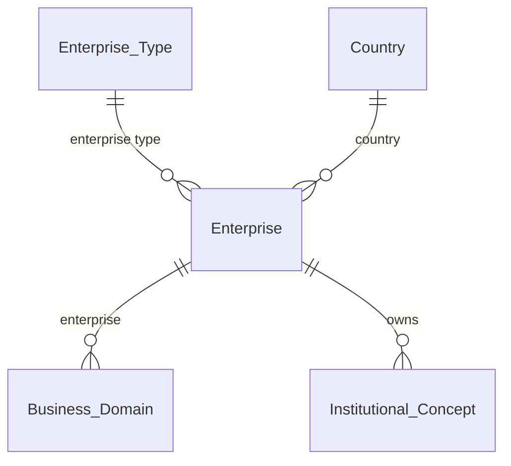
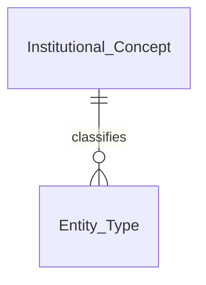
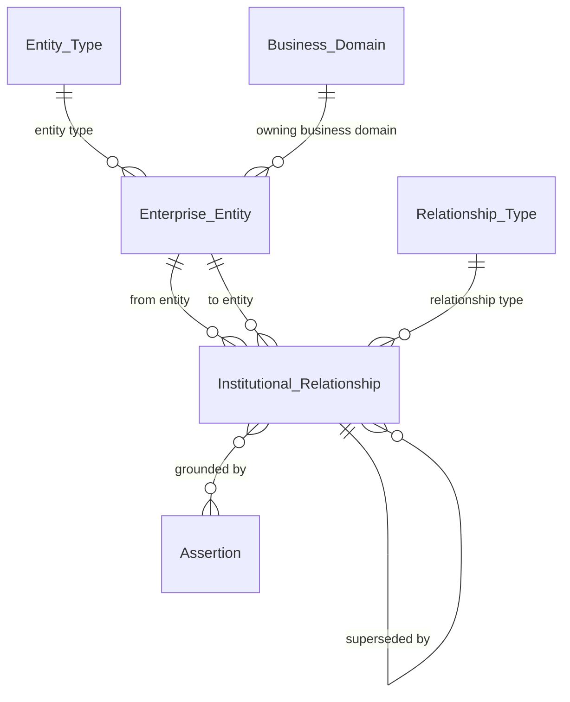
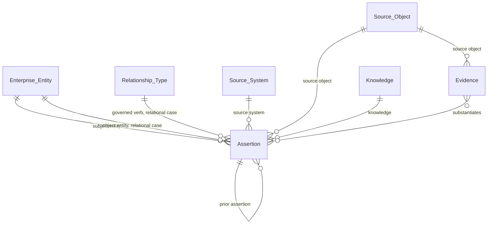
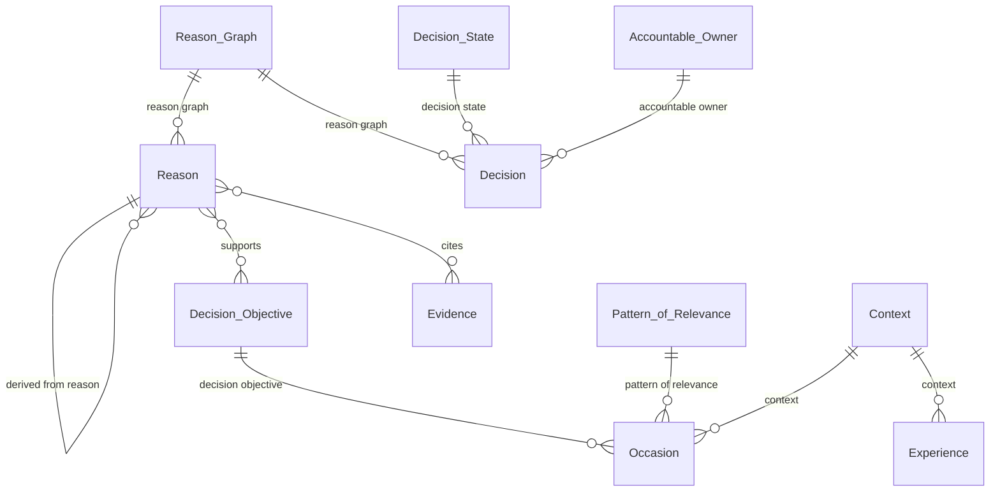
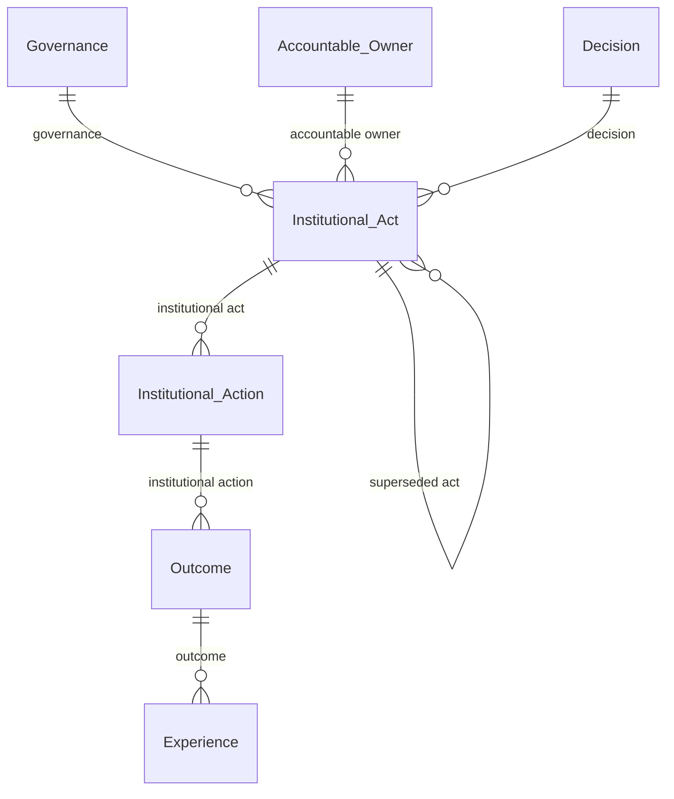
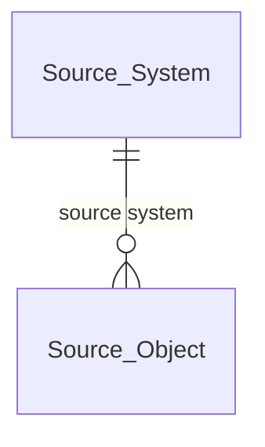

# ECOM Logical Data Model v1.3

**Derived from:** EAD-001 v1.3 (Enterprise Attribute Dictionary)
**Method:** Every relationship diagrammed below is extracted programmatically from the dictionary's own FK/FK-Entity columns, not hand-transcribed. M:N relationships (join tables in the physical model) are added explicitly and noted as such.
**Organization:** entities are now presented by **Entity Package** (Foundation / Semantic / Operational / Knowledge / Decision / Governance / Integration), documentation-only per the reviewer's request — the schema itself is unchanged; only this presentation is reorganized. The package assignment for each entity is a judgment call, stated plainly rather than asserted as the only valid grouping: `Experience`, in particular, could reasonably sit in either Decision or its own Memory package — placed under Decision here since nothing in the current taxonomy has a Memory bucket, and it's read primarily during Reasoning.

**v1.3 changes:** `Assertion.predicate` narrowed to the literal-attribute case only; added `Assertion.relationship_type_id` (governed verb) for the entity-relational case, enforced by a real CHECK constraint in the physical model; added `Institutional Concept.enterprise_id` (ownership); documented the Universal Relationship Principle as a hard rule, audited against the current schema.

---

## Package: Foundation

`Enterprise`, `Enterprise Type`, `Country`, `Business Domain`, `Accountable Owner`

**v1.3:** `Enterprise owns Institutional Concept` is now represented — every governed concept belongs to an Enterprise, restoring a relationship that existed in prior specification but had not yet been implemented in this dictionary.

---

## Package: Semantic

`Institutional Concept`, `Entity Type`, `Relationship Type`

**Reading this package:** this is the meaning layer, EO-111's own territory — Institutional Concept and Relationship Type are the two governed vocabularies everything else in the model draws from. `Relationship Type` has no inbound relationship *within* this package; its role is to be referenced *from* Operational and Knowledge (below), which is exactly where a governed verb should be consumed, not defined twice.

---

## Package: Operational

`Enterprise Entity`, `Institutional Relationship`, `Context`

**Reading this package, and the Universal Relationship Principle audit:** every relationship an Enterprise Entity participates in goes through `Institutional Relationship`'s `from_entity_id`/`to_entity_id` pair, governed by `Relationship Type` — there is no direct Entity-to-Entity FK anywhere in this model. That's the hard rule from point C, confirmed by inspection, not asserted. `Institutional Relationship`'s own `superseded_by` self-reference is KG-101 again: a relationship that evolves (`supplies → wasSupplierOf`) does so as a new row, never a mutation. Its `grounded by` link to Assertion (M:N) means a Supplier-SUPPLIES-Product edge has standing because specific Assertions say so — not because the edge asserts itself.

---

## Package: Knowledge

`Assertion`, `Evidence`, `Knowledge`

**v1.3, the most substantive change in this pass:** Assertion's predicate is now split into two genuinely different governed paths, not one free-text column pretending to cover both.

- **Relational case** (the object is another Entity): `relationship_type_id` → Relationship Type. "Supplier SUPPLIES Product" is a governed verb, the same vocabulary Institutional Relationship draws from — verbs are governable semantic objects, not strings.
- **Literal case** (the object is a value): `predicate` remains free text — "legal_name", "country" — because EO-111 draws a real line between relationship-predicates and attribute-predicates (Concept Characteristics), and forcing both through Relationship Type would have quietly erased that line. **A governed Concept Characteristic entity, to close this gap properly, is flagged as a new open item — not built yet.**

Trust in an Assertion remains what v1.2 established: substantiated by Evidence (M:N, Evidence upstream), decided by Governance, never a stored score.

---

## Package: Decision

`Decision Objective`, `Occasion`, `Pattern of Relevance`, `Reason`, `Reason Graph`, `Decision`, `Decision State`, `Experience`

**Reading this package:** `Decision Objective → Occasion` stays sequential — Occasion authorizes pursuing an already-standing objective, it doesn't create one. `Reason`'s relationships to Decision Objective and Evidence are both M:N (join tables in the physical model, correctly this time — the redundant single-FK versions of both were caught and removed in the prior pass). `Decision.decision_state_id` is the structural expression of ED-106: the Decision row is immutable in content, but this one pointer is allowed to change, by pointing at a new Decision State row rather than mutating an old one.

---

## Package: Governance

`Governance`, `Institutional Act`, `Institutional Action`, `Outcome`

**Reading this package:** `Institutional Act`'s `superseded_act_id` self-reference is IA-T8 at the Act level — superseding an Act is a new Act, never a change to the old one. This is also where the pipeline closes back toward Experience: an Outcome, once recorded, becomes the thing a future Experience row anchors to.

---

## Package: Integration

`Source System`, `Source Object`

**Reading this package:** deliberately the smallest package — everything else in the model treats Source System/Object as the boundary where raw, ungoverned data becomes eligible for institutional predication (Assertion), never as institutional truth in its own right.

---

## Notes carried over, not repeated as new findings here

- `OccasionLifecycle` has no frozen RFC behind it yet.
- Deferred, not urgent: Pattern of Relevance, Knowledge, Governance, and Source Object all need real business attributes beyond the generic template.
- Open decision: Enterprise Type's uniqueness (global vs. per-enterprise).
- Open, larger question: whether the Universal Relationship Principle should extend to structural/constitutional FKs (e.g. `decisions.decision_state_id`), not just entity-to-entity relationships. Audited and confirmed clean at the entity-to-entity level only.
- A surrogate identifier layer beneath today's direct FK references remains explicitly deferred.
- New in this pass: a governed Concept Characteristic entity is needed to complete the predicate split properly — currently the literal-attribute case still falls back to free text.
