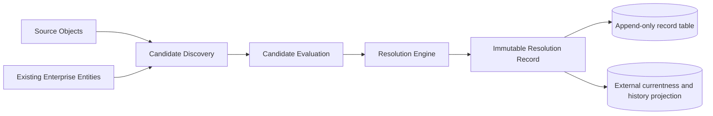
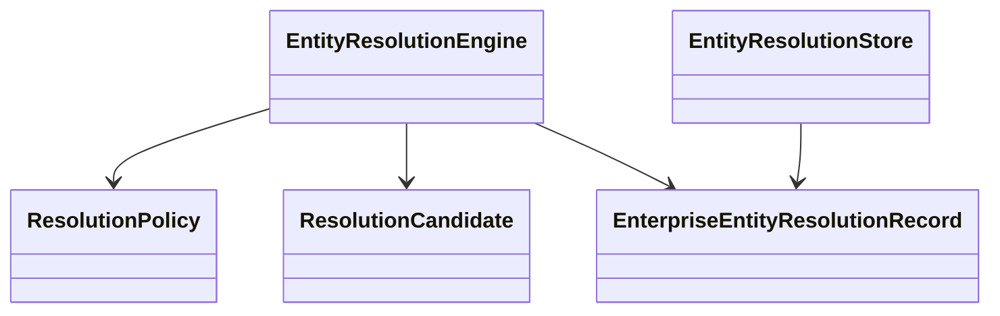
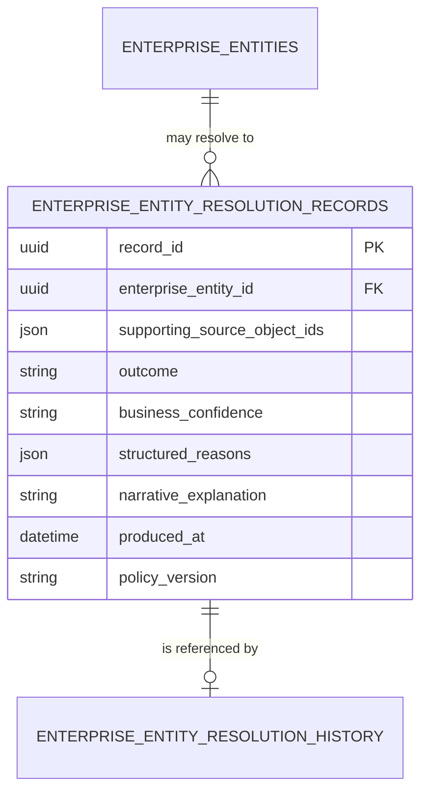

# CDD-004 Enterprise Entity Resolution — Design

## Authority

This implementation consumes the frozen Canonical Enterprise Ontology and implements only ERM-001 v2.2. It introduces no canonical entity, attribute, or relationship.

## Architecture



The Resolution Record is an immutable domain value and append-only database row. Currentness is determined externally from the ordered immutable record history in accordance with RFC-011. No Resolution Record changes state from active to archived.

## Sequence

```mermaid
sequenceDiagram
  participant Caller
  participant Engine
  participant Store
  Caller->>Engine: Source names + existing Enterprise Entities
  Engine->>Engine: Normalize, discover, evaluate
  Engine-->>Caller: Immutable Resolution Record
  Caller->>Store: append(record)
  Store->>Store: insert record; advance history projection
```

## Class model



## Persistence



- `enterprise_entity_resolution_records`: append-only ERM business artifacts.
- `enterprise_entity_resolution_history`: implementation-owned currentness/history projection. Its legacy physical column names are retained for migration compatibility and do not represent mutable business state.
- No canonical physical-model table is changed.
- The projection is keyed by the deterministic digest of the supporting Source Object set. `current_record_identifier` identifies the externally determined current record, and `historical_record_references` preserve the preceding immutable sequence.

## Configuration

Policy version and thresholds are externalized through `CTEC_RESOLUTION_*` settings. Internal numeric scores are implementation details; only High, Medium, and Low are exposed as Business Confidence.
