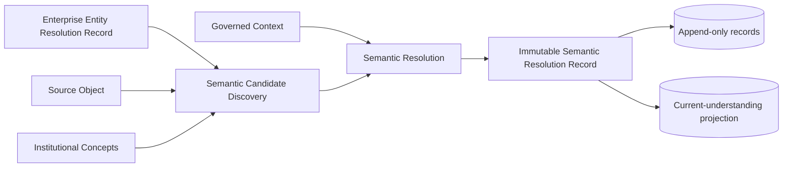
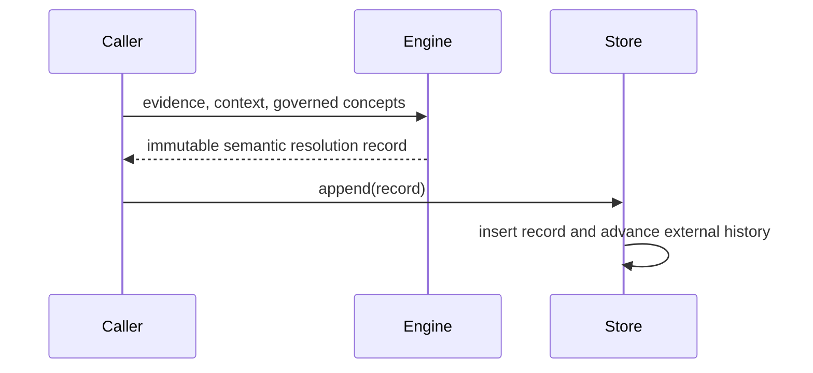
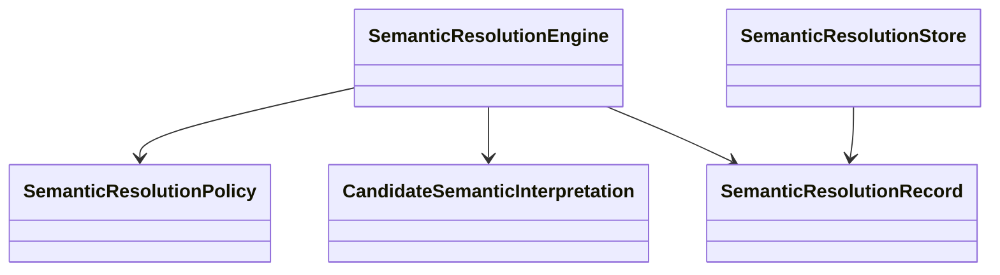

# CDD-005 Semantic Resolution — Design

SRM-001 v2.1 is the sole authority for business semantics. The implementation consumes existing CEO artifacts unchanged.

The physical implementation adds append-only `semantic_resolution_records` and an externally maintained `semantic_resolution_history` projection. No canonical physical table is modified. In accordance with RFC-011, current understanding is determined from ordered immutable record history keyed by Enterprise Entity plus Context. No Semantic Resolution Record changes state from active to archived. Legacy projection column names remain physical compatibility details only.
