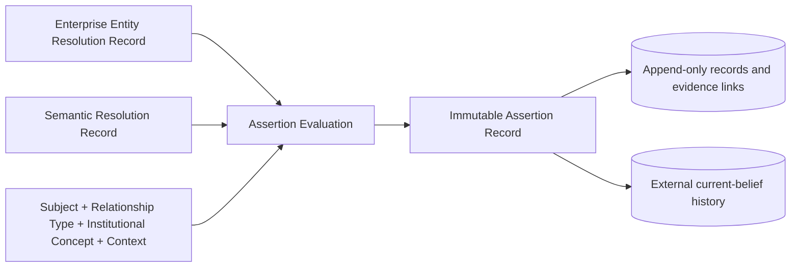
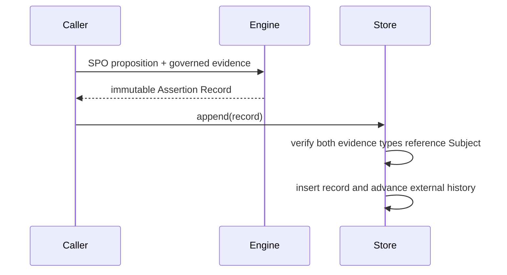
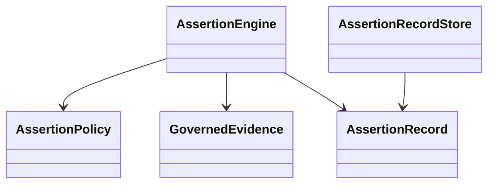

# CDD-006 Assertion Engine — Design

ASM-001 v2.0 is the sole authority for Assertion business semantics. Every creation path requires governed Enterprise Entity Resolution and Semantic Resolution evidence for the same Subject.

Persistence adds one immutable record table, two evidence junction tables with foreign keys to CDD-004/005 records, and one external history projection keyed by Subject, Predicate, Object, and Context. The existing CEO and canonical physical tables are unchanged.
