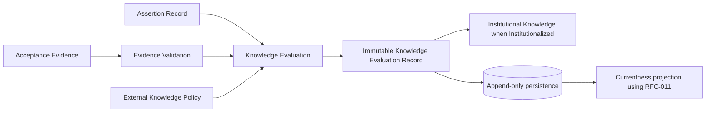
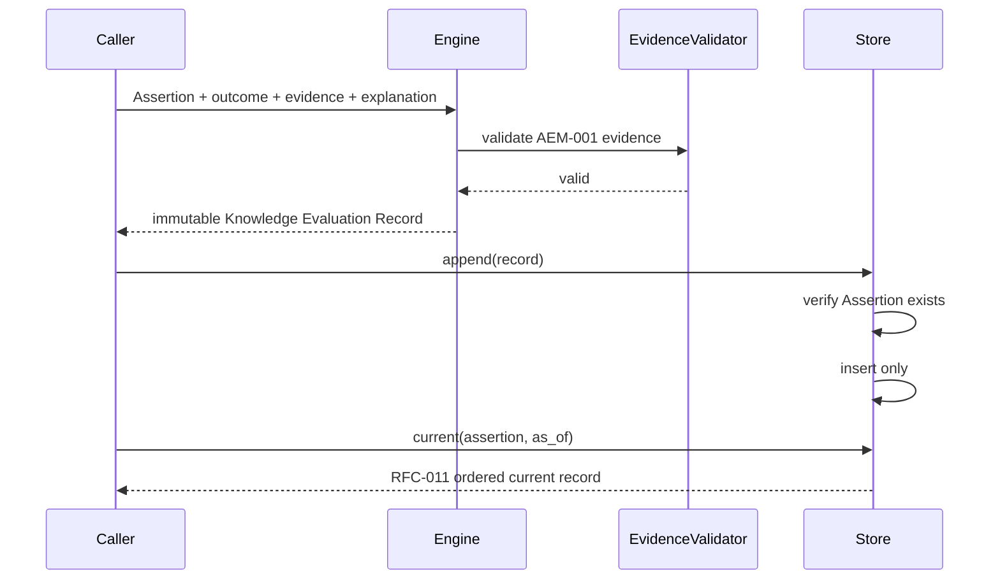
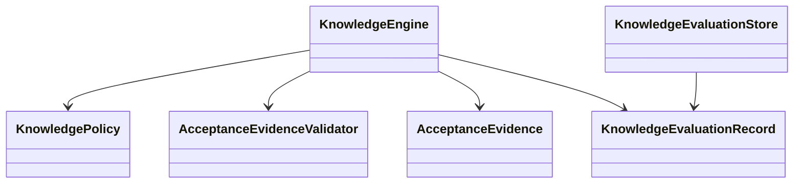
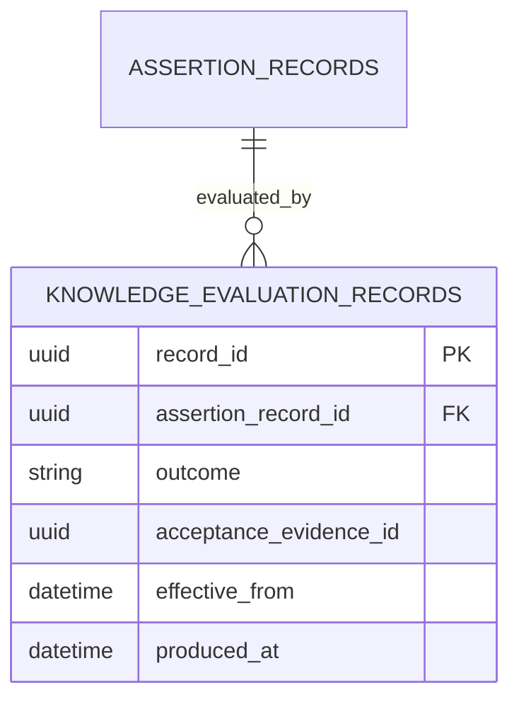

# CDD-007 Knowledge Engine — Design

KRM-001 v1.3 is the authority for Knowledge semantics, AEM-001 v1.1 defines Acceptance Evidence under RFC-013 Governance Authority, and RFC-011 v1.0 defines immutable-record currentness.

Acceptance Evidence remains Governance-owned and is referenced, not created or duplicated. Currentness is computed from `Effective From`, `Produced Timestamp`, and `Record Identifier`; no lifecycle state is stored in the immutable record.
