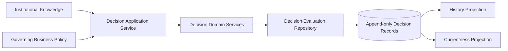
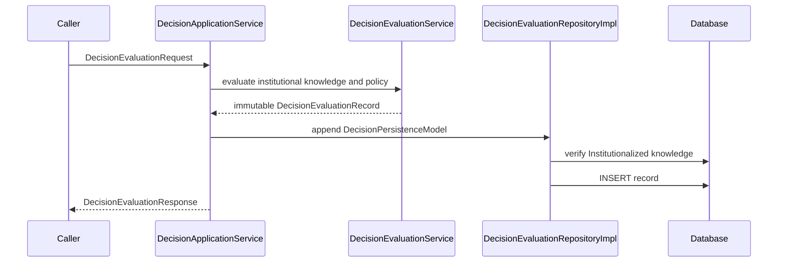
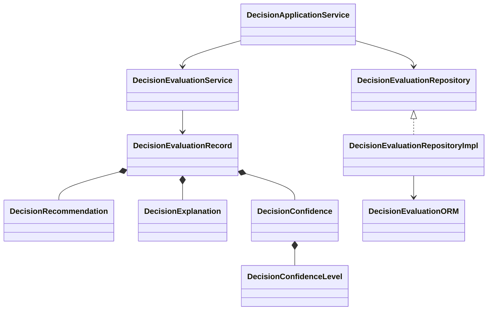
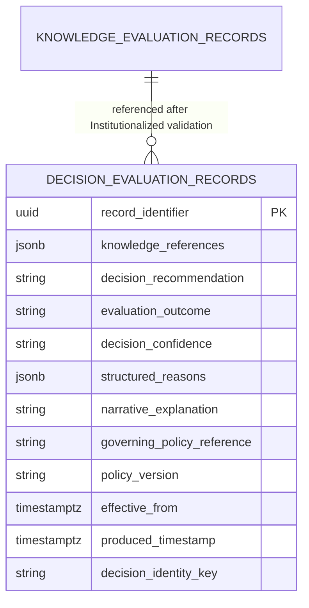

# CDD-008 Decision Engine — Design

CDD-008 implements DRM-001 v1.1. It evaluates existing Institutional Knowledge against a referenced governed business policy and creates an immutable Decision Evaluation Record. It does not approve policy, create knowledge, execute recommendations, or expose external query capability.

## Architecture

## Sequence

## Class model

## Persistence

Knowledge references are stored as a governed reference set because each Decision Evaluation consumes one or more Institutional Knowledge items. Repository validation ensures every reference points to an Institutionalized Knowledge Evaluation. No assertion, semantic resolution, or entity-resolution source can be supplied directly.

The decision identity key is an internal SHA-256 projection key derived from the sorted Supporting Knowledge set, Decision Recommendation, and optional Business Context. It is not a business attribute. RFC-011 currentness orders matching records by Effective From, Produced Timestamp, and Record Identifier, descending; future-effective records are excluded until effective.

PostgreSQL rejects UPDATE and DELETE operations through a dedicated trigger. Human override therefore creates a new record.
