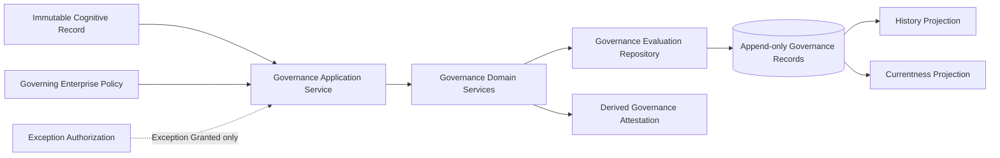
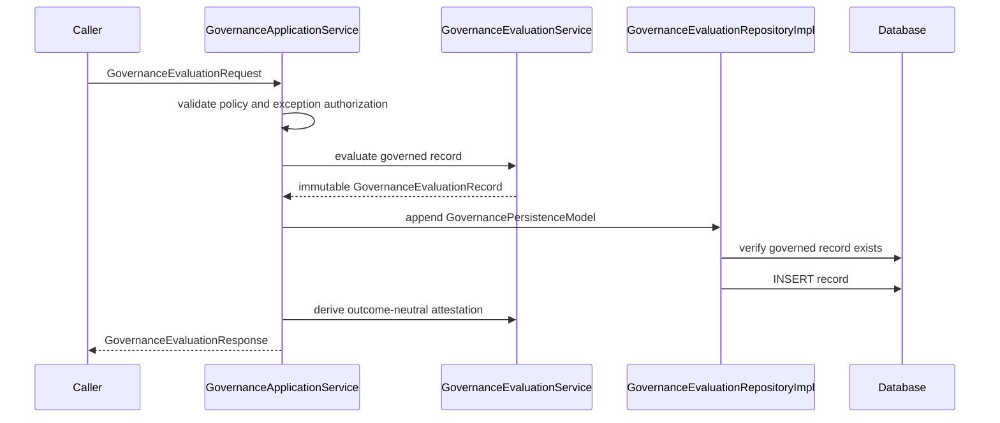
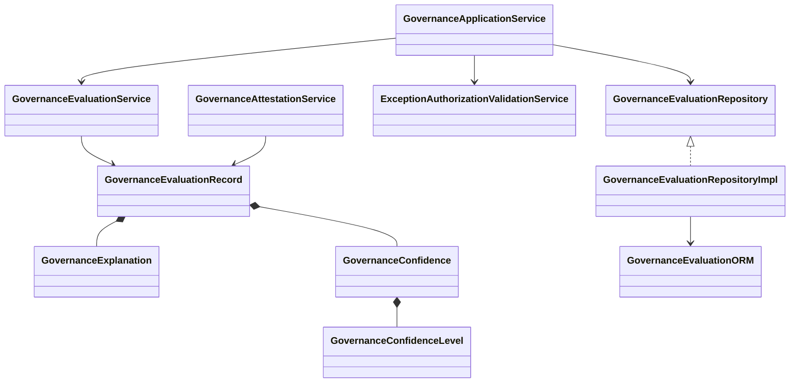
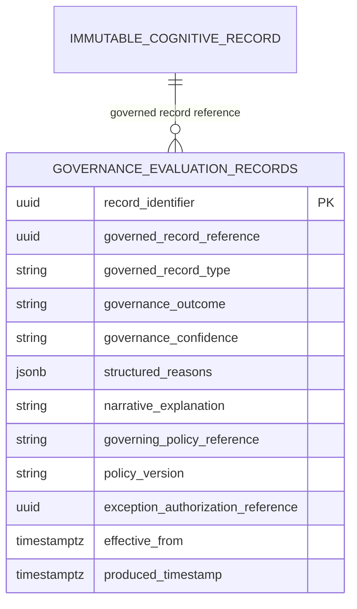

# CDD-009 Governance Engine — Design

CDD-009 implements GRM-001 v1.2 and consumes GEM-001 v1.1 under RFC-013 v1.1. It evaluates one existing immutable cognitive record against a configured governing enterprise policy and appends one immutable Governance Evaluation Record. The outcome-neutral Governance Attestation is derived from that record and is never persisted independently. Enterprise Trust is neither modeled nor persisted.

## Architecture

## Sequence

## Class model

## Persistence

The repository validates the governed record reference against exactly one authorized cognitive-record table selected by Governed Record Type. The type is not a new canonical entity or enum; it is the GRM-defined business attribute constrained to the five authorized cognitive record types.

Governance identity is Governed Record Reference plus Governing Policy Reference. Policy Version participates in history, not identity. RFC-011 currentness orders matching records by Effective From, Produced Timestamp, and Record Identifier, descending, and excludes future-effective records.

For Exception Granted, the application validates the supplied GEM-001 authorization authority, policy and version, effective period, and expiration. The authorization is consumed without modification and only its authorized reference is recorded. PostgreSQL rejects UPDATE and DELETE operations through a dedicated trigger. Human override appends a replacement record.
