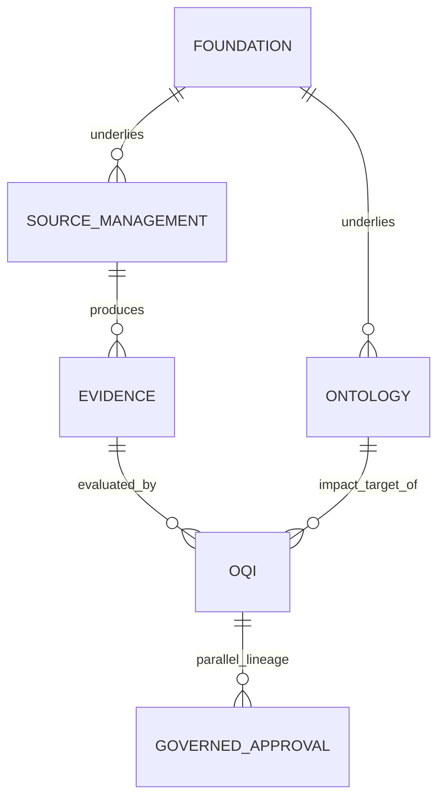
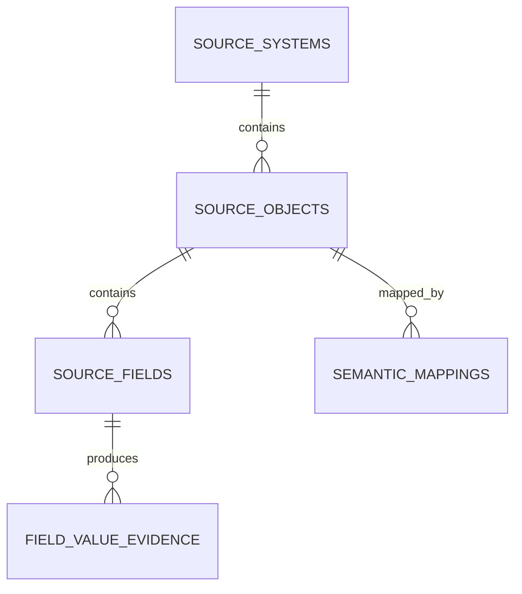
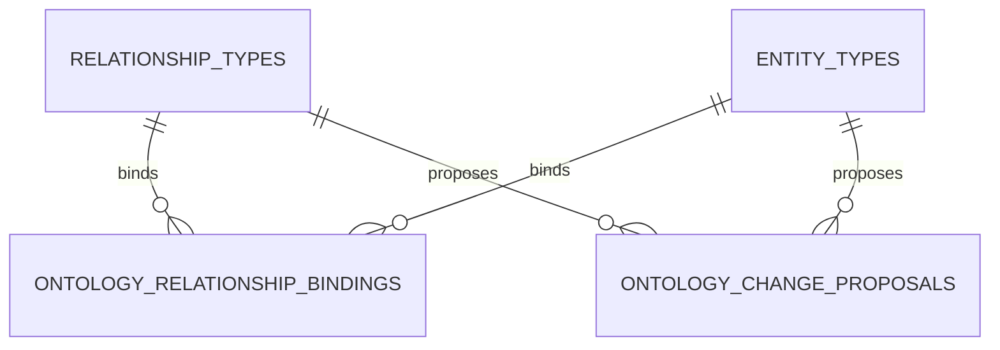
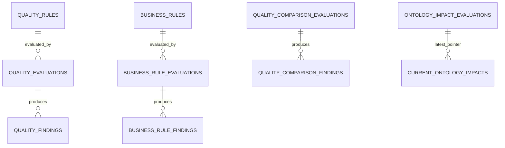
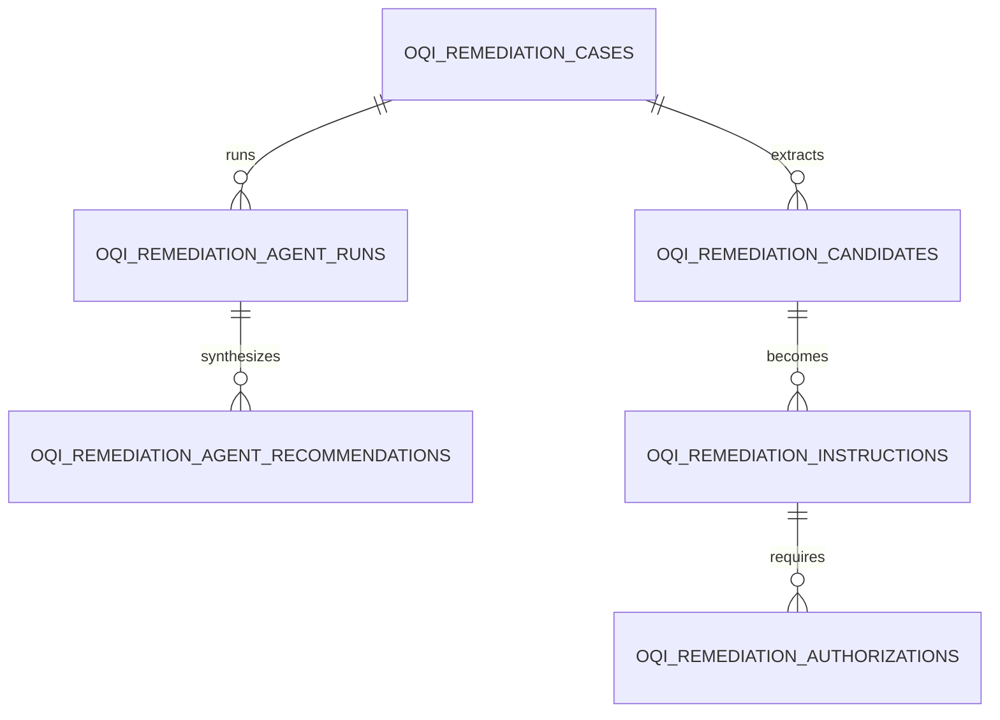
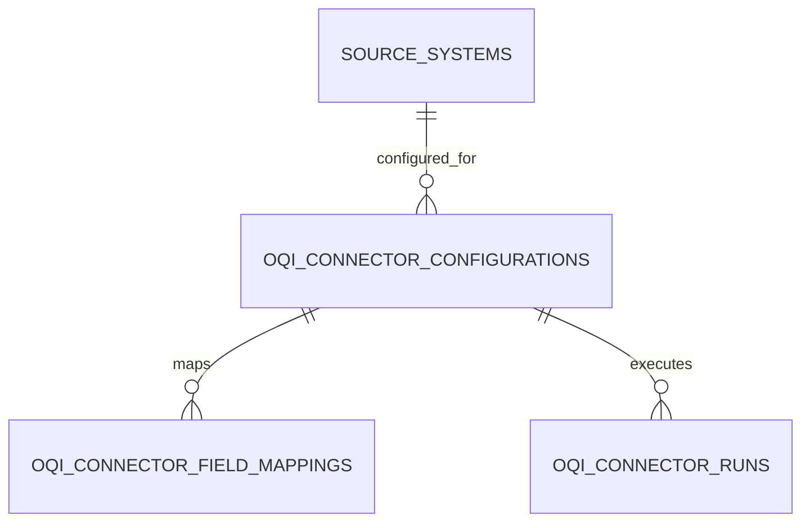
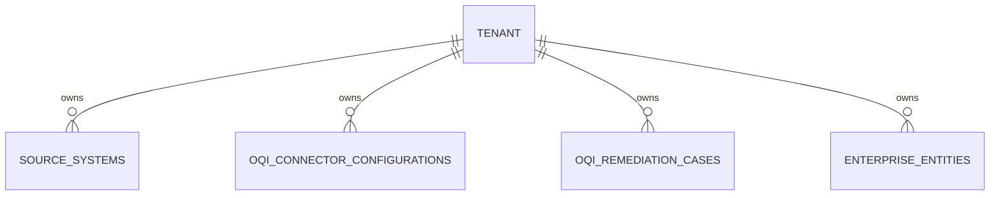
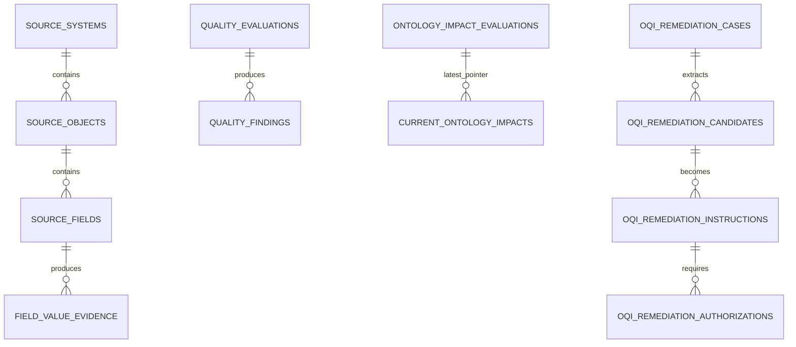

# Noetva Enterprise Data Model

Version: 1.0
Status: **DISCOVERED / GOVERNED — PENDING VM CERTIFICATION**
Phase: POSTGRES-DATA-MODEL-CLOSURE-DG
Source of truth: PostgreSQL catalog, independently extracted from a database migrated from empty
to Alembic head `0046_oqi5_remediation_tenancy` (single head, 126 application tables), reconciled
against Alembic migration file provenance. Not derived from ORM assumptions alone.

## 1. Purpose

This document is the authoritative reference for Noetva's complete PostgreSQL persistence model.
It serves four audiences:

1. **Engineering** — an authoritative database relationship reference: every table, column, key,
   constraint, and index, derived directly from the live catalog, not from memory or ORM
   declarations alone.
2. **Architecture** — enterprise data-model documentation: how the 126 physical tables group into
   product domains and how those domains depend on one another.
3. **Product** — an explanation of how Noetva's product concepts (tenants, sources, evidence,
   ontology, OQI findings, Reliance, governed remediation, business impact) actually persist.
4. **ER modeling** — sufficient structured information (a relationship catalog, cardinalities, and
   machine-oriented import data) to construct formal ER diagrams without re-reading source code.

**Methodology note**: every fact in sections 2-17 is mechanically derived from the extracted
PostgreSQL catalog (`pg_catalog`/`information_schema`) and cross-referenced against the 45 Alembic
migration files' own table-creation calls (`table_provenance.tsv`). Domain names and plain-English
table purposes are inferred from table/column naming and each migration's own docstring, not
invented; two tables (`source_systems`, `source_objects`) are functionally reclassified from their
literal bootstrap provenance (the original ECOM `0001_canonical_v1_3` raw-SQL migration) into
"Source Management" because that is what they functionally are today — disclosed here, not hidden.

## 2. Level 1 — Enterprise Domain Model

```text
Platform / Foundation (ECOM + Entity/Semantic Resolution + Runtime + Security Audit)
       |
       +--> Source Management (Blueprint, SourceSystem/SourceObject/SourceField, Connector)
       |         |
       |         v
       |    Evidence / Provenance (FieldValueEvidence)
       |         |
       |         +----------------+
       v                          v
   Ontology                  OQI (Ontology Quality Intelligence)
       |                          |
       |          +---------------+----------------+
       |          v               v                v
       |     Evaluation      Cross-Source      Business Rule
       |     (OQI1)          (OQI2)             (OQI3)
       |          \\               |                /
       |           +--------------+---------------+
       |                          v
       +----------------> Ontology Impact (OQI4)
                                  |
                    +-------------+-------------+
                    v                            v
            Reliance/Business Impact      Governed Agentic Remediation
            (OQI6)                        (OQI5: Recommendation ->
                                            Authorization -> Execution ->
                                            Re-evaluation -> Resolution)

   Governed Approval (Gate S/V) -- an older, separate, non-OQI approval lineage
   (CDD-018/CDD-037), architecturally parallel to OQI5, not a dependency of it.
```

Every arrow above corresponds to at least one real foreign key traced in sections 5 and 8-11.

### Domain Inventory

| Domain | Purpose | Tables | Root entity | Tenant scoped | Upstream domains | Downstream domains | Key relationships |
|---|---|---:|---|---|---|---|---|
| Foundation / Enterprise Canonical Ontology Model (ECOM) | The original v1.3 canonical enterprise/institutional model (CDD-003/004): parties, governance, institutional acts/relationships, decisions, reasons, evidence. | 30 | `enterprise_entities` | Mixed (most predate the tenant model; institutional_relationships is tenant-owned) | - | Entity & Semantic Resolution, Source Management, Ontology | enterprise_entities is the created_by/modified_by actor reference for nearly every later table |
| Entity & Semantic Resolution | Deterministic entity/semantic resolution and multi-stage assertion evaluation pipeline (CDD-004-013). | 13 | `assertion_records` | Yes (via resolution_policies/enterprise_entity_resolution_records) | Foundation | Blueprint & Canonical Requirements | assertion_records feeds knowledge/decision/governance evaluation records |
| OQI5 Governed Agentic Remediation | Candidate extraction -> instruction -> authorization -> execution-report -> re-evaluation lifecycle, plus optional advisory specialist-agent reasoning (CDD-043). | 8 | `oqi_remediation_cases` | Yes | OQI1-4 | - | oqi_remediation_instructions/authorizations/agent_runs all key off oqi_remediation_cases.case_id |
| OQI2 Cross-Source Consistency | Multi-source correspondence and disagreement detection (CDD-040). | 7 | `comparison_subject_correspondences` | Yes | OQI1, Evidence | OQI4 | quality_comparison_findings.latest_evaluation_id -> quality_comparison_evaluations |
| OQI Hardening H2 (Accuracy/Reasonableness) | Adds ACCURACY (reference-evidence-based) and REASONABLENESS dimensions (CDD-048). | 7 | `oqi_reference_evidence_assertions` | Yes | Source Management, OQI3 | OQI1 | oqi_reference_evidence_assertions.form distinguishes governed-dataset/human-verified/business-rule-derived evidence |
| OQI3 Business-Rule Quality | Governed business-rule evaluation over source evidence (CDD-041). | 6 | `business_rules` | Yes | OQI1, Evidence | OQI4, OQI5 | business_rule_findings.latest_evaluation_id -> business_rule_evaluations |
| OQI6 Criticality / Business Impact / Reliance | Business-process dependency modeling, business-impact evaluation, and the 3-state Reliance computation (CDD-044). | 6 | `oqi_business_processes` | Yes | OQI4 | - | current_business_impacts / current_reliance are tenant-qualified 'latest evaluation' pointers |
| OQI Hardening H4 (Integrity) | Adds INTEGRITY dimension: structural/reference relationship-cardinality and orphan-reference checks (CDD-050). | 6 | `oqi_integrity_relationship_cardinalities` | Yes | Ontology, Entity Resolution | - | oqi_integrity_structural_findings.tenant_id,enterprise_entity_id -> enterprise_entities (composite, corrected H4-R1) |
| Runtime Execution / Durable Orchestration | Durable, replayable execution/handoff/recovery framework (CDD-012). | 6 | `runtime_executions` | Yes (runtime_executions.tenant_id) | Foundation | - | runtime_stages/handoffs/results/recovery_attempts all key off runtime_executions |
| OQI4 Ontology Impact | Propagates a quality/comparison/business-rule Finding's impact across the ontology graph (CDD-042). | 5 | `ontology_impact_evaluations` | Yes | OQI1-3, Ontology | OQI6 | current_ontology_impacts is the tenant-qualified 'latest evaluation' pointer (CDD-055 correction) |
| OQI Hardening H3 (Conformity) | Adds CONFORMITY dimension via CanonicalStandard reference values (CDD-049). | 5 | `oqi_canonical_standards` | Mixed (standards are global; evaluations are tenant-scoped via OQI1/OQI2) | Blueprint | OQI1, OQI2 | oqi_canonical_standard_values/aliases anchor quality_evaluation/comparison canonical projections |
| Blueprint & Canonical Requirements | Canonical supply-chain Blueprint requirement contract (CDD-017): concept/relationship/information-element requirements. | 4 | `blueprints` | No (global canonical contract) | Foundation | Source Management, OQI Hardening (H3 canonical standards) | information_element_requirements anchors OQI H3 CanonicalStandard and H5 TimelinessPolicy |
| OQI1 Quality Foundation | Standard per-field quality dimension evaluation and findings (COMPLETENESS/VALIDITY/CONSISTENCY originally; CDD-039). | 4 | `quality_rules` | Yes | Source Management, Evidence | OQI2-6, OQI Hardening | quality_evaluations.source_field_id/source_object_id -> Source Management |
| Source Management | SourceSystem -> SourceObject -> SourceField hierarchy and semantic mapping to the Blueprint (CDD-015), plus the REAL-ENTERPRISE-INGESTION connector. | 4 | `source_systems` | Yes (source_systems/source_objects tenant-owned; source_fields inherits via source_objects) | Foundation, Blueprint | Evidence, OQI (every dimension), Connector/Ingestion | source_fields has no tenant_id of its own; scoped via source_objects (two-hop) |
| Gate S/V Governed Approval (pre-OQI) | (uninferred) | 3 | `(uninferred)` | (uninferred) | (uninferred) | (uninferred) | (uninferred) |
| Connector / Ingestion (REAL-ENTERPRISE-INGESTION) | Generic Governed REST Connector configuration/field-mapping/run persistence (CDD-059). | 3 | `oqi_connector_configurations` | Yes | Source Management | Evidence | oqi_connector_configurations.tenant_id,source_system_id -> source_systems (composite tenant-qualified) |
| OQI Hardening H5 (Timeliness) | Adds TIMELINESS dimension: source-evidence freshness/ingestion-SLA policy (CDD-051). | 3 | `oqi_timeliness_policies` | Yes | Source Management, Evidence, Blueprint | - | oqi_timeliness_evaluations.field_value_evidence_id -> field_value_evidence |
| Ontology | Ontology relationship-type graph bindings and governed change-proposal workflow (CDD-010/017). | 2 | `ontology_relationship_bindings` | No (global type-system graph) | Foundation, Blueprint | OQI4 (ontology impact), OQI Hardening H4 (integrity) | ontology_relationship_bindings triples (relationship_type, source_entity_type, target_entity_type) |
| OQI Hardening H1 (Coverage/Reliance) | Generalizes Reliance's coverage requirement across ontology elements (CDD-047). | 2 | `oqi_quality_coverage_policies` | Yes | OQI1, Ontology | OQI6 | policy_dimensions enumerates all 9 named dimensions in its own CHECK constraint |
| Platform Security Audit | API-level security audit event log (CDD-013). | 1 | `api_security_audit_events` | Optional (tenant_id nullable) | Foundation | - | standalone, no outbound FKs |
| Evidence / Provenance | FieldValueEvidence: the append-only 4-tuple-identity record of an observed source value (CDD-022). | 1 | `field_value_evidence` | No direct column; scoped via source_fields (two-hop from source_objects) | Source Management | OQI (all evaluation dimensions) | field_value_evidence.source_field_id -> source_fields |

## 3. Domain Inventory (table membership)

**Foundation / Enterprise Canonical Ontology Model (ECOM)** (30 tables): `accountable_owners`, `assertion_evidence`, `assertions`, `business_domains`, `contexts`, `countries`, `decision_objectives`, `decision_states`, `decisions`, `enterprise_entities`, `enterprise_types`, `enterprises`, `entity_types`, `evidences`, `experiences`, `governances`, `institutional_actions`, `institutional_acts`, `institutional_concepts`, `institutional_relationship_assertions`, `institutional_relationships`, `knowledges`, `occasions`, `outcomes`, `pattern_of_relevances`, `reason_decision_objectives`, `reason_evidence`, `reason_graphs`, `reasons`, `relationship_types`

**Entity & Semantic Resolution** (13 tables): `assertion_record_entity_resolution_evidence`, `assertion_record_history`, `assertion_record_semantic_resolution_evidence`, `assertion_records`, `decision_evaluation_records`, `decision_evaluations`, `enterprise_entity_resolution_history`, `enterprise_entity_resolution_records`, `governance_evaluation_records`, `knowledge_evaluation_records`, `resolution_policies`, `semantic_resolution_history`, `semantic_resolution_records`

**OQI5 Governed Agentic Remediation** (8 tables): `oqi_remediation_agent_assessments`, `oqi_remediation_agent_recommendations`, `oqi_remediation_agent_roles`, `oqi_remediation_agent_runs`, `oqi_remediation_authorizations`, `oqi_remediation_candidates`, `oqi_remediation_cases`, `oqi_remediation_instructions`

**OQI2 Cross-Source Consistency** (7 tables): `comparison_subject_correspondence_members`, `comparison_subject_correspondences`, `quality_comparison_evaluation_evidence`, `quality_comparison_evaluation_observations`, `quality_comparison_evaluation_participants`, `quality_comparison_evaluations`, `quality_comparison_findings`

**OQI Hardening H2 (Accuracy/Reasonableness)** (7 tables): `oqi_business_rule_derived_reference_entries`, `oqi_governed_reference_dataset_entries`, `oqi_human_verified_evidence_entries`, `oqi_quality_evaluation_reference_evidence`, `oqi_reference_evidence_assertions`, `oqi_reference_evidence_conflict_members`, `oqi_reference_evidence_conflicts`

**OQI3 Business-Rule Quality** (6 tables): `business_rule_evaluation_inputs`, `business_rule_evaluation_observations`, `business_rule_evaluations`, `business_rule_findings`, `business_rule_input_bindings`, `business_rules`

**OQI6 Criticality / Business Impact / Reliance** (6 tables): `current_business_impacts`, `current_reliance`, `oqi_business_dependencies`, `oqi_business_impact_evaluations`, `oqi_business_processes`, `oqi_reliance_evaluations`

**OQI Hardening H4 (Integrity)** (6 tables): `oqi_integrity_reference_evaluations`, `oqi_integrity_reference_findings`, `oqi_integrity_relationship_cardinalities`, `oqi_integrity_structural_evaluation_relationships`, `oqi_integrity_structural_evaluations`, `oqi_integrity_structural_findings`

**Runtime Execution / Durable Orchestration** (6 tables): `runtime_artifact_references`, `runtime_executions`, `runtime_handoffs`, `runtime_recovery_attempts`, `runtime_results`, `runtime_stages`

**OQI4 Ontology Impact** (5 tables): `current_ontology_impacts`, `impact_propagation_policies`, `ontology_impact_evaluations`, `ontology_impact_observations`, `ontology_impact_paths`

**OQI Hardening H3 (Conformity)** (5 tables): `oqi_canonical_standard_aliases`, `oqi_canonical_standard_values`, `oqi_canonical_standards`, `oqi_comparison_participant_canonical_projection`, `oqi_quality_evaluation_canonical_standard`

**Blueprint & Canonical Requirements** (4 tables): `blueprints`, `concept_requirements`, `information_element_requirements`, `relationship_requirements`

**OQI1 Quality Foundation** (4 tables): `quality_evaluation_evidence`, `quality_evaluations`, `quality_findings`, `quality_rules`

**Source Management** (4 tables): `semantic_mappings`, `source_fields`, `source_objects`, `source_systems`

**Gate S/V Governed Approval (pre-OQI)** (3 tables): `gate_s_approval_requests`, `gate_s_governed_notes`, `gate_v_agent_resolutions`

**Connector / Ingestion (REAL-ENTERPRISE-INGESTION)** (3 tables): `oqi_connector_configurations`, `oqi_connector_field_mappings`, `oqi_connector_runs`

**OQI Hardening H5 (Timeliness)** (3 tables): `oqi_timeliness_evaluations`, `oqi_timeliness_findings`, `oqi_timeliness_policies`

**Ontology** (2 tables): `ontology_change_proposals`, `ontology_relationship_bindings`

**OQI Hardening H1 (Coverage/Reliance)** (2 tables): `oqi_quality_coverage_policies`, `oqi_quality_coverage_policy_dimensions`

**Platform Security Audit** (1 tables): `api_security_audit_events`

**Evidence / Provenance** (1 tables): `field_value_evidence`


## 4. Complete Table Catalog

All 126 physical application tables, in alphabetical order.

### `accountable_owners`

**Purpose**: See domain description (Foundation / Enterprise Canonical Ontology Model (ECOM)); no additional table-specific purpose hint was authored for this table.

**Domain**: Foundation / Enterprise Canonical Ontology Model (ECOM)

**Tenant classification**: GLOBAL

**Columns**

| Column | PostgreSQL Type | Nullable | Default | PK | FK | Unique | Description |
|---|---|---:|---|---:|---:|---:|---|
| `accountable_owner_id` | uuid | NO | gen_random_uuid() | PK |  |  |  |
| `accountable_owner_name` | character varying | NO | - |  |  | UK |  |
| `lifecycle_state` | USER-DEFINED | NO | - |  |  |  |  |
| `effective_from` | timestamp with time zone | NO | - |  |  |  |  |
| `effective_to` | timestamp with time zone | YES | - |  |  |  |  |
| `governance_status` | USER-DEFINED | NO | - |  |  |  |  |
| `created_by` | uuid | NO | - |  | FK |  |  |
| `created_on` | timestamp with time zone | NO | - |  |  |  |  |
| `modified_by` | uuid | YES | - |  | FK |  |  |
| `modified_on` | timestamp with time zone | YES | - |  |  |  |  |
| `version_number` | integer | NO | 1 |  |  |  |  |
| `previous_version_id` | uuid | YES | - |  | FK |  |  |

**Primary Key**: `accountable_owner_id`

**Foreign Keys**

| FK | Child Column(s) | Parent Table | Parent Column(s) | ON DELETE | Tenant-aware | Relationship |
|---|---|---|---|---|---|---|
| `fk_accountable_owners_created_by` | created_by | `enterprise_entities` | enterprise_entity_id | NO ACTION | CHILD_NOT_TENANT_OWNED | accountable_owners 1:N `enterprise_entities` |
| `fk_accountable_owners_modified_by` | modified_by | `enterprise_entities` | enterprise_entity_id | NO ACTION | CHILD_NOT_TENANT_OWNED | accountable_owners 1:N `enterprise_entities` |
| `fk_accountable_owners_previous_version_id` | previous_version_id | `accountable_owners` | accountable_owner_id | NO ACTION | GLOBAL_PARENT | accountable_owners 1:N `accountable_owners` |

**Unique Constraints**

- `accountable_owners_accountable_owner_name_key`: UNIQUE (accountable_owner_name)

**Check Constraints**

_(none)_

**Indexes** (excluding the PK's own index)

- `accountable_owners_accountable_owner_name_key` (unique): `CREATE UNIQUE INDEX accountable_owners_accountable_owner_name_key ON public.accountable_owners USING btree (accountable_owner_name)`
- `idx_accountable_owners_accountable_owner_name`: `CREATE INDEX idx_accountable_owners_accountable_owner_name ON public.accountable_owners USING btree (accountable_owner_name)`
- `idx_accountable_owners_created_by`: `CREATE INDEX idx_accountable_owners_created_by ON public.accountable_owners USING btree (created_by)`
- `idx_accountable_owners_created_on`: `CREATE INDEX idx_accountable_owners_created_on ON public.accountable_owners USING btree (created_on)`
- `idx_accountable_owners_effective_from`: `CREATE INDEX idx_accountable_owners_effective_from ON public.accountable_owners USING btree (effective_from)`
- `idx_accountable_owners_effective_to`: `CREATE INDEX idx_accountable_owners_effective_to ON public.accountable_owners USING btree (effective_to)`
- `idx_accountable_owners_governance_status`: `CREATE INDEX idx_accountable_owners_governance_status ON public.accountable_owners USING btree (governance_status)`
- `idx_accountable_owners_lifecycle_state`: `CREATE INDEX idx_accountable_owners_lifecycle_state ON public.accountable_owners USING btree (lifecycle_state)`
- `idx_accountable_owners_modified_by`: `CREATE INDEX idx_accountable_owners_modified_by ON public.accountable_owners USING btree (modified_by)`
- `idx_accountable_owners_modified_on`: `CREATE INDEX idx_accountable_owners_modified_on ON public.accountable_owners USING btree (modified_on)`
- `idx_accountable_owners_previous_version_id`: `CREATE INDEX idx_accountable_owners_previous_version_id ON public.accountable_owners USING btree (previous_version_id)`
- `idx_accountable_owners_version_number`: `CREATE INDEX idx_accountable_owners_version_number ON public.accountable_owners USING btree (version_number)`

**Relationships**

- `accountable_owners` 1:N `enterprise_entities` (via created_by)
- `accountable_owners` 1:N `enterprise_entities` (via modified_by)
- `accountable_owners` 1:N `accountable_owners` (via previous_version_id)
- `decisions` 1:N `accountable_owners` (via accountable_owner_id)
- `institutional_acts` 1:N `accountable_owners` (via accountable_owner_id)

**Lifecycle**: has a version number column; carries a `previous_version_id` self-reference (version-chain lineage).

**Introduced By**: `0001_canonical_v1_3` (0001_canonical_model_v1_3.py (canonical_v1_3.sql))

### `api_security_audit_events`

**Purpose**: See domain description (Platform Security Audit); no additional table-specific purpose hint was authored for this table.

**Domain**: Platform Security Audit

**Tenant classification**: TENANT

**Columns**

| Column | PostgreSQL Type | Nullable | Default | PK | FK | Unique | Description |
|---|---|---:|---|---:|---:|---:|---|
| `audit_event_id` | uuid | NO | - | PK |  |  |  |
| `event_timestamp` | timestamp with time zone | NO | - |  |  |  |  |
| `tenant_id` | character varying | YES | - |  |  |  | tenant identity |
| `principal_reference` | character varying | YES | - |  |  |  |  |
| `operation` | character varying | NO | - |  |  |  |  |
| `endpoint_classification` | character varying | NO | - |  |  |  |  |
| `event_category` | character varying | NO | - |  |  |  |  |
| `outcome` | character varying | NO | - |  |  |  |  |
| `diagnostic_code` | character varying | NO | - |  |  |  |  |
| `correlation_id` | uuid | NO | - |  |  |  |  |
| `execution_id` | uuid | YES | - |  |  |  |  |
| `attempt_id` | uuid | YES | - |  |  |  |  |
| `authorization_decision_reference` | character varying | YES | - |  |  |  |  |
| `evidence_resource_reference` | character varying | YES | - |  |  |  |  |
| `source_channel` | character varying | YES | - |  |  |  |  |
| `retention_until` | timestamp with time zone | NO | - |  |  |  |  |
| `legal_hold` | boolean | NO | false |  |  |  |  |
| `legal_hold_reference` | character varying | YES | - |  |  |  |  |
| `integrity_version` | integer | NO | 1 |  |  |  |  |
| `integrity_digest` | bytea | NO | - |  |  |  |  |
| `created_at` | timestamp with time zone | NO | - |  |  |  |  |

**Primary Key**: `audit_event_id`

**Foreign Keys**

_(none — this table has no outbound foreign keys)_

**Unique Constraints**

_(none beyond the primary key)_

**Check Constraints**

- `api_security_audit_retention_valid`: CHECK ((retention_until >= event_timestamp))

**Indexes** (excluding the PK's own index)

- `ix_api_security_audit_category_time`: `CREATE INDEX ix_api_security_audit_category_time ON public.api_security_audit_events USING btree (event_category, event_timestamp)`
- `ix_api_security_audit_correlation`: `CREATE INDEX ix_api_security_audit_correlation ON public.api_security_audit_events USING btree (correlation_id)`
- `ix_api_security_audit_retention`: `CREATE INDEX ix_api_security_audit_retention ON public.api_security_audit_events USING btree (retention_until, legal_hold)`
- `ix_api_security_audit_tenant_time`: `CREATE INDEX ix_api_security_audit_tenant_time ON public.api_security_audit_events USING btree (tenant_id, event_timestamp)`

**Relationships**

_(no FK relationships either direction)_

**Lifecycle**: N/A — no status/version column found.

**Introduced By**: `0009_api_security_audit` (0009_api_security_audit.py)

### `assertion_evidence`

**Purpose**: An evidence/observation record supporting an evaluation in this domain.

**Domain**: Foundation / Enterprise Canonical Ontology Model (ECOM)

**Tenant classification**: ASSOCIATIVE

**Columns**

| Column | PostgreSQL Type | Nullable | Default | PK | FK | Unique | Description |
|---|---|---:|---|---:|---:|---:|---|
| `assertion_id` | uuid | NO | - | PK | FK |  |  |
| `evidence_id` | uuid | NO | - | PK | FK |  |  |

**Primary Key**: `assertion_id,evidence_id`

**Foreign Keys**

| FK | Child Column(s) | Parent Table | Parent Column(s) | ON DELETE | Tenant-aware | Relationship |
|---|---|---|---|---|---|---|
| `assertion_evidence_assertion_id_fkey` | assertion_id | `assertions` | assertion_id | NO ACTION | GLOBAL_PARENT | assertion_evidence 1:N `assertions` |
| `assertion_evidence_evidence_id_fkey` | evidence_id | `evidences` | evidence_id | NO ACTION | GLOBAL_PARENT | assertion_evidence 1:N `evidences` |

**Unique Constraints**

_(none beyond the primary key)_

**Check Constraints**

_(none)_

**Indexes** (excluding the PK's own index)

_(no secondary indexes beyond the primary key)_

**Relationships**

- `assertion_evidence` 1:N `assertions` (via assertion_id)
- `assertion_evidence` 1:N `evidences` (via evidence_id)

**Lifecycle**: N/A — no status/version column found.

**Introduced By**: `0001_canonical_v1_3` (0001_canonical_model_v1_3.py (canonical_v1_3.sql))

### `assertion_record_entity_resolution_evidence`

**Purpose**: An evidence/observation record supporting an evaluation in this domain.

**Domain**: Entity & Semantic Resolution

**Tenant classification**: ASSOCIATIVE

**Columns**

| Column | PostgreSQL Type | Nullable | Default | PK | FK | Unique | Description |
|---|---|---:|---|---:|---:|---:|---|
| `assertion_record_id` | uuid | NO | - | PK | FK |  |  |
| `entity_resolution_record_id` | uuid | NO | - | PK | FK |  |  |

**Primary Key**: `assertion_record_id,entity_resolution_record_id`

**Foreign Keys**

| FK | Child Column(s) | Parent Table | Parent Column(s) | ON DELETE | Tenant-aware | Relationship |
|---|---|---|---|---|---|---|
| `assertion_record_entity_resolu_entity_resolution_record_id_fkey` | entity_resolution_record_id | `enterprise_entity_resolution_records` | record_id | NO ACTION | CHILD_NOT_TENANT_OWNED | assertion_record_entity_resolution_evidence 1:N `enterprise_entity_resolution_records` |
| `assertion_record_entity_resolution_evi_assertion_record_id_fkey` | assertion_record_id | `assertion_records` | record_id | NO ACTION | GLOBAL_PARENT | assertion_record_entity_resolution_evidence 1:N `assertion_records` |

**Unique Constraints**

_(none beyond the primary key)_

**Check Constraints**

_(none)_

**Indexes** (excluding the PK's own index)

_(no secondary indexes beyond the primary key)_

**Relationships**

- `assertion_record_entity_resolution_evidence` 1:N `enterprise_entity_resolution_records` (via entity_resolution_record_id)
- `assertion_record_entity_resolution_evidence` 1:N `assertion_records` (via assertion_record_id)

**Lifecycle**: N/A — no status/version column found.

**Introduced By**: `0004_assertion_records` (0004_assertion_records.py)

### `assertion_record_history`

**Purpose**: An append-only history/audit trail table.

**Domain**: Entity & Semantic Resolution

**Tenant classification**: GLOBAL

**Columns**

| Column | PostgreSQL Type | Nullable | Default | PK | FK | Unique | Description |
|---|---|---:|---|---:|---:|---:|---|
| `assertion_identity_key` | character varying | NO | - | PK |  |  |  |
| `active_record_id` | uuid | NO | - |  | FK |  |  |
| `archived_record_ids` | character varying | NO | - |  |  |  |  |
| `updated_at` | timestamp with time zone | NO | - |  |  |  |  |

**Primary Key**: `assertion_identity_key`

**Foreign Keys**

| FK | Child Column(s) | Parent Table | Parent Column(s) | ON DELETE | Tenant-aware | Relationship |
|---|---|---|---|---|---|---|
| `assertion_record_history_active_record_id_fkey` | active_record_id | `assertion_records` | record_id | NO ACTION | GLOBAL_PARENT | assertion_record_history 1:N `assertion_records` |

**Unique Constraints**

_(none beyond the primary key)_

**Check Constraints**

_(none)_

**Indexes** (excluding the PK's own index)

_(no secondary indexes beyond the primary key)_

**Relationships**

- `assertion_record_history` 1:N `assertion_records` (via active_record_id)

**Lifecycle**: N/A — no status/version column found.

**Introduced By**: `0004_assertion_records` (0004_assertion_records.py)

### `assertion_record_semantic_resolution_evidence`

**Purpose**: An evidence/observation record supporting an evaluation in this domain.

**Domain**: Entity & Semantic Resolution

**Tenant classification**: ASSOCIATIVE

**Columns**

| Column | PostgreSQL Type | Nullable | Default | PK | FK | Unique | Description |
|---|---|---:|---|---:|---:|---:|---|
| `assertion_record_id` | uuid | NO | - | PK | FK |  |  |
| `semantic_resolution_record_id` | uuid | NO | - | PK | FK |  |  |

**Primary Key**: `assertion_record_id,semantic_resolution_record_id`

**Foreign Keys**

| FK | Child Column(s) | Parent Table | Parent Column(s) | ON DELETE | Tenant-aware | Relationship |
|---|---|---|---|---|---|---|
| `assertion_record_semantic_res_semantic_resolution_record_i_fkey` | semantic_resolution_record_id | `semantic_resolution_records` | record_id | NO ACTION | GLOBAL_PARENT | assertion_record_semantic_resolution_evidence 1:N `semantic_resolution_records` |
| `assertion_record_semantic_resolution_e_assertion_record_id_fkey` | assertion_record_id | `assertion_records` | record_id | NO ACTION | GLOBAL_PARENT | assertion_record_semantic_resolution_evidence 1:N `assertion_records` |

**Unique Constraints**

_(none beyond the primary key)_

**Check Constraints**

_(none)_

**Indexes** (excluding the PK's own index)

_(no secondary indexes beyond the primary key)_

**Relationships**

- `assertion_record_semantic_resolution_evidence` 1:N `semantic_resolution_records` (via semantic_resolution_record_id)
- `assertion_record_semantic_resolution_evidence` 1:N `assertion_records` (via assertion_record_id)

**Lifecycle**: N/A — no status/version column found.

**Introduced By**: `0004_assertion_records` (0004_assertion_records.py)

### `assertion_records`

**Purpose**: See domain description (Entity & Semantic Resolution); no additional table-specific purpose hint was authored for this table.

**Domain**: Entity & Semantic Resolution

**Tenant classification**: GLOBAL

**Columns**

| Column | PostgreSQL Type | Nullable | Default | PK | FK | Unique | Description |
|---|---|---:|---|---:|---:|---:|---|
| `record_id` | uuid | NO | - | PK |  |  |  |
| `subject_entity_id` | uuid | NO | - |  | FK |  |  |
| `predicate_relationship_type_id` | uuid | NO | - |  | FK |  |  |
| `object_institutional_concept_id` | uuid | NO | - |  | FK |  |  |
| `context_id` | uuid | NO | - |  | FK |  |  |
| `outcome` | character varying | NO | - |  |  |  |  |
| `business_confidence` | character varying | NO | - |  |  |  |  |
| `structured_reasons` | character varying | NO | - |  |  |  |  |
| `narrative_explanation` | character varying | NO | - |  |  |  |  |
| `policy_version` | character varying | NO | - |  |  |  |  |
| `produced_at` | timestamp with time zone | NO | - |  |  |  |  |

**Primary Key**: `record_id`

**Foreign Keys**

| FK | Child Column(s) | Parent Table | Parent Column(s) | ON DELETE | Tenant-aware | Relationship |
|---|---|---|---|---|---|---|
| `assertion_records_context_id_fkey` | context_id | `contexts` | context_id | NO ACTION | GLOBAL_PARENT | assertion_records 1:N `contexts` |
| `assertion_records_object_institutional_concept_id_fkey` | object_institutional_concept_id | `institutional_concepts` | institutional_concept_id | NO ACTION | GLOBAL_PARENT | assertion_records 1:N `institutional_concepts` |
| `assertion_records_predicate_relationship_type_id_fkey` | predicate_relationship_type_id | `relationship_types` | relationship_type_id | NO ACTION | GLOBAL_PARENT | assertion_records 1:N `relationship_types` |
| `assertion_records_subject_entity_id_fkey` | subject_entity_id | `enterprise_entities` | enterprise_entity_id | NO ACTION | CHILD_NOT_TENANT_OWNED | assertion_records 1:N `enterprise_entities` |

**Unique Constraints**

_(none beyond the primary key)_

**Check Constraints**

_(none)_

**Indexes** (excluding the PK's own index)

- `idx_assertion_record_identity`: `CREATE INDEX idx_assertion_record_identity ON public.assertion_records USING btree (subject_entity_id, predicate_relationship_type_id, object_institutional_concept_id, context_id)`

**Relationships**

- `assertion_records` 1:N `contexts` (via context_id)
- `assertion_records` 1:N `institutional_concepts` (via object_institutional_concept_id)
- `assertion_records` 1:N `relationship_types` (via predicate_relationship_type_id)
- `assertion_records` 1:N `enterprise_entities` (via subject_entity_id)
- `assertion_record_entity_resolution_evidence` 1:N `assertion_records` (via assertion_record_id)
- `assertion_record_history` 1:N `assertion_records` (via active_record_id)
- `assertion_record_semantic_resolution_evidence` 1:N `assertion_records` (via assertion_record_id)
- `knowledge_evaluation_records` 1:N `assertion_records` (via assertion_record_id)

**Lifecycle**: N/A — no status/version column found.

**Introduced By**: `0004_assertion_records` (0004_assertion_records.py)

### `assertions`

**Purpose**: See domain description (Foundation / Enterprise Canonical Ontology Model (ECOM)); no additional table-specific purpose hint was authored for this table.

**Domain**: Foundation / Enterprise Canonical Ontology Model (ECOM)

**Tenant classification**: GLOBAL

**Columns**

| Column | PostgreSQL Type | Nullable | Default | PK | FK | Unique | Description |
|---|---|---:|---|---:|---:|---:|---|
| `assertion_id` | uuid | NO | gen_random_uuid() | PK |  |  |  |
| `assertion_name` | character varying | NO | - |  |  | UK |  |
| `lifecycle_state` | USER-DEFINED | NO | - |  |  |  |  |
| `effective_from` | timestamp with time zone | NO | - |  |  |  |  |
| `effective_to` | timestamp with time zone | YES | - |  |  |  |  |
| `governance_status` | USER-DEFINED | NO | - |  |  |  |  |
| `created_by` | uuid | NO | - |  | FK |  |  |
| `created_on` | timestamp with time zone | NO | - |  |  |  |  |
| `modified_by` | uuid | YES | - |  | FK |  |  |
| `modified_on` | timestamp with time zone | YES | - |  |  |  |  |
| `version_number` | integer | NO | 1 |  |  |  |  |
| `previous_version_id` | uuid | YES | - |  | FK |  |  |
| `subject_entity_id` | uuid | NO | - |  | FK |  |  |
| `predicate` | character varying | YES | - |  |  |  |  |
| `object_value` | character varying | YES | - |  |  |  |  |
| `object_entity_id` | uuid | YES | - |  | FK |  |  |
| `source_system_id` | uuid | NO | - |  | FK |  |  |
| `source_object_id` | uuid | YES | - |  | FK |  |  |
| `asserted_on` | timestamp with time zone | NO | - |  |  |  |  |
| `prior_assertion_id` | uuid | YES | - |  | FK |  |  |
| `knowledge_id` | uuid | YES | - |  | FK |  |  |
| `assertion_type` | USER-DEFINED | NO | - |  |  |  |  |
| `relationship_type_id` | uuid | YES | - |  | FK |  |  |

**Primary Key**: `assertion_id`

**Foreign Keys**

| FK | Child Column(s) | Parent Table | Parent Column(s) | ON DELETE | Tenant-aware | Relationship |
|---|---|---|---|---|---|---|
| `fk_assertions_created_by` | created_by | `enterprise_entities` | enterprise_entity_id | NO ACTION | CHILD_NOT_TENANT_OWNED | assertions 1:N `enterprise_entities` |
| `fk_assertions_knowledge_id` | knowledge_id | `knowledges` | knowledge_id | NO ACTION | GLOBAL_PARENT | assertions 1:N `knowledges` |
| `fk_assertions_modified_by` | modified_by | `enterprise_entities` | enterprise_entity_id | NO ACTION | CHILD_NOT_TENANT_OWNED | assertions 1:N `enterprise_entities` |
| `fk_assertions_object_entity_id` | object_entity_id | `enterprise_entities` | enterprise_entity_id | NO ACTION | CHILD_NOT_TENANT_OWNED | assertions 1:N `enterprise_entities` |
| `fk_assertions_previous_version_id` | previous_version_id | `assertions` | assertion_id | NO ACTION | GLOBAL_PARENT | assertions 1:N `assertions` |
| `fk_assertions_prior_assertion_id` | prior_assertion_id | `assertions` | assertion_id | NO ACTION | GLOBAL_PARENT | assertions 1:N `assertions` |
| `fk_assertions_relationship_type_id` | relationship_type_id | `relationship_types` | relationship_type_id | NO ACTION | GLOBAL_PARENT | assertions 1:N `relationship_types` |
| `fk_assertions_source_object_id` | source_object_id | `source_objects` | source_object_id | NO ACTION | CHILD_NOT_TENANT_OWNED | assertions 1:N `source_objects` |
| `fk_assertions_source_system_id` | source_system_id | `source_systems` | source_system_id | NO ACTION | CHILD_NOT_TENANT_OWNED | assertions 1:N `source_systems` |
| `fk_assertions_subject_entity_id` | subject_entity_id | `enterprise_entities` | enterprise_entity_id | NO ACTION | CHILD_NOT_TENANT_OWNED | assertions 1:N `enterprise_entities` |

**Unique Constraints**

- `assertions_assertion_name_key`: UNIQUE (assertion_name)

**Check Constraints**

- `chk_assertions_relational_xor_literal`: CHECK ((((relationship_type_id IS NOT NULL) AND (object_entity_id IS NOT NULL) AND (predicate IS NULL) AND (object_value IS NULL)) OR ((relationship_type_id IS NULL) AND (object_entity_id IS NULL) AND (predicate IS NOT NULL))))

**Indexes** (excluding the PK's own index)

- `assertions_assertion_name_key` (unique): `CREATE UNIQUE INDEX assertions_assertion_name_key ON public.assertions USING btree (assertion_name)`
- `idx_assertions_asserted_on`: `CREATE INDEX idx_assertions_asserted_on ON public.assertions USING btree (asserted_on)`
- `idx_assertions_assertion_name`: `CREATE INDEX idx_assertions_assertion_name ON public.assertions USING btree (assertion_name)`
- `idx_assertions_assertion_type`: `CREATE INDEX idx_assertions_assertion_type ON public.assertions USING btree (assertion_type)`
- `idx_assertions_created_by`: `CREATE INDEX idx_assertions_created_by ON public.assertions USING btree (created_by)`
- `idx_assertions_created_on`: `CREATE INDEX idx_assertions_created_on ON public.assertions USING btree (created_on)`
- `idx_assertions_effective_from`: `CREATE INDEX idx_assertions_effective_from ON public.assertions USING btree (effective_from)`
- `idx_assertions_effective_to`: `CREATE INDEX idx_assertions_effective_to ON public.assertions USING btree (effective_to)`
- `idx_assertions_governance_status`: `CREATE INDEX idx_assertions_governance_status ON public.assertions USING btree (governance_status)`
- `idx_assertions_knowledge_id`: `CREATE INDEX idx_assertions_knowledge_id ON public.assertions USING btree (knowledge_id)`
- `idx_assertions_lifecycle_state`: `CREATE INDEX idx_assertions_lifecycle_state ON public.assertions USING btree (lifecycle_state)`
- `idx_assertions_modified_by`: `CREATE INDEX idx_assertions_modified_by ON public.assertions USING btree (modified_by)`
- `idx_assertions_modified_on`: `CREATE INDEX idx_assertions_modified_on ON public.assertions USING btree (modified_on)`
- `idx_assertions_object_entity_id`: `CREATE INDEX idx_assertions_object_entity_id ON public.assertions USING btree (object_entity_id)`
- `idx_assertions_object_value`: `CREATE INDEX idx_assertions_object_value ON public.assertions USING btree (object_value)`
- `idx_assertions_predicate`: `CREATE INDEX idx_assertions_predicate ON public.assertions USING btree (predicate)`
- `idx_assertions_previous_version_id`: `CREATE INDEX idx_assertions_previous_version_id ON public.assertions USING btree (previous_version_id)`
- `idx_assertions_prior_assertion_id`: `CREATE INDEX idx_assertions_prior_assertion_id ON public.assertions USING btree (prior_assertion_id)`
- `idx_assertions_relationship_type_id`: `CREATE INDEX idx_assertions_relationship_type_id ON public.assertions USING btree (relationship_type_id)`
- `idx_assertions_source_object_id`: `CREATE INDEX idx_assertions_source_object_id ON public.assertions USING btree (source_object_id)`
- `idx_assertions_source_system_id`: `CREATE INDEX idx_assertions_source_system_id ON public.assertions USING btree (source_system_id)`
- `idx_assertions_subject_entity_id`: `CREATE INDEX idx_assertions_subject_entity_id ON public.assertions USING btree (subject_entity_id)`
- `idx_assertions_version_number`: `CREATE INDEX idx_assertions_version_number ON public.assertions USING btree (version_number)`

**Relationships**

- `assertions` 1:N `enterprise_entities` (via created_by)
- `assertions` 1:N `knowledges` (via knowledge_id)
- `assertions` 1:N `enterprise_entities` (via modified_by)
- `assertions` 1:N `enterprise_entities` (via object_entity_id)
- `assertions` 1:N `assertions` (via previous_version_id)
- `assertions` 1:N `assertions` (via prior_assertion_id)
- `assertions` 1:N `relationship_types` (via relationship_type_id)
- `assertions` 1:N `source_objects` (via source_object_id)
- `assertions` 1:N `source_systems` (via source_system_id)
- `assertions` 1:N `enterprise_entities` (via subject_entity_id)
- `assertion_evidence` 1:N `assertions` (via assertion_id)
- `institutional_relationship_assertions` 1:N `assertions` (via assertion_id)

**Lifecycle**: has a version number column; carries a `previous_version_id` self-reference (version-chain lineage).

**Introduced By**: `0001_canonical_v1_3` (0001_canonical_model_v1_3.py (canonical_v1_3.sql))

### `blueprints`

**Purpose**: See domain description (Blueprint & Canonical Requirements); no additional table-specific purpose hint was authored for this table.

**Domain**: Blueprint & Canonical Requirements

**Tenant classification**: GLOBAL

**Columns**

| Column | PostgreSQL Type | Nullable | Default | PK | FK | Unique | Description |
|---|---|---:|---|---:|---:|---:|---|
| `blueprint_id` | uuid | NO | gen_random_uuid() | PK |  |  |  |
| `blueprint_name` | character varying | NO | - |  |  |  |  |
| `lifecycle_state` | USER-DEFINED | NO | - |  |  |  |  |
| `governance_status` | USER-DEFINED | NO | - |  |  |  |  |
| `version_number` | integer | NO | 1 |  |  |  |  |
| `previous_version_id` | uuid | YES | - |  | FK |  |  |
| `created_by` | uuid | NO | - |  | FK |  |  |
| `created_on` | timestamp with time zone | NO | - |  |  |  |  |
| `modified_by` | uuid | YES | - |  | FK |  |  |
| `modified_on` | timestamp with time zone | YES | - |  |  |  |  |

**Primary Key**: `blueprint_id`

**Foreign Keys**

| FK | Child Column(s) | Parent Table | Parent Column(s) | ON DELETE | Tenant-aware | Relationship |
|---|---|---|---|---|---|---|
| `fk_blueprints_created_by` | created_by | `enterprise_entities` | enterprise_entity_id | NO ACTION | CHILD_NOT_TENANT_OWNED | blueprints 1:N `enterprise_entities` |
| `fk_blueprints_modified_by` | modified_by | `enterprise_entities` | enterprise_entity_id | NO ACTION | CHILD_NOT_TENANT_OWNED | blueprints 1:N `enterprise_entities` |
| `fk_blueprints_previous_version_id` | previous_version_id | `blueprints` | blueprint_id | NO ACTION | GLOBAL_PARENT | blueprints 1:N `blueprints` |

**Unique Constraints**

_(none beyond the primary key)_

**Check Constraints**

_(none)_

**Indexes** (excluding the PK's own index)

- `idx_blueprints_blueprint_name`: `CREATE INDEX idx_blueprints_blueprint_name ON public.blueprints USING btree (blueprint_name)`
- `idx_blueprints_governance_status`: `CREATE INDEX idx_blueprints_governance_status ON public.blueprints USING btree (governance_status)`
- `idx_blueprints_lifecycle_state`: `CREATE INDEX idx_blueprints_lifecycle_state ON public.blueprints USING btree (lifecycle_state)`
- `idx_blueprints_previous_version_id`: `CREATE INDEX idx_blueprints_previous_version_id ON public.blueprints USING btree (previous_version_id)`

**Relationships**

- `blueprints` 1:N `enterprise_entities` (via created_by)
- `blueprints` 1:N `enterprise_entities` (via modified_by)
- `blueprints` 1:N `blueprints` (via previous_version_id)
- `concept_requirements` 1:N `blueprints` (via blueprint_id)

**Lifecycle**: has a version number column; carries a `previous_version_id` self-reference (version-chain lineage).

**Introduced By**: `0014_blueprint_requirement` (0014_blueprint_requirement_contract.py)

### `business_domains`

**Purpose**: See domain description (Foundation / Enterprise Canonical Ontology Model (ECOM)); no additional table-specific purpose hint was authored for this table.

**Domain**: Foundation / Enterprise Canonical Ontology Model (ECOM)

**Tenant classification**: GLOBAL

**Columns**

| Column | PostgreSQL Type | Nullable | Default | PK | FK | Unique | Description |
|---|---|---:|---|---:|---:|---:|---|
| `business_domain_id` | uuid | NO | gen_random_uuid() | PK |  |  |  |
| `enterprise_id` | uuid | NO | - |  | FK | UK |  |
| `domain_name` | character varying | NO | - |  |  | UK |  |
| `lifecycle_state` | USER-DEFINED | NO | - |  |  |  |  |
| `effective_from` | timestamp with time zone | NO | - |  |  |  |  |
| `effective_to` | timestamp with time zone | YES | - |  |  |  |  |
| `governance_status` | USER-DEFINED | NO | - |  |  |  |  |
| `created_by` | uuid | NO | - |  | FK |  |  |
| `created_on` | timestamp with time zone | NO | - |  |  |  |  |
| `modified_by` | uuid | YES | - |  | FK |  |  |
| `modified_on` | timestamp with time zone | YES | - |  |  |  |  |
| `version_number` | integer | NO | 1 |  |  |  |  |
| `previous_version_id` | uuid | YES | - |  | FK |  |  |

**Primary Key**: `business_domain_id`

**Foreign Keys**

| FK | Child Column(s) | Parent Table | Parent Column(s) | ON DELETE | Tenant-aware | Relationship |
|---|---|---|---|---|---|---|
| `fk_business_domains_created_by` | created_by | `enterprise_entities` | enterprise_entity_id | NO ACTION | CHILD_NOT_TENANT_OWNED | business_domains 1:N `enterprise_entities` |
| `fk_business_domains_enterprise_id` | enterprise_id | `enterprises` | enterprise_id | NO ACTION | GLOBAL_PARENT | business_domains 1:N `enterprises` |
| `fk_business_domains_modified_by` | modified_by | `enterprise_entities` | enterprise_entity_id | NO ACTION | CHILD_NOT_TENANT_OWNED | business_domains 1:N `enterprise_entities` |
| `fk_business_domains_previous_version_id` | previous_version_id | `business_domains` | business_domain_id | NO ACTION | GLOBAL_PARENT | business_domains 1:N `business_domains` |

**Unique Constraints**

- `uq_business_domains_enterprise_id_domain_name`: UNIQUE (enterprise_id, domain_name)

**Check Constraints**

_(none)_

**Indexes** (excluding the PK's own index)

- `idx_business_domains_created_by`: `CREATE INDEX idx_business_domains_created_by ON public.business_domains USING btree (created_by)`
- `idx_business_domains_created_on`: `CREATE INDEX idx_business_domains_created_on ON public.business_domains USING btree (created_on)`
- `idx_business_domains_domain_name`: `CREATE INDEX idx_business_domains_domain_name ON public.business_domains USING btree (domain_name)`
- `idx_business_domains_effective_from`: `CREATE INDEX idx_business_domains_effective_from ON public.business_domains USING btree (effective_from)`
- `idx_business_domains_effective_to`: `CREATE INDEX idx_business_domains_effective_to ON public.business_domains USING btree (effective_to)`
- `idx_business_domains_enterprise_id`: `CREATE INDEX idx_business_domains_enterprise_id ON public.business_domains USING btree (enterprise_id)`
- `idx_business_domains_governance_status`: `CREATE INDEX idx_business_domains_governance_status ON public.business_domains USING btree (governance_status)`
- `idx_business_domains_lifecycle_state`: `CREATE INDEX idx_business_domains_lifecycle_state ON public.business_domains USING btree (lifecycle_state)`
- `idx_business_domains_modified_by`: `CREATE INDEX idx_business_domains_modified_by ON public.business_domains USING btree (modified_by)`
- `idx_business_domains_modified_on`: `CREATE INDEX idx_business_domains_modified_on ON public.business_domains USING btree (modified_on)`
- `idx_business_domains_previous_version_id`: `CREATE INDEX idx_business_domains_previous_version_id ON public.business_domains USING btree (previous_version_id)`
- `idx_business_domains_version_number`: `CREATE INDEX idx_business_domains_version_number ON public.business_domains USING btree (version_number)`
- `uq_business_domains_enterprise_id_domain_name` (unique): `CREATE UNIQUE INDEX uq_business_domains_enterprise_id_domain_name ON public.business_domains USING btree (enterprise_id, domain_name)`

**Relationships**

- `business_domains` 1:N `enterprise_entities` (via created_by)
- `business_domains` 1:N `enterprises` (via enterprise_id)
- `business_domains` 1:N `enterprise_entities` (via modified_by)
- `business_domains` 1:N `business_domains` (via previous_version_id)
- `enterprise_entities` 1:N `business_domains` (via business_domain_id)

**Lifecycle**: has a version number column; carries a `previous_version_id` self-reference (version-chain lineage).

**Introduced By**: `0001_canonical_v1_3` (0001_canonical_model_v1_3.py (canonical_v1_3.sql))

### `business_rule_evaluation_inputs`

**Purpose**: See domain description (OQI3 Business-Rule Quality); no additional table-specific purpose hint was authored for this table.

**Domain**: OQI3 Business-Rule Quality

**Tenant classification**: ASSOCIATIVE

**Columns**

| Column | PostgreSQL Type | Nullable | Default | PK | FK | Unique | Description |
|---|---|---:|---|---:|---:|---:|---|
| `evaluation_id` | uuid | NO | - | PK | FK |  |  |
| `input_role` | character varying | NO | - | PK |  |  |  |
| `field_value_evidence_id` | uuid | YES | - |  | FK |  |  |

**Primary Key**: `evaluation_id,input_role`

**Foreign Keys**

| FK | Child Column(s) | Parent Table | Parent Column(s) | ON DELETE | Tenant-aware | Relationship |
|---|---|---|---|---|---|---|
| `fk_business_rule_evaluation_inputs_evaluation_id` | evaluation_id | `business_rule_evaluations` | evaluation_id | NO ACTION | CHILD_NOT_TENANT_OWNED | business_rule_evaluation_inputs 1:N `business_rule_evaluations` |
| `fk_business_rule_evaluation_inputs_evidence_id` | field_value_evidence_id | `field_value_evidence` | field_value_evidence_id | NO ACTION | GLOBAL_PARENT | business_rule_evaluation_inputs 1:N `field_value_evidence` |

**Unique Constraints**

_(none beyond the primary key)_

**Check Constraints**

_(none)_

**Indexes** (excluding the PK's own index)

_(no secondary indexes beyond the primary key)_

**Relationships**

- `business_rule_evaluation_inputs` 1:N `business_rule_evaluations` (via evaluation_id)
- `business_rule_evaluation_inputs` 1:N `field_value_evidence` (via field_value_evidence_id)
- `business_rule_evaluation_observations` 1:N `business_rule_evaluation_inputs` (via evaluation_id,input_role)

**Lifecycle**: N/A — no status/version column found.

**Introduced By**: `0022_oqi3_business_rule` (0022_oqi3_business_rule.py)

### `business_rule_evaluation_observations`

**Purpose**: See domain description (OQI3 Business-Rule Quality); no additional table-specific purpose hint was authored for this table.

**Domain**: OQI3 Business-Rule Quality

**Tenant classification**: ASSOCIATIVE

**Columns**

| Column | PostgreSQL Type | Nullable | Default | PK | FK | Unique | Description |
|---|---|---:|---|---:|---:|---:|---|
| `evaluation_id` | uuid | NO | - | PK | FK |  |  |
| `clause_id` | character varying | NO | - | PK |  |  |  |
| `observation_type` | character varying | NO | - | PK |  |  |  |
| `input_role` | character varying | NO | - | PK | FK |  |  |

**Primary Key**: `evaluation_id,clause_id,observation_type,input_role`

**Foreign Keys**

| FK | Child Column(s) | Parent Table | Parent Column(s) | ON DELETE | Tenant-aware | Relationship |
|---|---|---|---|---|---|---|
| `fk_business_rule_evaluation_observations_evaluation_id` | evaluation_id | `business_rule_evaluations` | evaluation_id | NO ACTION | CHILD_NOT_TENANT_OWNED | business_rule_evaluation_observations 1:N `business_rule_evaluations` |
| `fk_business_rule_evaluation_observations_input` | evaluation_id,input_role | `business_rule_evaluation_inputs` | evaluation_id,input_role | NO ACTION | GLOBAL_PARENT | business_rule_evaluation_observations 1:N `business_rule_evaluation_inputs` |

**Unique Constraints**

_(none beyond the primary key)_

**Check Constraints**

_(none)_

**Indexes** (excluding the PK's own index)

_(no secondary indexes beyond the primary key)_

**Relationships**

- `business_rule_evaluation_observations` 1:N `business_rule_evaluations` (via evaluation_id)
- `business_rule_evaluation_observations` 1:N `business_rule_evaluation_inputs` (via evaluation_id,input_role)

**Lifecycle**: N/A — no status/version column found.

**Introduced By**: `0022_oqi3_business_rule` (0022_oqi3_business_rule.py)

### `business_rule_evaluations`

**Purpose**: One point-in-time business-rule evaluation run.

**Domain**: OQI3 Business-Rule Quality

**Tenant classification**: TENANT

**Columns**

| Column | PostgreSQL Type | Nullable | Default | PK | FK | Unique | Description |
|---|---|---:|---|---:|---:|---:|---|
| `evaluation_id` | uuid | NO | - | PK |  |  |  |
| `tenant_id` | character varying | NO | - |  |  |  | tenant identity |
| `business_condition_id` | character varying | NO | - |  |  |  |  |
| `rule_id` | uuid | NO | - |  | FK |  |  |
| `subject_type` | character varying | NO | - |  |  |  |  |
| `source_object_id` | uuid | NO | - |  | FK |  |  |
| `source_record_reference` | character varying | NO | - |  |  |  |  |
| `evaluation_mode` | character varying | NO | - |  |  |  |  |
| `evaluation_horizon` | timestamp with time zone | NO | - |  |  |  |  |
| `input_evidence_digest` | character varying | NO | - |  |  |  |  |
| `outcome` | character varying | NO | - |  |  |  |  |
| `evaluated_at` | timestamp with time zone | NO | - |  |  |  |  |

**Primary Key**: `evaluation_id`

**Foreign Keys**

| FK | Child Column(s) | Parent Table | Parent Column(s) | ON DELETE | Tenant-aware | Relationship |
|---|---|---|---|---|---|---|
| `fk_business_rule_evaluations_rule_id` | rule_id | `business_rules` | rule_id | NO ACTION | APPLICATION_GUARDED | business_rule_evaluations 1:N `business_rules` |
| `fk_business_rule_evaluations_source_object_id` | source_object_id | `source_objects` | source_object_id | NO ACTION | APPLICATION_GUARDED | business_rule_evaluations 1:N `source_objects` |

**Unique Constraints**

_(none beyond the primary key)_

**Check Constraints**

_(none)_

**Indexes** (excluding the PK's own index)

- `idx_business_rule_evaluations_subject_history`: `CREATE INDEX idx_business_rule_evaluations_subject_history ON public.business_rule_evaluations USING btree (business_condition_id, subject_type, source_record_reference, evaluation_mode)`
- `idx_business_rule_evaluations_tenant_id`: `CREATE INDEX idx_business_rule_evaluations_tenant_id ON public.business_rule_evaluations USING btree (tenant_id)`

**Relationships**

- `business_rule_evaluations` 1:N `business_rules` (via rule_id)
- `business_rule_evaluations` 1:N `source_objects` (via source_object_id)
- `business_rule_evaluation_inputs` 1:N `business_rule_evaluations` (via evaluation_id)
- `business_rule_evaluation_observations` 1:N `business_rule_evaluations` (via evaluation_id)
- `business_rule_findings` 1:N `business_rule_evaluations` (via latest_evaluation_id)
- `oqi_business_rule_derived_reference_entries` 1:N `business_rule_evaluations` (via deriving_evaluation_id)

**Lifecycle**: N/A — no status/version column found.

**Introduced By**: `0022_oqi3_business_rule` (0022_oqi3_business_rule.py)

### `business_rule_findings`

**Purpose**: A persistent, reopenable Finding produced by a business-rule evaluation.

**Domain**: OQI3 Business-Rule Quality

**Tenant classification**: TENANT

**Columns**

| Column | PostgreSQL Type | Nullable | Default | PK | FK | Unique | Description |
|---|---|---:|---|---:|---:|---:|---|
| `finding_id` | uuid | NO | - | PK |  |  |  |
| `tenant_id` | character varying | NO | - |  |  | UK | tenant identity |
| `business_condition_id` | character varying | NO | - |  |  | UK |  |
| `subject_type` | character varying | NO | - |  |  | UK |  |
| `subject_identity` | character varying | NO | - |  |  | UK |  |
| `status` | character varying | NO | - |  |  |  |  |
| `resolution_basis` | character varying | YES | - |  |  |  |  |
| `latest_evaluation_id` | uuid | NO | - |  | FK |  |  |
| `occurrence_count` | integer | NO | - |  |  |  |  |
| `reopen_count` | integer | NO | - |  |  |  |  |
| `state_revision` | integer | NO | - |  |  |  |  |
| `first_seen_at` | timestamp with time zone | NO | - |  |  |  |  |
| `last_seen_at` | timestamp with time zone | NO | - |  |  |  |  |
| `violation_type` | character varying | YES | - |  |  |  |  |

**Primary Key**: `finding_id`

**Foreign Keys**

| FK | Child Column(s) | Parent Table | Parent Column(s) | ON DELETE | Tenant-aware | Relationship |
|---|---|---|---|---|---|---|
| `fk_business_rule_findings_latest_evaluation_id` | latest_evaluation_id | `business_rule_evaluations` | evaluation_id | NO ACTION | APPLICATION_GUARDED | business_rule_findings 1:N `business_rule_evaluations` |

**Unique Constraints**

- `uq_business_rule_findings_subject`: UNIQUE (tenant_id, business_condition_id, subject_type, subject_identity)

**Check Constraints**

- `ck_business_rule_findings_resolution_basis`: CHECK (((((status)::text = 'OPEN'::text) AND (resolution_basis IS NULL)) OR (((status)::text = 'RESOLVED'::text) AND (resolution_basis IS NOT NULL))))
- `ck_business_rule_findings_violation_type`: CHECK ((((status)::text = 'OPEN'::text) OR (violation_type IS NULL)))

**Indexes** (excluding the PK's own index)

- `idx_business_rule_findings_status`: `CREATE INDEX idx_business_rule_findings_status ON public.business_rule_findings USING btree (status)`
- `idx_business_rule_findings_tenant_id`: `CREATE INDEX idx_business_rule_findings_tenant_id ON public.business_rule_findings USING btree (tenant_id)`
- `uq_business_rule_findings_subject` (unique): `CREATE UNIQUE INDEX uq_business_rule_findings_subject ON public.business_rule_findings USING btree (tenant_id, business_condition_id, subject_type, subject_identity)`

**Relationships**

- `business_rule_findings` 1:N `business_rule_evaluations` (via latest_evaluation_id)

**Lifecycle**: has a `status` column.

**Introduced By**: `0022_oqi3_business_rule` (0022_oqi3_business_rule.py)

### `business_rule_input_bindings`

**Purpose**: See domain description (OQI3 Business-Rule Quality); no additional table-specific purpose hint was authored for this table.

**Domain**: OQI3 Business-Rule Quality

**Tenant classification**: ASSOCIATIVE

**Columns**

| Column | PostgreSQL Type | Nullable | Default | PK | FK | Unique | Description |
|---|---|---:|---|---:|---:|---:|---|
| `rule_id` | uuid | NO | - | PK | FK |  |  |
| `input_role` | character varying | NO | - | PK |  |  |  |
| `source_field_id` | uuid | NO | - |  | FK |  |  |
| `required` | boolean | NO | - |  |  |  |  |
| `expected_type` | character varying | NO | - |  |  |  |  |

**Primary Key**: `rule_id,input_role`

**Foreign Keys**

| FK | Child Column(s) | Parent Table | Parent Column(s) | ON DELETE | Tenant-aware | Relationship |
|---|---|---|---|---|---|---|
| `fk_business_rule_input_bindings_rule_id` | rule_id | `business_rules` | rule_id | NO ACTION | CHILD_NOT_TENANT_OWNED | business_rule_input_bindings 1:N `business_rules` |
| `fk_business_rule_input_bindings_source_field_id` | source_field_id | `source_fields` | source_field_id | NO ACTION | GLOBAL_PARENT | business_rule_input_bindings 1:N `source_fields` |

**Unique Constraints**

_(none beyond the primary key)_

**Check Constraints**

_(none)_

**Indexes** (excluding the PK's own index)

_(no secondary indexes beyond the primary key)_

**Relationships**

- `business_rule_input_bindings` 1:N `business_rules` (via rule_id)
- `business_rule_input_bindings` 1:N `source_fields` (via source_field_id)

**Lifecycle**: N/A — no status/version column found.

**Introduced By**: `0022_oqi3_business_rule` (0022_oqi3_business_rule.py)

### `business_rules`

**Purpose**: See domain description (OQI3 Business-Rule Quality); no additional table-specific purpose hint was authored for this table.

**Domain**: OQI3 Business-Rule Quality

**Tenant classification**: TENANT

**Columns**

| Column | PostgreSQL Type | Nullable | Default | PK | FK | Unique | Description |
|---|---|---:|---|---:|---:|---:|---|
| `rule_id` | uuid | NO | - | PK |  |  |  |
| `business_condition_id` | character varying | NO | - |  |  | UK |  |
| `version` | integer | NO | - |  |  | UK |  |
| `tenant_id` | character varying | NO | - |  |  |  | tenant identity |
| `rule_family` | character varying | NO | - |  |  |  |  |
| `applicability` | json | YES | - |  |  |  |  |
| `predicate` | json | NO | - |  |  |  |  |
| `status` | character varying | NO | - |  |  |  |  |
| `created_by` | character varying | NO | - |  |  |  |  |
| `created_on` | timestamp with time zone | NO | - |  |  |  |  |
| `retired_on` | timestamp with time zone | YES | - |  |  |  |  |
| `dimension` | character varying | NO | 'LEGACY_UNCLASSIFIED_BUSINESS_RULE'::character varying |  |  |  |  |

**Primary Key**: `rule_id`

**Foreign Keys**

_(none — this table has no outbound foreign keys)_

**Unique Constraints**

- `uq_business_rules_condition_version`: UNIQUE (business_condition_id, version)
- `uq_business_rules_one_active_per_condition` (partial/plain unique index): `CREATE UNIQUE INDEX uq_business_rules_one_active_per_condition ON public.business_rules USING btree (tenant_id, business_condition_id) WHERE ((status)::text = 'ACTIVE'::text)`

**Check Constraints**

- `ck_business_rules_dimension`: CHECK (((dimension)::text = ANY ((ARRAY['LEGACY_UNCLASSIFIED_BUSINESS_RULE'::character varying, 'REASONABLENESS'::character varying, 'ACCURACY_REFERENCE_DERIVATION'::character varying])::text[])))

**Indexes** (excluding the PK's own index)

- `idx_business_rules_tenant_id`: `CREATE INDEX idx_business_rules_tenant_id ON public.business_rules USING btree (tenant_id)`
- `uq_business_rules_condition_version` (unique): `CREATE UNIQUE INDEX uq_business_rules_condition_version ON public.business_rules USING btree (business_condition_id, version)`
- `uq_business_rules_one_active_per_condition` (unique): `CREATE UNIQUE INDEX uq_business_rules_one_active_per_condition ON public.business_rules USING btree (tenant_id, business_condition_id) WHERE ((status)::text = 'ACTIVE'::text)`

**Relationships**

- `business_rule_evaluations` 1:N `business_rules` (via rule_id)
- `business_rule_input_bindings` 1:N `business_rules` (via rule_id)
- `oqi_business_rule_derived_reference_entries` 1:N `business_rules` (via deriving_business_rule_id)

**Lifecycle**: has a `status` column; has a version number column.

**Introduced By**: `0022_oqi3_business_rule` (0022_oqi3_business_rule.py)

### `comparison_subject_correspondence_members`

**Purpose**: See domain description (OQI2 Cross-Source Consistency); no additional table-specific purpose hint was authored for this table.

**Domain**: OQI2 Cross-Source Consistency

**Tenant classification**: ASSOCIATIVE

**Columns**

| Column | PostgreSQL Type | Nullable | Default | PK | FK | Unique | Description |
|---|---|---:|---|---:|---:|---:|---|
| `correspondence_id` | uuid | NO | - | PK | FK | UK |  |
| `participant_role` | character varying | NO | - | PK |  |  |  |
| `source_object_id` | uuid | NO | - |  | FK | UK |  |
| `source_record_reference` | character varying | NO | - |  |  | UK |  |

**Primary Key**: `correspondence_id,participant_role`

**Foreign Keys**

| FK | Child Column(s) | Parent Table | Parent Column(s) | ON DELETE | Tenant-aware | Relationship |
|---|---|---|---|---|---|---|
| `fk_correspondence_members_correspondence_id` | correspondence_id | `comparison_subject_correspondences` | correspondence_id | NO ACTION | CHILD_NOT_TENANT_OWNED | comparison_subject_correspondence_members 1:N `comparison_subject_correspondences` |
| `fk_correspondence_members_source_object_id` | source_object_id | `source_objects` | source_object_id | NO ACTION | CHILD_NOT_TENANT_OWNED | comparison_subject_correspondence_members 1:N `source_objects` |

**Unique Constraints**

- `uq_correspondence_members_lineage`: UNIQUE (correspondence_id, source_object_id, source_record_reference)

**Check Constraints**

_(none)_

**Indexes** (excluding the PK's own index)

- `idx_correspondence_members_correspondence_id`: `CREATE INDEX idx_correspondence_members_correspondence_id ON public.comparison_subject_correspondence_members USING btree (correspondence_id)`
- `uq_correspondence_members_lineage` (unique): `CREATE UNIQUE INDEX uq_correspondence_members_lineage ON public.comparison_subject_correspondence_members USING btree (correspondence_id, source_object_id, source_record_reference)`

**Relationships**

- `comparison_subject_correspondence_members` 1:N `comparison_subject_correspondences` (via correspondence_id)
- `comparison_subject_correspondence_members` 1:N `source_objects` (via source_object_id)

**Lifecycle**: N/A — no status/version column found.

**Introduced By**: `0021_oqi2_cross_source` (0021_oqi2_cross_source_consistency.py)

### `comparison_subject_correspondences`

**Purpose**: See domain description (OQI2 Cross-Source Consistency); no additional table-specific purpose hint was authored for this table.

**Domain**: OQI2 Cross-Source Consistency

**Tenant classification**: TENANT

**Columns**

| Column | PostgreSQL Type | Nullable | Default | PK | FK | Unique | Description |
|---|---|---:|---|---:|---:|---:|---|
| `correspondence_id` | uuid | NO | - | PK |  |  |  |
| `comparison_subject_id` | uuid | NO | - |  |  |  |  |
| `tenant_id` | character varying | NO | - |  |  |  | tenant identity |
| `version` | integer | NO | - |  |  |  |  |
| `status` | character varying | NO | - |  |  |  |  |
| `created_by` | character varying | NO | - |  |  |  |  |
| `created_on` | timestamp with time zone | NO | - |  |  |  |  |
| `retired_on` | timestamp with time zone | YES | - |  |  |  |  |

**Primary Key**: `correspondence_id`

**Foreign Keys**

_(none — this table has no outbound foreign keys)_

**Unique Constraints**

- `uq_comparison_subject_correspondences_one_active` (partial/plain unique index): `CREATE UNIQUE INDEX uq_comparison_subject_correspondences_one_active ON public.comparison_subject_correspondences USING btree (tenant_id, comparison_subject_id) WHERE ((status)::text = 'ACTIVE'::text)`

**Check Constraints**

_(none)_

**Indexes** (excluding the PK's own index)

- `idx_comparison_subject_correspondences_subject_id`: `CREATE INDEX idx_comparison_subject_correspondences_subject_id ON public.comparison_subject_correspondences USING btree (comparison_subject_id)`
- `idx_comparison_subject_correspondences_tenant_id`: `CREATE INDEX idx_comparison_subject_correspondences_tenant_id ON public.comparison_subject_correspondences USING btree (tenant_id)`
- `uq_comparison_subject_correspondences_one_active` (unique): `CREATE UNIQUE INDEX uq_comparison_subject_correspondences_one_active ON public.comparison_subject_correspondences USING btree (tenant_id, comparison_subject_id) WHERE ((status)::text = 'ACTIVE'::text)`

**Relationships**

- `comparison_subject_correspondence_members` 1:N `comparison_subject_correspondences` (via correspondence_id)
- `quality_comparison_evaluations` 1:N `comparison_subject_correspondences` (via comparison_subject_correspondence_id)

**Lifecycle**: has a `status` column; has a version number column.

**Introduced By**: `0021_oqi2_cross_source` (0021_oqi2_cross_source_consistency.py)

### `concept_requirements`

**Purpose**: See domain description (Blueprint & Canonical Requirements); no additional table-specific purpose hint was authored for this table.

**Domain**: Blueprint & Canonical Requirements

**Tenant classification**: GLOBAL

**Columns**

| Column | PostgreSQL Type | Nullable | Default | PK | FK | Unique | Description |
|---|---|---:|---|---:|---:|---:|---|
| `concept_requirement_id` | uuid | NO | gen_random_uuid() | PK |  |  |  |
| `blueprint_id` | uuid | NO | - |  | FK |  |  |
| `entity_type_id` | uuid | NO | - |  | FK |  |  |
| `domain_label` | character varying | YES | - |  |  |  |  |
| `obligation` | USER-DEFINED | NO | - |  |  |  |  |

**Primary Key**: `concept_requirement_id`

**Foreign Keys**

| FK | Child Column(s) | Parent Table | Parent Column(s) | ON DELETE | Tenant-aware | Relationship |
|---|---|---|---|---|---|---|
| `fk_concept_requirements_blueprint_id` | blueprint_id | `blueprints` | blueprint_id | NO ACTION | GLOBAL_PARENT | concept_requirements 1:N `blueprints` |
| `fk_concept_requirements_entity_type_id` | entity_type_id | `entity_types` | entity_type_id | NO ACTION | GLOBAL_PARENT | concept_requirements 1:N `entity_types` |

**Unique Constraints**

_(none beyond the primary key)_

**Check Constraints**

_(none)_

**Indexes** (excluding the PK's own index)

- `idx_concept_requirements_blueprint_id`: `CREATE INDEX idx_concept_requirements_blueprint_id ON public.concept_requirements USING btree (blueprint_id)`
- `idx_concept_requirements_entity_type_id`: `CREATE INDEX idx_concept_requirements_entity_type_id ON public.concept_requirements USING btree (entity_type_id)`

**Relationships**

- `concept_requirements` 1:N `blueprints` (via blueprint_id)
- `concept_requirements` 1:N `entity_types` (via entity_type_id)
- `information_element_requirements` 1:N `concept_requirements` (via concept_requirement_id)
- `relationship_requirements` 1:N `concept_requirements` (via concept_requirement_id)

**Lifecycle**: N/A — no status/version column found.

**Introduced By**: `0014_blueprint_requirement` (0014_blueprint_requirement_contract.py)

### `contexts`

**Purpose**: See domain description (Foundation / Enterprise Canonical Ontology Model (ECOM)); no additional table-specific purpose hint was authored for this table.

**Domain**: Foundation / Enterprise Canonical Ontology Model (ECOM)

**Tenant classification**: GLOBAL

**Columns**

| Column | PostgreSQL Type | Nullable | Default | PK | FK | Unique | Description |
|---|---|---:|---|---:|---:|---:|---|
| `context_id` | uuid | NO | gen_random_uuid() | PK |  |  |  |
| `context_name` | character varying | NO | - |  |  | UK |  |
| `lifecycle_state` | USER-DEFINED | NO | - |  |  |  |  |
| `effective_from` | timestamp with time zone | NO | - |  |  |  |  |
| `effective_to` | timestamp with time zone | YES | - |  |  |  |  |
| `governance_status` | USER-DEFINED | NO | - |  |  |  |  |
| `created_by` | uuid | NO | - |  | FK |  |  |
| `created_on` | timestamp with time zone | NO | - |  |  |  |  |
| `modified_by` | uuid | YES | - |  | FK |  |  |
| `modified_on` | timestamp with time zone | YES | - |  |  |  |  |
| `version_number` | integer | NO | 1 |  |  |  |  |
| `previous_version_id` | uuid | YES | - |  | FK |  |  |

**Primary Key**: `context_id`

**Foreign Keys**

| FK | Child Column(s) | Parent Table | Parent Column(s) | ON DELETE | Tenant-aware | Relationship |
|---|---|---|---|---|---|---|
| `fk_contexts_created_by` | created_by | `enterprise_entities` | enterprise_entity_id | NO ACTION | CHILD_NOT_TENANT_OWNED | contexts 1:N `enterprise_entities` |
| `fk_contexts_modified_by` | modified_by | `enterprise_entities` | enterprise_entity_id | NO ACTION | CHILD_NOT_TENANT_OWNED | contexts 1:N `enterprise_entities` |
| `fk_contexts_previous_version_id` | previous_version_id | `contexts` | context_id | NO ACTION | GLOBAL_PARENT | contexts 1:N `contexts` |

**Unique Constraints**

- `contexts_context_name_key`: UNIQUE (context_name)

**Check Constraints**

_(none)_

**Indexes** (excluding the PK's own index)

- `contexts_context_name_key` (unique): `CREATE UNIQUE INDEX contexts_context_name_key ON public.contexts USING btree (context_name)`
- `idx_contexts_context_name`: `CREATE INDEX idx_contexts_context_name ON public.contexts USING btree (context_name)`
- `idx_contexts_created_by`: `CREATE INDEX idx_contexts_created_by ON public.contexts USING btree (created_by)`
- `idx_contexts_created_on`: `CREATE INDEX idx_contexts_created_on ON public.contexts USING btree (created_on)`
- `idx_contexts_effective_from`: `CREATE INDEX idx_contexts_effective_from ON public.contexts USING btree (effective_from)`
- `idx_contexts_effective_to`: `CREATE INDEX idx_contexts_effective_to ON public.contexts USING btree (effective_to)`
- `idx_contexts_governance_status`: `CREATE INDEX idx_contexts_governance_status ON public.contexts USING btree (governance_status)`
- `idx_contexts_lifecycle_state`: `CREATE INDEX idx_contexts_lifecycle_state ON public.contexts USING btree (lifecycle_state)`
- `idx_contexts_modified_by`: `CREATE INDEX idx_contexts_modified_by ON public.contexts USING btree (modified_by)`
- `idx_contexts_modified_on`: `CREATE INDEX idx_contexts_modified_on ON public.contexts USING btree (modified_on)`
- `idx_contexts_previous_version_id`: `CREATE INDEX idx_contexts_previous_version_id ON public.contexts USING btree (previous_version_id)`
- `idx_contexts_version_number`: `CREATE INDEX idx_contexts_version_number ON public.contexts USING btree (version_number)`

**Relationships**

- `contexts` 1:N `enterprise_entities` (via created_by)
- `contexts` 1:N `enterprise_entities` (via modified_by)
- `contexts` 1:N `contexts` (via previous_version_id)
- `assertion_records` 1:N `contexts` (via context_id)
- `experiences` 1:N `contexts` (via context_id)
- `occasions` 1:N `contexts` (via context_id)
- `semantic_resolution_records` 1:N `contexts` (via context_id)

**Lifecycle**: has a version number column; carries a `previous_version_id` self-reference (version-chain lineage).

**Introduced By**: `0001_canonical_v1_3` (0001_canonical_model_v1_3.py (canonical_v1_3.sql))

### `countries`

**Purpose**: See domain description (Foundation / Enterprise Canonical Ontology Model (ECOM)); no additional table-specific purpose hint was authored for this table.

**Domain**: Foundation / Enterprise Canonical Ontology Model (ECOM)

**Tenant classification**: GLOBAL

**Columns**

| Column | PostgreSQL Type | Nullable | Default | PK | FK | Unique | Description |
|---|---|---:|---|---:|---:|---:|---|
| `country_id` | uuid | NO | gen_random_uuid() | PK |  |  |  |
| `country_name` | character varying | NO | - |  |  | UK |  |
| `iso2_code` | character varying | NO | - |  |  | UK |  |
| `iso3_code` | character varying | NO | - |  |  | UK |  |

**Primary Key**: `country_id`

**Foreign Keys**

_(none — this table has no outbound foreign keys)_

**Unique Constraints**

- `countries_country_name_key`: UNIQUE (country_name)
- `countries_iso2_code_key`: UNIQUE (iso2_code)
- `countries_iso3_code_key`: UNIQUE (iso3_code)

**Check Constraints**

_(none)_

**Indexes** (excluding the PK's own index)

- `countries_country_name_key` (unique): `CREATE UNIQUE INDEX countries_country_name_key ON public.countries USING btree (country_name)`
- `countries_iso2_code_key` (unique): `CREATE UNIQUE INDEX countries_iso2_code_key ON public.countries USING btree (iso2_code)`
- `countries_iso3_code_key` (unique): `CREATE UNIQUE INDEX countries_iso3_code_key ON public.countries USING btree (iso3_code)`
- `idx_countries_country_name`: `CREATE INDEX idx_countries_country_name ON public.countries USING btree (country_name)`
- `idx_countries_iso2_code`: `CREATE INDEX idx_countries_iso2_code ON public.countries USING btree (iso2_code)`
- `idx_countries_iso3_code`: `CREATE INDEX idx_countries_iso3_code ON public.countries USING btree (iso3_code)`

**Relationships**

- `enterprises` 1:N `countries` (via country_id)

**Lifecycle**: N/A — no status/version column found.

**Introduced By**: `0001_canonical_v1_3` (0001_canonical_model_v1_3.py (canonical_v1_3.sql))

### `current_business_impacts`

**Purpose**: The tenant-qualified 'latest business-impact evaluation' pointer for one business dependency.

**Domain**: OQI6 Criticality / Business Impact / Reliance

**Tenant classification**: TENANT

**Columns**

| Column | PostgreSQL Type | Nullable | Default | PK | FK | Unique | Description |
|---|---|---:|---|---:|---:|---:|---|
| `tenant_id` | character varying | NO | - | PK | FK |  | tenant identity |
| `business_dependency_id` | uuid | NO | - | PK |  |  |  |
| `latest_evaluation_id` | uuid | NO | - |  | FK |  |  |
| `first_seen_at` | timestamp with time zone | NO | - |  |  |  |  |
| `last_seen_at` | timestamp with time zone | NO | - |  |  |  |  |

**Primary Key**: `tenant_id,business_dependency_id`

**Foreign Keys**

| FK | Child Column(s) | Parent Table | Parent Column(s) | ON DELETE | Tenant-aware | Relationship |
|---|---|---|---|---|---|---|
| `fk_current_business_impacts_tenant_evaluation` | tenant_id,latest_evaluation_id | `oqi_business_impact_evaluations` | tenant_id,evaluation_id | NO ACTION | YES | current_business_impacts 1:N `oqi_business_impact_evaluations` |

**Unique Constraints**

_(none beyond the primary key)_

**Check Constraints**

_(none)_

**Indexes** (excluding the PK's own index)

- `idx_current_business_impacts_tenant_id`: `CREATE INDEX idx_current_business_impacts_tenant_id ON public.current_business_impacts USING btree (tenant_id)`

**Relationships**

- `current_business_impacts` 1:N `oqi_business_impact_evaluations` (via tenant_id,latest_evaluation_id)

**Lifecycle**: N/A — no status/version column found.

**Introduced By**: `0026_oqi6_reliance` (0026_oqi6_criticality_business_impact_reliance.py)

### `current_ontology_impacts`

**Purpose**: The tenant-qualified 'latest ontology-impact evaluation' pointer for one (finding, ontology element, impact kind).

**Domain**: OQI4 Ontology Impact

**Tenant classification**: TENANT

**Columns**

| Column | PostgreSQL Type | Nullable | Default | PK | FK | Unique | Description |
|---|---|---:|---|---:|---:|---:|---|
| `current_impact_id` | uuid | NO | - | PK |  |  |  |
| `tenant_id` | character varying | NO | - |  | FK | UK | tenant identity |
| `finding_family` | character varying | NO | - |  |  | UK |  |
| `finding_id` | uuid | NO | - |  |  | UK |  |
| `ontology_element_type` | character varying | NO | - |  |  | UK |  |
| `ontology_element_id` | uuid | NO | - |  |  | UK |  |
| `impact_kind` | character varying | NO | - |  |  | UK |  |
| `status` | character varying | NO | - |  |  |  |  |
| `latest_evaluation_id` | uuid | NO | - |  | FK |  |  |
| `first_seen_at` | timestamp with time zone | NO | - |  |  |  |  |
| `last_seen_at` | timestamp with time zone | NO | - |  |  |  |  |

**Primary Key**: `current_impact_id`

**Foreign Keys**

| FK | Child Column(s) | Parent Table | Parent Column(s) | ON DELETE | Tenant-aware | Relationship |
|---|---|---|---|---|---|---|
| `fk_current_ontology_impacts_tenant_evaluation` | tenant_id,latest_evaluation_id | `ontology_impact_evaluations` | tenant_id,evaluation_id | NO ACTION | YES | current_ontology_impacts 1:N `ontology_impact_evaluations` |

**Unique Constraints**

- `uq_current_ontology_impacts_natural_key`: UNIQUE (tenant_id, finding_family, finding_id, ontology_element_type, ontology_element_id, impact_kind)

**Check Constraints**

_(none)_

**Indexes** (excluding the PK's own index)

- `idx_current_ontology_impacts_element`: `CREATE INDEX idx_current_ontology_impacts_element ON public.current_ontology_impacts USING btree (ontology_element_type, ontology_element_id)`
- `idx_current_ontology_impacts_tenant_id`: `CREATE INDEX idx_current_ontology_impacts_tenant_id ON public.current_ontology_impacts USING btree (tenant_id)`
- `uq_current_ontology_impacts_natural_key` (unique): `CREATE UNIQUE INDEX uq_current_ontology_impacts_natural_key ON public.current_ontology_impacts USING btree (tenant_id, finding_family, finding_id, ontology_element_type, ontology_element_id, impact_kind)`

**Relationships**

- `current_ontology_impacts` 1:N `ontology_impact_evaluations` (via tenant_id,latest_evaluation_id)
- `oqi_business_impact_evaluations` 1:N `current_ontology_impacts` (via considered_current_impact_id)

**Lifecycle**: has a `status` column.

**Introduced By**: `0023_oqi4_ontology_impact` (0023_oqi4_ontology_impact.py)

### `current_reliance`

**Purpose**: The tenant-qualified 'latest Reliance evaluation' pointer for one ontology element.

**Domain**: OQI6 Criticality / Business Impact / Reliance

**Tenant classification**: TENANT

**Columns**

| Column | PostgreSQL Type | Nullable | Default | PK | FK | Unique | Description |
|---|---|---:|---|---:|---:|---:|---|
| `tenant_id` | character varying | NO | - | PK | FK |  | tenant identity |
| `ontology_element_type` | character varying | NO | - | PK |  |  |  |
| `ontology_element_id` | uuid | NO | - | PK |  |  |  |
| `latest_evaluation_id` | uuid | NO | - |  | FK |  |  |
| `first_seen_at` | timestamp with time zone | NO | - |  |  |  |  |
| `last_seen_at` | timestamp with time zone | NO | - |  |  |  |  |

**Primary Key**: `tenant_id,ontology_element_type,ontology_element_id`

**Foreign Keys**

| FK | Child Column(s) | Parent Table | Parent Column(s) | ON DELETE | Tenant-aware | Relationship |
|---|---|---|---|---|---|---|
| `fk_current_reliance_tenant_evaluation` | tenant_id,latest_evaluation_id | `oqi_reliance_evaluations` | tenant_id,evaluation_id | NO ACTION | YES | current_reliance 1:N `oqi_reliance_evaluations` |

**Unique Constraints**

_(none beyond the primary key)_

**Check Constraints**

_(none)_

**Indexes** (excluding the PK's own index)

- `idx_current_reliance_tenant_id`: `CREATE INDEX idx_current_reliance_tenant_id ON public.current_reliance USING btree (tenant_id)`

**Relationships**

- `current_reliance` 1:N `oqi_reliance_evaluations` (via tenant_id,latest_evaluation_id)

**Lifecycle**: N/A — no status/version column found.

**Introduced By**: `0026_oqi6_reliance` (0026_oqi6_criticality_business_impact_reliance.py)

### `decision_evaluation_records`

**Purpose**: See domain description (Entity & Semantic Resolution); no additional table-specific purpose hint was authored for this table.

**Domain**: Entity & Semantic Resolution

**Tenant classification**: GLOBAL

**Columns**

| Column | PostgreSQL Type | Nullable | Default | PK | FK | Unique | Description |
|---|---|---:|---|---:|---:|---:|---|
| `record_identifier` | uuid | NO | - | PK |  |  |  |
| `knowledge_references` | jsonb | NO | - |  |  |  |  |
| `decision_recommendation` | character varying | NO | - |  |  |  |  |
| `evaluation_outcome` | character varying | NO | - |  |  |  |  |
| `decision_confidence` | character varying | NO | - |  |  |  |  |
| `structured_reasons` | jsonb | NO | - |  |  |  |  |
| `narrative_explanation` | character varying | NO | - |  |  |  |  |
| `governing_policy_reference` | character varying | NO | - |  |  |  |  |
| `policy_version` | character varying | NO | - |  |  |  |  |
| `effective_from` | timestamp with time zone | NO | - |  |  |  |  |
| `produced_timestamp` | timestamp with time zone | NO | - |  |  |  |  |
| `decision_identity_key` | character varying | NO | - |  |  |  |  |
| `business_context_reference` | uuid | YES | - |  |  |  |  |
| `enterprise_constraint_references` | jsonb | NO | - |  |  |  |  |
| `policy_satisfied` | boolean | NO | - |  |  |  |  |
| `decision_evaluation_id` | uuid | YES | - |  | FK |  |  |

**Primary Key**: `record_identifier`

**Foreign Keys**

| FK | Child Column(s) | Parent Table | Parent Column(s) | ON DELETE | Tenant-aware | Relationship |
|---|---|---|---|---|---|---|
| `fk_decision_evaluation_records_decision_evaluation_id` | decision_evaluation_id | `decision_evaluations` | decision_evaluation_id | NO ACTION | CHILD_NOT_TENANT_OWNED | decision_evaluation_records 1:N `decision_evaluations` |

**Unique Constraints**

_(none beyond the primary key)_

**Check Constraints**

_(none)_

**Indexes** (excluding the PK's own index)

- `idx_decision_evaluation_currentness`: `CREATE INDEX idx_decision_evaluation_currentness ON public.decision_evaluation_records USING btree (decision_identity_key, effective_from, produced_timestamp, record_identifier)`
- `idx_decision_evaluation_policy_traceability`: `CREATE INDEX idx_decision_evaluation_policy_traceability ON public.decision_evaluation_records USING btree (governing_policy_reference, policy_version)`
- `idx_decision_evaluation_records_decision_evaluation_id`: `CREATE INDEX idx_decision_evaluation_records_decision_evaluation_id ON public.decision_evaluation_records USING btree (decision_evaluation_id)`

**Relationships**

- `decision_evaluation_records` 1:N `decision_evaluations` (via decision_evaluation_id)

**Lifecycle**: N/A — no status/version column found.

**Introduced By**: `0006_decision_evaluation` (0006_decision_evaluation.py)

### `decision_evaluations`

**Purpose**: One point-in-time evaluation run record in this domain.

**Domain**: Entity & Semantic Resolution

**Tenant classification**: TENANT

**Columns**

| Column | PostgreSQL Type | Nullable | Default | PK | FK | Unique | Description |
|---|---|---:|---|---:|---:|---:|---|
| `decision_evaluation_id` | uuid | NO | - | PK |  |  |  |
| `tenant_id` | character varying | NO | - |  |  |  | tenant identity |
| `logical_execution_id` | uuid | YES | - |  |  |  |  |
| `created_at` | timestamp with time zone | NO | - |  |  |  |  |

**Primary Key**: `decision_evaluation_id`

**Foreign Keys**

_(none — this table has no outbound foreign keys)_

**Unique Constraints**

_(none beyond the primary key)_

**Check Constraints**

_(none)_

**Indexes** (excluding the PK's own index)

- `idx_decision_evaluations_tenant_id`: `CREATE INDEX idx_decision_evaluations_tenant_id ON public.decision_evaluations USING btree (tenant_id)`

**Relationships**

- `decision_evaluation_records` 1:N `decision_evaluations` (via decision_evaluation_id)

**Lifecycle**: N/A — no status/version column found.

**Introduced By**: `0013_decision_evaluation_group` (0013_decision_evaluation_group.py)

### `decision_objectives`

**Purpose**: See domain description (Foundation / Enterprise Canonical Ontology Model (ECOM)); no additional table-specific purpose hint was authored for this table.

**Domain**: Foundation / Enterprise Canonical Ontology Model (ECOM)

**Tenant classification**: GLOBAL

**Columns**

| Column | PostgreSQL Type | Nullable | Default | PK | FK | Unique | Description |
|---|---|---:|---|---:|---:|---:|---|
| `decision_objective_id` | uuid | NO | gen_random_uuid() | PK |  |  |  |
| `decision_objective_name` | character varying | NO | - |  |  | UK |  |
| `lifecycle_state` | USER-DEFINED | NO | - |  |  |  |  |
| `effective_from` | timestamp with time zone | NO | - |  |  |  |  |
| `effective_to` | timestamp with time zone | YES | - |  |  |  |  |
| `governance_status` | USER-DEFINED | NO | - |  |  |  |  |
| `created_by` | uuid | NO | - |  | FK |  |  |
| `created_on` | timestamp with time zone | NO | - |  |  |  |  |
| `modified_by` | uuid | YES | - |  | FK |  |  |
| `modified_on` | timestamp with time zone | YES | - |  |  |  |  |
| `version_number` | integer | NO | 1 |  |  |  |  |
| `previous_version_id` | uuid | YES | - |  | FK |  |  |

**Primary Key**: `decision_objective_id`

**Foreign Keys**

| FK | Child Column(s) | Parent Table | Parent Column(s) | ON DELETE | Tenant-aware | Relationship |
|---|---|---|---|---|---|---|
| `fk_decision_objectives_created_by` | created_by | `enterprise_entities` | enterprise_entity_id | NO ACTION | CHILD_NOT_TENANT_OWNED | decision_objectives 1:N `enterprise_entities` |
| `fk_decision_objectives_modified_by` | modified_by | `enterprise_entities` | enterprise_entity_id | NO ACTION | CHILD_NOT_TENANT_OWNED | decision_objectives 1:N `enterprise_entities` |
| `fk_decision_objectives_previous_version_id` | previous_version_id | `decision_objectives` | decision_objective_id | NO ACTION | GLOBAL_PARENT | decision_objectives 1:N `decision_objectives` |

**Unique Constraints**

- `decision_objectives_decision_objective_name_key`: UNIQUE (decision_objective_name)

**Check Constraints**

_(none)_

**Indexes** (excluding the PK's own index)

- `decision_objectives_decision_objective_name_key` (unique): `CREATE UNIQUE INDEX decision_objectives_decision_objective_name_key ON public.decision_objectives USING btree (decision_objective_name)`
- `idx_decision_objectives_created_by`: `CREATE INDEX idx_decision_objectives_created_by ON public.decision_objectives USING btree (created_by)`
- `idx_decision_objectives_created_on`: `CREATE INDEX idx_decision_objectives_created_on ON public.decision_objectives USING btree (created_on)`
- `idx_decision_objectives_decision_objective_name`: `CREATE INDEX idx_decision_objectives_decision_objective_name ON public.decision_objectives USING btree (decision_objective_name)`
- `idx_decision_objectives_effective_from`: `CREATE INDEX idx_decision_objectives_effective_from ON public.decision_objectives USING btree (effective_from)`
- `idx_decision_objectives_effective_to`: `CREATE INDEX idx_decision_objectives_effective_to ON public.decision_objectives USING btree (effective_to)`
- `idx_decision_objectives_governance_status`: `CREATE INDEX idx_decision_objectives_governance_status ON public.decision_objectives USING btree (governance_status)`
- `idx_decision_objectives_lifecycle_state`: `CREATE INDEX idx_decision_objectives_lifecycle_state ON public.decision_objectives USING btree (lifecycle_state)`
- `idx_decision_objectives_modified_by`: `CREATE INDEX idx_decision_objectives_modified_by ON public.decision_objectives USING btree (modified_by)`
- `idx_decision_objectives_modified_on`: `CREATE INDEX idx_decision_objectives_modified_on ON public.decision_objectives USING btree (modified_on)`
- `idx_decision_objectives_previous_version_id`: `CREATE INDEX idx_decision_objectives_previous_version_id ON public.decision_objectives USING btree (previous_version_id)`
- `idx_decision_objectives_version_number`: `CREATE INDEX idx_decision_objectives_version_number ON public.decision_objectives USING btree (version_number)`

**Relationships**

- `decision_objectives` 1:N `enterprise_entities` (via created_by)
- `decision_objectives` 1:N `enterprise_entities` (via modified_by)
- `decision_objectives` 1:N `decision_objectives` (via previous_version_id)
- `occasions` 1:N `decision_objectives` (via decision_objective_id)
- `reason_decision_objectives` 1:N `decision_objectives` (via decision_objective_id)

**Lifecycle**: has a version number column; carries a `previous_version_id` self-reference (version-chain lineage).

**Introduced By**: `0001_canonical_v1_3` (0001_canonical_model_v1_3.py (canonical_v1_3.sql))

### `decision_states`

**Purpose**: See domain description (Foundation / Enterprise Canonical Ontology Model (ECOM)); no additional table-specific purpose hint was authored for this table.

**Domain**: Foundation / Enterprise Canonical Ontology Model (ECOM)

**Tenant classification**: GLOBAL

**Columns**

| Column | PostgreSQL Type | Nullable | Default | PK | FK | Unique | Description |
|---|---|---:|---|---:|---:|---:|---|
| `decision_state_id` | uuid | NO | gen_random_uuid() | PK |  |  |  |
| `decision_state_name` | character varying | NO | - |  |  | UK |  |
| `lifecycle_state` | USER-DEFINED | NO | - |  |  |  |  |
| `effective_from` | timestamp with time zone | NO | - |  |  |  |  |
| `effective_to` | timestamp with time zone | YES | - |  |  |  |  |
| `governance_status` | USER-DEFINED | NO | - |  |  |  |  |
| `created_by` | uuid | NO | - |  | FK |  |  |
| `created_on` | timestamp with time zone | NO | - |  |  |  |  |
| `modified_by` | uuid | YES | - |  | FK |  |  |
| `modified_on` | timestamp with time zone | YES | - |  |  |  |  |
| `version_number` | integer | NO | 1 |  |  |  |  |
| `previous_version_id` | uuid | YES | - |  | FK |  |  |
| `state_value` | USER-DEFINED | NO | - |  |  |  |  |

**Primary Key**: `decision_state_id`

**Foreign Keys**

| FK | Child Column(s) | Parent Table | Parent Column(s) | ON DELETE | Tenant-aware | Relationship |
|---|---|---|---|---|---|---|
| `fk_decision_states_created_by` | created_by | `enterprise_entities` | enterprise_entity_id | NO ACTION | CHILD_NOT_TENANT_OWNED | decision_states 1:N `enterprise_entities` |
| `fk_decision_states_modified_by` | modified_by | `enterprise_entities` | enterprise_entity_id | NO ACTION | CHILD_NOT_TENANT_OWNED | decision_states 1:N `enterprise_entities` |
| `fk_decision_states_previous_version_id` | previous_version_id | `decision_states` | decision_state_id | NO ACTION | GLOBAL_PARENT | decision_states 1:N `decision_states` |

**Unique Constraints**

- `decision_states_decision_state_name_key`: UNIQUE (decision_state_name)

**Check Constraints**

_(none)_

**Indexes** (excluding the PK's own index)

- `decision_states_decision_state_name_key` (unique): `CREATE UNIQUE INDEX decision_states_decision_state_name_key ON public.decision_states USING btree (decision_state_name)`
- `idx_decision_states_created_by`: `CREATE INDEX idx_decision_states_created_by ON public.decision_states USING btree (created_by)`
- `idx_decision_states_created_on`: `CREATE INDEX idx_decision_states_created_on ON public.decision_states USING btree (created_on)`
- `idx_decision_states_decision_state_name`: `CREATE INDEX idx_decision_states_decision_state_name ON public.decision_states USING btree (decision_state_name)`
- `idx_decision_states_effective_from`: `CREATE INDEX idx_decision_states_effective_from ON public.decision_states USING btree (effective_from)`
- `idx_decision_states_effective_to`: `CREATE INDEX idx_decision_states_effective_to ON public.decision_states USING btree (effective_to)`
- `idx_decision_states_governance_status`: `CREATE INDEX idx_decision_states_governance_status ON public.decision_states USING btree (governance_status)`
- `idx_decision_states_lifecycle_state`: `CREATE INDEX idx_decision_states_lifecycle_state ON public.decision_states USING btree (lifecycle_state)`
- `idx_decision_states_modified_by`: `CREATE INDEX idx_decision_states_modified_by ON public.decision_states USING btree (modified_by)`
- `idx_decision_states_modified_on`: `CREATE INDEX idx_decision_states_modified_on ON public.decision_states USING btree (modified_on)`
- `idx_decision_states_previous_version_id`: `CREATE INDEX idx_decision_states_previous_version_id ON public.decision_states USING btree (previous_version_id)`
- `idx_decision_states_state_value`: `CREATE INDEX idx_decision_states_state_value ON public.decision_states USING btree (state_value)`
- `idx_decision_states_version_number`: `CREATE INDEX idx_decision_states_version_number ON public.decision_states USING btree (version_number)`

**Relationships**

- `decision_states` 1:N `enterprise_entities` (via created_by)
- `decision_states` 1:N `enterprise_entities` (via modified_by)
- `decision_states` 1:N `decision_states` (via previous_version_id)
- `decisions` 1:N `decision_states` (via decision_state_id)

**Lifecycle**: has a version number column; carries a `previous_version_id` self-reference (version-chain lineage).

**Introduced By**: `0001_canonical_v1_3` (0001_canonical_model_v1_3.py (canonical_v1_3.sql))

### `decisions`

**Purpose**: See domain description (Foundation / Enterprise Canonical Ontology Model (ECOM)); no additional table-specific purpose hint was authored for this table.

**Domain**: Foundation / Enterprise Canonical Ontology Model (ECOM)

**Tenant classification**: GLOBAL

**Columns**

| Column | PostgreSQL Type | Nullable | Default | PK | FK | Unique | Description |
|---|---|---:|---|---:|---:|---:|---|
| `decision_id` | uuid | NO | gen_random_uuid() | PK |  |  |  |
| `decision_name` | character varying | NO | - |  |  | UK |  |
| `lifecycle_state` | USER-DEFINED | NO | - |  |  |  |  |
| `effective_from` | timestamp with time zone | NO | - |  |  |  |  |
| `effective_to` | timestamp with time zone | YES | - |  |  |  |  |
| `governance_status` | USER-DEFINED | NO | - |  |  |  |  |
| `created_by` | uuid | NO | - |  | FK |  |  |
| `created_on` | timestamp with time zone | NO | - |  |  |  |  |
| `modified_by` | uuid | YES | - |  | FK |  |  |
| `modified_on` | timestamp with time zone | YES | - |  |  |  |  |
| `version_number` | integer | NO | 1 |  |  |  |  |
| `previous_version_id` | uuid | YES | - |  | FK |  |  |
| `reason_graph_id` | uuid | NO | - |  | FK |  |  |
| `decision_state_id` | uuid | NO | - |  | FK |  |  |
| `accountable_owner_id` | uuid | NO | - |  | FK |  |  |
| `institutional_act_id` | uuid | YES | - |  | FK |  |  |

**Primary Key**: `decision_id`

**Foreign Keys**

| FK | Child Column(s) | Parent Table | Parent Column(s) | ON DELETE | Tenant-aware | Relationship |
|---|---|---|---|---|---|---|
| `fk_decisions_accountable_owner_id` | accountable_owner_id | `accountable_owners` | accountable_owner_id | NO ACTION | GLOBAL_PARENT | decisions 1:N `accountable_owners` |
| `fk_decisions_created_by` | created_by | `enterprise_entities` | enterprise_entity_id | NO ACTION | CHILD_NOT_TENANT_OWNED | decisions 1:N `enterprise_entities` |
| `fk_decisions_decision_state_id` | decision_state_id | `decision_states` | decision_state_id | NO ACTION | GLOBAL_PARENT | decisions 1:N `decision_states` |
| `fk_decisions_institutional_act_id` | institutional_act_id | `institutional_acts` | institutional_act_id | NO ACTION | GLOBAL_PARENT | decisions 1:N `institutional_acts` |
| `fk_decisions_modified_by` | modified_by | `enterprise_entities` | enterprise_entity_id | NO ACTION | CHILD_NOT_TENANT_OWNED | decisions 1:N `enterprise_entities` |
| `fk_decisions_previous_version_id` | previous_version_id | `decisions` | decision_id | NO ACTION | GLOBAL_PARENT | decisions 1:N `decisions` |
| `fk_decisions_reason_graph_id` | reason_graph_id | `reason_graphs` | reason_graph_id | NO ACTION | GLOBAL_PARENT | decisions 1:N `reason_graphs` |

**Unique Constraints**

- `decisions_decision_name_key`: UNIQUE (decision_name)

**Check Constraints**

_(none)_

**Indexes** (excluding the PK's own index)

- `decisions_decision_name_key` (unique): `CREATE UNIQUE INDEX decisions_decision_name_key ON public.decisions USING btree (decision_name)`
- `idx_decisions_accountable_owner_id`: `CREATE INDEX idx_decisions_accountable_owner_id ON public.decisions USING btree (accountable_owner_id)`
- `idx_decisions_created_by`: `CREATE INDEX idx_decisions_created_by ON public.decisions USING btree (created_by)`
- `idx_decisions_created_on`: `CREATE INDEX idx_decisions_created_on ON public.decisions USING btree (created_on)`
- `idx_decisions_decision_name`: `CREATE INDEX idx_decisions_decision_name ON public.decisions USING btree (decision_name)`
- `idx_decisions_decision_state_id`: `CREATE INDEX idx_decisions_decision_state_id ON public.decisions USING btree (decision_state_id)`
- `idx_decisions_effective_from`: `CREATE INDEX idx_decisions_effective_from ON public.decisions USING btree (effective_from)`
- `idx_decisions_effective_to`: `CREATE INDEX idx_decisions_effective_to ON public.decisions USING btree (effective_to)`
- `idx_decisions_governance_status`: `CREATE INDEX idx_decisions_governance_status ON public.decisions USING btree (governance_status)`
- `idx_decisions_institutional_act_id`: `CREATE INDEX idx_decisions_institutional_act_id ON public.decisions USING btree (institutional_act_id)`
- `idx_decisions_lifecycle_state`: `CREATE INDEX idx_decisions_lifecycle_state ON public.decisions USING btree (lifecycle_state)`
- `idx_decisions_modified_by`: `CREATE INDEX idx_decisions_modified_by ON public.decisions USING btree (modified_by)`
- `idx_decisions_modified_on`: `CREATE INDEX idx_decisions_modified_on ON public.decisions USING btree (modified_on)`
- `idx_decisions_previous_version_id`: `CREATE INDEX idx_decisions_previous_version_id ON public.decisions USING btree (previous_version_id)`
- `idx_decisions_reason_graph_id`: `CREATE INDEX idx_decisions_reason_graph_id ON public.decisions USING btree (reason_graph_id)`
- `idx_decisions_version_number`: `CREATE INDEX idx_decisions_version_number ON public.decisions USING btree (version_number)`

**Relationships**

- `decisions` 1:N `accountable_owners` (via accountable_owner_id)
- `decisions` 1:N `enterprise_entities` (via created_by)
- `decisions` 1:N `decision_states` (via decision_state_id)
- `decisions` 1:N `institutional_acts` (via institutional_act_id)
- `decisions` 1:N `enterprise_entities` (via modified_by)
- `decisions` 1:N `decisions` (via previous_version_id)
- `decisions` 1:N `reason_graphs` (via reason_graph_id)
- `institutional_acts` 1:N `decisions` (via decision_id)

**Lifecycle**: has a version number column; carries a `previous_version_id` self-reference (version-chain lineage).

**Introduced By**: `0001_canonical_v1_3` (0001_canonical_model_v1_3.py (canonical_v1_3.sql))

### `enterprise_entities`

**Purpose**: The canonical party/actor registry; the created_by/modified_by target for most of the ECOM model.

**Domain**: Foundation / Enterprise Canonical Ontology Model (ECOM)

**Tenant classification**: TENANT

**Columns**

| Column | PostgreSQL Type | Nullable | Default | PK | FK | Unique | Description |
|---|---|---:|---|---:|---:|---:|---|
| `enterprise_entity_id` | uuid | NO | gen_random_uuid() | PK |  | UK |  |
| `enterprise_entity_name` | character varying | NO | - |  |  | UK |  |
| `lifecycle_state` | USER-DEFINED | NO | - |  |  |  |  |
| `effective_from` | timestamp with time zone | NO | - |  |  |  |  |
| `effective_to` | timestamp with time zone | YES | - |  |  |  |  |
| `governance_status` | USER-DEFINED | NO | - |  |  |  |  |
| `created_by` | uuid | NO | - |  | FK |  |  |
| `created_on` | timestamp with time zone | NO | - |  |  |  |  |
| `modified_by` | uuid | YES | - |  | FK |  |  |
| `modified_on` | timestamp with time zone | YES | - |  |  |  |  |
| `version_number` | integer | NO | 1 |  |  |  |  |
| `previous_version_id` | uuid | YES | - |  | FK |  |  |
| `entity_type_id` | uuid | NO | - |  | FK |  |  |
| `business_domain_id` | uuid | NO | - |  | FK |  |  |
| `tenant_id` | character varying | NO | - |  |  | UK | tenant identity |

**Primary Key**: `enterprise_entity_id`

**Foreign Keys**

| FK | Child Column(s) | Parent Table | Parent Column(s) | ON DELETE | Tenant-aware | Relationship |
|---|---|---|---|---|---|---|
| `fk_enterprise_entities_business_domain_id` | business_domain_id | `business_domains` | business_domain_id | NO ACTION | GLOBAL_PARENT | enterprise_entities 1:N `business_domains` |
| `fk_enterprise_entities_created_by` | created_by | `enterprise_entities` | enterprise_entity_id | NO ACTION | APPLICATION_GUARDED | enterprise_entities 1:N `enterprise_entities` |
| `fk_enterprise_entities_entity_type_id` | entity_type_id | `entity_types` | entity_type_id | NO ACTION | GLOBAL_PARENT | enterprise_entities 1:N `entity_types` |
| `fk_enterprise_entities_modified_by` | modified_by | `enterprise_entities` | enterprise_entity_id | NO ACTION | APPLICATION_GUARDED | enterprise_entities 1:N `enterprise_entities` |
| `fk_enterprise_entities_previous_version_id` | previous_version_id | `enterprise_entities` | enterprise_entity_id | NO ACTION | APPLICATION_GUARDED | enterprise_entities 1:N `enterprise_entities` |

**Unique Constraints**

- `uq_enterprise_entities_tenant_name`: UNIQUE (tenant_id, enterprise_entity_name)
- `uq_enterprise_entities_tenant_pk`: UNIQUE (tenant_id, enterprise_entity_id)

**Check Constraints**

_(none)_

**Indexes** (excluding the PK's own index)

- `idx_enterprise_entities_business_domain_id`: `CREATE INDEX idx_enterprise_entities_business_domain_id ON public.enterprise_entities USING btree (business_domain_id)`
- `idx_enterprise_entities_created_by`: `CREATE INDEX idx_enterprise_entities_created_by ON public.enterprise_entities USING btree (created_by)`
- `idx_enterprise_entities_created_on`: `CREATE INDEX idx_enterprise_entities_created_on ON public.enterprise_entities USING btree (created_on)`
- `idx_enterprise_entities_effective_from`: `CREATE INDEX idx_enterprise_entities_effective_from ON public.enterprise_entities USING btree (effective_from)`
- `idx_enterprise_entities_effective_to`: `CREATE INDEX idx_enterprise_entities_effective_to ON public.enterprise_entities USING btree (effective_to)`
- `idx_enterprise_entities_enterprise_entity_name`: `CREATE INDEX idx_enterprise_entities_enterprise_entity_name ON public.enterprise_entities USING btree (enterprise_entity_name)`
- `idx_enterprise_entities_entity_type_id`: `CREATE INDEX idx_enterprise_entities_entity_type_id ON public.enterprise_entities USING btree (entity_type_id)`
- `idx_enterprise_entities_governance_status`: `CREATE INDEX idx_enterprise_entities_governance_status ON public.enterprise_entities USING btree (governance_status)`
- `idx_enterprise_entities_lifecycle_state`: `CREATE INDEX idx_enterprise_entities_lifecycle_state ON public.enterprise_entities USING btree (lifecycle_state)`
- `idx_enterprise_entities_modified_by`: `CREATE INDEX idx_enterprise_entities_modified_by ON public.enterprise_entities USING btree (modified_by)`
- `idx_enterprise_entities_modified_on`: `CREATE INDEX idx_enterprise_entities_modified_on ON public.enterprise_entities USING btree (modified_on)`
- `idx_enterprise_entities_previous_version_id`: `CREATE INDEX idx_enterprise_entities_previous_version_id ON public.enterprise_entities USING btree (previous_version_id)`
- `idx_enterprise_entities_tenant_id`: `CREATE INDEX idx_enterprise_entities_tenant_id ON public.enterprise_entities USING btree (tenant_id)`
- `idx_enterprise_entities_version_number`: `CREATE INDEX idx_enterprise_entities_version_number ON public.enterprise_entities USING btree (version_number)`
- `uq_enterprise_entities_tenant_name` (unique): `CREATE UNIQUE INDEX uq_enterprise_entities_tenant_name ON public.enterprise_entities USING btree (tenant_id, enterprise_entity_name)`
- `uq_enterprise_entities_tenant_pk` (unique): `CREATE UNIQUE INDEX uq_enterprise_entities_tenant_pk ON public.enterprise_entities USING btree (tenant_id, enterprise_entity_id)`

**Relationships**

- `enterprise_entities` 1:N `business_domains` (via business_domain_id)
- `enterprise_entities` 1:N `enterprise_entities` (via created_by)
- `enterprise_entities` 1:N `entity_types` (via entity_type_id)
- `enterprise_entities` 1:N `enterprise_entities` (via modified_by)
- `enterprise_entities` 1:N `enterprise_entities` (via previous_version_id)
- `accountable_owners` 1:N `enterprise_entities` (via created_by)
- `accountable_owners` 1:N `enterprise_entities` (via modified_by)
- `assertion_records` 1:N `enterprise_entities` (via subject_entity_id)
- `assertions` 1:N `enterprise_entities` (via created_by)
- `assertions` 1:N `enterprise_entities` (via modified_by)
- `assertions` 1:N `enterprise_entities` (via object_entity_id)
- `assertions` 1:N `enterprise_entities` (via subject_entity_id)
- `blueprints` 1:N `enterprise_entities` (via created_by)
- `blueprints` 1:N `enterprise_entities` (via modified_by)
- `business_domains` 1:N `enterprise_entities` (via created_by)
- `business_domains` 1:N `enterprise_entities` (via modified_by)
- `contexts` 1:N `enterprise_entities` (via created_by)
- `contexts` 1:N `enterprise_entities` (via modified_by)
- `decision_objectives` 1:N `enterprise_entities` (via created_by)
- `decision_objectives` 1:N `enterprise_entities` (via modified_by)
- `decision_states` 1:N `enterprise_entities` (via created_by)
- `decision_states` 1:N `enterprise_entities` (via modified_by)
- `decisions` 1:N `enterprise_entities` (via created_by)
- `decisions` 1:N `enterprise_entities` (via modified_by)
- `enterprise_entity_resolution_records` 1:N `enterprise_entities` (via tenant_id,enterprise_entity_id)
- `enterprises` 1:N `enterprise_entities` (via created_by)
- `enterprises` 1:N `enterprise_entities` (via modified_by)
- `entity_types` 1:N `enterprise_entities` (via created_by)
- `entity_types` 1:N `enterprise_entities` (via modified_by)
- `evidences` 1:N `enterprise_entities` (via created_by)
- `evidences` 1:N `enterprise_entities` (via modified_by)
- `experiences` 1:N `enterprise_entities` (via created_by)
- `experiences` 1:N `enterprise_entities` (via modified_by)
- `governances` 1:N `enterprise_entities` (via created_by)
- `governances` 1:N `enterprise_entities` (via modified_by)
- `institutional_actions` 1:N `enterprise_entities` (via created_by)
- `institutional_actions` 1:N `enterprise_entities` (via modified_by)
- `institutional_acts` 1:N `enterprise_entities` (via created_by)
- `institutional_acts` 1:N `enterprise_entities` (via modified_by)
- `institutional_concepts` 1:N `enterprise_entities` (via created_by)
- `institutional_concepts` 1:N `enterprise_entities` (via modified_by)
- `institutional_relationships` 1:N `enterprise_entities` (via created_by)
- `institutional_relationships` 1:N `enterprise_entities` (via tenant_id,from_entity_id)
- `institutional_relationships` 1:N `enterprise_entities` (via modified_by)
- `institutional_relationships` 1:N `enterprise_entities` (via tenant_id,to_entity_id)
- `knowledges` 1:N `enterprise_entities` (via created_by)
- `knowledges` 1:N `enterprise_entities` (via modified_by)
- `occasions` 1:N `enterprise_entities` (via created_by)
- `occasions` 1:N `enterprise_entities` (via modified_by)
- `oqi_integrity_structural_evaluations` 1:N `enterprise_entities` (via tenant_id,enterprise_entity_id)
- `oqi_integrity_structural_findings` 1:N `enterprise_entities` (via tenant_id,enterprise_entity_id)
- `outcomes` 1:N `enterprise_entities` (via created_by)
- `outcomes` 1:N `enterprise_entities` (via modified_by)
- `pattern_of_relevances` 1:N `enterprise_entities` (via created_by)
- `pattern_of_relevances` 1:N `enterprise_entities` (via modified_by)
- `reason_graphs` 1:N `enterprise_entities` (via created_by)
- `reason_graphs` 1:N `enterprise_entities` (via modified_by)
- `reasons` 1:N `enterprise_entities` (via created_by)
- `reasons` 1:N `enterprise_entities` (via modified_by)
- `relationship_types` 1:N `enterprise_entities` (via created_by)
- `relationship_types` 1:N `enterprise_entities` (via modified_by)
- `semantic_mappings` 1:N `enterprise_entities` (via created_by)
- `semantic_mappings` 1:N `enterprise_entities` (via modified_by)
- `semantic_resolution_records` 1:N `enterprise_entities` (via enterprise_entity_id)
- `source_fields` 1:N `enterprise_entities` (via created_by)
- `source_fields` 1:N `enterprise_entities` (via modified_by)
- `source_objects` 1:N `enterprise_entities` (via created_by)
- `source_objects` 1:N `enterprise_entities` (via modified_by)
- `source_systems` 1:N `enterprise_entities` (via created_by)
- `source_systems` 1:N `enterprise_entities` (via modified_by)

**Lifecycle**: has a version number column; carries a `previous_version_id` self-reference (version-chain lineage).

**Introduced By**: `0001_canonical_v1_3` (0001_canonical_model_v1_3.py (canonical_v1_3.sql))

### `enterprise_entity_resolution_history`

**Purpose**: An append-only history/audit trail table.

**Domain**: Entity & Semantic Resolution

**Tenant classification**: TENANT

**Columns**

| Column | PostgreSQL Type | Nullable | Default | PK | FK | Unique | Description |
|---|---|---:|---|---:|---:|---:|---|
| `understanding_key` | character varying | NO | - | PK |  |  |  |
| `active_record_id` | uuid | NO | - |  | FK |  |  |
| `archived_record_ids` | json | NO | - |  |  |  |  |
| `updated_at` | timestamp with time zone | NO | - |  |  |  |  |
| `tenant_id` | character varying | NO | - |  | FK |  | tenant identity |

**Primary Key**: `understanding_key`

**Foreign Keys**

| FK | Child Column(s) | Parent Table | Parent Column(s) | ON DELETE | Tenant-aware | Relationship |
|---|---|---|---|---|---|---|
| `fk_eer_history_tenant_active_record` | tenant_id,active_record_id | `enterprise_entity_resolution_records` | tenant_id,record_id | NO ACTION | YES | enterprise_entity_resolution_history 1:N `enterprise_entity_resolution_records` |

**Unique Constraints**

_(none beyond the primary key)_

**Check Constraints**

_(none)_

**Indexes** (excluding the PK's own index)

_(no secondary indexes beyond the primary key)_

**Relationships**

- `enterprise_entity_resolution_history` 1:N `enterprise_entity_resolution_records` (via tenant_id,active_record_id)

**Lifecycle**: N/A — no status/version column found.

**Introduced By**: `0002_entity_resolution` (0002_entity_resolution.py)

### `enterprise_entity_resolution_records`

**Purpose**: See domain description (Entity & Semantic Resolution); no additional table-specific purpose hint was authored for this table.

**Domain**: Entity & Semantic Resolution

**Tenant classification**: TENANT

**Columns**

| Column | PostgreSQL Type | Nullable | Default | PK | FK | Unique | Description |
|---|---|---:|---|---:|---:|---:|---|
| `record_id` | uuid | NO | - | PK |  | UK |  |
| `enterprise_entity_id` | uuid | YES | - |  | FK |  |  |
| `supporting_source_object_ids` | json | NO | - |  |  |  |  |
| `outcome` | character varying | NO | - |  |  |  |  |
| `business_confidence` | character varying | NO | - |  |  |  |  |
| `structured_reasons` | json | NO | - |  |  |  |  |
| `narrative_explanation` | character varying | NO | - |  |  |  |  |
| `produced_at` | timestamp with time zone | NO | - |  |  |  |  |
| `policy_version` | character varying | NO | - |  |  |  |  |
| `tenant_id` | character varying | NO | - |  | FK | UK | tenant identity |
| `evidence_profile` | json | YES | - |  |  |  |  |
| `policy_id` | uuid | YES | - |  | FK |  |  |
| `actor_id` | character varying | YES | - |  |  |  |  |
| `decision_rationale` | character varying | YES | - |  |  |  |  |

**Primary Key**: `record_id`

**Foreign Keys**

| FK | Child Column(s) | Parent Table | Parent Column(s) | ON DELETE | Tenant-aware | Relationship |
|---|---|---|---|---|---|---|
| `fk_eer_records_tenant_enterprise_entity` | tenant_id,enterprise_entity_id | `enterprise_entities` | tenant_id,enterprise_entity_id | NO ACTION | YES | enterprise_entity_resolution_records 1:N `enterprise_entities` |
| `fk_eer_records_tenant_policy` | tenant_id,policy_id | `resolution_policies` | tenant_id,policy_id | NO ACTION | YES | enterprise_entity_resolution_records 1:N `resolution_policies` |

**Unique Constraints**

- `uq_eer_records_tenant_pk`: UNIQUE (tenant_id, record_id)

**Check Constraints**

_(none)_

**Indexes** (excluding the PK's own index)

- `idx_eer_records_produced_at`: `CREATE INDEX idx_eer_records_produced_at ON public.enterprise_entity_resolution_records USING btree (produced_at)`
- `uq_eer_records_tenant_pk` (unique): `CREATE UNIQUE INDEX uq_eer_records_tenant_pk ON public.enterprise_entity_resolution_records USING btree (tenant_id, record_id)`

**Relationships**

- `enterprise_entity_resolution_records` 1:N `enterprise_entities` (via tenant_id,enterprise_entity_id)
- `enterprise_entity_resolution_records` 1:N `resolution_policies` (via tenant_id,policy_id)
- `assertion_record_entity_resolution_evidence` 1:N `enterprise_entity_resolution_records` (via entity_resolution_record_id)
- `enterprise_entity_resolution_history` 1:N `enterprise_entity_resolution_records` (via tenant_id,active_record_id)
- `ontology_impact_evaluations` 1:N `enterprise_entity_resolution_records` (via resolution_record_id)
- `oqi_integrity_reference_evaluations` 1:N `enterprise_entity_resolution_records` (via tenant_id,resolution_record_id)

**Lifecycle**: N/A — no status/version column found.

**Introduced By**: `0002_entity_resolution` (0002_entity_resolution.py)

### `enterprise_types`

**Purpose**: See domain description (Foundation / Enterprise Canonical Ontology Model (ECOM)); no additional table-specific purpose hint was authored for this table.

**Domain**: Foundation / Enterprise Canonical Ontology Model (ECOM)

**Tenant classification**: GLOBAL

**Columns**

| Column | PostgreSQL Type | Nullable | Default | PK | FK | Unique | Description |
|---|---|---:|---|---:|---:|---:|---|
| `enterprise_type_id` | uuid | NO | gen_random_uuid() | PK |  |  |  |
| `type_name` | character varying | NO | - |  |  | UK |  |

**Primary Key**: `enterprise_type_id`

**Foreign Keys**

_(none — this table has no outbound foreign keys)_

**Unique Constraints**

- `enterprise_types_type_name_key`: UNIQUE (type_name)

**Check Constraints**

_(none)_

**Indexes** (excluding the PK's own index)

- `enterprise_types_type_name_key` (unique): `CREATE UNIQUE INDEX enterprise_types_type_name_key ON public.enterprise_types USING btree (type_name)`
- `idx_enterprise_types_type_name`: `CREATE INDEX idx_enterprise_types_type_name ON public.enterprise_types USING btree (type_name)`

**Relationships**

- `enterprises` 1:N `enterprise_types` (via enterprise_type_id)

**Lifecycle**: N/A — no status/version column found.

**Introduced By**: `0001_canonical_v1_3` (0001_canonical_model_v1_3.py (canonical_v1_3.sql))

### `enterprises`

**Purpose**: See domain description (Foundation / Enterprise Canonical Ontology Model (ECOM)); no additional table-specific purpose hint was authored for this table.

**Domain**: Foundation / Enterprise Canonical Ontology Model (ECOM)

**Tenant classification**: GLOBAL

**Columns**

| Column | PostgreSQL Type | Nullable | Default | PK | FK | Unique | Description |
|---|---|---:|---|---:|---:|---:|---|
| `enterprise_id` | uuid | NO | gen_random_uuid() | PK |  |  |  |
| `enterprise_name` | character varying | NO | - |  |  | UK |  |
| `legal_name` | character varying | YES | - |  |  |  |  |
| `enterprise_type_id` | uuid | NO | - |  | FK |  |  |
| `country_id` | uuid | NO | - |  | FK |  |  |
| `lifecycle_state` | USER-DEFINED | NO | - |  |  |  |  |
| `effective_from` | timestamp with time zone | NO | - |  |  |  |  |
| `effective_to` | timestamp with time zone | YES | - |  |  |  |  |
| `governance_status` | USER-DEFINED | NO | - |  |  |  |  |
| `created_by` | uuid | NO | - |  | FK |  |  |
| `created_on` | timestamp with time zone | NO | - |  |  |  |  |
| `modified_by` | uuid | YES | - |  | FK |  |  |
| `modified_on` | timestamp with time zone | YES | - |  |  |  |  |
| `version_number` | integer | NO | 1 |  |  |  |  |
| `previous_version_id` | uuid | YES | - |  | FK |  |  |

**Primary Key**: `enterprise_id`

**Foreign Keys**

| FK | Child Column(s) | Parent Table | Parent Column(s) | ON DELETE | Tenant-aware | Relationship |
|---|---|---|---|---|---|---|
| `fk_enterprises_country_id` | country_id | `countries` | country_id | NO ACTION | GLOBAL_PARENT | enterprises 1:N `countries` |
| `fk_enterprises_created_by` | created_by | `enterprise_entities` | enterprise_entity_id | NO ACTION | CHILD_NOT_TENANT_OWNED | enterprises 1:N `enterprise_entities` |
| `fk_enterprises_enterprise_type_id` | enterprise_type_id | `enterprise_types` | enterprise_type_id | NO ACTION | GLOBAL_PARENT | enterprises 1:N `enterprise_types` |
| `fk_enterprises_modified_by` | modified_by | `enterprise_entities` | enterprise_entity_id | NO ACTION | CHILD_NOT_TENANT_OWNED | enterprises 1:N `enterprise_entities` |
| `fk_enterprises_previous_version_id` | previous_version_id | `enterprises` | enterprise_id | NO ACTION | GLOBAL_PARENT | enterprises 1:N `enterprises` |

**Unique Constraints**

- `enterprises_enterprise_name_key`: UNIQUE (enterprise_name)

**Check Constraints**

_(none)_

**Indexes** (excluding the PK's own index)

- `enterprises_enterprise_name_key` (unique): `CREATE UNIQUE INDEX enterprises_enterprise_name_key ON public.enterprises USING btree (enterprise_name)`
- `idx_enterprises_country_id`: `CREATE INDEX idx_enterprises_country_id ON public.enterprises USING btree (country_id)`
- `idx_enterprises_created_by`: `CREATE INDEX idx_enterprises_created_by ON public.enterprises USING btree (created_by)`
- `idx_enterprises_created_on`: `CREATE INDEX idx_enterprises_created_on ON public.enterprises USING btree (created_on)`
- `idx_enterprises_effective_from`: `CREATE INDEX idx_enterprises_effective_from ON public.enterprises USING btree (effective_from)`
- `idx_enterprises_effective_to`: `CREATE INDEX idx_enterprises_effective_to ON public.enterprises USING btree (effective_to)`
- `idx_enterprises_enterprise_name`: `CREATE INDEX idx_enterprises_enterprise_name ON public.enterprises USING btree (enterprise_name)`
- `idx_enterprises_enterprise_type_id`: `CREATE INDEX idx_enterprises_enterprise_type_id ON public.enterprises USING btree (enterprise_type_id)`
- `idx_enterprises_governance_status`: `CREATE INDEX idx_enterprises_governance_status ON public.enterprises USING btree (governance_status)`
- `idx_enterprises_lifecycle_state`: `CREATE INDEX idx_enterprises_lifecycle_state ON public.enterprises USING btree (lifecycle_state)`
- `idx_enterprises_modified_by`: `CREATE INDEX idx_enterprises_modified_by ON public.enterprises USING btree (modified_by)`
- `idx_enterprises_modified_on`: `CREATE INDEX idx_enterprises_modified_on ON public.enterprises USING btree (modified_on)`
- `idx_enterprises_previous_version_id`: `CREATE INDEX idx_enterprises_previous_version_id ON public.enterprises USING btree (previous_version_id)`
- `idx_enterprises_version_number`: `CREATE INDEX idx_enterprises_version_number ON public.enterprises USING btree (version_number)`

**Relationships**

- `enterprises` 1:N `countries` (via country_id)
- `enterprises` 1:N `enterprise_entities` (via created_by)
- `enterprises` 1:N `enterprise_types` (via enterprise_type_id)
- `enterprises` 1:N `enterprise_entities` (via modified_by)
- `enterprises` 1:N `enterprises` (via previous_version_id)
- `business_domains` 1:N `enterprises` (via enterprise_id)
- `institutional_concepts` 1:N `enterprises` (via enterprise_id)

**Lifecycle**: has a version number column; carries a `previous_version_id` self-reference (version-chain lineage).

**Introduced By**: `0001_canonical_v1_3` (0001_canonical_model_v1_3.py (canonical_v1_3.sql))

### `entity_types`

**Purpose**: See domain description (Foundation / Enterprise Canonical Ontology Model (ECOM)); no additional table-specific purpose hint was authored for this table.

**Domain**: Foundation / Enterprise Canonical Ontology Model (ECOM)

**Tenant classification**: GLOBAL

**Columns**

| Column | PostgreSQL Type | Nullable | Default | PK | FK | Unique | Description |
|---|---|---:|---|---:|---:|---:|---|
| `entity_type_id` | uuid | NO | gen_random_uuid() | PK |  |  |  |
| `entity_type_name` | character varying | NO | - |  |  | UK |  |
| `lifecycle_state` | USER-DEFINED | NO | - |  |  |  |  |
| `effective_from` | timestamp with time zone | NO | - |  |  |  |  |
| `effective_to` | timestamp with time zone | YES | - |  |  |  |  |
| `governance_status` | USER-DEFINED | NO | - |  |  |  |  |
| `created_by` | uuid | NO | - |  | FK |  |  |
| `created_on` | timestamp with time zone | NO | - |  |  |  |  |
| `modified_by` | uuid | YES | - |  | FK |  |  |
| `modified_on` | timestamp with time zone | YES | - |  |  |  |  |
| `version_number` | integer | NO | 1 |  |  |  |  |
| `previous_version_id` | uuid | YES | - |  | FK |  |  |
| `institutional_concept_id` | uuid | NO | - |  | FK |  |  |

**Primary Key**: `entity_type_id`

**Foreign Keys**

| FK | Child Column(s) | Parent Table | Parent Column(s) | ON DELETE | Tenant-aware | Relationship |
|---|---|---|---|---|---|---|
| `fk_entity_types_created_by` | created_by | `enterprise_entities` | enterprise_entity_id | NO ACTION | CHILD_NOT_TENANT_OWNED | entity_types 1:N `enterprise_entities` |
| `fk_entity_types_institutional_concept_id` | institutional_concept_id | `institutional_concepts` | institutional_concept_id | NO ACTION | GLOBAL_PARENT | entity_types 1:N `institutional_concepts` |
| `fk_entity_types_modified_by` | modified_by | `enterprise_entities` | enterprise_entity_id | NO ACTION | CHILD_NOT_TENANT_OWNED | entity_types 1:N `enterprise_entities` |
| `fk_entity_types_previous_version_id` | previous_version_id | `entity_types` | entity_type_id | NO ACTION | GLOBAL_PARENT | entity_types 1:N `entity_types` |

**Unique Constraints**

- `entity_types_entity_type_name_key`: UNIQUE (entity_type_name)

**Check Constraints**

_(none)_

**Indexes** (excluding the PK's own index)

- `entity_types_entity_type_name_key` (unique): `CREATE UNIQUE INDEX entity_types_entity_type_name_key ON public.entity_types USING btree (entity_type_name)`
- `idx_entity_types_created_by`: `CREATE INDEX idx_entity_types_created_by ON public.entity_types USING btree (created_by)`
- `idx_entity_types_created_on`: `CREATE INDEX idx_entity_types_created_on ON public.entity_types USING btree (created_on)`
- `idx_entity_types_effective_from`: `CREATE INDEX idx_entity_types_effective_from ON public.entity_types USING btree (effective_from)`
- `idx_entity_types_effective_to`: `CREATE INDEX idx_entity_types_effective_to ON public.entity_types USING btree (effective_to)`
- `idx_entity_types_entity_type_name`: `CREATE INDEX idx_entity_types_entity_type_name ON public.entity_types USING btree (entity_type_name)`
- `idx_entity_types_governance_status`: `CREATE INDEX idx_entity_types_governance_status ON public.entity_types USING btree (governance_status)`
- `idx_entity_types_institutional_concept_id`: `CREATE INDEX idx_entity_types_institutional_concept_id ON public.entity_types USING btree (institutional_concept_id)`
- `idx_entity_types_lifecycle_state`: `CREATE INDEX idx_entity_types_lifecycle_state ON public.entity_types USING btree (lifecycle_state)`
- `idx_entity_types_modified_by`: `CREATE INDEX idx_entity_types_modified_by ON public.entity_types USING btree (modified_by)`
- `idx_entity_types_modified_on`: `CREATE INDEX idx_entity_types_modified_on ON public.entity_types USING btree (modified_on)`
- `idx_entity_types_previous_version_id`: `CREATE INDEX idx_entity_types_previous_version_id ON public.entity_types USING btree (previous_version_id)`
- `idx_entity_types_version_number`: `CREATE INDEX idx_entity_types_version_number ON public.entity_types USING btree (version_number)`

**Relationships**

- `entity_types` 1:N `enterprise_entities` (via created_by)
- `entity_types` 1:N `institutional_concepts` (via institutional_concept_id)
- `entity_types` 1:N `enterprise_entities` (via modified_by)
- `entity_types` 1:N `entity_types` (via previous_version_id)
- `concept_requirements` 1:N `entity_types` (via entity_type_id)
- `enterprise_entities` 1:N `entity_types` (via entity_type_id)
- `ontology_change_proposals` 1:N `entity_types` (via proposed_source_entity_type_id)
- `ontology_change_proposals` 1:N `entity_types` (via proposed_target_entity_type_id)
- `ontology_change_proposals` 1:N `entity_types` (via published_entity_type_id)
- `ontology_relationship_bindings` 1:N `entity_types` (via source_entity_type_id)
- `ontology_relationship_bindings` 1:N `entity_types` (via target_entity_type_id)
- `relationship_requirements` 1:N `entity_types` (via target_entity_type_id)

**Lifecycle**: has a version number column; carries a `previous_version_id` self-reference (version-chain lineage).

**Introduced By**: `0001_canonical_v1_3` (0001_canonical_model_v1_3.py (canonical_v1_3.sql))

### `evidences`

**Purpose**: See domain description (Foundation / Enterprise Canonical Ontology Model (ECOM)); no additional table-specific purpose hint was authored for this table.

**Domain**: Foundation / Enterprise Canonical Ontology Model (ECOM)

**Tenant classification**: GLOBAL

**Columns**

| Column | PostgreSQL Type | Nullable | Default | PK | FK | Unique | Description |
|---|---|---:|---|---:|---:|---:|---|
| `evidence_id` | uuid | NO | gen_random_uuid() | PK |  |  |  |
| `evidence_name` | character varying | NO | - |  |  | UK |  |
| `lifecycle_state` | USER-DEFINED | NO | - |  |  |  |  |
| `effective_from` | timestamp with time zone | NO | - |  |  |  |  |
| `effective_to` | timestamp with time zone | YES | - |  |  |  |  |
| `governance_status` | USER-DEFINED | NO | - |  |  |  |  |
| `created_by` | uuid | NO | - |  | FK |  |  |
| `created_on` | timestamp with time zone | NO | - |  |  |  |  |
| `modified_by` | uuid | YES | - |  | FK |  |  |
| `modified_on` | timestamp with time zone | YES | - |  |  |  |  |
| `version_number` | integer | NO | 1 |  |  |  |  |
| `previous_version_id` | uuid | YES | - |  | FK |  |  |
| `source_object_id` | uuid | YES | - |  | FK |  |  |

**Primary Key**: `evidence_id`

**Foreign Keys**

| FK | Child Column(s) | Parent Table | Parent Column(s) | ON DELETE | Tenant-aware | Relationship |
|---|---|---|---|---|---|---|
| `fk_evidences_created_by` | created_by | `enterprise_entities` | enterprise_entity_id | NO ACTION | CHILD_NOT_TENANT_OWNED | evidences 1:N `enterprise_entities` |
| `fk_evidences_modified_by` | modified_by | `enterprise_entities` | enterprise_entity_id | NO ACTION | CHILD_NOT_TENANT_OWNED | evidences 1:N `enterprise_entities` |
| `fk_evidences_previous_version_id` | previous_version_id | `evidences` | evidence_id | NO ACTION | GLOBAL_PARENT | evidences 1:N `evidences` |
| `fk_evidences_source_object_id` | source_object_id | `source_objects` | source_object_id | NO ACTION | CHILD_NOT_TENANT_OWNED | evidences 1:N `source_objects` |

**Unique Constraints**

- `evidences_evidence_name_key`: UNIQUE (evidence_name)

**Check Constraints**

_(none)_

**Indexes** (excluding the PK's own index)

- `evidences_evidence_name_key` (unique): `CREATE UNIQUE INDEX evidences_evidence_name_key ON public.evidences USING btree (evidence_name)`
- `idx_evidences_created_by`: `CREATE INDEX idx_evidences_created_by ON public.evidences USING btree (created_by)`
- `idx_evidences_created_on`: `CREATE INDEX idx_evidences_created_on ON public.evidences USING btree (created_on)`
- `idx_evidences_effective_from`: `CREATE INDEX idx_evidences_effective_from ON public.evidences USING btree (effective_from)`
- `idx_evidences_effective_to`: `CREATE INDEX idx_evidences_effective_to ON public.evidences USING btree (effective_to)`
- `idx_evidences_evidence_name`: `CREATE INDEX idx_evidences_evidence_name ON public.evidences USING btree (evidence_name)`
- `idx_evidences_governance_status`: `CREATE INDEX idx_evidences_governance_status ON public.evidences USING btree (governance_status)`
- `idx_evidences_lifecycle_state`: `CREATE INDEX idx_evidences_lifecycle_state ON public.evidences USING btree (lifecycle_state)`
- `idx_evidences_modified_by`: `CREATE INDEX idx_evidences_modified_by ON public.evidences USING btree (modified_by)`
- `idx_evidences_modified_on`: `CREATE INDEX idx_evidences_modified_on ON public.evidences USING btree (modified_on)`
- `idx_evidences_previous_version_id`: `CREATE INDEX idx_evidences_previous_version_id ON public.evidences USING btree (previous_version_id)`
- `idx_evidences_source_object_id`: `CREATE INDEX idx_evidences_source_object_id ON public.evidences USING btree (source_object_id)`
- `idx_evidences_version_number`: `CREATE INDEX idx_evidences_version_number ON public.evidences USING btree (version_number)`

**Relationships**

- `evidences` 1:N `enterprise_entities` (via created_by)
- `evidences` 1:N `enterprise_entities` (via modified_by)
- `evidences` 1:N `evidences` (via previous_version_id)
- `evidences` 1:N `source_objects` (via source_object_id)
- `assertion_evidence` 1:N `evidences` (via evidence_id)
- `reason_evidence` 1:N `evidences` (via evidence_id)

**Lifecycle**: has a version number column; carries a `previous_version_id` self-reference (version-chain lineage).

**Introduced By**: `0001_canonical_v1_3` (0001_canonical_model_v1_3.py (canonical_v1_3.sql))

### `experiences`

**Purpose**: See domain description (Foundation / Enterprise Canonical Ontology Model (ECOM)); no additional table-specific purpose hint was authored for this table.

**Domain**: Foundation / Enterprise Canonical Ontology Model (ECOM)

**Tenant classification**: GLOBAL

**Columns**

| Column | PostgreSQL Type | Nullable | Default | PK | FK | Unique | Description |
|---|---|---:|---|---:|---:|---:|---|
| `experience_id` | uuid | NO | gen_random_uuid() | PK |  |  |  |
| `experience_name` | character varying | NO | - |  |  | UK |  |
| `lifecycle_state` | USER-DEFINED | NO | - |  |  |  |  |
| `effective_from` | timestamp with time zone | NO | - |  |  |  |  |
| `effective_to` | timestamp with time zone | YES | - |  |  |  |  |
| `governance_status` | USER-DEFINED | NO | - |  |  |  |  |
| `created_by` | uuid | NO | - |  | FK |  |  |
| `created_on` | timestamp with time zone | NO | - |  |  |  |  |
| `modified_by` | uuid | YES | - |  | FK |  |  |
| `modified_on` | timestamp with time zone | YES | - |  |  |  |  |
| `version_number` | integer | NO | 1 |  |  |  |  |
| `previous_version_id` | uuid | YES | - |  | FK |  |  |
| `outcome_id` | uuid | NO | - |  | FK |  |  |
| `context_id` | uuid | NO | - |  | FK |  |  |

**Primary Key**: `experience_id`

**Foreign Keys**

| FK | Child Column(s) | Parent Table | Parent Column(s) | ON DELETE | Tenant-aware | Relationship |
|---|---|---|---|---|---|---|
| `fk_experiences_context_id` | context_id | `contexts` | context_id | NO ACTION | GLOBAL_PARENT | experiences 1:N `contexts` |
| `fk_experiences_created_by` | created_by | `enterprise_entities` | enterprise_entity_id | NO ACTION | CHILD_NOT_TENANT_OWNED | experiences 1:N `enterprise_entities` |
| `fk_experiences_modified_by` | modified_by | `enterprise_entities` | enterprise_entity_id | NO ACTION | CHILD_NOT_TENANT_OWNED | experiences 1:N `enterprise_entities` |
| `fk_experiences_outcome_id` | outcome_id | `outcomes` | outcome_id | NO ACTION | GLOBAL_PARENT | experiences 1:N `outcomes` |
| `fk_experiences_previous_version_id` | previous_version_id | `experiences` | experience_id | NO ACTION | GLOBAL_PARENT | experiences 1:N `experiences` |

**Unique Constraints**

- `experiences_experience_name_key`: UNIQUE (experience_name)

**Check Constraints**

_(none)_

**Indexes** (excluding the PK's own index)

- `experiences_experience_name_key` (unique): `CREATE UNIQUE INDEX experiences_experience_name_key ON public.experiences USING btree (experience_name)`
- `idx_experiences_context_id`: `CREATE INDEX idx_experiences_context_id ON public.experiences USING btree (context_id)`
- `idx_experiences_created_by`: `CREATE INDEX idx_experiences_created_by ON public.experiences USING btree (created_by)`
- `idx_experiences_created_on`: `CREATE INDEX idx_experiences_created_on ON public.experiences USING btree (created_on)`
- `idx_experiences_effective_from`: `CREATE INDEX idx_experiences_effective_from ON public.experiences USING btree (effective_from)`
- `idx_experiences_effective_to`: `CREATE INDEX idx_experiences_effective_to ON public.experiences USING btree (effective_to)`
- `idx_experiences_experience_name`: `CREATE INDEX idx_experiences_experience_name ON public.experiences USING btree (experience_name)`
- `idx_experiences_governance_status`: `CREATE INDEX idx_experiences_governance_status ON public.experiences USING btree (governance_status)`
- `idx_experiences_lifecycle_state`: `CREATE INDEX idx_experiences_lifecycle_state ON public.experiences USING btree (lifecycle_state)`
- `idx_experiences_modified_by`: `CREATE INDEX idx_experiences_modified_by ON public.experiences USING btree (modified_by)`
- `idx_experiences_modified_on`: `CREATE INDEX idx_experiences_modified_on ON public.experiences USING btree (modified_on)`
- `idx_experiences_outcome_id`: `CREATE INDEX idx_experiences_outcome_id ON public.experiences USING btree (outcome_id)`
- `idx_experiences_previous_version_id`: `CREATE INDEX idx_experiences_previous_version_id ON public.experiences USING btree (previous_version_id)`
- `idx_experiences_version_number`: `CREATE INDEX idx_experiences_version_number ON public.experiences USING btree (version_number)`

**Relationships**

- `experiences` 1:N `contexts` (via context_id)
- `experiences` 1:N `enterprise_entities` (via created_by)
- `experiences` 1:N `enterprise_entities` (via modified_by)
- `experiences` 1:N `outcomes` (via outcome_id)
- `experiences` 1:N `experiences` (via previous_version_id)

**Lifecycle**: has a version number column; carries a `previous_version_id` self-reference (version-chain lineage).

**Introduced By**: `0001_canonical_v1_3` (0001_canonical_model_v1_3.py (canonical_v1_3.sql))

### `field_value_evidence`

**Purpose**: The append-only, 4-tuple-identity (source_field_id, source_record_reference, observed_representation, observed_at) record of one observed value from one source field at one point in time.

**Domain**: Evidence / Provenance

**Tenant classification**: GLOBAL

**Columns**

| Column | PostgreSQL Type | Nullable | Default | PK | FK | Unique | Description |
|---|---|---:|---|---:|---:|---:|---|
| `field_value_evidence_id` | uuid | NO | gen_random_uuid() | PK |  | UK |  |
| `source_field_id` | uuid | NO | - |  | FK | UK |  |
| `source_record_reference` | character varying | NO | - |  |  |  |  |
| `observed_representation` | character varying | NO | - |  |  |  |  |
| `observed_at` | timestamp with time zone | NO | - |  |  |  |  |
| `received_at` | timestamp with time zone | NO | - |  |  |  |  |
| `evidence_reference` | character varying | YES | - |  |  |  |  |

**Primary Key**: `field_value_evidence_id`

**Foreign Keys**

| FK | Child Column(s) | Parent Table | Parent Column(s) | ON DELETE | Tenant-aware | Relationship |
|---|---|---|---|---|---|---|
| `fk_field_value_evidence_source_field_id` | source_field_id | `source_fields` | source_field_id | NO ACTION | GLOBAL_PARENT | field_value_evidence 1:N `source_fields` |

**Unique Constraints**

- `uq_field_value_evidence_id_source_field`: UNIQUE (field_value_evidence_id, source_field_id)

**Check Constraints**

_(none)_

**Indexes** (excluding the PK's own index)

- `idx_field_value_evidence_observed_at`: `CREATE INDEX idx_field_value_evidence_observed_at ON public.field_value_evidence USING btree (observed_at)`
- `idx_field_value_evidence_received_at`: `CREATE INDEX idx_field_value_evidence_received_at ON public.field_value_evidence USING btree (received_at)`
- `idx_field_value_evidence_source_field_id`: `CREATE INDEX idx_field_value_evidence_source_field_id ON public.field_value_evidence USING btree (source_field_id)`
- `uq_field_value_evidence_id_source_field` (unique): `CREATE UNIQUE INDEX uq_field_value_evidence_id_source_field ON public.field_value_evidence USING btree (field_value_evidence_id, source_field_id)`

**Relationships**

- `field_value_evidence` 1:N `source_fields` (via source_field_id)
- `business_rule_evaluation_inputs` 1:N `field_value_evidence` (via field_value_evidence_id)
- `oqi_timeliness_evaluations` 1:N `field_value_evidence` (via field_value_evidence_id)
- `quality_comparison_evaluation_evidence` 1:N `field_value_evidence` (via field_value_evidence_id,source_field_id)
- `quality_evaluation_evidence` 1:N `field_value_evidence` (via field_value_evidence_id)

**Lifecycle**: N/A — no status/version column found.

**Introduced By**: `0016_field_value_evidence` (0016_field_value_evidence.py)

### `gate_s_approval_requests`

**Purpose**: See domain description (Gate S/V Governed Approval (pre-OQI)); no additional table-specific purpose hint was authored for this table.

**Domain**: Gate S/V Governed Approval (pre-OQI)

**Tenant classification**: TENANT

**Columns**

| Column | PostgreSQL Type | Nullable | Default | PK | FK | Unique | Description |
|---|---|---:|---|---:|---:|---:|---|
| `approval_id` | uuid | NO | gen_random_uuid() | PK |  |  |  |
| `tenant_id` | character varying | NO | - |  |  |  | tenant identity |
| `action_id` | character varying | NO | - |  |  |  |  |
| `note_text` | character varying | NO | - |  |  |  |  |
| `action_input_digest` | character varying | NO | - |  |  |  |  |
| `requested_by` | character varying | NO | - |  |  |  |  |
| `requested_on` | timestamp with time zone | NO | - |  |  |  |  |
| `status` | character varying | NO | - |  |  |  |  |
| `decided_by` | character varying | YES | - |  |  |  |  |
| `decided_on` | timestamp with time zone | YES | - |  |  |  |  |
| `rejection_reason` | character varying | YES | - |  |  |  |  |
| `consumed_on` | timestamp with time zone | YES | - |  |  |  |  |
| `consumed_execution_id` | uuid | YES | - |  |  |  |  |

**Primary Key**: `approval_id`

**Foreign Keys**

_(none — this table has no outbound foreign keys)_

**Unique Constraints**

_(none beyond the primary key)_

**Check Constraints**

_(none)_

**Indexes** (excluding the PK's own index)

- `idx_gate_s_approval_requests_requested_by`: `CREATE INDEX idx_gate_s_approval_requests_requested_by ON public.gate_s_approval_requests USING btree (requested_by)`
- `idx_gate_s_approval_requests_status`: `CREATE INDEX idx_gate_s_approval_requests_status ON public.gate_s_approval_requests USING btree (status)`
- `idx_gate_s_approval_requests_tenant_id`: `CREATE INDEX idx_gate_s_approval_requests_tenant_id ON public.gate_s_approval_requests USING btree (tenant_id)`

**Relationships**

- `gate_s_governed_notes` 1:N `gate_s_approval_requests` (via approval_id)
- `gate_v_agent_resolutions` 1:N `gate_s_approval_requests` (via approval_id)

**Lifecycle**: has a `status` column.

**Introduced By**: `0018_gate_s_approval` (0018_gate_s_approval.py)

### `gate_s_governed_notes`

**Purpose**: See domain description (Gate S/V Governed Approval (pre-OQI)); no additional table-specific purpose hint was authored for this table.

**Domain**: Gate S/V Governed Approval (pre-OQI)

**Tenant classification**: TENANT

**Columns**

| Column | PostgreSQL Type | Nullable | Default | PK | FK | Unique | Description |
|---|---|---:|---|---:|---:|---:|---|
| `governed_note_id` | uuid | NO | gen_random_uuid() | PK |  |  |  |
| `tenant_id` | character varying | NO | - |  |  |  | tenant identity |
| `approval_id` | uuid | NO | - |  | FK |  |  |
| `note_text` | character varying | NO | - |  |  |  |  |
| `created_by` | character varying | NO | - |  |  |  |  |
| `created_at` | timestamp with time zone | NO | - |  |  |  |  |

**Primary Key**: `governed_note_id`

**Foreign Keys**

| FK | Child Column(s) | Parent Table | Parent Column(s) | ON DELETE | Tenant-aware | Relationship |
|---|---|---|---|---|---|---|
| `fk_gate_s_governed_notes_approval_id` | approval_id | `gate_s_approval_requests` | approval_id | NO ACTION | APPLICATION_GUARDED | gate_s_governed_notes 1:N `gate_s_approval_requests` |

**Unique Constraints**

_(none beyond the primary key)_

**Check Constraints**

_(none)_

**Indexes** (excluding the PK's own index)

- `idx_gate_s_governed_notes_tenant_id`: `CREATE INDEX idx_gate_s_governed_notes_tenant_id ON public.gate_s_governed_notes USING btree (tenant_id)`

**Relationships**

- `gate_s_governed_notes` 1:N `gate_s_approval_requests` (via approval_id)

**Lifecycle**: N/A — no status/version column found.

**Introduced By**: `0018_gate_s_approval` (0018_gate_s_approval.py)

### `gate_v_agent_resolutions`

**Purpose**: See domain description (Gate S/V Governed Approval (pre-OQI)); no additional table-specific purpose hint was authored for this table.

**Domain**: Gate S/V Governed Approval (pre-OQI)

**Tenant classification**: TENANT

**Columns**

| Column | PostgreSQL Type | Nullable | Default | PK | FK | Unique | Description |
|---|---|---:|---|---:|---:|---:|---|
| `resolution_id` | uuid | NO | gen_random_uuid() | PK |  |  |  |
| `tenant_id` | character varying | NO | - |  |  |  | tenant identity |
| `agent_id` | character varying | NO | - |  |  |  |  |
| `requested_by` | character varying | NO | - |  |  |  |  |
| `observation_text` | character varying | NO | - |  |  |  |  |
| `priority_score` | integer | NO | - |  |  |  |  |
| `outcome` | character varying | NO | - |  |  |  |  |
| `approval_id` | uuid | YES | - |  | FK |  |  |
| `resolved_on` | timestamp with time zone | NO | - |  |  |  |  |

**Primary Key**: `resolution_id`

**Foreign Keys**

| FK | Child Column(s) | Parent Table | Parent Column(s) | ON DELETE | Tenant-aware | Relationship |
|---|---|---|---|---|---|---|
| `fk_gate_v_agent_resolutions_approval_id` | approval_id | `gate_s_approval_requests` | approval_id | NO ACTION | APPLICATION_GUARDED | gate_v_agent_resolutions 1:N `gate_s_approval_requests` |

**Unique Constraints**

_(none beyond the primary key)_

**Check Constraints**

_(none)_

**Indexes** (excluding the PK's own index)

- `idx_gate_v_agent_resolutions_tenant_id`: `CREATE INDEX idx_gate_v_agent_resolutions_tenant_id ON public.gate_v_agent_resolutions USING btree (tenant_id)`

**Relationships**

- `gate_v_agent_resolutions` 1:N `gate_s_approval_requests` (via approval_id)

**Lifecycle**: N/A — no status/version column found.

**Introduced By**: `0019_gate_v_agent_resolution` (0019_gate_v_agent_resolution.py)

### `governance_evaluation_records`

**Purpose**: See domain description (Entity & Semantic Resolution); no additional table-specific purpose hint was authored for this table.

**Domain**: Entity & Semantic Resolution

**Tenant classification**: GLOBAL

**Columns**

| Column | PostgreSQL Type | Nullable | Default | PK | FK | Unique | Description |
|---|---|---:|---|---:|---:|---:|---|
| `record_identifier` | uuid | NO | - | PK |  |  |  |
| `governed_record_reference` | uuid | NO | - |  |  |  |  |
| `governed_record_type` | character varying | NO | - |  |  |  |  |
| `governance_outcome` | character varying | NO | - |  |  |  |  |
| `governance_confidence` | character varying | NO | - |  |  |  |  |
| `structured_reasons` | jsonb | NO | - |  |  |  |  |
| `narrative_explanation` | character varying | NO | - |  |  |  |  |
| `governing_policy_reference` | character varying | NO | - |  |  |  |  |
| `policy_version` | character varying | NO | - |  |  |  |  |
| `exception_authorization_reference` | uuid | YES | - |  |  |  |  |
| `effective_from` | timestamp with time zone | NO | - |  |  |  |  |
| `produced_timestamp` | timestamp with time zone | NO | - |  |  |  |  |

**Primary Key**: `record_identifier`

**Foreign Keys**

_(none — this table has no outbound foreign keys)_

**Unique Constraints**

_(none beyond the primary key)_

**Check Constraints**

_(none)_

**Indexes** (excluding the PK's own index)

- `idx_governance_evaluation_currentness`: `CREATE INDEX idx_governance_evaluation_currentness ON public.governance_evaluation_records USING btree (governed_record_reference, governing_policy_reference, effective_from, produced_timestamp, record_identifier)`
- `idx_governance_evaluation_policy_traceability`: `CREATE INDEX idx_governance_evaluation_policy_traceability ON public.governance_evaluation_records USING btree (governing_policy_reference, policy_version)`

**Relationships**

_(no FK relationships either direction)_

**Lifecycle**: N/A — no status/version column found.

**Introduced By**: `0007_governance_eval` (0007_governance_evaluation.py)

### `governances`

**Purpose**: See domain description (Foundation / Enterprise Canonical Ontology Model (ECOM)); no additional table-specific purpose hint was authored for this table.

**Domain**: Foundation / Enterprise Canonical Ontology Model (ECOM)

**Tenant classification**: GLOBAL

**Columns**

| Column | PostgreSQL Type | Nullable | Default | PK | FK | Unique | Description |
|---|---|---:|---|---:|---:|---:|---|
| `governance_id` | uuid | NO | gen_random_uuid() | PK |  |  |  |
| `governance_name` | character varying | NO | - |  |  | UK |  |
| `lifecycle_state` | USER-DEFINED | NO | - |  |  |  |  |
| `effective_from` | timestamp with time zone | NO | - |  |  |  |  |
| `effective_to` | timestamp with time zone | YES | - |  |  |  |  |
| `governance_status` | USER-DEFINED | NO | - |  |  |  |  |
| `created_by` | uuid | NO | - |  | FK |  |  |
| `created_on` | timestamp with time zone | NO | - |  |  |  |  |
| `modified_by` | uuid | YES | - |  | FK |  |  |
| `modified_on` | timestamp with time zone | YES | - |  |  |  |  |
| `version_number` | integer | NO | 1 |  |  |  |  |
| `previous_version_id` | uuid | YES | - |  | FK |  |  |

**Primary Key**: `governance_id`

**Foreign Keys**

| FK | Child Column(s) | Parent Table | Parent Column(s) | ON DELETE | Tenant-aware | Relationship |
|---|---|---|---|---|---|---|
| `fk_governances_created_by` | created_by | `enterprise_entities` | enterprise_entity_id | NO ACTION | CHILD_NOT_TENANT_OWNED | governances 1:N `enterprise_entities` |
| `fk_governances_modified_by` | modified_by | `enterprise_entities` | enterprise_entity_id | NO ACTION | CHILD_NOT_TENANT_OWNED | governances 1:N `enterprise_entities` |
| `fk_governances_previous_version_id` | previous_version_id | `governances` | governance_id | NO ACTION | GLOBAL_PARENT | governances 1:N `governances` |

**Unique Constraints**

- `governances_governance_name_key`: UNIQUE (governance_name)

**Check Constraints**

_(none)_

**Indexes** (excluding the PK's own index)

- `governances_governance_name_key` (unique): `CREATE UNIQUE INDEX governances_governance_name_key ON public.governances USING btree (governance_name)`
- `idx_governances_created_by`: `CREATE INDEX idx_governances_created_by ON public.governances USING btree (created_by)`
- `idx_governances_created_on`: `CREATE INDEX idx_governances_created_on ON public.governances USING btree (created_on)`
- `idx_governances_effective_from`: `CREATE INDEX idx_governances_effective_from ON public.governances USING btree (effective_from)`
- `idx_governances_effective_to`: `CREATE INDEX idx_governances_effective_to ON public.governances USING btree (effective_to)`
- `idx_governances_governance_name`: `CREATE INDEX idx_governances_governance_name ON public.governances USING btree (governance_name)`
- `idx_governances_governance_status`: `CREATE INDEX idx_governances_governance_status ON public.governances USING btree (governance_status)`
- `idx_governances_lifecycle_state`: `CREATE INDEX idx_governances_lifecycle_state ON public.governances USING btree (lifecycle_state)`
- `idx_governances_modified_by`: `CREATE INDEX idx_governances_modified_by ON public.governances USING btree (modified_by)`
- `idx_governances_modified_on`: `CREATE INDEX idx_governances_modified_on ON public.governances USING btree (modified_on)`
- `idx_governances_previous_version_id`: `CREATE INDEX idx_governances_previous_version_id ON public.governances USING btree (previous_version_id)`
- `idx_governances_version_number`: `CREATE INDEX idx_governances_version_number ON public.governances USING btree (version_number)`

**Relationships**

- `governances` 1:N `enterprise_entities` (via created_by)
- `governances` 1:N `enterprise_entities` (via modified_by)
- `governances` 1:N `governances` (via previous_version_id)
- `institutional_acts` 1:N `governances` (via governance_id)

**Lifecycle**: has a version number column; carries a `previous_version_id` self-reference (version-chain lineage).

**Introduced By**: `0001_canonical_v1_3` (0001_canonical_model_v1_3.py (canonical_v1_3.sql))

### `impact_propagation_policies`

**Purpose**: See domain description (OQI4 Ontology Impact); no additional table-specific purpose hint was authored for this table.

**Domain**: OQI4 Ontology Impact

**Tenant classification**: TENANT

**Columns**

| Column | PostgreSQL Type | Nullable | Default | PK | FK | Unique | Description |
|---|---|---:|---|---:|---:|---:|---|
| `policy_id` | uuid | NO | - | PK |  | UK |  |
| `tenant_id` | character varying | NO | - |  |  | UK | tenant identity |
| `relationship_type_id` | uuid | NO | - |  | FK |  |  |
| `direction` | character varying | NO | - |  |  |  |  |
| `max_depth` | integer | NO | - |  |  |  |  |
| `governance_status` | character varying | NO | - |  |  |  |  |
| `version_number` | integer | NO | - |  |  |  |  |
| `previous_version_id` | uuid | YES | - |  | FK |  |  |

**Primary Key**: `policy_id`

**Foreign Keys**

| FK | Child Column(s) | Parent Table | Parent Column(s) | ON DELETE | Tenant-aware | Relationship |
|---|---|---|---|---|---|---|
| `fk_impact_propagation_policies_previous_version_id` | previous_version_id | `impact_propagation_policies` | policy_id | NO ACTION | APPLICATION_GUARDED | impact_propagation_policies 1:N `impact_propagation_policies` |
| `fk_impact_propagation_policies_relationship_type_id` | relationship_type_id | `relationship_types` | relationship_type_id | NO ACTION | GLOBAL_PARENT | impact_propagation_policies 1:N `relationship_types` |

**Unique Constraints**

- `uq_impact_propagation_policies_tenant_pk`: UNIQUE (tenant_id, policy_id)
- `uq_impact_propagation_policies_one_active` (partial/plain unique index): `CREATE UNIQUE INDEX uq_impact_propagation_policies_one_active ON public.impact_propagation_policies USING btree (tenant_id, relationship_type_id, direction) WHERE ((governance_status)::text = 'Active'::text)`

**Check Constraints**

- `ck_ipp_max_depth_bounded`: CHECK (((max_depth >= 1) AND (max_depth <= 10)))

**Indexes** (excluding the PK's own index)

- `idx_impact_propagation_policies_relationship_type_id`: `CREATE INDEX idx_impact_propagation_policies_relationship_type_id ON public.impact_propagation_policies USING btree (relationship_type_id)`
- `idx_impact_propagation_policies_tenant_id`: `CREATE INDEX idx_impact_propagation_policies_tenant_id ON public.impact_propagation_policies USING btree (tenant_id)`
- `uq_impact_propagation_policies_one_active` (unique): `CREATE UNIQUE INDEX uq_impact_propagation_policies_one_active ON public.impact_propagation_policies USING btree (tenant_id, relationship_type_id, direction) WHERE ((governance_status)::text = 'Active'::text)`
- `uq_impact_propagation_policies_tenant_pk` (unique): `CREATE UNIQUE INDEX uq_impact_propagation_policies_tenant_pk ON public.impact_propagation_policies USING btree (tenant_id, policy_id)`

**Relationships**

- `impact_propagation_policies` 1:N `impact_propagation_policies` (via previous_version_id)
- `impact_propagation_policies` 1:N `relationship_types` (via relationship_type_id)
- `ontology_impact_paths` 1:N `impact_propagation_policies` (via policy_id)

**Lifecycle**: has a version number column; carries a `previous_version_id` self-reference (version-chain lineage).

**Introduced By**: `0023_oqi4_ontology_impact` (0023_oqi4_ontology_impact.py)

### `information_element_requirements`

**Purpose**: See domain description (Blueprint & Canonical Requirements); no additional table-specific purpose hint was authored for this table.

**Domain**: Blueprint & Canonical Requirements

**Tenant classification**: GLOBAL

**Columns**

| Column | PostgreSQL Type | Nullable | Default | PK | FK | Unique | Description |
|---|---|---:|---|---:|---:|---:|---|
| `information_element_requirement_id` | uuid | NO | gen_random_uuid() | PK |  |  |  |
| `concept_requirement_id` | uuid | NO | - |  | FK |  |  |
| `element_name` | character varying | NO | - |  |  |  |  |
| `description` | character varying | NO | - |  |  |  |  |
| `obligation` | USER-DEFINED | NO | - |  |  |  |  |

**Primary Key**: `information_element_requirement_id`

**Foreign Keys**

| FK | Child Column(s) | Parent Table | Parent Column(s) | ON DELETE | Tenant-aware | Relationship |
|---|---|---|---|---|---|---|
| `fk_information_element_requirements_concept_requirement_id` | concept_requirement_id | `concept_requirements` | concept_requirement_id | NO ACTION | GLOBAL_PARENT | information_element_requirements 1:N `concept_requirements` |

**Unique Constraints**

_(none beyond the primary key)_

**Check Constraints**

_(none)_

**Indexes** (excluding the PK's own index)

- `idx_information_element_requirements_concept_requirement_id`: `CREATE INDEX idx_information_element_requirements_concept_requirement_id ON public.information_element_requirements USING btree (concept_requirement_id)`

**Relationships**

- `information_element_requirements` 1:N `concept_requirements` (via concept_requirement_id)
- `oqi_canonical_standards` 1:N `information_element_requirements` (via information_element_requirement_id)
- `oqi_timeliness_policies` 1:N `information_element_requirements` (via information_element_requirement_id)
- `semantic_mappings` 1:N `information_element_requirements` (via information_element_requirement_id)

**Lifecycle**: N/A — no status/version column found.

**Introduced By**: `0014_blueprint_requirement` (0014_blueprint_requirement_contract.py)

### `institutional_actions`

**Purpose**: See domain description (Foundation / Enterprise Canonical Ontology Model (ECOM)); no additional table-specific purpose hint was authored for this table.

**Domain**: Foundation / Enterprise Canonical Ontology Model (ECOM)

**Tenant classification**: GLOBAL

**Columns**

| Column | PostgreSQL Type | Nullable | Default | PK | FK | Unique | Description |
|---|---|---:|---|---:|---:|---:|---|
| `institutional_action_id` | uuid | NO | gen_random_uuid() | PK |  |  |  |
| `institutional_action_name` | character varying | NO | - |  |  | UK |  |
| `lifecycle_state` | USER-DEFINED | NO | - |  |  |  |  |
| `effective_from` | timestamp with time zone | NO | - |  |  |  |  |
| `effective_to` | timestamp with time zone | YES | - |  |  |  |  |
| `governance_status` | USER-DEFINED | NO | - |  |  |  |  |
| `created_by` | uuid | NO | - |  | FK |  |  |
| `created_on` | timestamp with time zone | NO | - |  |  |  |  |
| `modified_by` | uuid | YES | - |  | FK |  |  |
| `modified_on` | timestamp with time zone | YES | - |  |  |  |  |
| `version_number` | integer | NO | 1 |  |  |  |  |
| `previous_version_id` | uuid | YES | - |  | FK |  |  |
| `institutional_act_id` | uuid | NO | - |  | FK |  |  |

**Primary Key**: `institutional_action_id`

**Foreign Keys**

| FK | Child Column(s) | Parent Table | Parent Column(s) | ON DELETE | Tenant-aware | Relationship |
|---|---|---|---|---|---|---|
| `fk_institutional_actions_created_by` | created_by | `enterprise_entities` | enterprise_entity_id | NO ACTION | CHILD_NOT_TENANT_OWNED | institutional_actions 1:N `enterprise_entities` |
| `fk_institutional_actions_institutional_act_id` | institutional_act_id | `institutional_acts` | institutional_act_id | NO ACTION | GLOBAL_PARENT | institutional_actions 1:N `institutional_acts` |
| `fk_institutional_actions_modified_by` | modified_by | `enterprise_entities` | enterprise_entity_id | NO ACTION | CHILD_NOT_TENANT_OWNED | institutional_actions 1:N `enterprise_entities` |
| `fk_institutional_actions_previous_version_id` | previous_version_id | `institutional_actions` | institutional_action_id | NO ACTION | GLOBAL_PARENT | institutional_actions 1:N `institutional_actions` |

**Unique Constraints**

- `institutional_actions_institutional_action_name_key`: UNIQUE (institutional_action_name)

**Check Constraints**

_(none)_

**Indexes** (excluding the PK's own index)

- `idx_institutional_actions_created_by`: `CREATE INDEX idx_institutional_actions_created_by ON public.institutional_actions USING btree (created_by)`
- `idx_institutional_actions_created_on`: `CREATE INDEX idx_institutional_actions_created_on ON public.institutional_actions USING btree (created_on)`
- `idx_institutional_actions_effective_from`: `CREATE INDEX idx_institutional_actions_effective_from ON public.institutional_actions USING btree (effective_from)`
- `idx_institutional_actions_effective_to`: `CREATE INDEX idx_institutional_actions_effective_to ON public.institutional_actions USING btree (effective_to)`
- `idx_institutional_actions_governance_status`: `CREATE INDEX idx_institutional_actions_governance_status ON public.institutional_actions USING btree (governance_status)`
- `idx_institutional_actions_institutional_act_id`: `CREATE INDEX idx_institutional_actions_institutional_act_id ON public.institutional_actions USING btree (institutional_act_id)`
- `idx_institutional_actions_institutional_action_name`: `CREATE INDEX idx_institutional_actions_institutional_action_name ON public.institutional_actions USING btree (institutional_action_name)`
- `idx_institutional_actions_lifecycle_state`: `CREATE INDEX idx_institutional_actions_lifecycle_state ON public.institutional_actions USING btree (lifecycle_state)`
- `idx_institutional_actions_modified_by`: `CREATE INDEX idx_institutional_actions_modified_by ON public.institutional_actions USING btree (modified_by)`
- `idx_institutional_actions_modified_on`: `CREATE INDEX idx_institutional_actions_modified_on ON public.institutional_actions USING btree (modified_on)`
- `idx_institutional_actions_previous_version_id`: `CREATE INDEX idx_institutional_actions_previous_version_id ON public.institutional_actions USING btree (previous_version_id)`
- `idx_institutional_actions_version_number`: `CREATE INDEX idx_institutional_actions_version_number ON public.institutional_actions USING btree (version_number)`
- `institutional_actions_institutional_action_name_key` (unique): `CREATE UNIQUE INDEX institutional_actions_institutional_action_name_key ON public.institutional_actions USING btree (institutional_action_name)`

**Relationships**

- `institutional_actions` 1:N `enterprise_entities` (via created_by)
- `institutional_actions` 1:N `institutional_acts` (via institutional_act_id)
- `institutional_actions` 1:N `enterprise_entities` (via modified_by)
- `institutional_actions` 1:N `institutional_actions` (via previous_version_id)
- `outcomes` 1:N `institutional_actions` (via institutional_action_id)

**Lifecycle**: has a version number column; carries a `previous_version_id` self-reference (version-chain lineage).

**Introduced By**: `0001_canonical_v1_3` (0001_canonical_model_v1_3.py (canonical_v1_3.sql))

### `institutional_acts`

**Purpose**: See domain description (Foundation / Enterprise Canonical Ontology Model (ECOM)); no additional table-specific purpose hint was authored for this table.

**Domain**: Foundation / Enterprise Canonical Ontology Model (ECOM)

**Tenant classification**: GLOBAL

**Columns**

| Column | PostgreSQL Type | Nullable | Default | PK | FK | Unique | Description |
|---|---|---:|---|---:|---:|---:|---|
| `institutional_act_id` | uuid | NO | gen_random_uuid() | PK |  |  |  |
| `institutional_act_name` | character varying | NO | - |  |  | UK |  |
| `lifecycle_state` | USER-DEFINED | NO | - |  |  |  |  |
| `effective_from` | timestamp with time zone | NO | - |  |  |  |  |
| `effective_to` | timestamp with time zone | YES | - |  |  |  |  |
| `governance_status` | USER-DEFINED | NO | - |  |  |  |  |
| `created_by` | uuid | NO | - |  | FK |  |  |
| `created_on` | timestamp with time zone | NO | - |  |  |  |  |
| `modified_by` | uuid | YES | - |  | FK |  |  |
| `modified_on` | timestamp with time zone | YES | - |  |  |  |  |
| `version_number` | integer | NO | 1 |  |  |  |  |
| `previous_version_id` | uuid | YES | - |  | FK |  |  |
| `governance_id` | uuid | NO | - |  | FK |  |  |
| `accountable_owner_id` | uuid | NO | - |  | FK |  |  |
| `decision_id` | uuid | YES | - |  | FK |  |  |
| `superseded_act_id` | uuid | YES | - |  | FK |  |  |

**Primary Key**: `institutional_act_id`

**Foreign Keys**

| FK | Child Column(s) | Parent Table | Parent Column(s) | ON DELETE | Tenant-aware | Relationship |
|---|---|---|---|---|---|---|
| `fk_institutional_acts_accountable_owner_id` | accountable_owner_id | `accountable_owners` | accountable_owner_id | NO ACTION | GLOBAL_PARENT | institutional_acts 1:N `accountable_owners` |
| `fk_institutional_acts_created_by` | created_by | `enterprise_entities` | enterprise_entity_id | NO ACTION | CHILD_NOT_TENANT_OWNED | institutional_acts 1:N `enterprise_entities` |
| `fk_institutional_acts_decision_id` | decision_id | `decisions` | decision_id | NO ACTION | GLOBAL_PARENT | institutional_acts 1:N `decisions` |
| `fk_institutional_acts_governance_id` | governance_id | `governances` | governance_id | NO ACTION | GLOBAL_PARENT | institutional_acts 1:N `governances` |
| `fk_institutional_acts_modified_by` | modified_by | `enterprise_entities` | enterprise_entity_id | NO ACTION | CHILD_NOT_TENANT_OWNED | institutional_acts 1:N `enterprise_entities` |
| `fk_institutional_acts_previous_version_id` | previous_version_id | `institutional_acts` | institutional_act_id | NO ACTION | GLOBAL_PARENT | institutional_acts 1:N `institutional_acts` |
| `fk_institutional_acts_superseded_act_id` | superseded_act_id | `institutional_acts` | institutional_act_id | NO ACTION | GLOBAL_PARENT | institutional_acts 1:N `institutional_acts` |

**Unique Constraints**

- `institutional_acts_institutional_act_name_key`: UNIQUE (institutional_act_name)

**Check Constraints**

_(none)_

**Indexes** (excluding the PK's own index)

- `idx_institutional_acts_accountable_owner_id`: `CREATE INDEX idx_institutional_acts_accountable_owner_id ON public.institutional_acts USING btree (accountable_owner_id)`
- `idx_institutional_acts_created_by`: `CREATE INDEX idx_institutional_acts_created_by ON public.institutional_acts USING btree (created_by)`
- `idx_institutional_acts_created_on`: `CREATE INDEX idx_institutional_acts_created_on ON public.institutional_acts USING btree (created_on)`
- `idx_institutional_acts_decision_id`: `CREATE INDEX idx_institutional_acts_decision_id ON public.institutional_acts USING btree (decision_id)`
- `idx_institutional_acts_effective_from`: `CREATE INDEX idx_institutional_acts_effective_from ON public.institutional_acts USING btree (effective_from)`
- `idx_institutional_acts_effective_to`: `CREATE INDEX idx_institutional_acts_effective_to ON public.institutional_acts USING btree (effective_to)`
- `idx_institutional_acts_governance_id`: `CREATE INDEX idx_institutional_acts_governance_id ON public.institutional_acts USING btree (governance_id)`
- `idx_institutional_acts_governance_status`: `CREATE INDEX idx_institutional_acts_governance_status ON public.institutional_acts USING btree (governance_status)`
- `idx_institutional_acts_institutional_act_name`: `CREATE INDEX idx_institutional_acts_institutional_act_name ON public.institutional_acts USING btree (institutional_act_name)`
- `idx_institutional_acts_lifecycle_state`: `CREATE INDEX idx_institutional_acts_lifecycle_state ON public.institutional_acts USING btree (lifecycle_state)`
- `idx_institutional_acts_modified_by`: `CREATE INDEX idx_institutional_acts_modified_by ON public.institutional_acts USING btree (modified_by)`
- `idx_institutional_acts_modified_on`: `CREATE INDEX idx_institutional_acts_modified_on ON public.institutional_acts USING btree (modified_on)`
- `idx_institutional_acts_previous_version_id`: `CREATE INDEX idx_institutional_acts_previous_version_id ON public.institutional_acts USING btree (previous_version_id)`
- `idx_institutional_acts_superseded_act_id`: `CREATE INDEX idx_institutional_acts_superseded_act_id ON public.institutional_acts USING btree (superseded_act_id)`
- `idx_institutional_acts_version_number`: `CREATE INDEX idx_institutional_acts_version_number ON public.institutional_acts USING btree (version_number)`
- `institutional_acts_institutional_act_name_key` (unique): `CREATE UNIQUE INDEX institutional_acts_institutional_act_name_key ON public.institutional_acts USING btree (institutional_act_name)`

**Relationships**

- `institutional_acts` 1:N `accountable_owners` (via accountable_owner_id)
- `institutional_acts` 1:N `enterprise_entities` (via created_by)
- `institutional_acts` 1:N `decisions` (via decision_id)
- `institutional_acts` 1:N `governances` (via governance_id)
- `institutional_acts` 1:N `enterprise_entities` (via modified_by)
- `institutional_acts` 1:N `institutional_acts` (via previous_version_id)
- `institutional_acts` 1:N `institutional_acts` (via superseded_act_id)
- `decisions` 1:N `institutional_acts` (via institutional_act_id)
- `institutional_actions` 1:N `institutional_acts` (via institutional_act_id)

**Lifecycle**: has a version number column; carries a `previous_version_id` self-reference (version-chain lineage).

**Introduced By**: `0001_canonical_v1_3` (0001_canonical_model_v1_3.py (canonical_v1_3.sql))

### `institutional_concepts`

**Purpose**: See domain description (Foundation / Enterprise Canonical Ontology Model (ECOM)); no additional table-specific purpose hint was authored for this table.

**Domain**: Foundation / Enterprise Canonical Ontology Model (ECOM)

**Tenant classification**: GLOBAL

**Columns**

| Column | PostgreSQL Type | Nullable | Default | PK | FK | Unique | Description |
|---|---|---:|---|---:|---:|---:|---|
| `institutional_concept_id` | uuid | NO | gen_random_uuid() | PK |  |  |  |
| `institutional_concept_name` | character varying | NO | - |  |  | UK |  |
| `lifecycle_state` | USER-DEFINED | NO | - |  |  |  |  |
| `effective_from` | timestamp with time zone | NO | - |  |  |  |  |
| `effective_to` | timestamp with time zone | YES | - |  |  |  |  |
| `governance_status` | USER-DEFINED | NO | - |  |  |  |  |
| `created_by` | uuid | NO | - |  | FK |  |  |
| `created_on` | timestamp with time zone | NO | - |  |  |  |  |
| `modified_by` | uuid | YES | - |  | FK |  |  |
| `modified_on` | timestamp with time zone | YES | - |  |  |  |  |
| `version_number` | integer | NO | 1 |  |  |  |  |
| `previous_version_id` | uuid | YES | - |  | FK |  |  |
| `enterprise_id` | uuid | NO | - |  | FK |  |  |

**Primary Key**: `institutional_concept_id`

**Foreign Keys**

| FK | Child Column(s) | Parent Table | Parent Column(s) | ON DELETE | Tenant-aware | Relationship |
|---|---|---|---|---|---|---|
| `fk_institutional_concepts_created_by` | created_by | `enterprise_entities` | enterprise_entity_id | NO ACTION | CHILD_NOT_TENANT_OWNED | institutional_concepts 1:N `enterprise_entities` |
| `fk_institutional_concepts_enterprise_id` | enterprise_id | `enterprises` | enterprise_id | NO ACTION | GLOBAL_PARENT | institutional_concepts 1:N `enterprises` |
| `fk_institutional_concepts_modified_by` | modified_by | `enterprise_entities` | enterprise_entity_id | NO ACTION | CHILD_NOT_TENANT_OWNED | institutional_concepts 1:N `enterprise_entities` |
| `fk_institutional_concepts_previous_version_id` | previous_version_id | `institutional_concepts` | institutional_concept_id | NO ACTION | GLOBAL_PARENT | institutional_concepts 1:N `institutional_concepts` |

**Unique Constraints**

- `institutional_concepts_institutional_concept_name_key`: UNIQUE (institutional_concept_name)

**Check Constraints**

_(none)_

**Indexes** (excluding the PK's own index)

- `idx_institutional_concepts_created_by`: `CREATE INDEX idx_institutional_concepts_created_by ON public.institutional_concepts USING btree (created_by)`
- `idx_institutional_concepts_created_on`: `CREATE INDEX idx_institutional_concepts_created_on ON public.institutional_concepts USING btree (created_on)`
- `idx_institutional_concepts_effective_from`: `CREATE INDEX idx_institutional_concepts_effective_from ON public.institutional_concepts USING btree (effective_from)`
- `idx_institutional_concepts_effective_to`: `CREATE INDEX idx_institutional_concepts_effective_to ON public.institutional_concepts USING btree (effective_to)`
- `idx_institutional_concepts_enterprise_id`: `CREATE INDEX idx_institutional_concepts_enterprise_id ON public.institutional_concepts USING btree (enterprise_id)`
- `idx_institutional_concepts_governance_status`: `CREATE INDEX idx_institutional_concepts_governance_status ON public.institutional_concepts USING btree (governance_status)`
- `idx_institutional_concepts_institutional_concept_name`: `CREATE INDEX idx_institutional_concepts_institutional_concept_name ON public.institutional_concepts USING btree (institutional_concept_name)`
- `idx_institutional_concepts_lifecycle_state`: `CREATE INDEX idx_institutional_concepts_lifecycle_state ON public.institutional_concepts USING btree (lifecycle_state)`
- `idx_institutional_concepts_modified_by`: `CREATE INDEX idx_institutional_concepts_modified_by ON public.institutional_concepts USING btree (modified_by)`
- `idx_institutional_concepts_modified_on`: `CREATE INDEX idx_institutional_concepts_modified_on ON public.institutional_concepts USING btree (modified_on)`
- `idx_institutional_concepts_previous_version_id`: `CREATE INDEX idx_institutional_concepts_previous_version_id ON public.institutional_concepts USING btree (previous_version_id)`
- `idx_institutional_concepts_version_number`: `CREATE INDEX idx_institutional_concepts_version_number ON public.institutional_concepts USING btree (version_number)`
- `institutional_concepts_institutional_concept_name_key` (unique): `CREATE UNIQUE INDEX institutional_concepts_institutional_concept_name_key ON public.institutional_concepts USING btree (institutional_concept_name)`

**Relationships**

- `institutional_concepts` 1:N `enterprise_entities` (via created_by)
- `institutional_concepts` 1:N `enterprises` (via enterprise_id)
- `institutional_concepts` 1:N `enterprise_entities` (via modified_by)
- `institutional_concepts` 1:N `institutional_concepts` (via previous_version_id)
- `assertion_records` 1:N `institutional_concepts` (via object_institutional_concept_id)
- `entity_types` 1:N `institutional_concepts` (via institutional_concept_id)
- `semantic_resolution_records` 1:N `institutional_concepts` (via semantic_interpretation_id)

**Lifecycle**: has a version number column; carries a `previous_version_id` self-reference (version-chain lineage).

**Introduced By**: `0001_canonical_v1_3` (0001_canonical_model_v1_3.py (canonical_v1_3.sql))

### `institutional_relationship_assertions`

**Purpose**: See domain description (Foundation / Enterprise Canonical Ontology Model (ECOM)); no additional table-specific purpose hint was authored for this table.

**Domain**: Foundation / Enterprise Canonical Ontology Model (ECOM)

**Tenant classification**: ASSOCIATIVE

**Columns**

| Column | PostgreSQL Type | Nullable | Default | PK | FK | Unique | Description |
|---|---|---:|---|---:|---:|---:|---|
| `institutional_relationship_id` | uuid | NO | - | PK | FK |  |  |
| `assertion_id` | uuid | NO | - | PK | FK |  |  |

**Primary Key**: `institutional_relationship_id,assertion_id`

**Foreign Keys**

| FK | Child Column(s) | Parent Table | Parent Column(s) | ON DELETE | Tenant-aware | Relationship |
|---|---|---|---|---|---|---|
| `institutional_relationship_as_institutional_relationship_i_fkey` | institutional_relationship_id | `institutional_relationships` | institutional_relationship_id | NO ACTION | CHILD_NOT_TENANT_OWNED | institutional_relationship_assertions 1:N `institutional_relationships` |
| `institutional_relationship_assertions_assertion_id_fkey` | assertion_id | `assertions` | assertion_id | NO ACTION | GLOBAL_PARENT | institutional_relationship_assertions 1:N `assertions` |

**Unique Constraints**

_(none beyond the primary key)_

**Check Constraints**

_(none)_

**Indexes** (excluding the PK's own index)

_(no secondary indexes beyond the primary key)_

**Relationships**

- `institutional_relationship_assertions` 1:N `institutional_relationships` (via institutional_relationship_id)
- `institutional_relationship_assertions` 1:N `assertions` (via assertion_id)

**Lifecycle**: N/A — no status/version column found.

**Introduced By**: `0001_canonical_v1_3` (0001_canonical_model_v1_3.py (canonical_v1_3.sql))

### `institutional_relationships`

**Purpose**: See domain description (Foundation / Enterprise Canonical Ontology Model (ECOM)); no additional table-specific purpose hint was authored for this table.

**Domain**: Foundation / Enterprise Canonical Ontology Model (ECOM)

**Tenant classification**: TENANT

**Columns**

| Column | PostgreSQL Type | Nullable | Default | PK | FK | Unique | Description |
|---|---|---:|---|---:|---:|---:|---|
| `institutional_relationship_id` | uuid | NO | gen_random_uuid() | PK |  | UK |  |
| `institutional_relationship_name` | character varying | NO | - |  |  | UK |  |
| `lifecycle_state` | USER-DEFINED | NO | - |  |  |  |  |
| `effective_from` | timestamp with time zone | NO | - |  |  |  |  |
| `effective_to` | timestamp with time zone | YES | - |  |  |  |  |
| `governance_status` | USER-DEFINED | NO | - |  |  |  |  |
| `created_by` | uuid | NO | - |  | FK |  |  |
| `created_on` | timestamp with time zone | NO | - |  |  |  |  |
| `modified_by` | uuid | YES | - |  | FK |  |  |
| `modified_on` | timestamp with time zone | YES | - |  |  |  |  |
| `version_number` | integer | NO | 1 |  |  |  |  |
| `previous_version_id` | uuid | YES | - |  | FK |  |  |
| `relationship_type_id` | uuid | NO | - |  | FK |  |  |
| `from_entity_id` | uuid | NO | - |  | FK |  |  |
| `to_entity_id` | uuid | NO | - |  | FK |  |  |
| `superseded_by_id` | uuid | YES | - |  | FK |  |  |
| `tenant_id` | character varying | NO | - |  | FK | UK | tenant identity |

**Primary Key**: `institutional_relationship_id`

**Foreign Keys**

| FK | Child Column(s) | Parent Table | Parent Column(s) | ON DELETE | Tenant-aware | Relationship |
|---|---|---|---|---|---|---|
| `fk_institutional_relationships_created_by` | created_by | `enterprise_entities` | enterprise_entity_id | NO ACTION | APPLICATION_GUARDED | institutional_relationships 1:N `enterprise_entities` |
| `fk_institutional_relationships_from_entity_id` | tenant_id,from_entity_id | `enterprise_entities` | tenant_id,enterprise_entity_id | NO ACTION | YES | institutional_relationships 1:N `enterprise_entities` |
| `fk_institutional_relationships_modified_by` | modified_by | `enterprise_entities` | enterprise_entity_id | NO ACTION | APPLICATION_GUARDED | institutional_relationships 1:N `enterprise_entities` |
| `fk_institutional_relationships_previous_version_id` | previous_version_id | `institutional_relationships` | institutional_relationship_id | NO ACTION | APPLICATION_GUARDED | institutional_relationships 1:N `institutional_relationships` |
| `fk_institutional_relationships_relationship_type_id` | relationship_type_id | `relationship_types` | relationship_type_id | NO ACTION | GLOBAL_PARENT | institutional_relationships 1:N `relationship_types` |
| `fk_institutional_relationships_superseded_by_id` | superseded_by_id | `institutional_relationships` | institutional_relationship_id | NO ACTION | APPLICATION_GUARDED | institutional_relationships 1:N `institutional_relationships` |
| `fk_institutional_relationships_to_entity_id` | tenant_id,to_entity_id | `enterprise_entities` | tenant_id,enterprise_entity_id | NO ACTION | YES | institutional_relationships 1:N `enterprise_entities` |

**Unique Constraints**

- `uq_institutional_relationships_tenant_name`: UNIQUE (tenant_id, institutional_relationship_name)
- `uq_institutional_relationships_tenant_pk`: UNIQUE (tenant_id, institutional_relationship_id)

**Check Constraints**

_(none)_

**Indexes** (excluding the PK's own index)

- `idx_institutional_relationships_created_by`: `CREATE INDEX idx_institutional_relationships_created_by ON public.institutional_relationships USING btree (created_by)`
- `idx_institutional_relationships_created_on`: `CREATE INDEX idx_institutional_relationships_created_on ON public.institutional_relationships USING btree (created_on)`
- `idx_institutional_relationships_effective_from`: `CREATE INDEX idx_institutional_relationships_effective_from ON public.institutional_relationships USING btree (effective_from)`
- `idx_institutional_relationships_effective_to`: `CREATE INDEX idx_institutional_relationships_effective_to ON public.institutional_relationships USING btree (effective_to)`
- `idx_institutional_relationships_from_entity_id`: `CREATE INDEX idx_institutional_relationships_from_entity_id ON public.institutional_relationships USING btree (from_entity_id)`
- `idx_institutional_relationships_governance_status`: `CREATE INDEX idx_institutional_relationships_governance_status ON public.institutional_relationships USING btree (governance_status)`
- `idx_institutional_relationships_institutional_relationship_name`: `CREATE INDEX idx_institutional_relationships_institutional_relationship_name ON public.institutional_relationships USING btree (institutional_relationship_name)`
- `idx_institutional_relationships_lifecycle_state`: `CREATE INDEX idx_institutional_relationships_lifecycle_state ON public.institutional_relationships USING btree (lifecycle_state)`
- `idx_institutional_relationships_modified_by`: `CREATE INDEX idx_institutional_relationships_modified_by ON public.institutional_relationships USING btree (modified_by)`
- `idx_institutional_relationships_modified_on`: `CREATE INDEX idx_institutional_relationships_modified_on ON public.institutional_relationships USING btree (modified_on)`
- `idx_institutional_relationships_previous_version_id`: `CREATE INDEX idx_institutional_relationships_previous_version_id ON public.institutional_relationships USING btree (previous_version_id)`
- `idx_institutional_relationships_relationship_type_id`: `CREATE INDEX idx_institutional_relationships_relationship_type_id ON public.institutional_relationships USING btree (relationship_type_id)`
- `idx_institutional_relationships_superseded_by_id`: `CREATE INDEX idx_institutional_relationships_superseded_by_id ON public.institutional_relationships USING btree (superseded_by_id)`
- `idx_institutional_relationships_tenant_id`: `CREATE INDEX idx_institutional_relationships_tenant_id ON public.institutional_relationships USING btree (tenant_id)`
- `idx_institutional_relationships_to_entity_id`: `CREATE INDEX idx_institutional_relationships_to_entity_id ON public.institutional_relationships USING btree (to_entity_id)`
- `idx_institutional_relationships_version_number`: `CREATE INDEX idx_institutional_relationships_version_number ON public.institutional_relationships USING btree (version_number)`
- `uq_institutional_relationships_tenant_name` (unique): `CREATE UNIQUE INDEX uq_institutional_relationships_tenant_name ON public.institutional_relationships USING btree (tenant_id, institutional_relationship_name)`
- `uq_institutional_relationships_tenant_pk` (unique): `CREATE UNIQUE INDEX uq_institutional_relationships_tenant_pk ON public.institutional_relationships USING btree (tenant_id, institutional_relationship_id)`

**Relationships**

- `institutional_relationships` 1:N `enterprise_entities` (via created_by)
- `institutional_relationships` 1:N `enterprise_entities` (via tenant_id,from_entity_id)
- `institutional_relationships` 1:N `enterprise_entities` (via modified_by)
- `institutional_relationships` 1:N `institutional_relationships` (via previous_version_id)
- `institutional_relationships` 1:N `relationship_types` (via relationship_type_id)
- `institutional_relationships` 1:N `institutional_relationships` (via superseded_by_id)
- `institutional_relationships` 1:N `enterprise_entities` (via tenant_id,to_entity_id)
- `institutional_relationship_assertions` 1:N `institutional_relationships` (via institutional_relationship_id)
- `ontology_impact_paths` 1:N `institutional_relationships` (via institutional_relationship_id)
- `oqi_integrity_structural_evaluation_relationships` 1:N `institutional_relationships` (via institutional_relationship_id)

**Lifecycle**: has a version number column; carries a `previous_version_id` self-reference (version-chain lineage).

**Introduced By**: `0001_canonical_v1_3` (0001_canonical_model_v1_3.py (canonical_v1_3.sql))

### `knowledge_evaluation_records`

**Purpose**: See domain description (Entity & Semantic Resolution); no additional table-specific purpose hint was authored for this table.

**Domain**: Entity & Semantic Resolution

**Tenant classification**: GLOBAL

**Columns**

| Column | PostgreSQL Type | Nullable | Default | PK | FK | Unique | Description |
|---|---|---:|---|---:|---:|---:|---|
| `record_id` | uuid | NO | - | PK |  |  |  |
| `assertion_record_id` | uuid | NO | - |  | FK |  |  |
| `outcome` | character varying | NO | - |  |  |  |  |
| `structured_reasons` | character varying | NO | - |  |  |  |  |
| `narrative_explanation` | character varying | NO | - |  |  |  |  |
| `acceptance_evidence_id` | uuid | YES | - |  |  |  |  |
| `rejection_explanation` | character varying | YES | - |  |  |  |  |
| `knowledge_confidence` | character varying | NO | - |  |  |  |  |
| `policy_version` | character varying | NO | - |  |  |  |  |
| `effective_from` | timestamp with time zone | NO | - |  |  |  |  |
| `produced_at` | timestamp with time zone | NO | - |  |  |  |  |

**Primary Key**: `record_id`

**Foreign Keys**

| FK | Child Column(s) | Parent Table | Parent Column(s) | ON DELETE | Tenant-aware | Relationship |
|---|---|---|---|---|---|---|
| `knowledge_evaluation_records_assertion_record_id_fkey` | assertion_record_id | `assertion_records` | record_id | NO ACTION | GLOBAL_PARENT | knowledge_evaluation_records 1:N `assertion_records` |

**Unique Constraints**

_(none beyond the primary key)_

**Check Constraints**

_(none)_

**Indexes** (excluding the PK's own index)

- `idx_knowledge_evaluation_currentness`: `CREATE INDEX idx_knowledge_evaluation_currentness ON public.knowledge_evaluation_records USING btree (assertion_record_id, effective_from, produced_at, record_id)`

**Relationships**

- `knowledge_evaluation_records` 1:N `assertion_records` (via assertion_record_id)

**Lifecycle**: N/A — no status/version column found.

**Introduced By**: `0005_knowledge_evaluation` (0005_knowledge_evaluation_records.py)

### `knowledges`

**Purpose**: See domain description (Foundation / Enterprise Canonical Ontology Model (ECOM)); no additional table-specific purpose hint was authored for this table.

**Domain**: Foundation / Enterprise Canonical Ontology Model (ECOM)

**Tenant classification**: GLOBAL

**Columns**

| Column | PostgreSQL Type | Nullable | Default | PK | FK | Unique | Description |
|---|---|---:|---|---:|---:|---:|---|
| `knowledge_id` | uuid | NO | gen_random_uuid() | PK |  |  |  |
| `knowledge_name` | character varying | NO | - |  |  | UK |  |
| `lifecycle_state` | USER-DEFINED | NO | - |  |  |  |  |
| `effective_from` | timestamp with time zone | NO | - |  |  |  |  |
| `effective_to` | timestamp with time zone | YES | - |  |  |  |  |
| `governance_status` | USER-DEFINED | NO | - |  |  |  |  |
| `created_by` | uuid | NO | - |  | FK |  |  |
| `created_on` | timestamp with time zone | NO | - |  |  |  |  |
| `modified_by` | uuid | YES | - |  | FK |  |  |
| `modified_on` | timestamp with time zone | YES | - |  |  |  |  |
| `version_number` | integer | NO | 1 |  |  |  |  |
| `previous_version_id` | uuid | YES | - |  | FK |  |  |

**Primary Key**: `knowledge_id`

**Foreign Keys**

| FK | Child Column(s) | Parent Table | Parent Column(s) | ON DELETE | Tenant-aware | Relationship |
|---|---|---|---|---|---|---|
| `fk_knowledges_created_by` | created_by | `enterprise_entities` | enterprise_entity_id | NO ACTION | CHILD_NOT_TENANT_OWNED | knowledges 1:N `enterprise_entities` |
| `fk_knowledges_modified_by` | modified_by | `enterprise_entities` | enterprise_entity_id | NO ACTION | CHILD_NOT_TENANT_OWNED | knowledges 1:N `enterprise_entities` |
| `fk_knowledges_previous_version_id` | previous_version_id | `knowledges` | knowledge_id | NO ACTION | GLOBAL_PARENT | knowledges 1:N `knowledges` |

**Unique Constraints**

- `knowledges_knowledge_name_key`: UNIQUE (knowledge_name)

**Check Constraints**

_(none)_

**Indexes** (excluding the PK's own index)

- `idx_knowledges_created_by`: `CREATE INDEX idx_knowledges_created_by ON public.knowledges USING btree (created_by)`
- `idx_knowledges_created_on`: `CREATE INDEX idx_knowledges_created_on ON public.knowledges USING btree (created_on)`
- `idx_knowledges_effective_from`: `CREATE INDEX idx_knowledges_effective_from ON public.knowledges USING btree (effective_from)`
- `idx_knowledges_effective_to`: `CREATE INDEX idx_knowledges_effective_to ON public.knowledges USING btree (effective_to)`
- `idx_knowledges_governance_status`: `CREATE INDEX idx_knowledges_governance_status ON public.knowledges USING btree (governance_status)`
- `idx_knowledges_knowledge_name`: `CREATE INDEX idx_knowledges_knowledge_name ON public.knowledges USING btree (knowledge_name)`
- `idx_knowledges_lifecycle_state`: `CREATE INDEX idx_knowledges_lifecycle_state ON public.knowledges USING btree (lifecycle_state)`
- `idx_knowledges_modified_by`: `CREATE INDEX idx_knowledges_modified_by ON public.knowledges USING btree (modified_by)`
- `idx_knowledges_modified_on`: `CREATE INDEX idx_knowledges_modified_on ON public.knowledges USING btree (modified_on)`
- `idx_knowledges_previous_version_id`: `CREATE INDEX idx_knowledges_previous_version_id ON public.knowledges USING btree (previous_version_id)`
- `idx_knowledges_version_number`: `CREATE INDEX idx_knowledges_version_number ON public.knowledges USING btree (version_number)`
- `knowledges_knowledge_name_key` (unique): `CREATE UNIQUE INDEX knowledges_knowledge_name_key ON public.knowledges USING btree (knowledge_name)`

**Relationships**

- `knowledges` 1:N `enterprise_entities` (via created_by)
- `knowledges` 1:N `enterprise_entities` (via modified_by)
- `knowledges` 1:N `knowledges` (via previous_version_id)
- `assertions` 1:N `knowledges` (via knowledge_id)

**Lifecycle**: has a version number column; carries a `previous_version_id` self-reference (version-chain lineage).

**Introduced By**: `0001_canonical_v1_3` (0001_canonical_model_v1_3.py (canonical_v1_3.sql))

### `occasions`

**Purpose**: See domain description (Foundation / Enterprise Canonical Ontology Model (ECOM)); no additional table-specific purpose hint was authored for this table.

**Domain**: Foundation / Enterprise Canonical Ontology Model (ECOM)

**Tenant classification**: GLOBAL

**Columns**

| Column | PostgreSQL Type | Nullable | Default | PK | FK | Unique | Description |
|---|---|---:|---|---:|---:|---:|---|
| `occasion_id` | uuid | NO | gen_random_uuid() | PK |  |  |  |
| `occasion_name` | character varying | NO | - |  |  | UK |  |
| `lifecycle_state` | USER-DEFINED | NO | - |  |  |  |  |
| `effective_from` | timestamp with time zone | NO | - |  |  |  |  |
| `effective_to` | timestamp with time zone | YES | - |  |  |  |  |
| `governance_status` | USER-DEFINED | NO | - |  |  |  |  |
| `created_by` | uuid | NO | - |  | FK |  |  |
| `created_on` | timestamp with time zone | NO | - |  |  |  |  |
| `modified_by` | uuid | YES | - |  | FK |  |  |
| `modified_on` | timestamp with time zone | YES | - |  |  |  |  |
| `version_number` | integer | NO | 1 |  |  |  |  |
| `previous_version_id` | uuid | YES | - |  | FK |  |  |
| `decision_objective_id` | uuid | NO | - |  | FK |  |  |
| `pattern_of_relevance_id` | uuid | NO | - |  | FK |  |  |
| `context_id` | uuid | NO | - |  | FK |  |  |
| `occasion_status` | USER-DEFINED | NO | - |  |  |  |  |

**Primary Key**: `occasion_id`

**Foreign Keys**

| FK | Child Column(s) | Parent Table | Parent Column(s) | ON DELETE | Tenant-aware | Relationship |
|---|---|---|---|---|---|---|
| `fk_occasions_context_id` | context_id | `contexts` | context_id | NO ACTION | GLOBAL_PARENT | occasions 1:N `contexts` |
| `fk_occasions_created_by` | created_by | `enterprise_entities` | enterprise_entity_id | NO ACTION | CHILD_NOT_TENANT_OWNED | occasions 1:N `enterprise_entities` |
| `fk_occasions_decision_objective_id` | decision_objective_id | `decision_objectives` | decision_objective_id | NO ACTION | GLOBAL_PARENT | occasions 1:N `decision_objectives` |
| `fk_occasions_modified_by` | modified_by | `enterprise_entities` | enterprise_entity_id | NO ACTION | CHILD_NOT_TENANT_OWNED | occasions 1:N `enterprise_entities` |
| `fk_occasions_pattern_of_relevance_id` | pattern_of_relevance_id | `pattern_of_relevances` | pattern_of_relevance_id | NO ACTION | GLOBAL_PARENT | occasions 1:N `pattern_of_relevances` |
| `fk_occasions_previous_version_id` | previous_version_id | `occasions` | occasion_id | NO ACTION | GLOBAL_PARENT | occasions 1:N `occasions` |

**Unique Constraints**

- `occasions_occasion_name_key`: UNIQUE (occasion_name)

**Check Constraints**

_(none)_

**Indexes** (excluding the PK's own index)

- `idx_occasions_context_id`: `CREATE INDEX idx_occasions_context_id ON public.occasions USING btree (context_id)`
- `idx_occasions_created_by`: `CREATE INDEX idx_occasions_created_by ON public.occasions USING btree (created_by)`
- `idx_occasions_created_on`: `CREATE INDEX idx_occasions_created_on ON public.occasions USING btree (created_on)`
- `idx_occasions_decision_objective_id`: `CREATE INDEX idx_occasions_decision_objective_id ON public.occasions USING btree (decision_objective_id)`
- `idx_occasions_effective_from`: `CREATE INDEX idx_occasions_effective_from ON public.occasions USING btree (effective_from)`
- `idx_occasions_effective_to`: `CREATE INDEX idx_occasions_effective_to ON public.occasions USING btree (effective_to)`
- `idx_occasions_governance_status`: `CREATE INDEX idx_occasions_governance_status ON public.occasions USING btree (governance_status)`
- `idx_occasions_lifecycle_state`: `CREATE INDEX idx_occasions_lifecycle_state ON public.occasions USING btree (lifecycle_state)`
- `idx_occasions_modified_by`: `CREATE INDEX idx_occasions_modified_by ON public.occasions USING btree (modified_by)`
- `idx_occasions_modified_on`: `CREATE INDEX idx_occasions_modified_on ON public.occasions USING btree (modified_on)`
- `idx_occasions_occasion_name`: `CREATE INDEX idx_occasions_occasion_name ON public.occasions USING btree (occasion_name)`
- `idx_occasions_occasion_status`: `CREATE INDEX idx_occasions_occasion_status ON public.occasions USING btree (occasion_status)`
- `idx_occasions_pattern_of_relevance_id`: `CREATE INDEX idx_occasions_pattern_of_relevance_id ON public.occasions USING btree (pattern_of_relevance_id)`
- `idx_occasions_previous_version_id`: `CREATE INDEX idx_occasions_previous_version_id ON public.occasions USING btree (previous_version_id)`
- `idx_occasions_version_number`: `CREATE INDEX idx_occasions_version_number ON public.occasions USING btree (version_number)`
- `occasions_occasion_name_key` (unique): `CREATE UNIQUE INDEX occasions_occasion_name_key ON public.occasions USING btree (occasion_name)`

**Relationships**

- `occasions` 1:N `contexts` (via context_id)
- `occasions` 1:N `enterprise_entities` (via created_by)
- `occasions` 1:N `decision_objectives` (via decision_objective_id)
- `occasions` 1:N `enterprise_entities` (via modified_by)
- `occasions` 1:N `pattern_of_relevances` (via pattern_of_relevance_id)
- `occasions` 1:N `occasions` (via previous_version_id)

**Lifecycle**: has a version number column; carries a `previous_version_id` self-reference (version-chain lineage).

**Introduced By**: `0001_canonical_v1_3` (0001_canonical_model_v1_3.py (canonical_v1_3.sql))

### `ontology_change_proposals`

**Purpose**: See domain description (Ontology); no additional table-specific purpose hint was authored for this table.

**Domain**: Ontology

**Tenant classification**: GLOBAL

**Columns**

| Column | PostgreSQL Type | Nullable | Default | PK | FK | Unique | Description |
|---|---|---:|---|---:|---:|---:|---|
| `ontology_change_proposal_id` | uuid | NO | gen_random_uuid() | PK |  |  |  |
| `proposal_kind` | USER-DEFINED | NO | - |  |  |  |  |
| `status` | USER-DEFINED | NO | - |  |  |  |  |
| `proposed_entity_type_name` | character varying | YES | - |  |  |  |  |
| `proposed_definition` | character varying | YES | - |  |  |  |  |
| `proposed_relationship_type_name` | character varying | YES | - |  |  |  |  |
| `proposed_source_entity_type_id` | uuid | YES | - |  | FK |  |  |
| `proposed_target_entity_type_id` | uuid | YES | - |  | FK |  |  |
| `proposed_by` | character varying | NO | - |  |  |  |  |
| `proposed_on` | timestamp with time zone | NO | - |  |  |  |  |
| `approved_by` | character varying | YES | - |  |  |  |  |
| `approved_on` | timestamp with time zone | YES | - |  |  |  |  |
| `rejected_by` | character varying | YES | - |  |  |  |  |
| `rejected_on` | timestamp with time zone | YES | - |  |  |  |  |
| `rejection_reason` | character varying | YES | - |  |  |  |  |
| `published_by` | character varying | YES | - |  |  |  |  |
| `published_on` | timestamp with time zone | YES | - |  |  |  |  |
| `published_entity_type_id` | uuid | YES | - |  | FK |  |  |
| `published_relationship_type_id` | uuid | YES | - |  | FK |  |  |

**Primary Key**: `ontology_change_proposal_id`

**Foreign Keys**

| FK | Child Column(s) | Parent Table | Parent Column(s) | ON DELETE | Tenant-aware | Relationship |
|---|---|---|---|---|---|---|
| `fk_ontology_change_proposals_proposed_source_entity_type_id` | proposed_source_entity_type_id | `entity_types` | entity_type_id | NO ACTION | GLOBAL_PARENT | ontology_change_proposals 1:N `entity_types` |
| `fk_ontology_change_proposals_proposed_target_entity_type_id` | proposed_target_entity_type_id | `entity_types` | entity_type_id | NO ACTION | GLOBAL_PARENT | ontology_change_proposals 1:N `entity_types` |
| `fk_ontology_change_proposals_published_entity_type_id` | published_entity_type_id | `entity_types` | entity_type_id | NO ACTION | GLOBAL_PARENT | ontology_change_proposals 1:N `entity_types` |
| `fk_ontology_change_proposals_published_relationship_type_id` | published_relationship_type_id | `relationship_types` | relationship_type_id | NO ACTION | GLOBAL_PARENT | ontology_change_proposals 1:N `relationship_types` |

**Unique Constraints**

- `uq_ontology_change_proposals_approved_concept_name` (partial/plain unique index): `CREATE UNIQUE INDEX uq_ontology_change_proposals_approved_concept_name ON public.ontology_change_proposals USING btree (proposed_entity_type_name) WHERE ((proposal_kind = 'CreateConcept'::proposalkind_t) AND (status = ANY (ARRAY['Approved'::proposalstatus_t, 'Published'::proposalstatus_t])))`
- `uq_ontology_change_proposals_approved_relationship_name` (partial/plain unique index): `CREATE UNIQUE INDEX uq_ontology_change_proposals_approved_relationship_name ON public.ontology_change_proposals USING btree (proposed_relationship_type_name) WHERE ((proposal_kind = 'CreateRelationship'::proposalkind_t) AND (status = ANY (ARRAY['Approved'::proposalstatus_t, 'Published'::proposalstatus_t])))`

**Check Constraints**

_(none)_

**Indexes** (excluding the PK's own index)

- `idx_ontology_change_proposals_proposal_kind`: `CREATE INDEX idx_ontology_change_proposals_proposal_kind ON public.ontology_change_proposals USING btree (proposal_kind)`
- `idx_ontology_change_proposals_proposed_by`: `CREATE INDEX idx_ontology_change_proposals_proposed_by ON public.ontology_change_proposals USING btree (proposed_by)`
- `idx_ontology_change_proposals_proposed_on`: `CREATE INDEX idx_ontology_change_proposals_proposed_on ON public.ontology_change_proposals USING btree (proposed_on)`
- `idx_ontology_change_proposals_status`: `CREATE INDEX idx_ontology_change_proposals_status ON public.ontology_change_proposals USING btree (status)`
- `uq_ontology_change_proposals_approved_concept_name` (unique): `CREATE UNIQUE INDEX uq_ontology_change_proposals_approved_concept_name ON public.ontology_change_proposals USING btree (proposed_entity_type_name) WHERE ((proposal_kind = 'CreateConcept'::proposalkind_t) AND (status = ANY (ARRAY['Approved'::proposalstatus_t, 'Published'::proposalstatus_t])))`
- `uq_ontology_change_proposals_approved_relationship_name` (unique): `CREATE UNIQUE INDEX uq_ontology_change_proposals_approved_relationship_name ON public.ontology_change_proposals USING btree (proposed_relationship_type_name) WHERE ((proposal_kind = 'CreateRelationship'::proposalkind_t) AND (status = ANY (ARRAY['Approved'::proposalstatus_t, 'Published'::proposalstatus_t])))`

**Relationships**

- `ontology_change_proposals` 1:N `entity_types` (via proposed_source_entity_type_id)
- `ontology_change_proposals` 1:N `entity_types` (via proposed_target_entity_type_id)
- `ontology_change_proposals` 1:N `entity_types` (via published_entity_type_id)
- `ontology_change_proposals` 1:N `relationship_types` (via published_relationship_type_id)

**Lifecycle**: has a `status` column.

**Introduced By**: `0017_ontology_change_proposal` (0017_ontology_change_proposal.py)

### `ontology_impact_evaluations`

**Purpose**: One point-in-time evaluation run record in this domain.

**Domain**: OQI4 Ontology Impact

**Tenant classification**: TENANT

**Columns**

| Column | PostgreSQL Type | Nullable | Default | PK | FK | Unique | Description |
|---|---|---:|---|---:|---:|---:|---|
| `evaluation_id` | uuid | NO | - | PK |  | UK |  |
| `tenant_id` | character varying | NO | - |  |  | UK | tenant identity |
| `finding_family` | character varying | NO | - |  |  | UK |  |
| `finding_id` | uuid | NO | - |  |  | UK |  |
| `finding_state_revision` | integer | NO | - |  |  | UK |  |
| `outcome` | character varying | NO | - |  |  |  |  |
| `resolution_record_id` | uuid | YES | - |  | FK |  |  |
| `traversed_state_digest` | character varying | NO | - |  |  | UK |  |
| `evaluated_at` | timestamp with time zone | NO | - |  |  |  |  |

**Primary Key**: `evaluation_id`

**Foreign Keys**

| FK | Child Column(s) | Parent Table | Parent Column(s) | ON DELETE | Tenant-aware | Relationship |
|---|---|---|---|---|---|---|
| `fk_ontology_impact_evaluations_resolution_record_id` | resolution_record_id | `enterprise_entity_resolution_records` | record_id | NO ACTION | APPLICATION_GUARDED | ontology_impact_evaluations 1:N `enterprise_entity_resolution_records` |

**Unique Constraints**

- `uq_ontology_impact_evaluations_natural_key`: UNIQUE (tenant_id, finding_family, finding_id, finding_state_revision, traversed_state_digest)
- `uq_ontology_impact_evaluations_tenant_pk`: UNIQUE (tenant_id, evaluation_id)

**Check Constraints**

_(none)_

**Indexes** (excluding the PK's own index)

- `idx_ontology_impact_evaluations_finding`: `CREATE INDEX idx_ontology_impact_evaluations_finding ON public.ontology_impact_evaluations USING btree (tenant_id, finding_family, finding_id)`
- `idx_ontology_impact_evaluations_tenant_id`: `CREATE INDEX idx_ontology_impact_evaluations_tenant_id ON public.ontology_impact_evaluations USING btree (tenant_id)`
- `uq_ontology_impact_evaluations_natural_key` (unique): `CREATE UNIQUE INDEX uq_ontology_impact_evaluations_natural_key ON public.ontology_impact_evaluations USING btree (tenant_id, finding_family, finding_id, finding_state_revision, traversed_state_digest)`
- `uq_ontology_impact_evaluations_tenant_pk` (unique): `CREATE UNIQUE INDEX uq_ontology_impact_evaluations_tenant_pk ON public.ontology_impact_evaluations USING btree (tenant_id, evaluation_id)`

**Relationships**

- `ontology_impact_evaluations` 1:N `enterprise_entity_resolution_records` (via resolution_record_id)
- `current_ontology_impacts` 1:N `ontology_impact_evaluations` (via tenant_id,latest_evaluation_id)
- `ontology_impact_observations` 1:N `ontology_impact_evaluations` (via evaluation_id)
- `ontology_impact_paths` 1:N `ontology_impact_evaluations` (via evaluation_id)

**Lifecycle**: N/A — no status/version column found.

**Introduced By**: `0023_oqi4_ontology_impact` (0023_oqi4_ontology_impact.py)

### `ontology_impact_observations`

**Purpose**: See domain description (OQI4 Ontology Impact); no additional table-specific purpose hint was authored for this table.

**Domain**: OQI4 Ontology Impact

**Tenant classification**: ASSOCIATIVE

**Columns**

| Column | PostgreSQL Type | Nullable | Default | PK | FK | Unique | Description |
|---|---|---:|---|---:|---:|---:|---|
| `evaluation_id` | uuid | NO | - | PK | FK |  |  |
| `ontology_element_type` | character varying | NO | - | PK |  |  |  |
| `ontology_element_id` | uuid | NO | - | PK |  |  |  |
| `impact_kind` | character varying | NO | - | PK |  |  |  |
| `basis` | character varying | NO | - |  |  |  |  |
| `depth` | integer | NO | - |  |  |  |  |

**Primary Key**: `evaluation_id,ontology_element_type,ontology_element_id,impact_kind`

**Foreign Keys**

| FK | Child Column(s) | Parent Table | Parent Column(s) | ON DELETE | Tenant-aware | Relationship |
|---|---|---|---|---|---|---|
| `fk_ontology_impact_observations_evaluation_id` | evaluation_id | `ontology_impact_evaluations` | evaluation_id | NO ACTION | CHILD_NOT_TENANT_OWNED | ontology_impact_observations 1:N `ontology_impact_evaluations` |

**Unique Constraints**

_(none beyond the primary key)_

**Check Constraints**

_(none)_

**Indexes** (excluding the PK's own index)

- `idx_ontology_impact_observations_element`: `CREATE INDEX idx_ontology_impact_observations_element ON public.ontology_impact_observations USING btree (ontology_element_type, ontology_element_id)`
- `idx_ontology_impact_observations_evaluation_id`: `CREATE INDEX idx_ontology_impact_observations_evaluation_id ON public.ontology_impact_observations USING btree (evaluation_id)`

**Relationships**

- `ontology_impact_observations` 1:N `ontology_impact_evaluations` (via evaluation_id)

**Lifecycle**: N/A — no status/version column found.

**Introduced By**: `0023_oqi4_ontology_impact` (0023_oqi4_ontology_impact.py)

### `ontology_impact_paths`

**Purpose**: See domain description (OQI4 Ontology Impact); no additional table-specific purpose hint was authored for this table.

**Domain**: OQI4 Ontology Impact

**Tenant classification**: ASSOCIATIVE

**Columns**

| Column | PostgreSQL Type | Nullable | Default | PK | FK | Unique | Description |
|---|---|---:|---|---:|---:|---:|---|
| `evaluation_id` | uuid | NO | - | PK | FK |  |  |
| `ontology_element_id` | uuid | NO | - | PK |  |  |  |
| `path_ordinal` | integer | NO | - | PK |  |  |  |
| `institutional_relationship_id` | uuid | NO | - |  | FK |  |  |
| `direction` | character varying | NO | - |  |  |  |  |
| `policy_id` | uuid | NO | - |  | FK |  |  |
| `policy_version_number` | integer | NO | - |  |  |  |  |

**Primary Key**: `evaluation_id,ontology_element_id,path_ordinal`

**Foreign Keys**

| FK | Child Column(s) | Parent Table | Parent Column(s) | ON DELETE | Tenant-aware | Relationship |
|---|---|---|---|---|---|---|
| `fk_ontology_impact_paths_evaluation_id` | evaluation_id | `ontology_impact_evaluations` | evaluation_id | NO ACTION | CHILD_NOT_TENANT_OWNED | ontology_impact_paths 1:N `ontology_impact_evaluations` |
| `fk_ontology_impact_paths_policy_id` | policy_id | `impact_propagation_policies` | policy_id | NO ACTION | CHILD_NOT_TENANT_OWNED | ontology_impact_paths 1:N `impact_propagation_policies` |
| `fk_ontology_impact_paths_relationship_id` | institutional_relationship_id | `institutional_relationships` | institutional_relationship_id | NO ACTION | CHILD_NOT_TENANT_OWNED | ontology_impact_paths 1:N `institutional_relationships` |

**Unique Constraints**

_(none beyond the primary key)_

**Check Constraints**

_(none)_

**Indexes** (excluding the PK's own index)

- `idx_ontology_impact_paths_evaluation_id`: `CREATE INDEX idx_ontology_impact_paths_evaluation_id ON public.ontology_impact_paths USING btree (evaluation_id)`

**Relationships**

- `ontology_impact_paths` 1:N `ontology_impact_evaluations` (via evaluation_id)
- `ontology_impact_paths` 1:N `impact_propagation_policies` (via policy_id)
- `ontology_impact_paths` 1:N `institutional_relationships` (via institutional_relationship_id)

**Lifecycle**: N/A — no status/version column found.

**Introduced By**: `0023_oqi4_ontology_impact` (0023_oqi4_ontology_impact.py)

### `ontology_relationship_bindings`

**Purpose**: See domain description (Ontology); no additional table-specific purpose hint was authored for this table.

**Domain**: Ontology

**Tenant classification**: GLOBAL

**Columns**

| Column | PostgreSQL Type | Nullable | Default | PK | FK | Unique | Description |
|---|---|---:|---|---:|---:|---:|---|
| `binding_id` | uuid | NO | gen_random_uuid() | PK |  |  |  |
| `relationship_type_id` | uuid | NO | - |  | FK | UK |  |
| `source_entity_type_id` | uuid | NO | - |  | FK | UK |  |
| `target_entity_type_id` | uuid | NO | - |  | FK | UK |  |
| `created_on` | timestamp with time zone | NO | - |  |  |  |  |

**Primary Key**: `binding_id`

**Foreign Keys**

| FK | Child Column(s) | Parent Table | Parent Column(s) | ON DELETE | Tenant-aware | Relationship |
|---|---|---|---|---|---|---|
| `fk_ontology_bindings_relationship_type_id` | relationship_type_id | `relationship_types` | relationship_type_id | NO ACTION | GLOBAL_PARENT | ontology_relationship_bindings 1:N `relationship_types` |
| `fk_ontology_bindings_source_entity_type_id` | source_entity_type_id | `entity_types` | entity_type_id | NO ACTION | GLOBAL_PARENT | ontology_relationship_bindings 1:N `entity_types` |
| `fk_ontology_bindings_target_entity_type_id` | target_entity_type_id | `entity_types` | entity_type_id | NO ACTION | GLOBAL_PARENT | ontology_relationship_bindings 1:N `entity_types` |

**Unique Constraints**

- `uq_ontology_bindings_triple`: UNIQUE (relationship_type_id, source_entity_type_id, target_entity_type_id)

**Check Constraints**

_(none)_

**Indexes** (excluding the PK's own index)

- `idx_ontology_bindings_relationship_type_id`: `CREATE INDEX idx_ontology_bindings_relationship_type_id ON public.ontology_relationship_bindings USING btree (relationship_type_id)`
- `uq_ontology_bindings_triple` (unique): `CREATE UNIQUE INDEX uq_ontology_bindings_triple ON public.ontology_relationship_bindings USING btree (relationship_type_id, source_entity_type_id, target_entity_type_id)`

**Relationships**

- `ontology_relationship_bindings` 1:N `relationship_types` (via relationship_type_id)
- `ontology_relationship_bindings` 1:N `entity_types` (via source_entity_type_id)
- `ontology_relationship_bindings` 1:N `entity_types` (via target_entity_type_id)

**Lifecycle**: N/A — no status/version column found.

**Introduced By**: `0010_ontology_bindings` (0010_ontology_bindings.py)

### `oqi_business_dependencies`

**Purpose**: See domain description (OQI6 Criticality / Business Impact / Reliance); no additional table-specific purpose hint was authored for this table.

**Domain**: OQI6 Criticality / Business Impact / Reliance

**Tenant classification**: TENANT

**Columns**

| Column | PostgreSQL Type | Nullable | Default | PK | FK | Unique | Description |
|---|---|---:|---|---:|---:|---:|---|
| `dependency_id` | uuid | NO | - | PK |  | UK |  |
| `version` | integer | NO | - | PK |  | UK |  |
| `tenant_id` | character varying | NO | - |  | FK | UK | tenant identity |
| `business_process_id` | uuid | NO | - |  | FK |  |  |
| `business_process_version` | integer | NO | - |  | FK |  |  |
| `ontology_element_type` | character varying | NO | - |  |  |  |  |
| `ontology_element_id` | uuid | NO | - |  |  |  |  |
| `criticality` | character varying | YES | - |  |  |  |  |
| `status` | character varying | NO | - |  |  |  |  |
| `created_by` | character varying | NO | - |  |  |  |  |
| `created_on` | timestamp with time zone | NO | - |  |  |  |  |

**Primary Key**: `dependency_id,version`

**Foreign Keys**

| FK | Child Column(s) | Parent Table | Parent Column(s) | ON DELETE | Tenant-aware | Relationship |
|---|---|---|---|---|---|---|
| `fk_oqi_business_dependencies_tenant_process` | tenant_id,business_process_id,business_process_version | `oqi_business_processes` | tenant_id,process_id,version | NO ACTION | YES | oqi_business_dependencies 1:N `oqi_business_processes` |

**Unique Constraints**

- `uq_oqi_business_dependencies_tenant_pk`: UNIQUE (tenant_id, dependency_id, version)

**Check Constraints**

_(none)_

**Indexes** (excluding the PK's own index)

- `idx_oqi_business_dependencies_dependency_id`: `CREATE INDEX idx_oqi_business_dependencies_dependency_id ON public.oqi_business_dependencies USING btree (dependency_id)`
- `idx_oqi_business_dependencies_subject`: `CREATE INDEX idx_oqi_business_dependencies_subject ON public.oqi_business_dependencies USING btree (tenant_id, ontology_element_type, ontology_element_id)`
- `idx_oqi_business_dependencies_tenant_id`: `CREATE INDEX idx_oqi_business_dependencies_tenant_id ON public.oqi_business_dependencies USING btree (tenant_id)`
- `uq_oqi_business_dependencies_tenant_pk` (unique): `CREATE UNIQUE INDEX uq_oqi_business_dependencies_tenant_pk ON public.oqi_business_dependencies USING btree (tenant_id, dependency_id, version)`

**Relationships**

- `oqi_business_dependencies` 1:N `oqi_business_processes` (via tenant_id,business_process_id,business_process_version)
- `oqi_business_impact_evaluations` 1:N `oqi_business_dependencies` (via tenant_id,business_dependency_id,business_dependency_version)

**Lifecycle**: has a `status` column; has a version number column.

**Introduced By**: `0026_oqi6_reliance` (0026_oqi6_criticality_business_impact_reliance.py)

### `oqi_business_impact_evaluations`

**Purpose**: One point-in-time evaluation run record in this domain.

**Domain**: OQI6 Criticality / Business Impact / Reliance

**Tenant classification**: TENANT

**Columns**

| Column | PostgreSQL Type | Nullable | Default | PK | FK | Unique | Description |
|---|---|---:|---|---:|---:|---:|---|
| `evaluation_id` | uuid | NO | - | PK |  | UK |  |
| `tenant_id` | character varying | NO | - |  | FK | UK | tenant identity |
| `business_dependency_id` | uuid | NO | - |  | FK |  |  |
| `business_dependency_version` | integer | NO | - |  | FK |  |  |
| `ontology_element_type` | character varying | NO | - |  |  |  |  |
| `ontology_element_id` | uuid | NO | - |  |  |  |  |
| `outcome` | character varying | NO | - |  |  |  |  |
| `considered_current_impact_id` | uuid | YES | - |  | FK |  |  |
| `evaluated_at` | timestamp with time zone | NO | - |  |  |  |  |

**Primary Key**: `evaluation_id`

**Foreign Keys**

| FK | Child Column(s) | Parent Table | Parent Column(s) | ON DELETE | Tenant-aware | Relationship |
|---|---|---|---|---|---|---|
| `fk_oqi_business_impact_evaluations_current_impact` | considered_current_impact_id | `current_ontology_impacts` | current_impact_id | NO ACTION | APPLICATION_GUARDED | oqi_business_impact_evaluations 1:N `current_ontology_impacts` |
| `fk_oqi_business_impact_evaluations_tenant_dependency` | tenant_id,business_dependency_id,business_dependency_version | `oqi_business_dependencies` | tenant_id,dependency_id,version | NO ACTION | YES | oqi_business_impact_evaluations 1:N `oqi_business_dependencies` |

**Unique Constraints**

- `uq_oqi_business_impact_evaluations_tenant_pk`: UNIQUE (tenant_id, evaluation_id)

**Check Constraints**

_(none)_

**Indexes** (excluding the PK's own index)

- `idx_oqi_business_impact_evaluations_dependency`: `CREATE INDEX idx_oqi_business_impact_evaluations_dependency ON public.oqi_business_impact_evaluations USING btree (business_dependency_id)`
- `idx_oqi_business_impact_evaluations_tenant_id`: `CREATE INDEX idx_oqi_business_impact_evaluations_tenant_id ON public.oqi_business_impact_evaluations USING btree (tenant_id)`
- `uq_oqi_business_impact_evaluations_tenant_pk` (unique): `CREATE UNIQUE INDEX uq_oqi_business_impact_evaluations_tenant_pk ON public.oqi_business_impact_evaluations USING btree (tenant_id, evaluation_id)`

**Relationships**

- `oqi_business_impact_evaluations` 1:N `current_ontology_impacts` (via considered_current_impact_id)
- `oqi_business_impact_evaluations` 1:N `oqi_business_dependencies` (via tenant_id,business_dependency_id,business_dependency_version)
- `current_business_impacts` 1:N `oqi_business_impact_evaluations` (via tenant_id,latest_evaluation_id)

**Lifecycle**: N/A — no status/version column found.

**Introduced By**: `0026_oqi6_reliance` (0026_oqi6_criticality_business_impact_reliance.py)

### `oqi_business_processes`

**Purpose**: See domain description (OQI6 Criticality / Business Impact / Reliance); no additional table-specific purpose hint was authored for this table.

**Domain**: OQI6 Criticality / Business Impact / Reliance

**Tenant classification**: TENANT

**Columns**

| Column | PostgreSQL Type | Nullable | Default | PK | FK | Unique | Description |
|---|---|---:|---|---:|---:|---:|---|
| `process_id` | uuid | NO | - | PK |  | UK |  |
| `version` | integer | NO | - | PK |  | UK |  |
| `tenant_id` | character varying | NO | - |  |  | UK | tenant identity |
| `name` | character varying | NO | - |  |  |  |  |
| `description` | character varying | YES | - |  |  |  |  |
| `status` | character varying | NO | - |  |  |  |  |
| `category` | character varying | YES | - |  |  |  |  |
| `created_by` | character varying | NO | - |  |  |  |  |
| `created_on` | timestamp with time zone | NO | - |  |  |  |  |

**Primary Key**: `process_id,version`

**Foreign Keys**

_(none — this table has no outbound foreign keys)_

**Unique Constraints**

- `uq_oqi_business_processes_tenant_pk`: UNIQUE (tenant_id, process_id, version)

**Check Constraints**

_(none)_

**Indexes** (excluding the PK's own index)

- `idx_oqi_business_processes_process_id`: `CREATE INDEX idx_oqi_business_processes_process_id ON public.oqi_business_processes USING btree (process_id)`
- `idx_oqi_business_processes_tenant_id`: `CREATE INDEX idx_oqi_business_processes_tenant_id ON public.oqi_business_processes USING btree (tenant_id)`
- `uq_oqi_business_processes_tenant_pk` (unique): `CREATE UNIQUE INDEX uq_oqi_business_processes_tenant_pk ON public.oqi_business_processes USING btree (tenant_id, process_id, version)`

**Relationships**

- `oqi_business_dependencies` 1:N `oqi_business_processes` (via tenant_id,business_process_id,business_process_version)
- `oqi_timeliness_policies` 1:N `oqi_business_processes` (via tenant_id,business_process_id,business_process_version)

**Lifecycle**: has a `status` column; has a version number column.

**Introduced By**: `0026_oqi6_reliance` (0026_oqi6_criticality_business_impact_reliance.py)

### `oqi_business_rule_derived_reference_entries`

**Purpose**: See domain description (OQI Hardening H2 (Accuracy/Reasonableness)); no additional table-specific purpose hint was authored for this table.

**Domain**: OQI Hardening H2 (Accuracy/Reasonableness)

**Tenant classification**: GLOBAL

**Columns**

| Column | PostgreSQL Type | Nullable | Default | PK | FK | Unique | Description |
|---|---|---:|---|---:|---:|---:|---|
| `assertion_id` | uuid | NO | - | PK | FK |  |  |
| `deriving_business_rule_id` | uuid | NO | - |  | FK |  |  |
| `deriving_rule_version` | integer | NO | - |  |  |  |  |
| `deriving_evaluation_id` | uuid | NO | - |  | FK |  |  |

**Primary Key**: `assertion_id`

**Foreign Keys**

| FK | Child Column(s) | Parent Table | Parent Column(s) | ON DELETE | Tenant-aware | Relationship |
|---|---|---|---|---|---|---|
| `fk_oqi_business_rule_derived_reference_entries_assertion_id` | assertion_id | `oqi_reference_evidence_assertions` | assertion_id | NO ACTION | CHILD_NOT_TENANT_OWNED | oqi_business_rule_derived_reference_entries 1:1 `oqi_reference_evidence_assertions` |
| `fk_oqi_business_rule_derived_reference_entries_evaluation_id` | deriving_evaluation_id | `business_rule_evaluations` | evaluation_id | NO ACTION | CHILD_NOT_TENANT_OWNED | oqi_business_rule_derived_reference_entries 1:N `business_rule_evaluations` |
| `fk_oqi_business_rule_derived_reference_entries_rule_id` | deriving_business_rule_id | `business_rules` | rule_id | NO ACTION | CHILD_NOT_TENANT_OWNED | oqi_business_rule_derived_reference_entries 1:N `business_rules` |

**Unique Constraints**

_(none beyond the primary key)_

**Check Constraints**

_(none)_

**Indexes** (excluding the PK's own index)

_(no secondary indexes beyond the primary key)_

**Relationships**

- `oqi_business_rule_derived_reference_entries` 1:1 `oqi_reference_evidence_assertions` (via assertion_id)
- `oqi_business_rule_derived_reference_entries` 1:N `business_rule_evaluations` (via deriving_evaluation_id)
- `oqi_business_rule_derived_reference_entries` 1:N `business_rules` (via deriving_business_rule_id)

**Lifecycle**: N/A — no status/version column found.

**Introduced By**: `0028_oqi_h2_reference_evidence` (0028_oqi_h2_reference_evidence.py)

### `oqi_canonical_standard_aliases`

**Purpose**: See domain description (OQI Hardening H3 (Conformity)); no additional table-specific purpose hint was authored for this table.

**Domain**: OQI Hardening H3 (Conformity)

**Tenant classification**: GLOBAL

**Columns**

| Column | PostgreSQL Type | Nullable | Default | PK | FK | Unique | Description |
|---|---|---:|---|---:|---:|---:|---|
| `canonical_alias_id` | uuid | NO | - | PK |  |  |  |
| `canonical_value_id` | uuid | NO | - |  | FK |  |  |
| `canonical_standard_id` | uuid | NO | - |  | FK |  |  |
| `alias_representation` | character varying | NO | - |  |  |  |  |

**Primary Key**: `canonical_alias_id`

**Foreign Keys**

| FK | Child Column(s) | Parent Table | Parent Column(s) | ON DELETE | Tenant-aware | Relationship |
|---|---|---|---|---|---|---|
| `fk_oqi_canonical_standard_aliases_standard_id` | canonical_standard_id | `oqi_canonical_standards` | canonical_standard_id | NO ACTION | GLOBAL_PARENT | oqi_canonical_standard_aliases 1:N `oqi_canonical_standards` |
| `fk_oqi_canonical_standard_aliases_value_id` | canonical_value_id | `oqi_canonical_standard_values` | canonical_value_id | NO ACTION | GLOBAL_PARENT | oqi_canonical_standard_aliases 1:N `oqi_canonical_standard_values` |

**Unique Constraints**

- `uq_oqi_canonical_standard_aliases_representation` (partial/plain unique index): `CREATE UNIQUE INDEX uq_oqi_canonical_standard_aliases_representation ON public.oqi_canonical_standard_aliases USING btree (canonical_standard_id, alias_representation)`

**Check Constraints**

_(none)_

**Indexes** (excluding the PK's own index)

- `idx_oqi_canonical_standard_aliases_standard_id`: `CREATE INDEX idx_oqi_canonical_standard_aliases_standard_id ON public.oqi_canonical_standard_aliases USING btree (canonical_standard_id)`
- `idx_oqi_canonical_standard_aliases_value_id`: `CREATE INDEX idx_oqi_canonical_standard_aliases_value_id ON public.oqi_canonical_standard_aliases USING btree (canonical_value_id)`
- `uq_oqi_canonical_standard_aliases_representation` (unique): `CREATE UNIQUE INDEX uq_oqi_canonical_standard_aliases_representation ON public.oqi_canonical_standard_aliases USING btree (canonical_standard_id, alias_representation)`

**Relationships**

- `oqi_canonical_standard_aliases` 1:N `oqi_canonical_standards` (via canonical_standard_id)
- `oqi_canonical_standard_aliases` 1:N `oqi_canonical_standard_values` (via canonical_value_id)

**Lifecycle**: N/A — no status/version column found.

**Introduced By**: `0031_oqi_h3_canonical_standard` (0031_oqi_h3_canonical_standard.py)

### `oqi_canonical_standard_values`

**Purpose**: See domain description (OQI Hardening H3 (Conformity)); no additional table-specific purpose hint was authored for this table.

**Domain**: OQI Hardening H3 (Conformity)

**Tenant classification**: GLOBAL

**Columns**

| Column | PostgreSQL Type | Nullable | Default | PK | FK | Unique | Description |
|---|---|---:|---|---:|---:|---:|---|
| `canonical_value_id` | uuid | NO | - | PK |  |  |  |
| `canonical_standard_id` | uuid | NO | - |  | FK |  |  |
| `canonical_representation` | character varying | NO | - |  |  |  |  |

**Primary Key**: `canonical_value_id`

**Foreign Keys**

| FK | Child Column(s) | Parent Table | Parent Column(s) | ON DELETE | Tenant-aware | Relationship |
|---|---|---|---|---|---|---|
| `fk_oqi_canonical_standard_values_standard_id` | canonical_standard_id | `oqi_canonical_standards` | canonical_standard_id | NO ACTION | GLOBAL_PARENT | oqi_canonical_standard_values 1:N `oqi_canonical_standards` |

**Unique Constraints**

- `uq_oqi_canonical_standard_values_representation` (partial/plain unique index): `CREATE UNIQUE INDEX uq_oqi_canonical_standard_values_representation ON public.oqi_canonical_standard_values USING btree (canonical_standard_id, canonical_representation)`

**Check Constraints**

_(none)_

**Indexes** (excluding the PK's own index)

- `idx_oqi_canonical_standard_values_standard_id`: `CREATE INDEX idx_oqi_canonical_standard_values_standard_id ON public.oqi_canonical_standard_values USING btree (canonical_standard_id)`
- `uq_oqi_canonical_standard_values_representation` (unique): `CREATE UNIQUE INDEX uq_oqi_canonical_standard_values_representation ON public.oqi_canonical_standard_values USING btree (canonical_standard_id, canonical_representation)`

**Relationships**

- `oqi_canonical_standard_values` 1:N `oqi_canonical_standards` (via canonical_standard_id)
- `oqi_canonical_standard_aliases` 1:N `oqi_canonical_standard_values` (via canonical_value_id)
- `oqi_comparison_participant_canonical_projection` 1:N `oqi_canonical_standard_values` (via canonical_value_id)
- `oqi_quality_evaluation_canonical_standard` 1:N `oqi_canonical_standard_values` (via canonical_value_id)

**Lifecycle**: N/A — no status/version column found.

**Introduced By**: `0031_oqi_h3_canonical_standard` (0031_oqi_h3_canonical_standard.py)

### `oqi_canonical_standards`

**Purpose**: See domain description (OQI Hardening H3 (Conformity)); no additional table-specific purpose hint was authored for this table.

**Domain**: OQI Hardening H3 (Conformity)

**Tenant classification**: GLOBAL

**Columns**

| Column | PostgreSQL Type | Nullable | Default | PK | FK | Unique | Description |
|---|---|---:|---|---:|---:|---:|---|
| `canonical_standard_id` | uuid | NO | - | PK |  |  |  |
| `information_element_requirement_id` | uuid | NO | - |  | FK |  |  |
| `version_number` | integer | NO | - |  |  |  |  |
| `previous_version_id` | uuid | YES | - |  | FK |  |  |
| `status` | character varying | NO | - |  |  |  |  |
| `created_by` | character varying | NO | - |  |  |  |  |
| `created_on` | timestamp with time zone | NO | - |  |  |  |  |
| `retired_on` | timestamp with time zone | YES | - |  |  |  |  |

**Primary Key**: `canonical_standard_id`

**Foreign Keys**

| FK | Child Column(s) | Parent Table | Parent Column(s) | ON DELETE | Tenant-aware | Relationship |
|---|---|---|---|---|---|---|
| `fk_oqi_canonical_standards_information_element_requirement_id` | information_element_requirement_id | `information_element_requirements` | information_element_requirement_id | NO ACTION | GLOBAL_PARENT | oqi_canonical_standards 1:N `information_element_requirements` |
| `fk_oqi_canonical_standards_previous_version_id` | previous_version_id | `oqi_canonical_standards` | canonical_standard_id | NO ACTION | GLOBAL_PARENT | oqi_canonical_standards 1:N `oqi_canonical_standards` |

**Unique Constraints**

- `uq_oqi_canonical_standards_one_active` (partial/plain unique index): `CREATE UNIQUE INDEX uq_oqi_canonical_standards_one_active ON public.oqi_canonical_standards USING btree (information_element_requirement_id) WHERE ((status)::text = 'ACTIVE'::text)`

**Check Constraints**

- `ck_oqi_canonical_standards_status`: CHECK (((status)::text = ANY ((ARRAY['ACTIVE'::character varying, 'RETIRED'::character varying])::text[])))

**Indexes** (excluding the PK's own index)

- `idx_oqi_canonical_standards_information_element_requirement_id`: `CREATE INDEX idx_oqi_canonical_standards_information_element_requirement_id ON public.oqi_canonical_standards USING btree (information_element_requirement_id)`
- `uq_oqi_canonical_standards_one_active` (unique): `CREATE UNIQUE INDEX uq_oqi_canonical_standards_one_active ON public.oqi_canonical_standards USING btree (information_element_requirement_id) WHERE ((status)::text = 'ACTIVE'::text)`

**Relationships**

- `oqi_canonical_standards` 1:N `information_element_requirements` (via information_element_requirement_id)
- `oqi_canonical_standards` 1:N `oqi_canonical_standards` (via previous_version_id)
- `oqi_canonical_standard_aliases` 1:N `oqi_canonical_standards` (via canonical_standard_id)
- `oqi_canonical_standard_values` 1:N `oqi_canonical_standards` (via canonical_standard_id)

**Lifecycle**: has a `status` column; has a version number column; carries a `previous_version_id` self-reference (version-chain lineage).

**Introduced By**: `0031_oqi_h3_canonical_standard` (0031_oqi_h3_canonical_standard.py)

### `oqi_comparison_participant_canonical_projection`

**Purpose**: See domain description (OQI Hardening H3 (Conformity)); no additional table-specific purpose hint was authored for this table.

**Domain**: OQI Hardening H3 (Conformity)

**Tenant classification**: ASSOCIATIVE

**Columns**

| Column | PostgreSQL Type | Nullable | Default | PK | FK | Unique | Description |
|---|---|---:|---|---:|---:|---:|---|
| `evaluation_id` | uuid | NO | - | PK | FK |  |  |
| `participant_role` | character varying | NO | - | PK |  |  |  |
| `canonical_value_id` | uuid | NO | - |  | FK |  |  |
| `standard_version` | integer | NO | - |  |  |  |  |

**Primary Key**: `evaluation_id,participant_role`

**Foreign Keys**

| FK | Child Column(s) | Parent Table | Parent Column(s) | ON DELETE | Tenant-aware | Relationship |
|---|---|---|---|---|---|---|
| `fk_comparison_participant_canonical_projection_evaluation_id` | evaluation_id | `quality_comparison_evaluations` | evaluation_id | NO ACTION | CHILD_NOT_TENANT_OWNED | oqi_comparison_participant_canonical_projection 1:N `quality_comparison_evaluations` |
| `fk_comparison_participant_canonical_projection_value_id` | canonical_value_id | `oqi_canonical_standard_values` | canonical_value_id | NO ACTION | GLOBAL_PARENT | oqi_comparison_participant_canonical_projection 1:N `oqi_canonical_standard_values` |

**Unique Constraints**

_(none beyond the primary key)_

**Check Constraints**

_(none)_

**Indexes** (excluding the PK's own index)

_(no secondary indexes beyond the primary key)_

**Relationships**

- `oqi_comparison_participant_canonical_projection` 1:N `quality_comparison_evaluations` (via evaluation_id)
- `oqi_comparison_participant_canonical_projection` 1:N `oqi_canonical_standard_values` (via canonical_value_id)

**Lifecycle**: N/A — no status/version column found.

**Introduced By**: `0033_oqi_h3_consistency_proj` (0033_oqi_h3_consistency_proj.py)

### `oqi_connector_configurations`

**Purpose**: A tenant-scoped Generic Governed REST Connector configuration (CDD-059): endpoint, auth mechanism, pagination style.

**Domain**: Connector / Ingestion (REAL-ENTERPRISE-INGESTION)

**Tenant classification**: TENANT

**Columns**

| Column | PostgreSQL Type | Nullable | Default | PK | FK | Unique | Description |
|---|---|---:|---|---:|---:|---:|---|
| `connector_id` | uuid | NO | - | PK |  | UK |  |
| `tenant_id` | character varying | NO | - |  | FK | UK | tenant identity |
| `source_system_id` | uuid | NO | - |  | FK |  |  |
| `display_name` | character varying | NO | - |  |  |  |  |
| `connector_type` | character varying | NO | - |  |  |  |  |
| `endpoint_url` | character varying | NO | - |  |  |  |  |
| `auth_mechanism` | character varying | NO | - |  |  |  |  |
| `auth_header_name` | character varying | YES | - |  |  |  |  |
| `credential_env_var_name` | character varying | NO | - |  |  |  |  |
| `pagination_style` | character varying | NO | - |  |  |  |  |
| `status` | character varying | NO | - |  |  |  |  |
| `created_by` | character varying | NO | - |  |  |  |  |
| `created_on` | timestamp with time zone | NO | - |  |  |  |  |
| `modified_by` | character varying | YES | - |  |  |  |  |
| `modified_on` | timestamp with time zone | YES | - |  |  |  |  |

**Primary Key**: `connector_id`

**Foreign Keys**

| FK | Child Column(s) | Parent Table | Parent Column(s) | ON DELETE | Tenant-aware | Relationship |
|---|---|---|---|---|---|---|
| `fk_oqi_connector_configurations_tenant_source_system` | tenant_id,source_system_id | `source_systems` | tenant_id,source_system_id | NO ACTION | YES | oqi_connector_configurations 1:N `source_systems` |

**Unique Constraints**

- `uq_oqi_connector_configurations_tenant_pk`: UNIQUE (tenant_id, connector_id)

**Check Constraints**

_(none)_

**Indexes** (excluding the PK's own index)

- `idx_oqi_connector_configurations_source_system_id`: `CREATE INDEX idx_oqi_connector_configurations_source_system_id ON public.oqi_connector_configurations USING btree (source_system_id)`
- `idx_oqi_connector_configurations_status`: `CREATE INDEX idx_oqi_connector_configurations_status ON public.oqi_connector_configurations USING btree (status)`
- `idx_oqi_connector_configurations_tenant_id`: `CREATE INDEX idx_oqi_connector_configurations_tenant_id ON public.oqi_connector_configurations USING btree (tenant_id)`
- `uq_oqi_connector_configurations_tenant_pk` (unique): `CREATE UNIQUE INDEX uq_oqi_connector_configurations_tenant_pk ON public.oqi_connector_configurations USING btree (tenant_id, connector_id)`

**Relationships**

- `oqi_connector_configurations` 1:N `source_systems` (via tenant_id,source_system_id)
- `oqi_connector_field_mappings` 1:N `oqi_connector_configurations` (via tenant_id,connector_id)
- `oqi_connector_runs` 1:N `oqi_connector_configurations` (via tenant_id,connector_id)

**Lifecycle**: has a `status` column.

**Introduced By**: `0045_oqi_connector_ingestion` (0045_oqi_connector_ingestion.py)

### `oqi_connector_field_mappings`

**Purpose**: Maps one external field path from a connector's response payload to a governed source_field.

**Domain**: Connector / Ingestion (REAL-ENTERPRISE-INGESTION)

**Tenant classification**: TENANT

**Columns**

| Column | PostgreSQL Type | Nullable | Default | PK | FK | Unique | Description |
|---|---|---:|---|---:|---:|---:|---|
| `mapping_id` | uuid | NO | - | PK |  | UK |  |
| `tenant_id` | character varying | NO | - |  | FK | UK | tenant identity |
| `connector_id` | uuid | NO | - |  | FK | UK |  |
| `external_field_path` | character varying | NO | - |  |  | UK |  |
| `source_field_id` | uuid | NO | - |  |  |  |  |
| `is_external_record_id` | boolean | NO | false |  |  |  |  |
| `created_by` | character varying | NO | - |  |  |  |  |
| `created_on` | timestamp with time zone | NO | - |  |  |  |  |

**Primary Key**: `mapping_id`

**Foreign Keys**

| FK | Child Column(s) | Parent Table | Parent Column(s) | ON DELETE | Tenant-aware | Relationship |
|---|---|---|---|---|---|---|
| `fk_oqi_connector_field_mappings_tenant_connector` | tenant_id,connector_id | `oqi_connector_configurations` | tenant_id,connector_id | NO ACTION | YES | oqi_connector_field_mappings 1:N `oqi_connector_configurations` |

**Unique Constraints**

- `uq_oqi_connector_field_mappings_connector_path`: UNIQUE (connector_id, external_field_path)
- `uq_oqi_connector_field_mappings_tenant_pk`: UNIQUE (tenant_id, mapping_id)
- `uq_oqi_connector_field_mappings_one_record_id_per_connector` (partial/plain unique index): `CREATE UNIQUE INDEX uq_oqi_connector_field_mappings_one_record_id_per_connector ON public.oqi_connector_field_mappings USING btree (connector_id) WHERE is_external_record_id`

**Check Constraints**

_(none)_

**Indexes** (excluding the PK's own index)

- `idx_oqi_connector_field_mappings_connector_id`: `CREATE INDEX idx_oqi_connector_field_mappings_connector_id ON public.oqi_connector_field_mappings USING btree (connector_id)`
- `idx_oqi_connector_field_mappings_tenant_id`: `CREATE INDEX idx_oqi_connector_field_mappings_tenant_id ON public.oqi_connector_field_mappings USING btree (tenant_id)`
- `uq_oqi_connector_field_mappings_connector_path` (unique): `CREATE UNIQUE INDEX uq_oqi_connector_field_mappings_connector_path ON public.oqi_connector_field_mappings USING btree (connector_id, external_field_path)`
- `uq_oqi_connector_field_mappings_one_record_id_per_connector` (unique): `CREATE UNIQUE INDEX uq_oqi_connector_field_mappings_one_record_id_per_connector ON public.oqi_connector_field_mappings USING btree (connector_id) WHERE is_external_record_id`
- `uq_oqi_connector_field_mappings_tenant_pk` (unique): `CREATE UNIQUE INDEX uq_oqi_connector_field_mappings_tenant_pk ON public.oqi_connector_field_mappings USING btree (tenant_id, mapping_id)`

**Relationships**

- `oqi_connector_field_mappings` 1:N `oqi_connector_configurations` (via tenant_id,connector_id)

**Lifecycle**: N/A — no status/version column found.

**Introduced By**: `0045_oqi_connector_ingestion` (0045_oqi_connector_ingestion.py)

### `oqi_connector_runs`

**Purpose**: One bounded, synchronous execution record of a connector configuration.

**Domain**: Connector / Ingestion (REAL-ENTERPRISE-INGESTION)

**Tenant classification**: TENANT

**Columns**

| Column | PostgreSQL Type | Nullable | Default | PK | FK | Unique | Description |
|---|---|---:|---|---:|---:|---:|---|
| `run_id` | uuid | NO | - | PK |  | UK |  |
| `tenant_id` | character varying | NO | - |  | FK | UK | tenant identity |
| `connector_id` | uuid | NO | - |  | FK |  |  |
| `correlation_id` | uuid | NO | - |  |  |  |  |
| `status` | character varying | NO | - |  |  |  |  |
| `started_on` | timestamp with time zone | NO | - |  |  |  |  |
| `completed_on` | timestamp with time zone | YES | - |  |  |  |  |
| `checkpoint_page_token` | character varying | YES | - |  |  |  |  |
| `fetched_records` | integer | NO | 0 |  |  |  |  |
| `accepted_records` | integer | NO | 0 |  |  |  |  |
| `rejected_records` | integer | NO | 0 |  |  |  |  |
| `duplicate_records` | integer | NO | 0 |  |  |  |  |
| `evidence_written` | integer | NO | 0 |  |  |  |  |
| `failure_kind` | character varying | YES | - |  |  |  |  |
| `failure_summary` | character varying | YES | - |  |  |  |  |
| `triggered_by` | character varying | NO | - |  |  |  |  |

**Primary Key**: `run_id`

**Foreign Keys**

| FK | Child Column(s) | Parent Table | Parent Column(s) | ON DELETE | Tenant-aware | Relationship |
|---|---|---|---|---|---|---|
| `fk_oqi_connector_runs_tenant_connector` | tenant_id,connector_id | `oqi_connector_configurations` | tenant_id,connector_id | NO ACTION | YES | oqi_connector_runs 1:N `oqi_connector_configurations` |

**Unique Constraints**

- `uq_oqi_connector_runs_tenant_pk`: UNIQUE (tenant_id, run_id)

**Check Constraints**

_(none)_

**Indexes** (excluding the PK's own index)

- `idx_oqi_connector_runs_connector_id_status`: `CREATE INDEX idx_oqi_connector_runs_connector_id_status ON public.oqi_connector_runs USING btree (connector_id, status)`
- `idx_oqi_connector_runs_tenant_id`: `CREATE INDEX idx_oqi_connector_runs_tenant_id ON public.oqi_connector_runs USING btree (tenant_id)`
- `uq_oqi_connector_runs_tenant_pk` (unique): `CREATE UNIQUE INDEX uq_oqi_connector_runs_tenant_pk ON public.oqi_connector_runs USING btree (tenant_id, run_id)`

**Relationships**

- `oqi_connector_runs` 1:N `oqi_connector_configurations` (via tenant_id,connector_id)

**Lifecycle**: has a `status` column.

**Introduced By**: `0045_oqi_connector_ingestion` (0045_oqi_connector_ingestion.py)

### `oqi_governed_reference_dataset_entries`

**Purpose**: See domain description (OQI Hardening H2 (Accuracy/Reasonableness)); no additional table-specific purpose hint was authored for this table.

**Domain**: OQI Hardening H2 (Accuracy/Reasonableness)

**Tenant classification**: GLOBAL

**Columns**

| Column | PostgreSQL Type | Nullable | Default | PK | FK | Unique | Description |
|---|---|---:|---|---:|---:|---:|---|
| `assertion_id` | uuid | NO | - | PK | FK |  |  |
| `dataset_name` | character varying | NO | - |  |  |  |  |
| `dataset_version` | character varying | NO | - |  |  |  |  |
| `entry_key` | character varying | NO | - |  |  |  |  |

**Primary Key**: `assertion_id`

**Foreign Keys**

| FK | Child Column(s) | Parent Table | Parent Column(s) | ON DELETE | Tenant-aware | Relationship |
|---|---|---|---|---|---|---|
| `fk_oqi_governed_reference_dataset_entries_assertion_id` | assertion_id | `oqi_reference_evidence_assertions` | assertion_id | NO ACTION | CHILD_NOT_TENANT_OWNED | oqi_governed_reference_dataset_entries 1:1 `oqi_reference_evidence_assertions` |

**Unique Constraints**

_(none beyond the primary key)_

**Check Constraints**

_(none)_

**Indexes** (excluding the PK's own index)

_(no secondary indexes beyond the primary key)_

**Relationships**

- `oqi_governed_reference_dataset_entries` 1:1 `oqi_reference_evidence_assertions` (via assertion_id)

**Lifecycle**: N/A — no status/version column found.

**Introduced By**: `0028_oqi_h2_reference_evidence` (0028_oqi_h2_reference_evidence.py)

### `oqi_human_verified_evidence_entries`

**Purpose**: See domain description (OQI Hardening H2 (Accuracy/Reasonableness)); no additional table-specific purpose hint was authored for this table.

**Domain**: OQI Hardening H2 (Accuracy/Reasonableness)

**Tenant classification**: GLOBAL

**Columns**

| Column | PostgreSQL Type | Nullable | Default | PK | FK | Unique | Description |
|---|---|---:|---|---:|---:|---:|---|
| `assertion_id` | uuid | NO | - | PK | FK |  |  |
| `verifying_actor_id` | character varying | NO | - |  |  |  |  |
| `verification_timestamp` | timestamp with time zone | NO | - |  |  |  |  |
| `verification_rationale` | character varying | NO | - |  |  |  |  |
| `revoked_at` | timestamp with time zone | YES | - |  |  |  |  |

**Primary Key**: `assertion_id`

**Foreign Keys**

| FK | Child Column(s) | Parent Table | Parent Column(s) | ON DELETE | Tenant-aware | Relationship |
|---|---|---|---|---|---|---|
| `fk_oqi_human_verified_evidence_entries_assertion_id` | assertion_id | `oqi_reference_evidence_assertions` | assertion_id | NO ACTION | CHILD_NOT_TENANT_OWNED | oqi_human_verified_evidence_entries 1:1 `oqi_reference_evidence_assertions` |

**Unique Constraints**

_(none beyond the primary key)_

**Check Constraints**

_(none)_

**Indexes** (excluding the PK's own index)

_(no secondary indexes beyond the primary key)_

**Relationships**

- `oqi_human_verified_evidence_entries` 1:1 `oqi_reference_evidence_assertions` (via assertion_id)

**Lifecycle**: N/A — no status/version column found.

**Introduced By**: `0028_oqi_h2_reference_evidence` (0028_oqi_h2_reference_evidence.py)

### `oqi_integrity_reference_evaluations`

**Purpose**: One point-in-time evaluation run record in this domain.

**Domain**: OQI Hardening H4 (Integrity)

**Tenant classification**: TENANT

**Columns**

| Column | PostgreSQL Type | Nullable | Default | PK | FK | Unique | Description |
|---|---|---:|---|---:|---:|---:|---|
| `evaluation_id` | uuid | NO | - | PK |  |  |  |
| `tenant_id` | character varying | NO | - |  | FK |  | tenant identity |
| `relationship_requirement_id` | uuid | NO | - |  | FK |  |  |
| `source_object_id` | uuid | NO | - |  | FK |  |  |
| `resolution_record_id` | uuid | NO | - |  | FK |  |  |
| `resolution_outcome` | character varying | NO | - |  |  |  |  |
| `outcome` | character varying | NO | - |  |  |  |  |
| `evaluation_horizon` | timestamp with time zone | NO | - |  |  |  |  |
| `evaluated_on` | timestamp with time zone | NO | - |  |  |  |  |

**Primary Key**: `evaluation_id`

**Foreign Keys**

| FK | Child Column(s) | Parent Table | Parent Column(s) | ON DELETE | Tenant-aware | Relationship |
|---|---|---|---|---|---|---|
| `fk_oqi_integrity_ref_eval_tenant_resolution_record` | tenant_id,resolution_record_id | `enterprise_entity_resolution_records` | tenant_id,record_id | NO ACTION | YES | oqi_integrity_reference_evaluations 1:N `enterprise_entity_resolution_records` |
| `fk_oqi_integrity_ref_eval_tenant_source_object` | tenant_id,source_object_id | `source_objects` | tenant_id,source_object_id | NO ACTION | YES | oqi_integrity_reference_evaluations 1:N `source_objects` |
| `fk_oqi_integrity_reference_evaluations_requirement_id` | relationship_requirement_id | `relationship_requirements` | relationship_requirement_id | NO ACTION | GLOBAL_PARENT | oqi_integrity_reference_evaluations 1:N `relationship_requirements` |

**Unique Constraints**

_(none beyond the primary key)_

**Check Constraints**

- `ck_oqi_integrity_reference_evaluations_outcome`: CHECK (((outcome)::text = ANY ((ARRAY['SATISFIED'::character varying, 'VIOLATED'::character varying])::text[])))
- `ck_oqi_integrity_reference_evaluations_resolution_outcome`: CHECK (((resolution_outcome)::text = ANY ((ARRAY['Resolved'::character varying, 'Unresolved'::character varying])::text[])))

**Indexes** (excluding the PK's own index)

- `idx_oqi_integrity_reference_evaluations_subject`: `CREATE INDEX idx_oqi_integrity_reference_evaluations_subject ON public.oqi_integrity_reference_evaluations USING btree (tenant_id, source_object_id, relationship_requirement_id)`
- `idx_oqi_integrity_reference_evaluations_tenant_id`: `CREATE INDEX idx_oqi_integrity_reference_evaluations_tenant_id ON public.oqi_integrity_reference_evaluations USING btree (tenant_id)`

**Relationships**

- `oqi_integrity_reference_evaluations` 1:N `enterprise_entity_resolution_records` (via tenant_id,resolution_record_id)
- `oqi_integrity_reference_evaluations` 1:N `source_objects` (via tenant_id,source_object_id)
- `oqi_integrity_reference_evaluations` 1:N `relationship_requirements` (via relationship_requirement_id)

**Lifecycle**: N/A — no status/version column found.

**Introduced By**: `0036_oqi_h4_integrity_reference` (0036_oqi_h4_integrity_reference.py)

### `oqi_integrity_reference_findings`

**Purpose**: A persistent, reopenable Finding record produced by an evaluation in this domain.

**Domain**: OQI Hardening H4 (Integrity)

**Tenant classification**: TENANT

**Columns**

| Column | PostgreSQL Type | Nullable | Default | PK | FK | Unique | Description |
|---|---|---:|---|---:|---:|---:|---|
| `finding_id` | uuid | NO | - | PK |  |  |  |
| `tenant_id` | character varying | NO | - |  | FK |  | tenant identity |
| `relationship_requirement_id` | uuid | NO | - |  | FK |  |  |
| `source_object_id` | uuid | NO | - |  | FK |  |  |
| `finding_type` | character varying | NO | - |  |  |  |  |
| `status` | character varying | NO | - |  |  |  |  |
| `state_revision` | integer | NO | - |  |  |  |  |
| `first_seen_at` | timestamp with time zone | NO | - |  |  |  |  |
| `last_seen_at` | timestamp with time zone | NO | - |  |  |  |  |
| `last_evaluated_horizon` | timestamp with time zone | NO | - |  |  |  |  |
| `occurrence_count` | integer | NO | - |  |  |  |  |
| `reopen_count` | integer | NO | - |  |  |  |  |

**Primary Key**: `finding_id`

**Foreign Keys**

| FK | Child Column(s) | Parent Table | Parent Column(s) | ON DELETE | Tenant-aware | Relationship |
|---|---|---|---|---|---|---|
| `fk_oqi_integrity_ref_finding_tenant_source_object` | tenant_id,source_object_id | `source_objects` | tenant_id,source_object_id | NO ACTION | YES | oqi_integrity_reference_findings 1:N `source_objects` |
| `fk_oqi_integrity_reference_findings_requirement_id` | relationship_requirement_id | `relationship_requirements` | relationship_requirement_id | NO ACTION | GLOBAL_PARENT | oqi_integrity_reference_findings 1:N `relationship_requirements` |

**Unique Constraints**

_(none beyond the primary key)_

**Check Constraints**

- `ck_oqi_integrity_reference_findings_status`: CHECK (((status)::text = ANY ((ARRAY['OPEN'::character varying, 'RESOLVED'::character varying])::text[])))
- `ck_oqi_integrity_reference_findings_type`: CHECK (((finding_type)::text = 'ORPHAN_REFERENCE'::text))

**Indexes** (excluding the PK's own index)

- `idx_oqi_integrity_reference_findings_status`: `CREATE INDEX idx_oqi_integrity_reference_findings_status ON public.oqi_integrity_reference_findings USING btree (status)`
- `idx_oqi_integrity_reference_findings_tenant_id`: `CREATE INDEX idx_oqi_integrity_reference_findings_tenant_id ON public.oqi_integrity_reference_findings USING btree (tenant_id)`

**Relationships**

- `oqi_integrity_reference_findings` 1:N `source_objects` (via tenant_id,source_object_id)
- `oqi_integrity_reference_findings` 1:N `relationship_requirements` (via relationship_requirement_id)

**Lifecycle**: has a `status` column.

**Introduced By**: `0036_oqi_h4_integrity_reference` (0036_oqi_h4_integrity_reference.py)

### `oqi_integrity_relationship_cardinalities`

**Purpose**: See domain description (OQI Hardening H4 (Integrity)); no additional table-specific purpose hint was authored for this table.

**Domain**: OQI Hardening H4 (Integrity)

**Tenant classification**: GLOBAL

**Columns**

| Column | PostgreSQL Type | Nullable | Default | PK | FK | Unique | Description |
|---|---|---:|---|---:|---:|---:|---|
| `integrity_relationship_cardinality_id` | uuid | NO | - | PK |  |  |  |
| `relationship_requirement_id` | uuid | NO | - |  | FK |  |  |
| `min_cardinality` | integer | NO | - |  |  |  |  |
| `max_cardinality` | integer | YES | - |  |  |  |  |
| `version_number` | integer | NO | - |  |  |  |  |
| `previous_version_id` | uuid | YES | - |  | FK |  |  |
| `status` | character varying | NO | - |  |  |  |  |
| `created_by` | character varying | NO | - |  |  |  |  |
| `created_on` | timestamp with time zone | NO | - |  |  |  |  |
| `retired_on` | timestamp with time zone | YES | - |  |  |  |  |

**Primary Key**: `integrity_relationship_cardinality_id`

**Foreign Keys**

| FK | Child Column(s) | Parent Table | Parent Column(s) | ON DELETE | Tenant-aware | Relationship |
|---|---|---|---|---|---|---|
| `fk_oqi_integrity_cardinalities_previous_version_id` | previous_version_id | `oqi_integrity_relationship_cardinalities` | integrity_relationship_cardinality_id | NO ACTION | GLOBAL_PARENT | oqi_integrity_relationship_cardinalities 1:N `oqi_integrity_relationship_cardinalities` |
| `fk_oqi_integrity_cardinalities_relationship_requirement_id` | relationship_requirement_id | `relationship_requirements` | relationship_requirement_id | NO ACTION | GLOBAL_PARENT | oqi_integrity_relationship_cardinalities 1:N `relationship_requirements` |

**Unique Constraints**

- `uq_oqi_integrity_cardinalities_one_active` (partial/plain unique index): `CREATE UNIQUE INDEX uq_oqi_integrity_cardinalities_one_active ON public.oqi_integrity_relationship_cardinalities USING btree (relationship_requirement_id) WHERE ((status)::text = 'ACTIVE'::text)`

**Check Constraints**

- `ck_oqi_integrity_cardinalities_max_ge_min`: CHECK (((max_cardinality IS NULL) OR (max_cardinality >= min_cardinality)))
- `ck_oqi_integrity_cardinalities_min_nonneg`: CHECK ((min_cardinality >= 0))
- `ck_oqi_integrity_cardinalities_status`: CHECK (((status)::text = ANY ((ARRAY['ACTIVE'::character varying, 'RETIRED'::character varying])::text[])))

**Indexes** (excluding the PK's own index)

- `idx_oqi_integrity_cardinalities_relationship_requirement_id`: `CREATE INDEX idx_oqi_integrity_cardinalities_relationship_requirement_id ON public.oqi_integrity_relationship_cardinalities USING btree (relationship_requirement_id)`
- `uq_oqi_integrity_cardinalities_one_active` (unique): `CREATE UNIQUE INDEX uq_oqi_integrity_cardinalities_one_active ON public.oqi_integrity_relationship_cardinalities USING btree (relationship_requirement_id) WHERE ((status)::text = 'ACTIVE'::text)`

**Relationships**

- `oqi_integrity_relationship_cardinalities` 1:N `oqi_integrity_relationship_cardinalities` (via previous_version_id)
- `oqi_integrity_relationship_cardinalities` 1:N `relationship_requirements` (via relationship_requirement_id)
- `oqi_integrity_structural_evaluations` 1:N `oqi_integrity_relationship_cardinalities` (via integrity_relationship_cardinality_id)

**Lifecycle**: has a `status` column; has a version number column; carries a `previous_version_id` self-reference (version-chain lineage).

**Introduced By**: `0034_oqi_h4_integrity_policy` (0034_oqi_h4_integrity_policy.py)

### `oqi_integrity_structural_evaluation_relationships`

**Purpose**: See domain description (OQI Hardening H4 (Integrity)); no additional table-specific purpose hint was authored for this table.

**Domain**: OQI Hardening H4 (Integrity)

**Tenant classification**: ASSOCIATIVE

**Columns**

| Column | PostgreSQL Type | Nullable | Default | PK | FK | Unique | Description |
|---|---|---:|---|---:|---:|---:|---|
| `evaluation_id` | uuid | NO | - | PK | FK |  |  |
| `institutional_relationship_id` | uuid | NO | - | PK | FK |  |  |

**Primary Key**: `evaluation_id,institutional_relationship_id`

**Foreign Keys**

| FK | Child Column(s) | Parent Table | Parent Column(s) | ON DELETE | Tenant-aware | Relationship |
|---|---|---|---|---|---|---|
| `fk_oqi_integrity_structural_eval_rel_evaluation_id` | evaluation_id | `oqi_integrity_structural_evaluations` | evaluation_id | NO ACTION | CHILD_NOT_TENANT_OWNED | oqi_integrity_structural_evaluation_relationships 1:N `oqi_integrity_structural_evaluations` |
| `fk_oqi_integrity_structural_eval_rel_relationship_id` | institutional_relationship_id | `institutional_relationships` | institutional_relationship_id | NO ACTION | CHILD_NOT_TENANT_OWNED | oqi_integrity_structural_evaluation_relationships 1:N `institutional_relationships` |

**Unique Constraints**

_(none beyond the primary key)_

**Check Constraints**

_(none)_

**Indexes** (excluding the PK's own index)

_(no secondary indexes beyond the primary key)_

**Relationships**

- `oqi_integrity_structural_evaluation_relationships` 1:N `oqi_integrity_structural_evaluations` (via evaluation_id)
- `oqi_integrity_structural_evaluation_relationships` 1:N `institutional_relationships` (via institutional_relationship_id)

**Lifecycle**: N/A — no status/version column found.

**Introduced By**: `0035_oqi_h4_integrity_structural` (0035_oqi_h4_integrity_structural.py)

### `oqi_integrity_structural_evaluations`

**Purpose**: One point-in-time evaluation run record in this domain.

**Domain**: OQI Hardening H4 (Integrity)

**Tenant classification**: TENANT

**Columns**

| Column | PostgreSQL Type | Nullable | Default | PK | FK | Unique | Description |
|---|---|---:|---|---:|---:|---:|---|
| `evaluation_id` | uuid | NO | - | PK |  |  |  |
| `tenant_id` | character varying | NO | - |  | FK |  | tenant identity |
| `relationship_requirement_id` | uuid | NO | - |  | FK |  |  |
| `integrity_relationship_cardinality_id` | uuid | NO | - |  | FK |  |  |
| `enterprise_entity_id` | uuid | NO | - |  | FK |  |  |
| `qualifying_target_count` | integer | NO | - |  |  |  |  |
| `outcome` | character varying | NO | - |  |  |  |  |
| `evaluation_horizon` | timestamp with time zone | NO | - |  |  |  |  |
| `evaluated_on` | timestamp with time zone | NO | - |  |  |  |  |

**Primary Key**: `evaluation_id`

**Foreign Keys**

| FK | Child Column(s) | Parent Table | Parent Column(s) | ON DELETE | Tenant-aware | Relationship |
|---|---|---|---|---|---|---|
| `fk_oqi_integrity_structural_evaluations_cardinality_id` | integrity_relationship_cardinality_id | `oqi_integrity_relationship_cardinalities` | integrity_relationship_cardinality_id | NO ACTION | GLOBAL_PARENT | oqi_integrity_structural_evaluations 1:N `oqi_integrity_relationship_cardinalities` |
| `fk_oqi_integrity_structural_evaluations_entity` | tenant_id,enterprise_entity_id | `enterprise_entities` | tenant_id,enterprise_entity_id | NO ACTION | YES | oqi_integrity_structural_evaluations 1:N `enterprise_entities` |
| `fk_oqi_integrity_structural_evaluations_requirement_id` | relationship_requirement_id | `relationship_requirements` | relationship_requirement_id | NO ACTION | GLOBAL_PARENT | oqi_integrity_structural_evaluations 1:N `relationship_requirements` |

**Unique Constraints**

_(none beyond the primary key)_

**Check Constraints**

- `ck_oqi_integrity_structural_evaluations_count_nonneg`: CHECK ((qualifying_target_count >= 0))
- `ck_oqi_integrity_structural_evaluations_outcome`: CHECK (((outcome)::text = ANY ((ARRAY['SATISFIED'::character varying, 'VIOLATED'::character varying])::text[])))

**Indexes** (excluding the PK's own index)

- `idx_oqi_integrity_structural_evaluations_subject`: `CREATE INDEX idx_oqi_integrity_structural_evaluations_subject ON public.oqi_integrity_structural_evaluations USING btree (tenant_id, enterprise_entity_id, relationship_requirement_id)`
- `idx_oqi_integrity_structural_evaluations_tenant_id`: `CREATE INDEX idx_oqi_integrity_structural_evaluations_tenant_id ON public.oqi_integrity_structural_evaluations USING btree (tenant_id)`

**Relationships**

- `oqi_integrity_structural_evaluations` 1:N `oqi_integrity_relationship_cardinalities` (via integrity_relationship_cardinality_id)
- `oqi_integrity_structural_evaluations` 1:N `enterprise_entities` (via tenant_id,enterprise_entity_id)
- `oqi_integrity_structural_evaluations` 1:N `relationship_requirements` (via relationship_requirement_id)
- `oqi_integrity_structural_evaluation_relationships` 1:N `oqi_integrity_structural_evaluations` (via evaluation_id)

**Lifecycle**: N/A — no status/version column found.

**Introduced By**: `0035_oqi_h4_integrity_structural` (0035_oqi_h4_integrity_structural.py)

### `oqi_integrity_structural_findings`

**Purpose**: A persistent, reopenable Finding record produced by an evaluation in this domain.

**Domain**: OQI Hardening H4 (Integrity)

**Tenant classification**: TENANT

**Columns**

| Column | PostgreSQL Type | Nullable | Default | PK | FK | Unique | Description |
|---|---|---:|---|---:|---:|---:|---|
| `finding_id` | uuid | NO | - | PK |  |  |  |
| `tenant_id` | character varying | NO | - |  | FK |  | tenant identity |
| `relationship_requirement_id` | uuid | NO | - |  | FK |  |  |
| `enterprise_entity_id` | uuid | NO | - |  | FK |  |  |
| `finding_type` | character varying | NO | - |  |  |  |  |
| `status` | character varying | NO | - |  |  |  |  |
| `state_revision` | integer | NO | - |  |  |  |  |
| `first_seen_at` | timestamp with time zone | NO | - |  |  |  |  |
| `last_seen_at` | timestamp with time zone | NO | - |  |  |  |  |
| `last_evaluated_horizon` | timestamp with time zone | NO | - |  |  |  |  |
| `occurrence_count` | integer | NO | - |  |  |  |  |
| `reopen_count` | integer | NO | - |  |  |  |  |

**Primary Key**: `finding_id`

**Foreign Keys**

| FK | Child Column(s) | Parent Table | Parent Column(s) | ON DELETE | Tenant-aware | Relationship |
|---|---|---|---|---|---|---|
| `fk_oqi_integrity_structural_findings_entity` | tenant_id,enterprise_entity_id | `enterprise_entities` | tenant_id,enterprise_entity_id | NO ACTION | YES | oqi_integrity_structural_findings 1:N `enterprise_entities` |
| `fk_oqi_integrity_structural_findings_requirement_id` | relationship_requirement_id | `relationship_requirements` | relationship_requirement_id | NO ACTION | GLOBAL_PARENT | oqi_integrity_structural_findings 1:N `relationship_requirements` |

**Unique Constraints**

_(none beyond the primary key)_

**Check Constraints**

- `ck_oqi_integrity_structural_findings_status`: CHECK (((status)::text = ANY ((ARRAY['OPEN'::character varying, 'RESOLVED'::character varying])::text[])))
- `ck_oqi_integrity_structural_findings_type`: CHECK (((finding_type)::text = ANY ((ARRAY['MISSING_REQUIRED_RELATIONSHIP'::character varying, 'RELATIONSHIP_CARDINALITY_VIOLATION'::character varying])::text[])))

**Indexes** (excluding the PK's own index)

- `idx_oqi_integrity_structural_findings_status`: `CREATE INDEX idx_oqi_integrity_structural_findings_status ON public.oqi_integrity_structural_findings USING btree (status)`
- `idx_oqi_integrity_structural_findings_tenant_id`: `CREATE INDEX idx_oqi_integrity_structural_findings_tenant_id ON public.oqi_integrity_structural_findings USING btree (tenant_id)`

**Relationships**

- `oqi_integrity_structural_findings` 1:N `enterprise_entities` (via tenant_id,enterprise_entity_id)
- `oqi_integrity_structural_findings` 1:N `relationship_requirements` (via relationship_requirement_id)

**Lifecycle**: has a `status` column.

**Introduced By**: `0035_oqi_h4_integrity_structural` (0035_oqi_h4_integrity_structural.py)

### `oqi_quality_coverage_policies`

**Purpose**: See domain description (OQI Hardening H1 (Coverage/Reliance)); no additional table-specific purpose hint was authored for this table.

**Domain**: OQI Hardening H1 (Coverage/Reliance)

**Tenant classification**: TENANT

**Columns**

| Column | PostgreSQL Type | Nullable | Default | PK | FK | Unique | Description |
|---|---|---:|---|---:|---:|---:|---|
| `policy_id` | uuid | NO | - | PK |  | UK |  |
| `tenant_id` | character varying | NO | - |  |  | UK | tenant identity |
| `ontology_element_type` | character varying | NO | - |  |  |  |  |
| `ontology_element_id` | uuid | NO | - |  |  |  |  |
| `status` | character varying | NO | - |  |  |  |  |
| `version_number` | integer | NO | - |  |  |  |  |
| `previous_version_id` | uuid | YES | - |  | FK |  |  |
| `created_by` | character varying | NO | - |  |  |  |  |
| `created_on` | timestamp with time zone | NO | - |  |  |  |  |

**Primary Key**: `policy_id`

**Foreign Keys**

| FK | Child Column(s) | Parent Table | Parent Column(s) | ON DELETE | Tenant-aware | Relationship |
|---|---|---|---|---|---|---|
| `fk_oqi_quality_coverage_policies_previous_version_id` | previous_version_id | `oqi_quality_coverage_policies` | policy_id | NO ACTION | APPLICATION_GUARDED | oqi_quality_coverage_policies 1:N `oqi_quality_coverage_policies` |

**Unique Constraints**

- `uq_oqi_quality_coverage_policies_tenant_pk`: UNIQUE (tenant_id, policy_id)
- `uq_oqi_quality_coverage_policies_one_active` (partial/plain unique index): `CREATE UNIQUE INDEX uq_oqi_quality_coverage_policies_one_active ON public.oqi_quality_coverage_policies USING btree (tenant_id, ontology_element_type, ontology_element_id) WHERE ((status)::text = 'ACTIVE'::text)`

**Check Constraints**

- `ck_oqi_quality_coverage_policies_anchor_type`: CHECK (((ontology_element_type)::text = ANY ((ARRAY['ENTITY'::character varying, 'RELATIONSHIP'::character varying])::text[])))
- `ck_oqi_quality_coverage_policies_status`: CHECK (((status)::text = ANY ((ARRAY['ACTIVE'::character varying, 'RETIRED'::character varying])::text[])))

**Indexes** (excluding the PK's own index)

- `idx_oqi_quality_coverage_policies_anchor`: `CREATE INDEX idx_oqi_quality_coverage_policies_anchor ON public.oqi_quality_coverage_policies USING btree (tenant_id, ontology_element_type, ontology_element_id)`
- `idx_oqi_quality_coverage_policies_tenant_id`: `CREATE INDEX idx_oqi_quality_coverage_policies_tenant_id ON public.oqi_quality_coverage_policies USING btree (tenant_id)`
- `uq_oqi_quality_coverage_policies_one_active` (unique): `CREATE UNIQUE INDEX uq_oqi_quality_coverage_policies_one_active ON public.oqi_quality_coverage_policies USING btree (tenant_id, ontology_element_type, ontology_element_id) WHERE ((status)::text = 'ACTIVE'::text)`
- `uq_oqi_quality_coverage_policies_tenant_pk` (unique): `CREATE UNIQUE INDEX uq_oqi_quality_coverage_policies_tenant_pk ON public.oqi_quality_coverage_policies USING btree (tenant_id, policy_id)`

**Relationships**

- `oqi_quality_coverage_policies` 1:N `oqi_quality_coverage_policies` (via previous_version_id)
- `oqi_quality_coverage_policy_dimensions` 1:N `oqi_quality_coverage_policies` (via policy_id)

**Lifecycle**: has a `status` column; has a version number column; carries a `previous_version_id` self-reference (version-chain lineage).

**Introduced By**: `0027_h1_coverage_policy` (0027_oqi_h1_quality_coverage_policy.py)

### `oqi_quality_coverage_policy_dimensions`

**Purpose**: See domain description (OQI Hardening H1 (Coverage/Reliance)); no additional table-specific purpose hint was authored for this table.

**Domain**: OQI Hardening H1 (Coverage/Reliance)

**Tenant classification**: ASSOCIATIVE

**Columns**

| Column | PostgreSQL Type | Nullable | Default | PK | FK | Unique | Description |
|---|---|---:|---|---:|---:|---:|---|
| `policy_id` | uuid | NO | - | PK | FK |  |  |
| `dimension` | character varying | NO | - | PK |  |  |  |

**Primary Key**: `policy_id,dimension`

**Foreign Keys**

| FK | Child Column(s) | Parent Table | Parent Column(s) | ON DELETE | Tenant-aware | Relationship |
|---|---|---|---|---|---|---|
| `fk_oqi_qcp_dimensions_policy_id` | policy_id | `oqi_quality_coverage_policies` | policy_id | NO ACTION | CHILD_NOT_TENANT_OWNED | oqi_quality_coverage_policy_dimensions 1:N `oqi_quality_coverage_policies` |

**Unique Constraints**

_(none beyond the primary key)_

**Check Constraints**

- `ck_oqi_qcp_dimensions_closed_vocab`: CHECK (((dimension)::text = ANY ((ARRAY['COMPLETENESS'::character varying, 'VALIDITY'::character varying, 'CONSISTENCY'::character varying, 'ACCURACY'::character varying, 'UNIQUENESS'::character varying, 'TIMELINESS'::character varying, 'INTEGRITY'::character varying, 'CONFORMITY'::character varying, 'REASONABLENESS'::character varying])::text[])))

**Indexes** (excluding the PK's own index)

- `idx_oqi_quality_coverage_policy_dimensions_policy_id`: `CREATE INDEX idx_oqi_quality_coverage_policy_dimensions_policy_id ON public.oqi_quality_coverage_policy_dimensions USING btree (policy_id)`

**Relationships**

- `oqi_quality_coverage_policy_dimensions` 1:N `oqi_quality_coverage_policies` (via policy_id)

**Lifecycle**: N/A — no status/version column found.

**Introduced By**: `0027_h1_coverage_policy` (0027_oqi_h1_quality_coverage_policy.py)

### `oqi_quality_evaluation_canonical_standard`

**Purpose**: See domain description (OQI Hardening H3 (Conformity)); no additional table-specific purpose hint was authored for this table.

**Domain**: OQI Hardening H3 (Conformity)

**Tenant classification**: ASSOCIATIVE

**Columns**

| Column | PostgreSQL Type | Nullable | Default | PK | FK | Unique | Description |
|---|---|---:|---|---:|---:|---:|---|
| `evaluation_id` | uuid | NO | - | PK | FK |  |  |
| `canonical_value_id` | uuid | NO | - | PK | FK |  |  |
| `standard_version` | integer | NO | - |  |  |  |  |

**Primary Key**: `evaluation_id,canonical_value_id`

**Foreign Keys**

| FK | Child Column(s) | Parent Table | Parent Column(s) | ON DELETE | Tenant-aware | Relationship |
|---|---|---|---|---|---|---|
| `fk_oqi_qe_canonical_standard_evaluation_id` | evaluation_id | `quality_evaluations` | evaluation_id | NO ACTION | CHILD_NOT_TENANT_OWNED | oqi_quality_evaluation_canonical_standard 1:N `quality_evaluations` |
| `fk_oqi_qe_canonical_standard_value_id` | canonical_value_id | `oqi_canonical_standard_values` | canonical_value_id | NO ACTION | GLOBAL_PARENT | oqi_quality_evaluation_canonical_standard 1:N `oqi_canonical_standard_values` |

**Unique Constraints**

_(none beyond the primary key)_

**Check Constraints**

_(none)_

**Indexes** (excluding the PK's own index)

_(no secondary indexes beyond the primary key)_

**Relationships**

- `oqi_quality_evaluation_canonical_standard` 1:N `quality_evaluations` (via evaluation_id)
- `oqi_quality_evaluation_canonical_standard` 1:N `oqi_canonical_standard_values` (via canonical_value_id)

**Lifecycle**: N/A — no status/version column found.

**Introduced By**: `0032_oqi_h3_conformity_evidence` (0032_oqi_h3_conformity_evidence.py)

### `oqi_quality_evaluation_reference_evidence`

**Purpose**: An evidence/observation record supporting an evaluation in this domain.

**Domain**: OQI Hardening H2 (Accuracy/Reasonableness)

**Tenant classification**: ASSOCIATIVE

**Columns**

| Column | PostgreSQL Type | Nullable | Default | PK | FK | Unique | Description |
|---|---|---:|---|---:|---:|---:|---|
| `evaluation_id` | uuid | NO | - | PK | FK |  |  |
| `assertion_id` | uuid | NO | - | PK | FK |  |  |

**Primary Key**: `evaluation_id,assertion_id`

**Foreign Keys**

| FK | Child Column(s) | Parent Table | Parent Column(s) | ON DELETE | Tenant-aware | Relationship |
|---|---|---|---|---|---|---|
| `fk_oqi_qe_reference_evidence_assertion_id` | assertion_id | `oqi_reference_evidence_assertions` | assertion_id | NO ACTION | CHILD_NOT_TENANT_OWNED | oqi_quality_evaluation_reference_evidence 1:N `oqi_reference_evidence_assertions` |
| `fk_oqi_qe_reference_evidence_evaluation_id` | evaluation_id | `quality_evaluations` | evaluation_id | NO ACTION | CHILD_NOT_TENANT_OWNED | oqi_quality_evaluation_reference_evidence 1:N `quality_evaluations` |

**Unique Constraints**

_(none beyond the primary key)_

**Check Constraints**

_(none)_

**Indexes** (excluding the PK's own index)

_(no secondary indexes beyond the primary key)_

**Relationships**

- `oqi_quality_evaluation_reference_evidence` 1:N `oqi_reference_evidence_assertions` (via assertion_id)
- `oqi_quality_evaluation_reference_evidence` 1:N `quality_evaluations` (via evaluation_id)

**Lifecycle**: N/A — no status/version column found.

**Introduced By**: `0029_oqi_h2_accuracy_dimension` (0029_oqi_h2_accuracy_dimension.py)

### `oqi_reference_evidence_assertions`

**Purpose**: See domain description (OQI Hardening H2 (Accuracy/Reasonableness)); no additional table-specific purpose hint was authored for this table.

**Domain**: OQI Hardening H2 (Accuracy/Reasonableness)

**Tenant classification**: TENANT

**Columns**

| Column | PostgreSQL Type | Nullable | Default | PK | FK | Unique | Description |
|---|---|---:|---|---:|---:|---:|---|
| `assertion_id` | uuid | NO | - | PK |  |  |  |
| `tenant_id` | character varying | NO | - |  |  |  | tenant identity |
| `ontology_element_type` | character varying | NO | - |  |  |  |  |
| `ontology_element_id` | uuid | NO | - |  |  |  |  |
| `source_field_id` | uuid | NO | - |  | FK |  |  |
| `form` | character varying | NO | - |  |  |  |  |
| `asserted_value` | character varying | NO | - |  |  |  |  |
| `status` | character varying | NO | - |  |  |  |  |
| `version_number` | integer | NO | - |  |  |  |  |
| `previous_version_id` | uuid | YES | - |  | FK |  |  |
| `created_by` | character varying | NO | - |  |  |  |  |
| `created_on` | timestamp with time zone | NO | - |  |  |  |  |
| `retired_on` | timestamp with time zone | YES | - |  |  |  |  |

**Primary Key**: `assertion_id`

**Foreign Keys**

| FK | Child Column(s) | Parent Table | Parent Column(s) | ON DELETE | Tenant-aware | Relationship |
|---|---|---|---|---|---|---|
| `fk_oqi_reference_evidence_assertions_previous_version_id` | previous_version_id | `oqi_reference_evidence_assertions` | assertion_id | NO ACTION | APPLICATION_GUARDED | oqi_reference_evidence_assertions 1:N `oqi_reference_evidence_assertions` |
| `fk_oqi_reference_evidence_assertions_source_field_id` | source_field_id | `source_fields` | source_field_id | NO ACTION | GLOBAL_PARENT | oqi_reference_evidence_assertions 1:N `source_fields` |

**Unique Constraints**

- `uq_oqi_reference_evidence_assertions_one_active` (partial/plain unique index): `CREATE UNIQUE INDEX uq_oqi_reference_evidence_assertions_one_active ON public.oqi_reference_evidence_assertions USING btree (tenant_id, ontology_element_type, ontology_element_id, source_field_id, form) WHERE ((status)::text = 'ACTIVE'::text)`

**Check Constraints**

- `ck_oqi_reference_evidence_assertions_anchor_type`: CHECK (((ontology_element_type)::text = ANY ((ARRAY['ENTITY'::character varying, 'RELATIONSHIP'::character varying])::text[])))
- `ck_oqi_reference_evidence_assertions_form`: CHECK (((form)::text = ANY ((ARRAY['GOVERNED_REFERENCE_DATASET'::character varying, 'HUMAN_VERIFIED_EVIDENCE'::character varying, 'BUSINESS_RULE_DERIVED_VALUE'::character varying])::text[])))
- `ck_oqi_reference_evidence_assertions_status`: CHECK (((status)::text = ANY ((ARRAY['ACTIVE'::character varying, 'RETIRED'::character varying])::text[])))

**Indexes** (excluding the PK's own index)

- `idx_oqi_reference_evidence_assertions_anchor`: `CREATE INDEX idx_oqi_reference_evidence_assertions_anchor ON public.oqi_reference_evidence_assertions USING btree (tenant_id, ontology_element_type, ontology_element_id, source_field_id)`
- `idx_oqi_reference_evidence_assertions_tenant_id`: `CREATE INDEX idx_oqi_reference_evidence_assertions_tenant_id ON public.oqi_reference_evidence_assertions USING btree (tenant_id)`
- `uq_oqi_reference_evidence_assertions_one_active` (unique): `CREATE UNIQUE INDEX uq_oqi_reference_evidence_assertions_one_active ON public.oqi_reference_evidence_assertions USING btree (tenant_id, ontology_element_type, ontology_element_id, source_field_id, form) WHERE ((status)::text = 'ACTIVE'::text)`

**Relationships**

- `oqi_reference_evidence_assertions` 1:N `oqi_reference_evidence_assertions` (via previous_version_id)
- `oqi_reference_evidence_assertions` 1:N `source_fields` (via source_field_id)
- `oqi_business_rule_derived_reference_entries` 1:1 `oqi_reference_evidence_assertions` (via assertion_id)
- `oqi_governed_reference_dataset_entries` 1:1 `oqi_reference_evidence_assertions` (via assertion_id)
- `oqi_human_verified_evidence_entries` 1:1 `oqi_reference_evidence_assertions` (via assertion_id)
- `oqi_quality_evaluation_reference_evidence` 1:N `oqi_reference_evidence_assertions` (via assertion_id)
- `oqi_reference_evidence_conflict_members` 1:N `oqi_reference_evidence_assertions` (via assertion_id)

**Lifecycle**: has a `status` column; has a version number column; carries a `previous_version_id` self-reference (version-chain lineage).

**Introduced By**: `0028_oqi_h2_reference_evidence` (0028_oqi_h2_reference_evidence.py)

### `oqi_reference_evidence_conflict_members`

**Purpose**: See domain description (OQI Hardening H2 (Accuracy/Reasonableness)); no additional table-specific purpose hint was authored for this table.

**Domain**: OQI Hardening H2 (Accuracy/Reasonableness)

**Tenant classification**: ASSOCIATIVE

**Columns**

| Column | PostgreSQL Type | Nullable | Default | PK | FK | Unique | Description |
|---|---|---:|---|---:|---:|---:|---|
| `conflict_id` | uuid | NO | - | PK | FK |  |  |
| `assertion_id` | uuid | NO | - | PK | FK |  |  |

**Primary Key**: `conflict_id,assertion_id`

**Foreign Keys**

| FK | Child Column(s) | Parent Table | Parent Column(s) | ON DELETE | Tenant-aware | Relationship |
|---|---|---|---|---|---|---|
| `fk_oqi_reference_evidence_conflict_members_assertion_id` | assertion_id | `oqi_reference_evidence_assertions` | assertion_id | NO ACTION | CHILD_NOT_TENANT_OWNED | oqi_reference_evidence_conflict_members 1:N `oqi_reference_evidence_assertions` |
| `fk_oqi_reference_evidence_conflict_members_conflict_id` | conflict_id | `oqi_reference_evidence_conflicts` | conflict_id | NO ACTION | CHILD_NOT_TENANT_OWNED | oqi_reference_evidence_conflict_members 1:N `oqi_reference_evidence_conflicts` |

**Unique Constraints**

_(none beyond the primary key)_

**Check Constraints**

_(none)_

**Indexes** (excluding the PK's own index)

_(no secondary indexes beyond the primary key)_

**Relationships**

- `oqi_reference_evidence_conflict_members` 1:N `oqi_reference_evidence_assertions` (via assertion_id)
- `oqi_reference_evidence_conflict_members` 1:N `oqi_reference_evidence_conflicts` (via conflict_id)

**Lifecycle**: N/A — no status/version column found.

**Introduced By**: `0028_oqi_h2_reference_evidence` (0028_oqi_h2_reference_evidence.py)

### `oqi_reference_evidence_conflicts`

**Purpose**: See domain description (OQI Hardening H2 (Accuracy/Reasonableness)); no additional table-specific purpose hint was authored for this table.

**Domain**: OQI Hardening H2 (Accuracy/Reasonableness)

**Tenant classification**: TENANT

**Columns**

| Column | PostgreSQL Type | Nullable | Default | PK | FK | Unique | Description |
|---|---|---:|---|---:|---:|---:|---|
| `conflict_id` | uuid | NO | - | PK |  |  |  |
| `tenant_id` | character varying | NO | - |  |  |  | tenant identity |
| `ontology_element_type` | character varying | NO | - |  |  |  |  |
| `ontology_element_id` | uuid | NO | - |  |  |  |  |
| `source_field_id` | uuid | NO | - |  | FK |  |  |
| `status` | character varying | NO | - |  |  |  |  |
| `first_detected_at` | timestamp with time zone | NO | - |  |  |  |  |
| `last_observed_at` | timestamp with time zone | NO | - |  |  |  |  |

**Primary Key**: `conflict_id`

**Foreign Keys**

| FK | Child Column(s) | Parent Table | Parent Column(s) | ON DELETE | Tenant-aware | Relationship |
|---|---|---|---|---|---|---|
| `fk_oqi_reference_evidence_conflicts_source_field_id` | source_field_id | `source_fields` | source_field_id | NO ACTION | GLOBAL_PARENT | oqi_reference_evidence_conflicts 1:N `source_fields` |

**Unique Constraints**

_(none beyond the primary key)_

**Check Constraints**

- `ck_oqi_reference_evidence_conflicts_anchor_type`: CHECK (((ontology_element_type)::text = ANY ((ARRAY['ENTITY'::character varying, 'RELATIONSHIP'::character varying])::text[])))
- `ck_oqi_reference_evidence_conflicts_status`: CHECK (((status)::text = ANY ((ARRAY['ACTIVE'::character varying, 'RESOLVED'::character varying])::text[])))

**Indexes** (excluding the PK's own index)

- `idx_oqi_reference_evidence_conflicts_anchor`: `CREATE INDEX idx_oqi_reference_evidence_conflicts_anchor ON public.oqi_reference_evidence_conflicts USING btree (tenant_id, ontology_element_type, ontology_element_id, source_field_id)`
- `idx_oqi_reference_evidence_conflicts_tenant_id`: `CREATE INDEX idx_oqi_reference_evidence_conflicts_tenant_id ON public.oqi_reference_evidence_conflicts USING btree (tenant_id)`

**Relationships**

- `oqi_reference_evidence_conflicts` 1:N `source_fields` (via source_field_id)
- `oqi_reference_evidence_conflict_members` 1:N `oqi_reference_evidence_conflicts` (via conflict_id)

**Lifecycle**: has a `status` column.

**Introduced By**: `0028_oqi_h2_reference_evidence` (0028_oqi_h2_reference_evidence.py)

### `oqi_reliance_evaluations`

**Purpose**: One computed Reliance evaluation (RELIANCE_SUPPORTED / RELIANCE_AT_RISK / RELIANCE_UNKNOWN) for an ontology element.

**Domain**: OQI6 Criticality / Business Impact / Reliance

**Tenant classification**: TENANT

**Columns**

| Column | PostgreSQL Type | Nullable | Default | PK | FK | Unique | Description |
|---|---|---:|---|---:|---:|---:|---|
| `evaluation_id` | uuid | NO | - | PK |  | UK |  |
| `tenant_id` | character varying | NO | - |  |  | UK | tenant identity |
| `ontology_element_type` | character varying | NO | - |  |  |  |  |
| `ontology_element_id` | uuid | NO | - |  |  |  |  |
| `state` | character varying | NO | - |  |  |  |  |
| `reason_codes` | json | NO | - |  |  |  |  |
| `contributing_state_digest` | character varying | NO | - |  |  |  |  |
| `evaluated_at` | timestamp with time zone | NO | - |  |  |  |  |

**Primary Key**: `evaluation_id`

**Foreign Keys**

_(none — this table has no outbound foreign keys)_

**Unique Constraints**

- `uq_oqi_reliance_evaluations_tenant_pk`: UNIQUE (tenant_id, evaluation_id)

**Check Constraints**

_(none)_

**Indexes** (excluding the PK's own index)

- `idx_oqi_reliance_evaluations_subject`: `CREATE INDEX idx_oqi_reliance_evaluations_subject ON public.oqi_reliance_evaluations USING btree (tenant_id, ontology_element_type, ontology_element_id)`
- `idx_oqi_reliance_evaluations_tenant_id`: `CREATE INDEX idx_oqi_reliance_evaluations_tenant_id ON public.oqi_reliance_evaluations USING btree (tenant_id)`
- `uq_oqi_reliance_evaluations_tenant_pk` (unique): `CREATE UNIQUE INDEX uq_oqi_reliance_evaluations_tenant_pk ON public.oqi_reliance_evaluations USING btree (tenant_id, evaluation_id)`

**Relationships**

- `current_reliance` 1:N `oqi_reliance_evaluations` (via tenant_id,latest_evaluation_id)

**Lifecycle**: N/A — no status/version column found.

**Introduced By**: `0026_oqi6_reliance` (0026_oqi6_criticality_business_impact_reliance.py)

### `oqi_remediation_agent_assessments`

**Purpose**: See domain description (OQI5 Governed Agentic Remediation); no additional table-specific purpose hint was authored for this table.

**Domain**: OQI5 Governed Agentic Remediation

**Tenant classification**: GLOBAL

**Columns**

| Column | PostgreSQL Type | Nullable | Default | PK | FK | Unique | Description |
|---|---|---:|---|---:|---:|---:|---|
| `run_id` | uuid | NO | - | PK | FK |  |  |
| `role_id` | character varying | NO | - |  |  |  |  |
| `recommendation_type` | character varying | NO | - |  |  |  |  |
| `candidate_id` | uuid | YES | - |  |  |  |  |
| `supporting_evidence_ids` | json | NO | - |  |  |  |  |
| `conflicting_evidence_ids` | json | NO | - |  |  |  |  |
| `impact_evaluation_ids` | json | NO | - |  |  |  |  |
| `rationale` | character varying | NO | - |  |  |  |  |

**Primary Key**: `run_id`

**Foreign Keys**

| FK | Child Column(s) | Parent Table | Parent Column(s) | ON DELETE | Tenant-aware | Relationship |
|---|---|---|---|---|---|---|
| `fk_oqi_remediation_agent_assessments_run_id` | run_id | `oqi_remediation_agent_runs` | run_id | NO ACTION | CHILD_NOT_TENANT_OWNED | oqi_remediation_agent_assessments 1:1 `oqi_remediation_agent_runs` |

**Unique Constraints**

_(none beyond the primary key)_

**Check Constraints**

_(none)_

**Indexes** (excluding the PK's own index)

- `idx_oqi_remediation_agent_assessments_run_id`: `CREATE INDEX idx_oqi_remediation_agent_assessments_run_id ON public.oqi_remediation_agent_assessments USING btree (run_id)`

**Relationships**

- `oqi_remediation_agent_assessments` 1:1 `oqi_remediation_agent_runs` (via run_id)

**Lifecycle**: N/A — no status/version column found.

**Introduced By**: `0025_oqi5_agent_reasoning` (0025_oqi5_agent_reasoning.py)

### `oqi_remediation_agent_recommendations`

**Purpose**: An advisory-only AgentRecommendation produced by a synthesis AgentRun; never itself authoritative.

**Domain**: OQI5 Governed Agentic Remediation

**Tenant classification**: GLOBAL

**Columns**

| Column | PostgreSQL Type | Nullable | Default | PK | FK | Unique | Description |
|---|---|---:|---|---:|---:|---:|---|
| `recommendation_id` | uuid | NO | - | PK |  |  |  |
| `run_id` | uuid | NO | - |  | FK |  |  |
| `case_id` | uuid | NO | - |  | FK |  |  |
| `recommendation_type` | character varying | NO | - |  |  |  |  |
| `candidate_id` | uuid | YES | - |  |  |  |  |
| `supporting_evidence_ids` | json | NO | - |  |  |  |  |
| `conflicting_evidence_ids` | json | NO | - |  |  |  |  |
| `rationale` | character varying | NO | - |  |  |  |  |
| `created_on` | timestamp with time zone | NO | - |  |  |  |  |

**Primary Key**: `recommendation_id`

**Foreign Keys**

| FK | Child Column(s) | Parent Table | Parent Column(s) | ON DELETE | Tenant-aware | Relationship |
|---|---|---|---|---|---|---|
| `fk_oqi_remediation_agent_recommendations_case_id` | case_id | `oqi_remediation_cases` | case_id | NO ACTION | CHILD_NOT_TENANT_OWNED | oqi_remediation_agent_recommendations 1:N `oqi_remediation_cases` |
| `fk_oqi_remediation_agent_recommendations_run_id` | run_id | `oqi_remediation_agent_runs` | run_id | NO ACTION | CHILD_NOT_TENANT_OWNED | oqi_remediation_agent_recommendations 1:N `oqi_remediation_agent_runs` |

**Unique Constraints**

_(none beyond the primary key)_

**Check Constraints**

_(none)_

**Indexes** (excluding the PK's own index)

- `idx_oqi_remediation_agent_recommendations_case_id`: `CREATE INDEX idx_oqi_remediation_agent_recommendations_case_id ON public.oqi_remediation_agent_recommendations USING btree (case_id)`
- `idx_oqi_remediation_agent_recommendations_run_id`: `CREATE INDEX idx_oqi_remediation_agent_recommendations_run_id ON public.oqi_remediation_agent_recommendations USING btree (run_id)`

**Relationships**

- `oqi_remediation_agent_recommendations` 1:N `oqi_remediation_cases` (via case_id)
- `oqi_remediation_agent_recommendations` 1:N `oqi_remediation_agent_runs` (via run_id)

**Lifecycle**: N/A — no status/version column found.

**Introduced By**: `0025_oqi5_agent_reasoning` (0025_oqi5_agent_reasoning.py)

### `oqi_remediation_agent_roles`

**Purpose**: See domain description (OQI5 Governed Agentic Remediation); no additional table-specific purpose hint was authored for this table.

**Domain**: OQI5 Governed Agentic Remediation

**Tenant classification**: ASSOCIATIVE

**Columns**

| Column | PostgreSQL Type | Nullable | Default | PK | FK | Unique | Description |
|---|---|---:|---|---:|---:|---:|---|
| `role_id` | character varying | NO | - | PK |  |  |  |
| `version` | integer | NO | - | PK |  |  |  |
| `status` | character varying | NO | - |  |  |  |  |
| `instructions` | text | NO | - |  |  |  |  |
| `allowed_recommendation_types` | json | NO | - |  |  |  |  |
| `created_on` | timestamp with time zone | NO | - |  |  |  |  |

**Primary Key**: `role_id,version`

**Foreign Keys**

_(none — this table has no outbound foreign keys)_

**Unique Constraints**

- `idx_oqi_remediation_agent_roles_role_version` (partial/plain unique index): `CREATE UNIQUE INDEX idx_oqi_remediation_agent_roles_role_version ON public.oqi_remediation_agent_roles USING btree (role_id, version)`

**Check Constraints**

_(none)_

**Indexes** (excluding the PK's own index)

- `idx_oqi_remediation_agent_roles_role_version` (unique): `CREATE UNIQUE INDEX idx_oqi_remediation_agent_roles_role_version ON public.oqi_remediation_agent_roles USING btree (role_id, version)`

**Relationships**

_(no FK relationships either direction)_

**Lifecycle**: has a `status` column; has a version number column.

**Introduced By**: `0025_oqi5_agent_reasoning` (0025_oqi5_agent_reasoning.py)

### `oqi_remediation_agent_runs`

**Purpose**: One specialist/synthesis AgentRun (OQI5-I2) associated with a remediation case.

**Domain**: OQI5 Governed Agentic Remediation

**Tenant classification**: TENANT

**Columns**

| Column | PostgreSQL Type | Nullable | Default | PK | FK | Unique | Description |
|---|---|---:|---|---:|---:|---:|---|
| `run_id` | uuid | NO | - | PK |  |  |  |
| `tenant_id` | character varying | NO | - |  |  |  | tenant identity |
| `case_id` | uuid | NO | - |  | FK |  |  |
| `role_id` | character varying | NO | - |  |  |  |  |
| `role_version` | integer | NO | - |  |  |  |  |
| `provider` | character varying | NO | - |  |  |  |  |
| `model` | character varying | NO | - |  |  |  |  |
| `evidence_packet_digest` | character varying | NO | - |  |  |  |  |
| `raw_output` | text | YES | - |  |  |  |  |
| `result_state` | character varying | NO | - |  |  |  |  |
| `failure_reason` | character varying | YES | - |  |  |  |  |
| `created_on` | timestamp with time zone | NO | - |  |  |  |  |

**Primary Key**: `run_id`

**Foreign Keys**

| FK | Child Column(s) | Parent Table | Parent Column(s) | ON DELETE | Tenant-aware | Relationship |
|---|---|---|---|---|---|---|
| `fk_oqi_remediation_agent_runs_tenant_case` | tenant_id,case_id | `oqi_remediation_cases` | tenant_id,case_id | NO ACTION | STRUCTURALLY_SAFE | oqi_remediation_agent_runs 1:N `oqi_remediation_cases` |

**Unique Constraints**

_(none beyond the primary key)_

**Check Constraints**

_(none)_

**Indexes** (excluding the PK's own index)

- `idx_oqi_remediation_agent_runs_case_id`: `CREATE INDEX idx_oqi_remediation_agent_runs_case_id ON public.oqi_remediation_agent_runs USING btree (case_id)`
- `idx_oqi_remediation_agent_runs_tenant_id`: `CREATE INDEX idx_oqi_remediation_agent_runs_tenant_id ON public.oqi_remediation_agent_runs USING btree (tenant_id)`

**Relationships**

- `oqi_remediation_agent_runs` 1:N `oqi_remediation_cases` (via tenant_id, case_id)
- `oqi_remediation_agent_assessments` 1:1 `oqi_remediation_agent_runs` (via run_id)
- `oqi_remediation_agent_recommendations` 1:N `oqi_remediation_agent_runs` (via run_id)

**Lifecycle**: N/A — no status/version column found.

**Introduced By**: `0025_oqi5_agent_reasoning` (0025_oqi5_agent_reasoning.py)

### `oqi_remediation_authorizations`

**Purpose**: A human/governed decision record (Gate-S-style digest/one-time-consumption) authorizing an instruction.

**Domain**: OQI5 Governed Agentic Remediation

**Tenant classification**: TENANT

**Columns**

| Column | PostgreSQL Type | Nullable | Default | PK | FK | Unique | Description |
|---|---|---:|---|---:|---:|---:|---|
| `authorization_id` | uuid | NO | gen_random_uuid() | PK |  |  |  |
| `tenant_id` | character varying | NO | - |  |  |  | tenant identity |
| `instruction_id` | uuid | NO | - |  | FK |  |  |
| `payload_digest` | character varying | NO | - |  |  |  |  |
| `requested_by` | character varying | NO | - |  |  |  |  |
| `requested_on` | timestamp with time zone | NO | - |  |  |  |  |
| `status` | character varying | NO | - |  |  |  |  |
| `decided_by` | character varying | YES | - |  |  |  |  |
| `decided_on` | timestamp with time zone | YES | - |  |  |  |  |
| `rejection_reason` | character varying | YES | - |  |  |  |  |
| `consumed_on` | timestamp with time zone | YES | - |  |  |  |  |
| `consumed_execution_id` | uuid | YES | - |  |  |  |  |

**Primary Key**: `authorization_id`

**Foreign Keys**

| FK | Child Column(s) | Parent Table | Parent Column(s) | ON DELETE | Tenant-aware | Relationship |
|---|---|---|---|---|---|---|
| `fk_oqi_remediation_authorizations_tenant_instruction` | tenant_id,instruction_id | `oqi_remediation_instructions` | tenant_id,instruction_id | NO ACTION | STRUCTURALLY_SAFE | oqi_remediation_authorizations 1:N `oqi_remediation_instructions` |

**Unique Constraints**

_(none beyond the primary key)_

**Check Constraints**

_(none)_

**Indexes** (excluding the PK's own index)

- `idx_oqi_remediation_authorizations_instruction_id`: `CREATE INDEX idx_oqi_remediation_authorizations_instruction_id ON public.oqi_remediation_authorizations USING btree (instruction_id)`
- `idx_oqi_remediation_authorizations_status`: `CREATE INDEX idx_oqi_remediation_authorizations_status ON public.oqi_remediation_authorizations USING btree (status)`
- `idx_oqi_remediation_authorizations_tenant_id`: `CREATE INDEX idx_oqi_remediation_authorizations_tenant_id ON public.oqi_remediation_authorizations USING btree (tenant_id)`

**Relationships**

- `oqi_remediation_authorizations` 1:N `oqi_remediation_instructions` (via tenant_id, instruction_id)

**Lifecycle**: has a `status` column.

**Introduced By**: `0024_oqi5_remediation` (0024_oqi5_remediation_foundation.py)

### `oqi_remediation_candidates`

**Purpose**: A deterministically extracted candidate replacement value for a remediation case.

**Domain**: OQI5 Governed Agentic Remediation

**Tenant classification**: GLOBAL

**Columns**

| Column | PostgreSQL Type | Nullable | Default | PK | FK | Unique | Description |
|---|---|---:|---|---:|---:|---:|---|
| `candidate_id` | uuid | NO | - | PK |  |  |  |
| `case_id` | uuid | NO | - |  | FK |  |  |
| `target_source_object_id` | uuid | NO | - |  |  |  |  |
| `target_source_field_id` | uuid | NO | - |  |  |  |  |
| `proposed_value` | character varying | NO | - |  |  |  |  |
| `supporting_evidence_ids` | json | NO | '[]'::json |  |  |  |  |
| `conflicting_evidence_ids` | json | NO | '[]'::json |  |  |  |  |
| `missing_participant_roles` | json | NO | '[]'::json |  |  |  |  |
| `authority_participant_role` | character varying | YES | - |  |  |  |  |
| `basis` | character varying | NO | - |  |  |  |  |
| `extracted_at` | timestamp with time zone | NO | - |  |  |  |  |

**Primary Key**: `candidate_id`

**Foreign Keys**

| FK | Child Column(s) | Parent Table | Parent Column(s) | ON DELETE | Tenant-aware | Relationship |
|---|---|---|---|---|---|---|
| `fk_oqi_remediation_candidates_case_id` | case_id | `oqi_remediation_cases` | case_id | NO ACTION | CHILD_NOT_TENANT_OWNED | oqi_remediation_candidates 1:N `oqi_remediation_cases` |

**Unique Constraints**

_(none beyond the primary key)_

**Check Constraints**

_(none)_

**Indexes** (excluding the PK's own index)

- `idx_oqi_remediation_candidates_case_id`: `CREATE INDEX idx_oqi_remediation_candidates_case_id ON public.oqi_remediation_candidates USING btree (case_id)`

**Relationships**

- `oqi_remediation_candidates` 1:N `oqi_remediation_cases` (via case_id)
- `oqi_remediation_instructions` 1:N `oqi_remediation_candidates` (via candidate_id)

**Lifecycle**: N/A — no status/version column found.

**Introduced By**: `0024_oqi5_remediation` (0024_oqi5_remediation_foundation.py)

### `oqi_remediation_cases`

**Purpose**: The root of OQI5's governed remediation lifecycle for one Finding.

**Domain**: OQI5 Governed Agentic Remediation

**Tenant classification**: TENANT

**Columns**

| Column | PostgreSQL Type | Nullable | Default | PK | FK | Unique | Description |
|---|---|---:|---|---:|---:|---:|---|
| `case_id` | uuid | NO | - | PK |  |  |  |
| `tenant_id` | character varying | NO | - |  |  | UK | tenant identity |
| `finding_family` | character varying | NO | - |  |  | UK |  |
| `finding_id` | uuid | NO | - |  |  | UK |  |
| `status` | character varying | NO | - |  |  |  |  |
| `external_execution_claimed` | boolean | NO | false |  |  |  |  |
| `external_execution_claimed_on` | timestamp with time zone | YES | - |  |  |  |  |
| `created_on` | timestamp with time zone | NO | - |  |  |  |  |
| `updated_on` | timestamp with time zone | NO | - |  |  |  |  |

**Primary Key**: `case_id`

**Foreign Keys**

_(none — this table has no outbound foreign keys)_

**Unique Constraints**

- `uq_oqi_remediation_cases_finding`: UNIQUE (tenant_id, finding_family, finding_id)
- `uq_oqi_remediation_cases_tenant_pk`: UNIQUE (tenant_id, case_id)

**Check Constraints**

_(none)_

**Indexes** (excluding the PK's own index)

- `idx_oqi_remediation_cases_status`: `CREATE INDEX idx_oqi_remediation_cases_status ON public.oqi_remediation_cases USING btree (status)`
- `idx_oqi_remediation_cases_tenant_id`: `CREATE INDEX idx_oqi_remediation_cases_tenant_id ON public.oqi_remediation_cases USING btree (tenant_id)`
- `uq_oqi_remediation_cases_finding` (unique): `CREATE UNIQUE INDEX uq_oqi_remediation_cases_finding ON public.oqi_remediation_cases USING btree (tenant_id, finding_family, finding_id)`
- `uq_oqi_remediation_cases_tenant_pk` (unique): `CREATE UNIQUE INDEX uq_oqi_remediation_cases_tenant_pk ON public.oqi_remediation_cases USING btree (tenant_id, case_id)`

**Relationships**

- `oqi_remediation_agent_recommendations` 1:N `oqi_remediation_cases` (via case_id)
- `oqi_remediation_agent_runs` 1:N `oqi_remediation_cases` (via tenant_id, case_id)
- `oqi_remediation_candidates` 1:N `oqi_remediation_cases` (via case_id)
- `oqi_remediation_instructions` 1:N `oqi_remediation_cases` (via tenant_id, case_id)

**Lifecycle**: has a `status` column.

**Introduced By**: `0024_oqi5_remediation` (0024_oqi5_remediation_foundation.py)

### `oqi_remediation_instructions`

**Purpose**: A concrete, payload-digest-bound instruction derived from an authorized candidate.

**Domain**: OQI5 Governed Agentic Remediation

**Tenant classification**: TENANT

**Columns**

| Column | PostgreSQL Type | Nullable | Default | PK | FK | Unique | Description |
|---|---|---:|---|---:|---:|---:|---|
| `instruction_id` | uuid | NO | - | PK |  |  |  |
| `tenant_id` | character varying | NO | - |  |  |  | tenant identity |
| `finding_id` | uuid | NO | - |  |  |  |  |
| `finding_state_revision` | integer | NO | - |  |  |  |  |
| `case_id` | uuid | NO | - |  | FK |  |  |
| `candidate_id` | uuid | NO | - |  | FK |  |  |
| `target_source_object_id` | uuid | NO | - |  |  |  |  |
| `target_source_field_id` | uuid | NO | - |  |  |  |  |
| `action_type` | character varying | NO | - |  |  |  |  |
| `payload_digest` | character varying | NO | - |  |  |  |  |
| `agent_recommendation_id` | uuid | YES | - |  |  |  |  |
| `created_by` | character varying | NO | - |  |  |  |  |
| `created_on` | timestamp with time zone | NO | - |  |  |  |  |

**Primary Key**: `instruction_id`

**Foreign Keys**

| FK | Child Column(s) | Parent Table | Parent Column(s) | ON DELETE | Tenant-aware | Relationship |
|---|---|---|---|---|---|---|
| `fk_oqi_remediation_instructions_candidate_id` | candidate_id | `oqi_remediation_candidates` | candidate_id | NO ACTION | GLOBAL_PARENT | oqi_remediation_instructions 1:N `oqi_remediation_candidates` |
| `fk_oqi_remediation_instructions_tenant_case` | tenant_id,case_id | `oqi_remediation_cases` | tenant_id,case_id | NO ACTION | STRUCTURALLY_SAFE | oqi_remediation_instructions 1:N `oqi_remediation_cases` |

**Unique Constraints**

- `uq_oqi_remediation_instructions_tenant_pk`: UNIQUE (tenant_id, instruction_id)

**Check Constraints**

_(none)_

**Indexes** (excluding the PK's own index)

- `idx_oqi_remediation_instructions_case_id`: `CREATE INDEX idx_oqi_remediation_instructions_case_id ON public.oqi_remediation_instructions USING btree (case_id)`
- `uq_oqi_remediation_instructions_tenant_pk` (unique): `CREATE UNIQUE INDEX uq_oqi_remediation_instructions_tenant_pk ON public.oqi_remediation_instructions USING btree (tenant_id, instruction_id)`

**Relationships**

- `oqi_remediation_instructions` 1:N `oqi_remediation_candidates` (via candidate_id)
- `oqi_remediation_instructions` 1:N `oqi_remediation_cases` (via tenant_id, case_id)
- `oqi_remediation_authorizations` 1:N `oqi_remediation_instructions` (via tenant_id, instruction_id)

**Lifecycle**: N/A — no status/version column found.

**Introduced By**: `0024_oqi5_remediation` (0024_oqi5_remediation_foundation.py)

### `oqi_timeliness_evaluations`

**Purpose**: One point-in-time evaluation run record in this domain.

**Domain**: OQI Hardening H5 (Timeliness)

**Tenant classification**: TENANT

**Columns**

| Column | PostgreSQL Type | Nullable | Default | PK | FK | Unique | Description |
|---|---|---:|---|---:|---:|---:|---|
| `evaluation_id` | uuid | NO | - | PK |  |  |  |
| `tenant_id` | character varying | NO | - |  | FK |  | tenant identity |
| `policy_id` | uuid | NO | - |  | FK |  |  |
| `policy_version` | integer | NO | - |  | FK |  |  |
| `finding_type` | character varying | NO | - |  |  |  |  |
| `source_object_id` | uuid | NO | - |  | FK |  |  |
| `field_value_evidence_id` | uuid | NO | - |  | FK |  |  |
| `outcome` | character varying | NO | - |  |  |  |  |
| `evaluation_horizon` | timestamp with time zone | NO | - |  |  |  |  |
| `evaluated_on` | timestamp with time zone | NO | - |  |  |  |  |

**Primary Key**: `evaluation_id`

**Foreign Keys**

| FK | Child Column(s) | Parent Table | Parent Column(s) | ON DELETE | Tenant-aware | Relationship |
|---|---|---|---|---|---|---|
| `fk_oqi_timeliness_evaluations_field_value_evidence_id` | field_value_evidence_id | `field_value_evidence` | field_value_evidence_id | NO ACTION | GLOBAL_PARENT | oqi_timeliness_evaluations 1:N `field_value_evidence` |
| `fk_oqi_timeliness_evaluations_tenant_policy` | tenant_id,policy_id,policy_version | `oqi_timeliness_policies` | tenant_id,policy_id,version | NO ACTION | YES | oqi_timeliness_evaluations 1:N `oqi_timeliness_policies` |
| `fk_oqi_timeliness_evaluations_tenant_source_object` | tenant_id,source_object_id | `source_objects` | tenant_id,source_object_id | NO ACTION | YES | oqi_timeliness_evaluations 1:N `source_objects` |

**Unique Constraints**

_(none beyond the primary key)_

**Check Constraints**

- `ck_oqi_timeliness_evaluations_finding_type`: CHECK (((finding_type)::text = ANY ((ARRAY['STALE_SOURCE_EVIDENCE'::character varying, 'INGESTION_LATENCY_EXCEEDED'::character varying])::text[])))
- `ck_oqi_timeliness_evaluations_outcome`: CHECK (((outcome)::text = ANY ((ARRAY['SATISFIED'::character varying, 'VIOLATED'::character varying])::text[])))

**Indexes** (excluding the PK's own index)

- `idx_oqi_timeliness_evaluations_subject`: `CREATE INDEX idx_oqi_timeliness_evaluations_subject ON public.oqi_timeliness_evaluations USING btree (tenant_id, source_object_id, policy_id, finding_type)`
- `idx_oqi_timeliness_evaluations_tenant_id`: `CREATE INDEX idx_oqi_timeliness_evaluations_tenant_id ON public.oqi_timeliness_evaluations USING btree (tenant_id)`

**Relationships**

- `oqi_timeliness_evaluations` 1:N `field_value_evidence` (via field_value_evidence_id)
- `oqi_timeliness_evaluations` 1:N `oqi_timeliness_policies` (via tenant_id,policy_id,policy_version)
- `oqi_timeliness_evaluations` 1:N `source_objects` (via tenant_id,source_object_id)

**Lifecycle**: N/A — no status/version column found.

**Introduced By**: `0040_oqi_h5_timeliness_eval` (0040_oqi_h5_timeliness_evaluation.py)

### `oqi_timeliness_findings`

**Purpose**: A persistent, reopenable Finding record produced by an evaluation in this domain.

**Domain**: OQI Hardening H5 (Timeliness)

**Tenant classification**: TENANT

**Columns**

| Column | PostgreSQL Type | Nullable | Default | PK | FK | Unique | Description |
|---|---|---:|---|---:|---:|---:|---|
| `finding_id` | uuid | NO | - | PK |  |  |  |
| `tenant_id` | character varying | NO | - |  | FK |  | tenant identity |
| `policy_id` | uuid | NO | - |  | FK |  |  |
| `policy_version` | integer | NO | - |  | FK |  |  |
| `finding_type` | character varying | NO | - |  |  |  |  |
| `source_object_id` | uuid | NO | - |  | FK |  |  |
| `status` | character varying | NO | - |  |  |  |  |
| `state_revision` | integer | NO | - |  |  |  |  |
| `first_seen_at` | timestamp with time zone | NO | - |  |  |  |  |
| `last_seen_at` | timestamp with time zone | NO | - |  |  |  |  |
| `last_evaluated_horizon` | timestamp with time zone | NO | - |  |  |  |  |
| `occurrence_count` | integer | NO | - |  |  |  |  |
| `reopen_count` | integer | NO | - |  |  |  |  |

**Primary Key**: `finding_id`

**Foreign Keys**

| FK | Child Column(s) | Parent Table | Parent Column(s) | ON DELETE | Tenant-aware | Relationship |
|---|---|---|---|---|---|---|
| `fk_oqi_timeliness_findings_tenant_policy` | tenant_id,policy_id,policy_version | `oqi_timeliness_policies` | tenant_id,policy_id,version | NO ACTION | YES | oqi_timeliness_findings 1:N `oqi_timeliness_policies` |
| `fk_oqi_timeliness_findings_tenant_source_object` | tenant_id,source_object_id | `source_objects` | tenant_id,source_object_id | NO ACTION | YES | oqi_timeliness_findings 1:N `source_objects` |

**Unique Constraints**

_(none beyond the primary key)_

**Check Constraints**

- `ck_oqi_timeliness_findings_status`: CHECK (((status)::text = ANY ((ARRAY['OPEN'::character varying, 'RESOLVED'::character varying])::text[])))
- `ck_oqi_timeliness_findings_type`: CHECK (((finding_type)::text = ANY ((ARRAY['STALE_SOURCE_EVIDENCE'::character varying, 'INGESTION_LATENCY_EXCEEDED'::character varying])::text[])))

**Indexes** (excluding the PK's own index)

- `idx_oqi_timeliness_findings_status`: `CREATE INDEX idx_oqi_timeliness_findings_status ON public.oqi_timeliness_findings USING btree (status)`
- `idx_oqi_timeliness_findings_tenant_id`: `CREATE INDEX idx_oqi_timeliness_findings_tenant_id ON public.oqi_timeliness_findings USING btree (tenant_id)`

**Relationships**

- `oqi_timeliness_findings` 1:N `oqi_timeliness_policies` (via tenant_id,policy_id,policy_version)
- `oqi_timeliness_findings` 1:N `source_objects` (via tenant_id,source_object_id)

**Lifecycle**: has a `status` column.

**Introduced By**: `0040_oqi_h5_timeliness_eval` (0040_oqi_h5_timeliness_evaluation.py)

### `oqi_timeliness_policies`

**Purpose**: See domain description (OQI Hardening H5 (Timeliness)); no additional table-specific purpose hint was authored for this table.

**Domain**: OQI Hardening H5 (Timeliness)

**Tenant classification**: TENANT

**Columns**

| Column | PostgreSQL Type | Nullable | Default | PK | FK | Unique | Description |
|---|---|---:|---|---:|---:|---:|---|
| `policy_id` | uuid | NO | - | PK |  | UK |  |
| `version` | integer | NO | - | PK |  | UK |  |
| `tenant_id` | character varying | NO | - |  | FK | UK | tenant identity |
| `information_element_requirement_id` | uuid | NO | - |  | FK |  |  |
| `business_process_id` | uuid | NO | - |  | FK |  |  |
| `business_process_version` | integer | NO | - |  | FK |  |  |
| `freshness_window_seconds` | integer | YES | - |  |  |  |  |
| `ingestion_sla_seconds` | integer | YES | - |  |  |  |  |
| `status` | character varying | NO | - |  |  |  |  |
| `created_by` | character varying | NO | - |  |  |  |  |
| `created_on` | timestamp with time zone | NO | - |  |  |  |  |

**Primary Key**: `policy_id,version`

**Foreign Keys**

| FK | Child Column(s) | Parent Table | Parent Column(s) | ON DELETE | Tenant-aware | Relationship |
|---|---|---|---|---|---|---|
| `fk_oqi_timeliness_policies_information_element_requirement_id` | information_element_requirement_id | `information_element_requirements` | information_element_requirement_id | NO ACTION | GLOBAL_PARENT | oqi_timeliness_policies 1:N `information_element_requirements` |
| `fk_oqi_timeliness_policies_tenant_business_process` | tenant_id,business_process_id,business_process_version | `oqi_business_processes` | tenant_id,process_id,version | NO ACTION | YES | oqi_timeliness_policies 1:N `oqi_business_processes` |

**Unique Constraints**

- `uq_oqi_timeliness_policies_tenant_pk`: UNIQUE (tenant_id, policy_id, version)
- `uq_oqi_timeliness_policies_one_active_per_anchor` (partial/plain unique index): `CREATE UNIQUE INDEX uq_oqi_timeliness_policies_one_active_per_anchor ON public.oqi_timeliness_policies USING btree (tenant_id, information_element_requirement_id, business_process_id, business_process_version) WHERE ((status)::text = 'ACTIVE'::text)`

**Check Constraints**

- `ck_oqi_timeliness_policies_at_least_one_threshold`: CHECK (((freshness_window_seconds IS NOT NULL) OR (ingestion_sla_seconds IS NOT NULL)))
- `ck_oqi_timeliness_policies_freshness_positive`: CHECK (((freshness_window_seconds IS NULL) OR (freshness_window_seconds > 0)))
- `ck_oqi_timeliness_policies_ingestion_sla_positive`: CHECK (((ingestion_sla_seconds IS NULL) OR (ingestion_sla_seconds > 0)))
- `ck_oqi_timeliness_policies_status`: CHECK (((status)::text = ANY ((ARRAY['ACTIVE'::character varying, 'RETIRED'::character varying])::text[])))

**Indexes** (excluding the PK's own index)

- `idx_oqi_timeliness_policies_anchor`: `CREATE INDEX idx_oqi_timeliness_policies_anchor ON public.oqi_timeliness_policies USING btree (tenant_id, information_element_requirement_id, business_process_id)`
- `idx_oqi_timeliness_policies_tenant_id`: `CREATE INDEX idx_oqi_timeliness_policies_tenant_id ON public.oqi_timeliness_policies USING btree (tenant_id)`
- `uq_oqi_timeliness_policies_one_active_per_anchor` (unique): `CREATE UNIQUE INDEX uq_oqi_timeliness_policies_one_active_per_anchor ON public.oqi_timeliness_policies USING btree (tenant_id, information_element_requirement_id, business_process_id, business_process_version) WHERE ((status)::text = 'ACTIVE'::text)`
- `uq_oqi_timeliness_policies_tenant_pk` (unique): `CREATE UNIQUE INDEX uq_oqi_timeliness_policies_tenant_pk ON public.oqi_timeliness_policies USING btree (tenant_id, policy_id, version)`

**Relationships**

- `oqi_timeliness_policies` 1:N `information_element_requirements` (via information_element_requirement_id)
- `oqi_timeliness_policies` 1:N `oqi_business_processes` (via tenant_id,business_process_id,business_process_version)
- `oqi_timeliness_evaluations` 1:N `oqi_timeliness_policies` (via tenant_id,policy_id,policy_version)
- `oqi_timeliness_findings` 1:N `oqi_timeliness_policies` (via tenant_id,policy_id,policy_version)

**Lifecycle**: has a `status` column; has a version number column.

**Introduced By**: `0039_oqi_h5_timeliness_policy` (0039_oqi_h5_timeliness_policy.py)

### `outcomes`

**Purpose**: See domain description (Foundation / Enterprise Canonical Ontology Model (ECOM)); no additional table-specific purpose hint was authored for this table.

**Domain**: Foundation / Enterprise Canonical Ontology Model (ECOM)

**Tenant classification**: GLOBAL

**Columns**

| Column | PostgreSQL Type | Nullable | Default | PK | FK | Unique | Description |
|---|---|---:|---|---:|---:|---:|---|
| `outcome_id` | uuid | NO | gen_random_uuid() | PK |  |  |  |
| `outcome_name` | character varying | NO | - |  |  | UK |  |
| `lifecycle_state` | USER-DEFINED | NO | - |  |  |  |  |
| `effective_from` | timestamp with time zone | NO | - |  |  |  |  |
| `effective_to` | timestamp with time zone | YES | - |  |  |  |  |
| `governance_status` | USER-DEFINED | NO | - |  |  |  |  |
| `created_by` | uuid | NO | - |  | FK |  |  |
| `created_on` | timestamp with time zone | NO | - |  |  |  |  |
| `modified_by` | uuid | YES | - |  | FK |  |  |
| `modified_on` | timestamp with time zone | YES | - |  |  |  |  |
| `version_number` | integer | NO | 1 |  |  |  |  |
| `previous_version_id` | uuid | YES | - |  | FK |  |  |
| `institutional_action_id` | uuid | NO | - |  | FK |  |  |

**Primary Key**: `outcome_id`

**Foreign Keys**

| FK | Child Column(s) | Parent Table | Parent Column(s) | ON DELETE | Tenant-aware | Relationship |
|---|---|---|---|---|---|---|
| `fk_outcomes_created_by` | created_by | `enterprise_entities` | enterprise_entity_id | NO ACTION | CHILD_NOT_TENANT_OWNED | outcomes 1:N `enterprise_entities` |
| `fk_outcomes_institutional_action_id` | institutional_action_id | `institutional_actions` | institutional_action_id | NO ACTION | GLOBAL_PARENT | outcomes 1:N `institutional_actions` |
| `fk_outcomes_modified_by` | modified_by | `enterprise_entities` | enterprise_entity_id | NO ACTION | CHILD_NOT_TENANT_OWNED | outcomes 1:N `enterprise_entities` |
| `fk_outcomes_previous_version_id` | previous_version_id | `outcomes` | outcome_id | NO ACTION | GLOBAL_PARENT | outcomes 1:N `outcomes` |

**Unique Constraints**

- `outcomes_outcome_name_key`: UNIQUE (outcome_name)

**Check Constraints**

_(none)_

**Indexes** (excluding the PK's own index)

- `idx_outcomes_created_by`: `CREATE INDEX idx_outcomes_created_by ON public.outcomes USING btree (created_by)`
- `idx_outcomes_created_on`: `CREATE INDEX idx_outcomes_created_on ON public.outcomes USING btree (created_on)`
- `idx_outcomes_effective_from`: `CREATE INDEX idx_outcomes_effective_from ON public.outcomes USING btree (effective_from)`
- `idx_outcomes_effective_to`: `CREATE INDEX idx_outcomes_effective_to ON public.outcomes USING btree (effective_to)`
- `idx_outcomes_governance_status`: `CREATE INDEX idx_outcomes_governance_status ON public.outcomes USING btree (governance_status)`
- `idx_outcomes_institutional_action_id`: `CREATE INDEX idx_outcomes_institutional_action_id ON public.outcomes USING btree (institutional_action_id)`
- `idx_outcomes_lifecycle_state`: `CREATE INDEX idx_outcomes_lifecycle_state ON public.outcomes USING btree (lifecycle_state)`
- `idx_outcomes_modified_by`: `CREATE INDEX idx_outcomes_modified_by ON public.outcomes USING btree (modified_by)`
- `idx_outcomes_modified_on`: `CREATE INDEX idx_outcomes_modified_on ON public.outcomes USING btree (modified_on)`
- `idx_outcomes_outcome_name`: `CREATE INDEX idx_outcomes_outcome_name ON public.outcomes USING btree (outcome_name)`
- `idx_outcomes_previous_version_id`: `CREATE INDEX idx_outcomes_previous_version_id ON public.outcomes USING btree (previous_version_id)`
- `idx_outcomes_version_number`: `CREATE INDEX idx_outcomes_version_number ON public.outcomes USING btree (version_number)`
- `outcomes_outcome_name_key` (unique): `CREATE UNIQUE INDEX outcomes_outcome_name_key ON public.outcomes USING btree (outcome_name)`

**Relationships**

- `outcomes` 1:N `enterprise_entities` (via created_by)
- `outcomes` 1:N `institutional_actions` (via institutional_action_id)
- `outcomes` 1:N `enterprise_entities` (via modified_by)
- `outcomes` 1:N `outcomes` (via previous_version_id)
- `experiences` 1:N `outcomes` (via outcome_id)

**Lifecycle**: has a version number column; carries a `previous_version_id` self-reference (version-chain lineage).

**Introduced By**: `0001_canonical_v1_3` (0001_canonical_model_v1_3.py (canonical_v1_3.sql))

### `pattern_of_relevances`

**Purpose**: See domain description (Foundation / Enterprise Canonical Ontology Model (ECOM)); no additional table-specific purpose hint was authored for this table.

**Domain**: Foundation / Enterprise Canonical Ontology Model (ECOM)

**Tenant classification**: GLOBAL

**Columns**

| Column | PostgreSQL Type | Nullable | Default | PK | FK | Unique | Description |
|---|---|---:|---|---:|---:|---:|---|
| `pattern_of_relevance_id` | uuid | NO | gen_random_uuid() | PK |  |  |  |
| `pattern_of_relevance_name` | character varying | NO | - |  |  | UK |  |
| `lifecycle_state` | USER-DEFINED | NO | - |  |  |  |  |
| `effective_from` | timestamp with time zone | NO | - |  |  |  |  |
| `effective_to` | timestamp with time zone | YES | - |  |  |  |  |
| `governance_status` | USER-DEFINED | NO | - |  |  |  |  |
| `created_by` | uuid | NO | - |  | FK |  |  |
| `created_on` | timestamp with time zone | NO | - |  |  |  |  |
| `modified_by` | uuid | YES | - |  | FK |  |  |
| `modified_on` | timestamp with time zone | YES | - |  |  |  |  |
| `version_number` | integer | NO | 1 |  |  |  |  |
| `previous_version_id` | uuid | YES | - |  | FK |  |  |

**Primary Key**: `pattern_of_relevance_id`

**Foreign Keys**

| FK | Child Column(s) | Parent Table | Parent Column(s) | ON DELETE | Tenant-aware | Relationship |
|---|---|---|---|---|---|---|
| `fk_pattern_of_relevances_created_by` | created_by | `enterprise_entities` | enterprise_entity_id | NO ACTION | CHILD_NOT_TENANT_OWNED | pattern_of_relevances 1:N `enterprise_entities` |
| `fk_pattern_of_relevances_modified_by` | modified_by | `enterprise_entities` | enterprise_entity_id | NO ACTION | CHILD_NOT_TENANT_OWNED | pattern_of_relevances 1:N `enterprise_entities` |
| `fk_pattern_of_relevances_previous_version_id` | previous_version_id | `pattern_of_relevances` | pattern_of_relevance_id | NO ACTION | GLOBAL_PARENT | pattern_of_relevances 1:N `pattern_of_relevances` |

**Unique Constraints**

- `pattern_of_relevances_pattern_of_relevance_name_key`: UNIQUE (pattern_of_relevance_name)

**Check Constraints**

_(none)_

**Indexes** (excluding the PK's own index)

- `idx_pattern_of_relevances_created_by`: `CREATE INDEX idx_pattern_of_relevances_created_by ON public.pattern_of_relevances USING btree (created_by)`
- `idx_pattern_of_relevances_created_on`: `CREATE INDEX idx_pattern_of_relevances_created_on ON public.pattern_of_relevances USING btree (created_on)`
- `idx_pattern_of_relevances_effective_from`: `CREATE INDEX idx_pattern_of_relevances_effective_from ON public.pattern_of_relevances USING btree (effective_from)`
- `idx_pattern_of_relevances_effective_to`: `CREATE INDEX idx_pattern_of_relevances_effective_to ON public.pattern_of_relevances USING btree (effective_to)`
- `idx_pattern_of_relevances_governance_status`: `CREATE INDEX idx_pattern_of_relevances_governance_status ON public.pattern_of_relevances USING btree (governance_status)`
- `idx_pattern_of_relevances_lifecycle_state`: `CREATE INDEX idx_pattern_of_relevances_lifecycle_state ON public.pattern_of_relevances USING btree (lifecycle_state)`
- `idx_pattern_of_relevances_modified_by`: `CREATE INDEX idx_pattern_of_relevances_modified_by ON public.pattern_of_relevances USING btree (modified_by)`
- `idx_pattern_of_relevances_modified_on`: `CREATE INDEX idx_pattern_of_relevances_modified_on ON public.pattern_of_relevances USING btree (modified_on)`
- `idx_pattern_of_relevances_pattern_of_relevance_name`: `CREATE INDEX idx_pattern_of_relevances_pattern_of_relevance_name ON public.pattern_of_relevances USING btree (pattern_of_relevance_name)`
- `idx_pattern_of_relevances_previous_version_id`: `CREATE INDEX idx_pattern_of_relevances_previous_version_id ON public.pattern_of_relevances USING btree (previous_version_id)`
- `idx_pattern_of_relevances_version_number`: `CREATE INDEX idx_pattern_of_relevances_version_number ON public.pattern_of_relevances USING btree (version_number)`
- `pattern_of_relevances_pattern_of_relevance_name_key` (unique): `CREATE UNIQUE INDEX pattern_of_relevances_pattern_of_relevance_name_key ON public.pattern_of_relevances USING btree (pattern_of_relevance_name)`

**Relationships**

- `pattern_of_relevances` 1:N `enterprise_entities` (via created_by)
- `pattern_of_relevances` 1:N `enterprise_entities` (via modified_by)
- `pattern_of_relevances` 1:N `pattern_of_relevances` (via previous_version_id)
- `occasions` 1:N `pattern_of_relevances` (via pattern_of_relevance_id)

**Lifecycle**: has a version number column; carries a `previous_version_id` self-reference (version-chain lineage).

**Introduced By**: `0001_canonical_v1_3` (0001_canonical_model_v1_3.py (canonical_v1_3.sql))

### `quality_comparison_evaluation_evidence`

**Purpose**: An evidence/observation record supporting an evaluation in this domain.

**Domain**: OQI2 Cross-Source Consistency

**Tenant classification**: ASSOCIATIVE

**Columns**

| Column | PostgreSQL Type | Nullable | Default | PK | FK | Unique | Description |
|---|---|---:|---|---:|---:|---:|---|
| `evaluation_id` | uuid | NO | - | PK | FK |  |  |
| `participant_role` | character varying | NO | - | PK | FK |  |  |
| `source_field_id` | uuid | NO | - |  | FK |  |  |
| `field_value_evidence_id` | uuid | NO | - | PK | FK |  |  |
| `sequence_index` | integer | NO | - |  |  |  |  |

**Primary Key**: `evaluation_id,participant_role,field_value_evidence_id`

**Foreign Keys**

| FK | Child Column(s) | Parent Table | Parent Column(s) | ON DELETE | Tenant-aware | Relationship |
|---|---|---|---|---|---|---|
| `fk_comparison_eval_evidence_field_value_evidence` | field_value_evidence_id,source_field_id | `field_value_evidence` | field_value_evidence_id,source_field_id | NO ACTION | GLOBAL_PARENT | quality_comparison_evaluation_evidence 1:N `field_value_evidence` |
| `fk_comparison_eval_evidence_participant` | evaluation_id,participant_role,source_field_id | `quality_comparison_evaluation_participants` | evaluation_id,participant_role,source_field_id | NO ACTION | GLOBAL_PARENT | quality_comparison_evaluation_evidence 1:N `quality_comparison_evaluation_participants` |

**Unique Constraints**

_(none beyond the primary key)_

**Check Constraints**

_(none)_

**Indexes** (excluding the PK's own index)

- `idx_comparison_eval_evidence_field_value_evidence_id`: `CREATE INDEX idx_comparison_eval_evidence_field_value_evidence_id ON public.quality_comparison_evaluation_evidence USING btree (field_value_evidence_id)`

**Relationships**

- `quality_comparison_evaluation_evidence` 1:N `field_value_evidence` (via field_value_evidence_id,source_field_id)
- `quality_comparison_evaluation_evidence` 1:N `quality_comparison_evaluation_participants` (via evaluation_id,participant_role,source_field_id)

**Lifecycle**: N/A — no status/version column found.

**Introduced By**: `0021_oqi2_cross_source` (0021_oqi2_cross_source_consistency.py)

### `quality_comparison_evaluation_observations`

**Purpose**: See domain description (OQI2 Cross-Source Consistency); no additional table-specific purpose hint was authored for this table.

**Domain**: OQI2 Cross-Source Consistency

**Tenant classification**: ASSOCIATIVE

**Columns**

| Column | PostgreSQL Type | Nullable | Default | PK | FK | Unique | Description |
|---|---|---:|---|---:|---:|---:|---|
| `evaluation_id` | uuid | NO | - | PK | FK |  |  |
| `observation_type` | character varying | NO | - | PK |  |  |  |
| `participant_role` | character varying | NO | - | PK | FK |  |  |

**Primary Key**: `evaluation_id,observation_type,participant_role`

**Foreign Keys**

| FK | Child Column(s) | Parent Table | Parent Column(s) | ON DELETE | Tenant-aware | Relationship |
|---|---|---|---|---|---|---|
| `fk_comparison_eval_observations_evaluation_id` | evaluation_id | `quality_comparison_evaluations` | evaluation_id | NO ACTION | CHILD_NOT_TENANT_OWNED | quality_comparison_evaluation_observations 1:N `quality_comparison_evaluations` |
| `fk_comparison_eval_observations_participant` | evaluation_id,participant_role | `quality_comparison_evaluation_participants` | evaluation_id,participant_role | NO ACTION | GLOBAL_PARENT | quality_comparison_evaluation_observations 1:N `quality_comparison_evaluation_participants` |

**Unique Constraints**

_(none beyond the primary key)_

**Check Constraints**

_(none)_

**Indexes** (excluding the PK's own index)

_(no secondary indexes beyond the primary key)_

**Relationships**

- `quality_comparison_evaluation_observations` 1:N `quality_comparison_evaluations` (via evaluation_id)
- `quality_comparison_evaluation_observations` 1:N `quality_comparison_evaluation_participants` (via evaluation_id,participant_role)

**Lifecycle**: N/A — no status/version column found.

**Introduced By**: `0021_oqi2_cross_source` (0021_oqi2_cross_source_consistency.py)

### `quality_comparison_evaluation_participants`

**Purpose**: See domain description (OQI2 Cross-Source Consistency); no additional table-specific purpose hint was authored for this table.

**Domain**: OQI2 Cross-Source Consistency

**Tenant classification**: ASSOCIATIVE

**Columns**

| Column | PostgreSQL Type | Nullable | Default | PK | FK | Unique | Description |
|---|---|---:|---|---:|---:|---:|---|
| `evaluation_id` | uuid | NO | - | PK | FK | UK |  |
| `participant_role` | character varying | NO | - | PK |  | UK |  |
| `source_field_id` | uuid | NO | - |  | FK | UK |  |
| `source_object_id` | uuid | NO | - |  | FK |  |  |
| `source_record_reference` | character varying | NO | - |  |  |  |  |
| `expected` | boolean | NO | - |  |  |  |  |
| `authoritative` | boolean | NO | - |  |  |  |  |

**Primary Key**: `evaluation_id,participant_role`

**Foreign Keys**

| FK | Child Column(s) | Parent Table | Parent Column(s) | ON DELETE | Tenant-aware | Relationship |
|---|---|---|---|---|---|---|
| `fk_comparison_eval_participants_evaluation_id` | evaluation_id | `quality_comparison_evaluations` | evaluation_id | NO ACTION | CHILD_NOT_TENANT_OWNED | quality_comparison_evaluation_participants 1:N `quality_comparison_evaluations` |
| `fk_comparison_eval_participants_source_field_id` | source_field_id | `source_fields` | source_field_id | NO ACTION | GLOBAL_PARENT | quality_comparison_evaluation_participants 1:N `source_fields` |
| `fk_comparison_eval_participants_source_object_id` | source_object_id | `source_objects` | source_object_id | NO ACTION | CHILD_NOT_TENANT_OWNED | quality_comparison_evaluation_participants 1:N `source_objects` |

**Unique Constraints**

- `uq_comparison_eval_participants_role_field`: UNIQUE (evaluation_id, participant_role, source_field_id)

**Check Constraints**

_(none)_

**Indexes** (excluding the PK's own index)

- `uq_comparison_eval_participants_role_field` (unique): `CREATE UNIQUE INDEX uq_comparison_eval_participants_role_field ON public.quality_comparison_evaluation_participants USING btree (evaluation_id, participant_role, source_field_id)`

**Relationships**

- `quality_comparison_evaluation_participants` 1:N `quality_comparison_evaluations` (via evaluation_id)
- `quality_comparison_evaluation_participants` 1:N `source_fields` (via source_field_id)
- `quality_comparison_evaluation_participants` 1:N `source_objects` (via source_object_id)
- `quality_comparison_evaluation_evidence` 1:N `quality_comparison_evaluation_participants` (via evaluation_id,participant_role,source_field_id)
- `quality_comparison_evaluation_observations` 1:N `quality_comparison_evaluation_participants` (via evaluation_id,participant_role)

**Lifecycle**: N/A — no status/version column found.

**Introduced By**: `0021_oqi2_cross_source` (0021_oqi2_cross_source_consistency.py)

### `quality_comparison_evaluations`

**Purpose**: One point-in-time evaluation run record in this domain.

**Domain**: OQI2 Cross-Source Consistency

**Tenant classification**: TENANT

**Columns**

| Column | PostgreSQL Type | Nullable | Default | PK | FK | Unique | Description |
|---|---|---:|---|---:|---:|---:|---|
| `evaluation_id` | uuid | NO | - | PK |  |  |  |
| `tenant_id` | character varying | NO | - |  |  |  | tenant identity |
| `quality_condition_id` | character varying | NO | - |  |  |  |  |
| `rule_id` | uuid | NO | - |  | FK |  |  |
| `rule_version` | integer | NO | - |  |  |  |  |
| `subject_type` | character varying | NO | - |  |  |  |  |
| `comparison_subject_id` | uuid | NO | - |  |  |  |  |
| `comparison_subject_correspondence_id` | uuid | NO | - |  | FK |  |  |
| `evaluation_mode` | character varying | NO | - |  |  |  |  |
| `evaluation_origin` | character varying | NO | - |  |  |  |  |
| `evaluation_horizon` | timestamp with time zone | NO | - |  |  |  |  |
| `participant_evidence_digest` | character varying | NO | - |  |  |  |  |
| `outcome` | character varying | NO | - |  |  |  |  |
| `applied_current_state_authority` | boolean | NO | - |  |  |  |  |
| `state_revision_applied` | integer | YES | - |  |  |  |  |
| `evaluated_on` | timestamp with time zone | NO | - |  |  |  |  |

**Primary Key**: `evaluation_id`

**Foreign Keys**

| FK | Child Column(s) | Parent Table | Parent Column(s) | ON DELETE | Tenant-aware | Relationship |
|---|---|---|---|---|---|---|
| `fk_quality_comparison_evaluations_correspondence_id` | comparison_subject_correspondence_id | `comparison_subject_correspondences` | correspondence_id | NO ACTION | APPLICATION_GUARDED | quality_comparison_evaluations 1:N `comparison_subject_correspondences` |
| `fk_quality_comparison_evaluations_rule_id` | rule_id | `quality_rules` | rule_id | NO ACTION | GLOBAL_PARENT | quality_comparison_evaluations 1:N `quality_rules` |

**Unique Constraints**

_(none beyond the primary key)_

**Check Constraints**

_(none)_

**Indexes** (excluding the PK's own index)

- `idx_quality_comparison_evaluations_subject_history`: `CREATE INDEX idx_quality_comparison_evaluations_subject_history ON public.quality_comparison_evaluations USING btree (quality_condition_id, comparison_subject_id, evaluation_mode, evaluation_horizon)`
- `idx_quality_comparison_evaluations_tenant_id`: `CREATE INDEX idx_quality_comparison_evaluations_tenant_id ON public.quality_comparison_evaluations USING btree (tenant_id)`

**Relationships**

- `quality_comparison_evaluations` 1:N `comparison_subject_correspondences` (via comparison_subject_correspondence_id)
- `quality_comparison_evaluations` 1:N `quality_rules` (via rule_id)
- `oqi_comparison_participant_canonical_projection` 1:N `quality_comparison_evaluations` (via evaluation_id)
- `quality_comparison_evaluation_observations` 1:N `quality_comparison_evaluations` (via evaluation_id)
- `quality_comparison_evaluation_participants` 1:N `quality_comparison_evaluations` (via evaluation_id)
- `quality_comparison_findings` 1:N `quality_comparison_evaluations` (via latest_evaluation_id)

**Lifecycle**: N/A — no status/version column found.

**Introduced By**: `0021_oqi2_cross_source` (0021_oqi2_cross_source_consistency.py)

### `quality_comparison_findings`

**Purpose**: A persistent, reopenable Finding produced by cross-source comparison (OQI2).

**Domain**: OQI2 Cross-Source Consistency

**Tenant classification**: TENANT

**Columns**

| Column | PostgreSQL Type | Nullable | Default | PK | FK | Unique | Description |
|---|---|---:|---|---:|---:|---:|---|
| `finding_id` | uuid | NO | - | PK |  |  |  |
| `tenant_id` | character varying | NO | - |  |  |  | tenant identity |
| `quality_condition_id` | character varying | NO | - |  |  |  |  |
| `subject_type` | character varying | NO | - |  |  |  |  |
| `comparison_subject_id` | uuid | NO | - |  |  |  |  |
| `status` | character varying | NO | - |  |  |  |  |
| `state_revision` | integer | NO | - |  |  |  |  |
| `first_seen_at` | timestamp with time zone | NO | - |  |  |  |  |
| `last_seen_at` | timestamp with time zone | NO | - |  |  |  |  |
| `last_evaluated_horizon` | timestamp with time zone | NO | - |  |  |  |  |
| `occurrence_count` | integer | NO | - |  |  |  |  |
| `reopen_count` | integer | NO | - |  |  |  |  |
| `latest_evaluation_id` | uuid | NO | - |  | FK |  |  |

**Primary Key**: `finding_id`

**Foreign Keys**

| FK | Child Column(s) | Parent Table | Parent Column(s) | ON DELETE | Tenant-aware | Relationship |
|---|---|---|---|---|---|---|
| `fk_quality_comparison_findings_latest_evaluation_id` | latest_evaluation_id | `quality_comparison_evaluations` | evaluation_id | NO ACTION | APPLICATION_GUARDED | quality_comparison_findings 1:N `quality_comparison_evaluations` |

**Unique Constraints**

_(none beyond the primary key)_

**Check Constraints**

_(none)_

**Indexes** (excluding the PK's own index)

- `idx_quality_comparison_findings_status`: `CREATE INDEX idx_quality_comparison_findings_status ON public.quality_comparison_findings USING btree (status)`
- `idx_quality_comparison_findings_tenant_id`: `CREATE INDEX idx_quality_comparison_findings_tenant_id ON public.quality_comparison_findings USING btree (tenant_id)`

**Relationships**

- `quality_comparison_findings` 1:N `quality_comparison_evaluations` (via latest_evaluation_id)

**Lifecycle**: has a `status` column.

**Introduced By**: `0021_oqi2_cross_source` (0021_oqi2_cross_source_consistency.py)

### `quality_evaluation_evidence`

**Purpose**: An evidence/observation record supporting an evaluation in this domain.

**Domain**: OQI1 Quality Foundation

**Tenant classification**: ASSOCIATIVE

**Columns**

| Column | PostgreSQL Type | Nullable | Default | PK | FK | Unique | Description |
|---|---|---:|---|---:|---:|---:|---|
| `evaluation_id` | uuid | NO | - | PK | FK |  |  |
| `field_value_evidence_id` | uuid | NO | - | PK | FK |  |  |
| `sequence_index` | integer | NO | - |  |  |  |  |

**Primary Key**: `evaluation_id,field_value_evidence_id`

**Foreign Keys**

| FK | Child Column(s) | Parent Table | Parent Column(s) | ON DELETE | Tenant-aware | Relationship |
|---|---|---|---|---|---|---|
| `fk_quality_evaluation_evidence_evaluation_id` | evaluation_id | `quality_evaluations` | evaluation_id | NO ACTION | CHILD_NOT_TENANT_OWNED | quality_evaluation_evidence 1:N `quality_evaluations` |
| `fk_quality_evaluation_evidence_field_value_evidence_id` | field_value_evidence_id | `field_value_evidence` | field_value_evidence_id | NO ACTION | GLOBAL_PARENT | quality_evaluation_evidence 1:N `field_value_evidence` |

**Unique Constraints**

_(none beyond the primary key)_

**Check Constraints**

_(none)_

**Indexes** (excluding the PK's own index)

- `idx_quality_evaluation_evidence_field_value_evidence_id`: `CREATE INDEX idx_quality_evaluation_evidence_field_value_evidence_id ON public.quality_evaluation_evidence USING btree (field_value_evidence_id)`

**Relationships**

- `quality_evaluation_evidence` 1:N `quality_evaluations` (via evaluation_id)
- `quality_evaluation_evidence` 1:N `field_value_evidence` (via field_value_evidence_id)

**Lifecycle**: N/A — no status/version column found.

**Introduced By**: `0020_oqi1_quality_foundation` (0020_oqi1_quality_foundation.py)

### `quality_evaluations`

**Purpose**: One point-in-time evaluation run record in this domain.

**Domain**: OQI1 Quality Foundation

**Tenant classification**: TENANT

**Columns**

| Column | PostgreSQL Type | Nullable | Default | PK | FK | Unique | Description |
|---|---|---:|---|---:|---:|---:|---|
| `evaluation_id` | uuid | NO | - | PK |  |  |  |
| `tenant_id` | character varying | NO | - |  |  |  | tenant identity |
| `quality_condition_id` | character varying | NO | - |  |  |  |  |
| `rule_id` | uuid | NO | - |  | FK |  |  |
| `rule_version` | integer | NO | - |  |  |  |  |
| `subject_type` | character varying | NO | - |  |  |  |  |
| `source_object_id` | uuid | NO | - |  | FK |  |  |
| `source_record_reference` | character varying | NO | - |  |  |  |  |
| `source_field_id` | uuid | NO | - |  | FK |  |  |
| `evaluation_mode` | character varying | NO | - |  |  |  |  |
| `evaluation_origin` | character varying | NO | - |  |  |  |  |
| `evaluation_horizon` | timestamp with time zone | NO | - |  |  |  |  |
| `evidence_set_digest` | character varying | NO | - |  |  |  |  |
| `outcome` | character varying | NO | - |  |  |  |  |
| `applied_current_state_authority` | boolean | NO | - |  |  |  |  |
| `state_revision_applied` | integer | YES | - |  |  |  |  |
| `evaluated_on` | timestamp with time zone | NO | - |  |  |  |  |

**Primary Key**: `evaluation_id`

**Foreign Keys**

| FK | Child Column(s) | Parent Table | Parent Column(s) | ON DELETE | Tenant-aware | Relationship |
|---|---|---|---|---|---|---|
| `fk_quality_evaluations_rule_id` | rule_id | `quality_rules` | rule_id | NO ACTION | GLOBAL_PARENT | quality_evaluations 1:N `quality_rules` |
| `fk_quality_evaluations_source_field_id` | source_field_id | `source_fields` | source_field_id | NO ACTION | GLOBAL_PARENT | quality_evaluations 1:N `source_fields` |
| `fk_quality_evaluations_source_object_id` | source_object_id | `source_objects` | source_object_id | NO ACTION | APPLICATION_GUARDED | quality_evaluations 1:N `source_objects` |

**Unique Constraints**

_(none beyond the primary key)_

**Check Constraints**

_(none)_

**Indexes** (excluding the PK's own index)

- `idx_quality_evaluations_source_field_id`: `CREATE INDEX idx_quality_evaluations_source_field_id ON public.quality_evaluations USING btree (source_field_id)`
- `idx_quality_evaluations_subject_history`: `CREATE INDEX idx_quality_evaluations_subject_history ON public.quality_evaluations USING btree (quality_condition_id, source_object_id, source_record_reference, source_field_id, evaluation_mode, evaluation_horizon)`
- `idx_quality_evaluations_tenant_id`: `CREATE INDEX idx_quality_evaluations_tenant_id ON public.quality_evaluations USING btree (tenant_id)`

**Relationships**

- `quality_evaluations` 1:N `quality_rules` (via rule_id)
- `quality_evaluations` 1:N `source_fields` (via source_field_id)
- `quality_evaluations` 1:N `source_objects` (via source_object_id)
- `oqi_quality_evaluation_canonical_standard` 1:N `quality_evaluations` (via evaluation_id)
- `oqi_quality_evaluation_reference_evidence` 1:N `quality_evaluations` (via evaluation_id)
- `quality_evaluation_evidence` 1:N `quality_evaluations` (via evaluation_id)

**Lifecycle**: N/A — no status/version column found.

**Introduced By**: `0020_oqi1_quality_foundation` (0020_oqi1_quality_foundation.py)

### `quality_findings`

**Purpose**: A persistent, reopenable Finding produced by a standard per-field quality-dimension evaluation (OQI1).

**Domain**: OQI1 Quality Foundation

**Tenant classification**: TENANT

**Columns**

| Column | PostgreSQL Type | Nullable | Default | PK | FK | Unique | Description |
|---|---|---:|---|---:|---:|---:|---|
| `finding_id` | uuid | NO | - | PK |  |  |  |
| `tenant_id` | character varying | NO | - |  |  |  | tenant identity |
| `quality_condition_id` | character varying | NO | - |  |  |  |  |
| `subject_type` | character varying | NO | - |  |  |  |  |
| `source_object_id` | uuid | NO | - |  | FK |  |  |
| `source_record_reference` | character varying | NO | - |  |  |  |  |
| `source_field_id` | uuid | NO | - |  | FK |  |  |
| `finding_type` | character varying | NO | - |  |  |  |  |
| `status` | character varying | NO | - |  |  |  |  |
| `state_revision` | integer | NO | - |  |  |  |  |
| `first_seen_at` | timestamp with time zone | NO | - |  |  |  |  |
| `last_seen_at` | timestamp with time zone | NO | - |  |  |  |  |
| `last_evaluated_horizon` | timestamp with time zone | NO | - |  |  |  |  |
| `occurrence_count` | integer | NO | - |  |  |  |  |
| `reopen_count` | integer | NO | - |  |  |  |  |

**Primary Key**: `finding_id`

**Foreign Keys**

| FK | Child Column(s) | Parent Table | Parent Column(s) | ON DELETE | Tenant-aware | Relationship |
|---|---|---|---|---|---|---|
| `fk_quality_findings_source_field_id` | source_field_id | `source_fields` | source_field_id | NO ACTION | GLOBAL_PARENT | quality_findings 1:N `source_fields` |
| `fk_quality_findings_source_object_id` | source_object_id | `source_objects` | source_object_id | NO ACTION | APPLICATION_GUARDED | quality_findings 1:N `source_objects` |

**Unique Constraints**

_(none beyond the primary key)_

**Check Constraints**

_(none)_

**Indexes** (excluding the PK's own index)

- `idx_quality_findings_source_field_id`: `CREATE INDEX idx_quality_findings_source_field_id ON public.quality_findings USING btree (source_field_id)`
- `idx_quality_findings_status`: `CREATE INDEX idx_quality_findings_status ON public.quality_findings USING btree (status)`
- `idx_quality_findings_tenant_id`: `CREATE INDEX idx_quality_findings_tenant_id ON public.quality_findings USING btree (tenant_id)`

**Relationships**

- `quality_findings` 1:N `source_fields` (via source_field_id)
- `quality_findings` 1:N `source_objects` (via source_object_id)

**Lifecycle**: has a `status` column.

**Introduced By**: `0020_oqi1_quality_foundation` (0020_oqi1_quality_foundation.py)

### `quality_rules`

**Purpose**: See domain description (OQI1 Quality Foundation); no additional table-specific purpose hint was authored for this table.

**Domain**: OQI1 Quality Foundation

**Tenant classification**: GLOBAL

**Columns**

| Column | PostgreSQL Type | Nullable | Default | PK | FK | Unique | Description |
|---|---|---:|---|---:|---:|---:|---|
| `rule_id` | uuid | NO | - | PK |  |  |  |
| `quality_condition_id` | character varying | NO | - |  |  | UK |  |
| `version` | integer | NO | - |  |  | UK |  |
| `dimension` | character varying | NO | - |  |  |  |  |
| `finding_type` | character varying | NO | - |  |  |  |  |
| `validity_primitive` | character varying | YES | - |  |  |  |  |
| `information_element_requirement_id` | character varying | NO | - |  |  |  |  |
| `rule_parameters` | json | NO | - |  |  |  |  |
| `status` | character varying | NO | - |  |  |  |  |
| `created_by` | character varying | NO | - |  |  |  |  |
| `created_on` | timestamp with time zone | NO | - |  |  |  |  |
| `retired_on` | timestamp with time zone | YES | - |  |  |  |  |

**Primary Key**: `rule_id`

**Foreign Keys**

_(none — this table has no outbound foreign keys)_

**Unique Constraints**

- `uq_quality_rules_condition_version`: UNIQUE (quality_condition_id, version)
- `uq_quality_rules_one_active_per_condition` (partial/plain unique index): `CREATE UNIQUE INDEX uq_quality_rules_one_active_per_condition ON public.quality_rules USING btree (quality_condition_id) WHERE ((status)::text = 'ACTIVE'::text)`

**Check Constraints**

_(none)_

**Indexes** (excluding the PK's own index)

- `uq_quality_rules_condition_version` (unique): `CREATE UNIQUE INDEX uq_quality_rules_condition_version ON public.quality_rules USING btree (quality_condition_id, version)`
- `uq_quality_rules_one_active_per_condition` (unique): `CREATE UNIQUE INDEX uq_quality_rules_one_active_per_condition ON public.quality_rules USING btree (quality_condition_id) WHERE ((status)::text = 'ACTIVE'::text)`

**Relationships**

- `quality_comparison_evaluations` 1:N `quality_rules` (via rule_id)
- `quality_evaluations` 1:N `quality_rules` (via rule_id)

**Lifecycle**: has a `status` column; has a version number column.

**Introduced By**: `0020_oqi1_quality_foundation` (0020_oqi1_quality_foundation.py)

### `reason_decision_objectives`

**Purpose**: See domain description (Foundation / Enterprise Canonical Ontology Model (ECOM)); no additional table-specific purpose hint was authored for this table.

**Domain**: Foundation / Enterprise Canonical Ontology Model (ECOM)

**Tenant classification**: ASSOCIATIVE

**Columns**

| Column | PostgreSQL Type | Nullable | Default | PK | FK | Unique | Description |
|---|---|---:|---|---:|---:|---:|---|
| `reason_id` | uuid | NO | - | PK | FK |  |  |
| `decision_objective_id` | uuid | NO | - | PK | FK |  |  |

**Primary Key**: `reason_id,decision_objective_id`

**Foreign Keys**

| FK | Child Column(s) | Parent Table | Parent Column(s) | ON DELETE | Tenant-aware | Relationship |
|---|---|---|---|---|---|---|
| `reason_decision_objectives_decision_objective_id_fkey` | decision_objective_id | `decision_objectives` | decision_objective_id | NO ACTION | GLOBAL_PARENT | reason_decision_objectives 1:N `decision_objectives` |
| `reason_decision_objectives_reason_id_fkey` | reason_id | `reasons` | reason_id | NO ACTION | GLOBAL_PARENT | reason_decision_objectives 1:N `reasons` |

**Unique Constraints**

_(none beyond the primary key)_

**Check Constraints**

_(none)_

**Indexes** (excluding the PK's own index)

_(no secondary indexes beyond the primary key)_

**Relationships**

- `reason_decision_objectives` 1:N `decision_objectives` (via decision_objective_id)
- `reason_decision_objectives` 1:N `reasons` (via reason_id)

**Lifecycle**: N/A — no status/version column found.

**Introduced By**: `0001_canonical_v1_3` (0001_canonical_model_v1_3.py (canonical_v1_3.sql))

### `reason_evidence`

**Purpose**: An evidence/observation record supporting an evaluation in this domain.

**Domain**: Foundation / Enterprise Canonical Ontology Model (ECOM)

**Tenant classification**: ASSOCIATIVE

**Columns**

| Column | PostgreSQL Type | Nullable | Default | PK | FK | Unique | Description |
|---|---|---:|---|---:|---:|---:|---|
| `reason_id` | uuid | NO | - | PK | FK |  |  |
| `evidence_id` | uuid | NO | - | PK | FK |  |  |

**Primary Key**: `reason_id,evidence_id`

**Foreign Keys**

| FK | Child Column(s) | Parent Table | Parent Column(s) | ON DELETE | Tenant-aware | Relationship |
|---|---|---|---|---|---|---|
| `reason_evidence_evidence_id_fkey` | evidence_id | `evidences` | evidence_id | NO ACTION | GLOBAL_PARENT | reason_evidence 1:N `evidences` |
| `reason_evidence_reason_id_fkey` | reason_id | `reasons` | reason_id | NO ACTION | GLOBAL_PARENT | reason_evidence 1:N `reasons` |

**Unique Constraints**

_(none beyond the primary key)_

**Check Constraints**

_(none)_

**Indexes** (excluding the PK's own index)

_(no secondary indexes beyond the primary key)_

**Relationships**

- `reason_evidence` 1:N `evidences` (via evidence_id)
- `reason_evidence` 1:N `reasons` (via reason_id)

**Lifecycle**: N/A — no status/version column found.

**Introduced By**: `0001_canonical_v1_3` (0001_canonical_model_v1_3.py (canonical_v1_3.sql))

### `reason_graphs`

**Purpose**: See domain description (Foundation / Enterprise Canonical Ontology Model (ECOM)); no additional table-specific purpose hint was authored for this table.

**Domain**: Foundation / Enterprise Canonical Ontology Model (ECOM)

**Tenant classification**: GLOBAL

**Columns**

| Column | PostgreSQL Type | Nullable | Default | PK | FK | Unique | Description |
|---|---|---:|---|---:|---:|---:|---|
| `reason_graph_id` | uuid | NO | gen_random_uuid() | PK |  |  |  |
| `reason_graph_name` | character varying | NO | - |  |  | UK |  |
| `lifecycle_state` | USER-DEFINED | NO | - |  |  |  |  |
| `effective_from` | timestamp with time zone | NO | - |  |  |  |  |
| `effective_to` | timestamp with time zone | YES | - |  |  |  |  |
| `governance_status` | USER-DEFINED | NO | - |  |  |  |  |
| `created_by` | uuid | NO | - |  | FK |  |  |
| `created_on` | timestamp with time zone | NO | - |  |  |  |  |
| `modified_by` | uuid | YES | - |  | FK |  |  |
| `modified_on` | timestamp with time zone | YES | - |  |  |  |  |
| `version_number` | integer | NO | 1 |  |  |  |  |
| `previous_version_id` | uuid | YES | - |  | FK |  |  |

**Primary Key**: `reason_graph_id`

**Foreign Keys**

| FK | Child Column(s) | Parent Table | Parent Column(s) | ON DELETE | Tenant-aware | Relationship |
|---|---|---|---|---|---|---|
| `fk_reason_graphs_created_by` | created_by | `enterprise_entities` | enterprise_entity_id | NO ACTION | CHILD_NOT_TENANT_OWNED | reason_graphs 1:N `enterprise_entities` |
| `fk_reason_graphs_modified_by` | modified_by | `enterprise_entities` | enterprise_entity_id | NO ACTION | CHILD_NOT_TENANT_OWNED | reason_graphs 1:N `enterprise_entities` |
| `fk_reason_graphs_previous_version_id` | previous_version_id | `reason_graphs` | reason_graph_id | NO ACTION | GLOBAL_PARENT | reason_graphs 1:N `reason_graphs` |

**Unique Constraints**

- `reason_graphs_reason_graph_name_key`: UNIQUE (reason_graph_name)

**Check Constraints**

_(none)_

**Indexes** (excluding the PK's own index)

- `idx_reason_graphs_created_by`: `CREATE INDEX idx_reason_graphs_created_by ON public.reason_graphs USING btree (created_by)`
- `idx_reason_graphs_created_on`: `CREATE INDEX idx_reason_graphs_created_on ON public.reason_graphs USING btree (created_on)`
- `idx_reason_graphs_effective_from`: `CREATE INDEX idx_reason_graphs_effective_from ON public.reason_graphs USING btree (effective_from)`
- `idx_reason_graphs_effective_to`: `CREATE INDEX idx_reason_graphs_effective_to ON public.reason_graphs USING btree (effective_to)`
- `idx_reason_graphs_governance_status`: `CREATE INDEX idx_reason_graphs_governance_status ON public.reason_graphs USING btree (governance_status)`
- `idx_reason_graphs_lifecycle_state`: `CREATE INDEX idx_reason_graphs_lifecycle_state ON public.reason_graphs USING btree (lifecycle_state)`
- `idx_reason_graphs_modified_by`: `CREATE INDEX idx_reason_graphs_modified_by ON public.reason_graphs USING btree (modified_by)`
- `idx_reason_graphs_modified_on`: `CREATE INDEX idx_reason_graphs_modified_on ON public.reason_graphs USING btree (modified_on)`
- `idx_reason_graphs_previous_version_id`: `CREATE INDEX idx_reason_graphs_previous_version_id ON public.reason_graphs USING btree (previous_version_id)`
- `idx_reason_graphs_reason_graph_name`: `CREATE INDEX idx_reason_graphs_reason_graph_name ON public.reason_graphs USING btree (reason_graph_name)`
- `idx_reason_graphs_version_number`: `CREATE INDEX idx_reason_graphs_version_number ON public.reason_graphs USING btree (version_number)`
- `reason_graphs_reason_graph_name_key` (unique): `CREATE UNIQUE INDEX reason_graphs_reason_graph_name_key ON public.reason_graphs USING btree (reason_graph_name)`

**Relationships**

- `reason_graphs` 1:N `enterprise_entities` (via created_by)
- `reason_graphs` 1:N `enterprise_entities` (via modified_by)
- `reason_graphs` 1:N `reason_graphs` (via previous_version_id)
- `decisions` 1:N `reason_graphs` (via reason_graph_id)
- `reasons` 1:N `reason_graphs` (via reason_graph_id)

**Lifecycle**: has a version number column; carries a `previous_version_id` self-reference (version-chain lineage).

**Introduced By**: `0001_canonical_v1_3` (0001_canonical_model_v1_3.py (canonical_v1_3.sql))

### `reasons`

**Purpose**: See domain description (Foundation / Enterprise Canonical Ontology Model (ECOM)); no additional table-specific purpose hint was authored for this table.

**Domain**: Foundation / Enterprise Canonical Ontology Model (ECOM)

**Tenant classification**: GLOBAL

**Columns**

| Column | PostgreSQL Type | Nullable | Default | PK | FK | Unique | Description |
|---|---|---:|---|---:|---:|---:|---|
| `reason_id` | uuid | NO | gen_random_uuid() | PK |  |  |  |
| `reason_name` | character varying | NO | - |  |  | UK |  |
| `lifecycle_state` | USER-DEFINED | NO | - |  |  |  |  |
| `effective_from` | timestamp with time zone | NO | - |  |  |  |  |
| `effective_to` | timestamp with time zone | YES | - |  |  |  |  |
| `governance_status` | USER-DEFINED | NO | - |  |  |  |  |
| `created_by` | uuid | NO | - |  | FK |  |  |
| `created_on` | timestamp with time zone | NO | - |  |  |  |  |
| `modified_by` | uuid | YES | - |  | FK |  |  |
| `modified_on` | timestamp with time zone | YES | - |  |  |  |  |
| `version_number` | integer | NO | 1 |  |  |  |  |
| `previous_version_id` | uuid | YES | - |  | FK |  |  |
| `reason_graph_id` | uuid | NO | - |  | FK |  |  |
| `derived_from_reason_id` | uuid | YES | - |  | FK |  |  |

**Primary Key**: `reason_id`

**Foreign Keys**

| FK | Child Column(s) | Parent Table | Parent Column(s) | ON DELETE | Tenant-aware | Relationship |
|---|---|---|---|---|---|---|
| `fk_reasons_created_by` | created_by | `enterprise_entities` | enterprise_entity_id | NO ACTION | CHILD_NOT_TENANT_OWNED | reasons 1:N `enterprise_entities` |
| `fk_reasons_derived_from_reason_id` | derived_from_reason_id | `reasons` | reason_id | NO ACTION | GLOBAL_PARENT | reasons 1:N `reasons` |
| `fk_reasons_modified_by` | modified_by | `enterprise_entities` | enterprise_entity_id | NO ACTION | CHILD_NOT_TENANT_OWNED | reasons 1:N `enterprise_entities` |
| `fk_reasons_previous_version_id` | previous_version_id | `reasons` | reason_id | NO ACTION | GLOBAL_PARENT | reasons 1:N `reasons` |
| `fk_reasons_reason_graph_id` | reason_graph_id | `reason_graphs` | reason_graph_id | NO ACTION | GLOBAL_PARENT | reasons 1:N `reason_graphs` |

**Unique Constraints**

- `reasons_reason_name_key`: UNIQUE (reason_name)

**Check Constraints**

_(none)_

**Indexes** (excluding the PK's own index)

- `idx_reasons_created_by`: `CREATE INDEX idx_reasons_created_by ON public.reasons USING btree (created_by)`
- `idx_reasons_created_on`: `CREATE INDEX idx_reasons_created_on ON public.reasons USING btree (created_on)`
- `idx_reasons_derived_from_reason_id`: `CREATE INDEX idx_reasons_derived_from_reason_id ON public.reasons USING btree (derived_from_reason_id)`
- `idx_reasons_effective_from`: `CREATE INDEX idx_reasons_effective_from ON public.reasons USING btree (effective_from)`
- `idx_reasons_effective_to`: `CREATE INDEX idx_reasons_effective_to ON public.reasons USING btree (effective_to)`
- `idx_reasons_governance_status`: `CREATE INDEX idx_reasons_governance_status ON public.reasons USING btree (governance_status)`
- `idx_reasons_lifecycle_state`: `CREATE INDEX idx_reasons_lifecycle_state ON public.reasons USING btree (lifecycle_state)`
- `idx_reasons_modified_by`: `CREATE INDEX idx_reasons_modified_by ON public.reasons USING btree (modified_by)`
- `idx_reasons_modified_on`: `CREATE INDEX idx_reasons_modified_on ON public.reasons USING btree (modified_on)`
- `idx_reasons_previous_version_id`: `CREATE INDEX idx_reasons_previous_version_id ON public.reasons USING btree (previous_version_id)`
- `idx_reasons_reason_graph_id`: `CREATE INDEX idx_reasons_reason_graph_id ON public.reasons USING btree (reason_graph_id)`
- `idx_reasons_reason_name`: `CREATE INDEX idx_reasons_reason_name ON public.reasons USING btree (reason_name)`
- `idx_reasons_version_number`: `CREATE INDEX idx_reasons_version_number ON public.reasons USING btree (version_number)`
- `reasons_reason_name_key` (unique): `CREATE UNIQUE INDEX reasons_reason_name_key ON public.reasons USING btree (reason_name)`

**Relationships**

- `reasons` 1:N `enterprise_entities` (via created_by)
- `reasons` 1:N `reasons` (via derived_from_reason_id)
- `reasons` 1:N `enterprise_entities` (via modified_by)
- `reasons` 1:N `reasons` (via previous_version_id)
- `reasons` 1:N `reason_graphs` (via reason_graph_id)
- `reason_decision_objectives` 1:N `reasons` (via reason_id)
- `reason_evidence` 1:N `reasons` (via reason_id)

**Lifecycle**: has a version number column; carries a `previous_version_id` self-reference (version-chain lineage).

**Introduced By**: `0001_canonical_v1_3` (0001_canonical_model_v1_3.py (canonical_v1_3.sql))

### `relationship_requirements`

**Purpose**: See domain description (Blueprint & Canonical Requirements); no additional table-specific purpose hint was authored for this table.

**Domain**: Blueprint & Canonical Requirements

**Tenant classification**: GLOBAL

**Columns**

| Column | PostgreSQL Type | Nullable | Default | PK | FK | Unique | Description |
|---|---|---:|---|---:|---:|---:|---|
| `relationship_requirement_id` | uuid | NO | gen_random_uuid() | PK |  |  |  |
| `concept_requirement_id` | uuid | NO | - |  | FK |  |  |
| `relationship_type_id` | uuid | NO | - |  | FK |  |  |
| `target_entity_type_id` | uuid | NO | - |  | FK |  |  |
| `obligation` | USER-DEFINED | NO | - |  |  |  |  |

**Primary Key**: `relationship_requirement_id`

**Foreign Keys**

| FK | Child Column(s) | Parent Table | Parent Column(s) | ON DELETE | Tenant-aware | Relationship |
|---|---|---|---|---|---|---|
| `fk_relationship_requirements_concept_requirement_id` | concept_requirement_id | `concept_requirements` | concept_requirement_id | NO ACTION | GLOBAL_PARENT | relationship_requirements 1:N `concept_requirements` |
| `fk_relationship_requirements_relationship_type_id` | relationship_type_id | `relationship_types` | relationship_type_id | NO ACTION | GLOBAL_PARENT | relationship_requirements 1:N `relationship_types` |
| `fk_relationship_requirements_target_entity_type_id` | target_entity_type_id | `entity_types` | entity_type_id | NO ACTION | GLOBAL_PARENT | relationship_requirements 1:N `entity_types` |

**Unique Constraints**

_(none beyond the primary key)_

**Check Constraints**

_(none)_

**Indexes** (excluding the PK's own index)

- `idx_relationship_requirements_concept_requirement_id`: `CREATE INDEX idx_relationship_requirements_concept_requirement_id ON public.relationship_requirements USING btree (concept_requirement_id)`
- `idx_relationship_requirements_relationship_type_id`: `CREATE INDEX idx_relationship_requirements_relationship_type_id ON public.relationship_requirements USING btree (relationship_type_id)`
- `idx_relationship_requirements_target_entity_type_id`: `CREATE INDEX idx_relationship_requirements_target_entity_type_id ON public.relationship_requirements USING btree (target_entity_type_id)`

**Relationships**

- `relationship_requirements` 1:N `concept_requirements` (via concept_requirement_id)
- `relationship_requirements` 1:N `relationship_types` (via relationship_type_id)
- `relationship_requirements` 1:N `entity_types` (via target_entity_type_id)
- `oqi_integrity_reference_evaluations` 1:N `relationship_requirements` (via relationship_requirement_id)
- `oqi_integrity_reference_findings` 1:N `relationship_requirements` (via relationship_requirement_id)
- `oqi_integrity_relationship_cardinalities` 1:N `relationship_requirements` (via relationship_requirement_id)
- `oqi_integrity_structural_evaluations` 1:N `relationship_requirements` (via relationship_requirement_id)
- `oqi_integrity_structural_findings` 1:N `relationship_requirements` (via relationship_requirement_id)

**Lifecycle**: N/A — no status/version column found.

**Introduced By**: `0014_blueprint_requirement` (0014_blueprint_requirement_contract.py)

### `relationship_types`

**Purpose**: See domain description (Foundation / Enterprise Canonical Ontology Model (ECOM)); no additional table-specific purpose hint was authored for this table.

**Domain**: Foundation / Enterprise Canonical Ontology Model (ECOM)

**Tenant classification**: GLOBAL

**Columns**

| Column | PostgreSQL Type | Nullable | Default | PK | FK | Unique | Description |
|---|---|---:|---|---:|---:|---:|---|
| `relationship_type_id` | uuid | NO | gen_random_uuid() | PK |  |  |  |
| `relationship_type_name` | character varying | NO | - |  |  | UK |  |
| `lifecycle_state` | USER-DEFINED | NO | - |  |  |  |  |
| `effective_from` | timestamp with time zone | NO | - |  |  |  |  |
| `effective_to` | timestamp with time zone | YES | - |  |  |  |  |
| `governance_status` | USER-DEFINED | NO | - |  |  |  |  |
| `created_by` | uuid | NO | - |  | FK |  |  |
| `created_on` | timestamp with time zone | NO | - |  |  |  |  |
| `modified_by` | uuid | YES | - |  | FK |  |  |
| `modified_on` | timestamp with time zone | YES | - |  |  |  |  |
| `version_number` | integer | NO | 1 |  |  |  |  |
| `previous_version_id` | uuid | YES | - |  | FK |  |  |

**Primary Key**: `relationship_type_id`

**Foreign Keys**

| FK | Child Column(s) | Parent Table | Parent Column(s) | ON DELETE | Tenant-aware | Relationship |
|---|---|---|---|---|---|---|
| `fk_relationship_types_created_by` | created_by | `enterprise_entities` | enterprise_entity_id | NO ACTION | CHILD_NOT_TENANT_OWNED | relationship_types 1:N `enterprise_entities` |
| `fk_relationship_types_modified_by` | modified_by | `enterprise_entities` | enterprise_entity_id | NO ACTION | CHILD_NOT_TENANT_OWNED | relationship_types 1:N `enterprise_entities` |
| `fk_relationship_types_previous_version_id` | previous_version_id | `relationship_types` | relationship_type_id | NO ACTION | GLOBAL_PARENT | relationship_types 1:N `relationship_types` |

**Unique Constraints**

- `relationship_types_relationship_type_name_key`: UNIQUE (relationship_type_name)

**Check Constraints**

_(none)_

**Indexes** (excluding the PK's own index)

- `idx_relationship_types_created_by`: `CREATE INDEX idx_relationship_types_created_by ON public.relationship_types USING btree (created_by)`
- `idx_relationship_types_created_on`: `CREATE INDEX idx_relationship_types_created_on ON public.relationship_types USING btree (created_on)`
- `idx_relationship_types_effective_from`: `CREATE INDEX idx_relationship_types_effective_from ON public.relationship_types USING btree (effective_from)`
- `idx_relationship_types_effective_to`: `CREATE INDEX idx_relationship_types_effective_to ON public.relationship_types USING btree (effective_to)`
- `idx_relationship_types_governance_status`: `CREATE INDEX idx_relationship_types_governance_status ON public.relationship_types USING btree (governance_status)`
- `idx_relationship_types_lifecycle_state`: `CREATE INDEX idx_relationship_types_lifecycle_state ON public.relationship_types USING btree (lifecycle_state)`
- `idx_relationship_types_modified_by`: `CREATE INDEX idx_relationship_types_modified_by ON public.relationship_types USING btree (modified_by)`
- `idx_relationship_types_modified_on`: `CREATE INDEX idx_relationship_types_modified_on ON public.relationship_types USING btree (modified_on)`
- `idx_relationship_types_previous_version_id`: `CREATE INDEX idx_relationship_types_previous_version_id ON public.relationship_types USING btree (previous_version_id)`
- `idx_relationship_types_relationship_type_name`: `CREATE INDEX idx_relationship_types_relationship_type_name ON public.relationship_types USING btree (relationship_type_name)`
- `idx_relationship_types_version_number`: `CREATE INDEX idx_relationship_types_version_number ON public.relationship_types USING btree (version_number)`
- `relationship_types_relationship_type_name_key` (unique): `CREATE UNIQUE INDEX relationship_types_relationship_type_name_key ON public.relationship_types USING btree (relationship_type_name)`

**Relationships**

- `relationship_types` 1:N `enterprise_entities` (via created_by)
- `relationship_types` 1:N `enterprise_entities` (via modified_by)
- `relationship_types` 1:N `relationship_types` (via previous_version_id)
- `assertion_records` 1:N `relationship_types` (via predicate_relationship_type_id)
- `assertions` 1:N `relationship_types` (via relationship_type_id)
- `impact_propagation_policies` 1:N `relationship_types` (via relationship_type_id)
- `institutional_relationships` 1:N `relationship_types` (via relationship_type_id)
- `ontology_change_proposals` 1:N `relationship_types` (via published_relationship_type_id)
- `ontology_relationship_bindings` 1:N `relationship_types` (via relationship_type_id)
- `relationship_requirements` 1:N `relationship_types` (via relationship_type_id)

**Lifecycle**: has a version number column; carries a `previous_version_id` self-reference (version-chain lineage).

**Introduced By**: `0001_canonical_v1_3` (0001_canonical_model_v1_3.py (canonical_v1_3.sql))

### `resolution_policies`

**Purpose**: See domain description (Entity & Semantic Resolution); no additional table-specific purpose hint was authored for this table.

**Domain**: Entity & Semantic Resolution

**Tenant classification**: TENANT

**Columns**

| Column | PostgreSQL Type | Nullable | Default | PK | FK | Unique | Description |
|---|---|---:|---|---:|---:|---:|---|
| `policy_id` | uuid | NO | gen_random_uuid() | PK |  | UK |  |
| `tenant_id` | character varying | NO | - |  |  | UK | tenant identity |
| `policy_name` | character varying | NO | - |  |  | UK |  |
| `policy_version` | character varying | NO | - |  |  | UK |  |
| `preset_kind` | character varying | NO | - |  |  |  |  |
| `definition` | json | NO | - |  |  |  |  |
| `status` | character varying | NO | - |  |  |  |  |
| `created_on` | timestamp with time zone | NO | - |  |  |  |  |

**Primary Key**: `policy_id`

**Foreign Keys**

_(none — this table has no outbound foreign keys)_

**Unique Constraints**

- `uq_resolution_policies_identity`: UNIQUE (tenant_id, policy_name, policy_version)
- `uq_resolution_policies_tenant_pk`: UNIQUE (tenant_id, policy_id)

**Check Constraints**

_(none)_

**Indexes** (excluding the PK's own index)

- `uq_resolution_policies_identity` (unique): `CREATE UNIQUE INDEX uq_resolution_policies_identity ON public.resolution_policies USING btree (tenant_id, policy_name, policy_version)`
- `uq_resolution_policies_tenant_pk` (unique): `CREATE UNIQUE INDEX uq_resolution_policies_tenant_pk ON public.resolution_policies USING btree (tenant_id, policy_id)`

**Relationships**

- `enterprise_entity_resolution_records` 1:N `resolution_policies` (via tenant_id,policy_id)

**Lifecycle**: has a `status` column.

**Introduced By**: `0011_erm_tenant_and_evidence` (0011_entity_resolution_tenant_and_evidence.py)

### `runtime_artifact_references`

**Purpose**: See domain description (Runtime Execution / Durable Orchestration); no additional table-specific purpose hint was authored for this table.

**Domain**: Runtime Execution / Durable Orchestration

**Tenant classification**: GLOBAL

**Columns**

| Column | PostgreSQL Type | Nullable | Default | PK | FK | Unique | Description |
|---|---|---:|---|---:|---:|---:|---|
| `artifact_reference_id` | uuid | NO | - | PK |  |  |  |
| `execution_id` | uuid | NO | - |  | FK | UK |  |
| `stage_id` | uuid | YES | - |  | FK |  |  |
| `artifact_role` | character varying | NO | - |  |  | UK |  |
| `artifact_id` | uuid | NO | - |  |  | UK |  |
| `source_capability` | character varying | NO | - |  |  |  |  |
| `created_at` | timestamp with time zone | NO | - |  |  |  |  |

**Primary Key**: `artifact_reference_id`

**Foreign Keys**

| FK | Child Column(s) | Parent Table | Parent Column(s) | ON DELETE | Tenant-aware | Relationship |
|---|---|---|---|---|---|---|
| `runtime_artifact_references_execution_id_fkey` | execution_id | `runtime_executions` | execution_id | NO ACTION | CHILD_NOT_TENANT_OWNED | runtime_artifact_references 1:N `runtime_executions` |
| `runtime_artifact_references_stage_id_fkey` | stage_id | `runtime_stages` | stage_id | NO ACTION | GLOBAL_PARENT | runtime_artifact_references 1:N `runtime_stages` |

**Unique Constraints**

- `runtime_artifact_references_execution_id_artifact_role_arti_key`: UNIQUE (execution_id, artifact_role, artifact_id)

**Check Constraints**

_(none)_

**Indexes** (excluding the PK's own index)

- `runtime_artifact_references_execution_id_artifact_role_arti_key` (unique): `CREATE UNIQUE INDEX runtime_artifact_references_execution_id_artifact_role_arti_key ON public.runtime_artifact_references USING btree (execution_id, artifact_role, artifact_id)`

**Relationships**

- `runtime_artifact_references` 1:N `runtime_executions` (via execution_id)
- `runtime_artifact_references` 1:N `runtime_stages` (via stage_id)

**Lifecycle**: N/A — no status/version column found.

**Introduced By**: `0008_durable_execution` (0008_durable_execution.py)

### `runtime_executions`

**Purpose**: See domain description (Runtime Execution / Durable Orchestration); no additional table-specific purpose hint was authored for this table.

**Domain**: Runtime Execution / Durable Orchestration

**Tenant classification**: TENANT

**Columns**

| Column | PostgreSQL Type | Nullable | Default | PK | FK | Unique | Description |
|---|---|---:|---|---:|---:|---:|---|
| `execution_id` | uuid | NO | - | PK |  |  |  |
| `logical_execution_id` | uuid | NO | - |  |  |  |  |
| `tenant_id` | character varying | NO | - |  |  | UK | tenant identity |
| `protocol_version` | character varying | NO | - |  |  | UK |  |
| `integration_contract_version` | character varying | NO | - |  |  |  |  |
| `request_id` | uuid | NO | - |  |  | UK |  |
| `correlation_id` | uuid | NO | - |  |  |  |  |
| `session_id` | uuid | NO | - |  |  |  |  |
| `request_classification` | character varying | NO | - |  |  |  |  |
| `payload_fingerprint` | bytea | NO | - |  |  |  |  |
| `control_fingerprint` | bytea | NO | - |  |  |  |  |
| `state` | character varying | NO | - |  |  |  |  |
| `admitted_at` | timestamp with time zone | NO | - |  |  |  |  |
| `terminal_at` | timestamp with time zone | YES | - |  |  |  |  |
| `revision` | bigint | NO | '0'::bigint |  |  |  |  |
| `legal_hold` | boolean | NO | false |  |  |  |  |
| `retention_until` | timestamp with time zone | YES | - |  |  |  |  |

**Primary Key**: `execution_id`

**Foreign Keys**

_(none — this table has no outbound foreign keys)_

**Unique Constraints**

- `runtime_executions_tenant_id_protocol_version_request_id_key`: UNIQUE (tenant_id, protocol_version, request_id)

**Check Constraints**

_(none)_

**Indexes** (excluding the PK's own index)

- `idx_runtime_executions_recovery`: `CREATE INDEX idx_runtime_executions_recovery ON public.runtime_executions USING btree (tenant_id, state, admitted_at)`
- `runtime_executions_tenant_id_protocol_version_request_id_key` (unique): `CREATE UNIQUE INDEX runtime_executions_tenant_id_protocol_version_request_id_key ON public.runtime_executions USING btree (tenant_id, protocol_version, request_id)`

**Relationships**

- `runtime_artifact_references` 1:N `runtime_executions` (via execution_id)
- `runtime_handoffs` 1:N `runtime_executions` (via execution_id)
- `runtime_recovery_attempts` 1:N `runtime_executions` (via original_execution_id)
- `runtime_recovery_attempts` 1:1 `runtime_executions` (via replay_execution_id)
- `runtime_results` 1:1 `runtime_executions` (via execution_id)
- `runtime_stages` 1:N `runtime_executions` (via execution_id)

**Lifecycle**: N/A — no status/version column found.

**Introduced By**: `0008_durable_execution` (0008_durable_execution.py)

### `runtime_handoffs`

**Purpose**: See domain description (Runtime Execution / Durable Orchestration); no additional table-specific purpose hint was authored for this table.

**Domain**: Runtime Execution / Durable Orchestration

**Tenant classification**: GLOBAL

**Columns**

| Column | PostgreSQL Type | Nullable | Default | PK | FK | Unique | Description |
|---|---|---:|---|---:|---:|---:|---|
| `handoff_id` | uuid | NO | - | PK |  |  |  |
| `execution_id` | uuid | NO | - |  | FK |  |  |
| `source_stage` | character varying | YES | - |  |  |  |  |
| `target_stage` | character varying | YES | - |  |  |  |  |
| `contract_version` | character varying | NO | - |  |  |  |  |
| `protected_payload` | bytea | NO | - |  |  |  |  |
| `content_hash` | bytea | NO | - |  |  |  |  |
| `created_at` | timestamp with time zone | NO | - |  |  |  |  |

**Primary Key**: `handoff_id`

**Foreign Keys**

| FK | Child Column(s) | Parent Table | Parent Column(s) | ON DELETE | Tenant-aware | Relationship |
|---|---|---|---|---|---|---|
| `runtime_handoffs_execution_id_fkey` | execution_id | `runtime_executions` | execution_id | NO ACTION | CHILD_NOT_TENANT_OWNED | runtime_handoffs 1:N `runtime_executions` |

**Unique Constraints**

_(none beyond the primary key)_

**Check Constraints**

_(none)_

**Indexes** (excluding the PK's own index)

_(no secondary indexes beyond the primary key)_

**Relationships**

- `runtime_handoffs` 1:N `runtime_executions` (via execution_id)

**Lifecycle**: N/A — no status/version column found.

**Introduced By**: `0008_durable_execution` (0008_durable_execution.py)

### `runtime_recovery_attempts`

**Purpose**: See domain description (Runtime Execution / Durable Orchestration); no additional table-specific purpose hint was authored for this table.

**Domain**: Runtime Execution / Durable Orchestration

**Tenant classification**: TENANT

**Columns**

| Column | PostgreSQL Type | Nullable | Default | PK | FK | Unique | Description |
|---|---|---:|---|---:|---:|---:|---|
| `recovery_id` | uuid | NO | - | PK |  |  |  |
| `logical_execution_id` | uuid | NO | - |  |  |  |  |
| `original_execution_id` | uuid | NO | - |  | FK |  |  |
| `replay_execution_id` | uuid | NO | - |  | FK | UK |  |
| `checkpoint_stage_id` | uuid | YES | - |  | FK |  |  |
| `tenant_id` | character varying | NO | - |  |  |  | tenant identity |
| `replay_principal_id` | character varying | NO | - |  |  |  |  |
| `original_authorization_reference` | character varying | NO | - |  |  |  |  |
| `replay_authorization_reference` | character varying | NO | - |  |  |  |  |
| `replay_reason` | character varying | NO | - |  |  |  |  |
| `correlation_id` | uuid | NO | - |  |  |  |  |
| `authorized_at` | timestamp with time zone | NO | - |  |  |  |  |

**Primary Key**: `recovery_id`

**Foreign Keys**

| FK | Child Column(s) | Parent Table | Parent Column(s) | ON DELETE | Tenant-aware | Relationship |
|---|---|---|---|---|---|---|
| `runtime_recovery_attempts_checkpoint_stage_id_fkey` | checkpoint_stage_id | `runtime_stages` | stage_id | NO ACTION | GLOBAL_PARENT | runtime_recovery_attempts 1:N `runtime_stages` |
| `runtime_recovery_attempts_original_execution_id_fkey` | original_execution_id | `runtime_executions` | execution_id | NO ACTION | APPLICATION_GUARDED | runtime_recovery_attempts 1:N `runtime_executions` |
| `runtime_recovery_attempts_replay_execution_id_fkey` | replay_execution_id | `runtime_executions` | execution_id | NO ACTION | APPLICATION_GUARDED | runtime_recovery_attempts 1:1 `runtime_executions` |

**Unique Constraints**

- `runtime_recovery_attempts_replay_execution_id_key`: UNIQUE (replay_execution_id)

**Check Constraints**

_(none)_

**Indexes** (excluding the PK's own index)

- `runtime_recovery_attempts_replay_execution_id_key` (unique): `CREATE UNIQUE INDEX runtime_recovery_attempts_replay_execution_id_key ON public.runtime_recovery_attempts USING btree (replay_execution_id)`

**Relationships**

- `runtime_recovery_attempts` 1:N `runtime_stages` (via checkpoint_stage_id)
- `runtime_recovery_attempts` 1:N `runtime_executions` (via original_execution_id)
- `runtime_recovery_attempts` 1:1 `runtime_executions` (via replay_execution_id)

**Lifecycle**: N/A — no status/version column found.

**Introduced By**: `0008_durable_execution` (0008_durable_execution.py)

### `runtime_results`

**Purpose**: See domain description (Runtime Execution / Durable Orchestration); no additional table-specific purpose hint was authored for this table.

**Domain**: Runtime Execution / Durable Orchestration

**Tenant classification**: GLOBAL

**Columns**

| Column | PostgreSQL Type | Nullable | Default | PK | FK | Unique | Description |
|---|---|---:|---|---:|---:|---:|---|
| `result_id` | uuid | NO | - | PK |  |  |  |
| `execution_id` | uuid | NO | - |  | FK | UK |  |
| `terminal_capability` | character varying | YES | - |  |  |  |  |
| `disposition` | character varying | NO | - |  |  |  |  |
| `result_code` | character varying | YES | - |  |  |  |  |
| `result_value` | character varying | YES | - |  |  |  |  |
| `actionable` | boolean | NO | - |  |  |  |  |
| `completed_at` | timestamp with time zone | NO | - |  |  |  |  |

**Primary Key**: `result_id`

**Foreign Keys**

| FK | Child Column(s) | Parent Table | Parent Column(s) | ON DELETE | Tenant-aware | Relationship |
|---|---|---|---|---|---|---|
| `runtime_results_execution_id_fkey` | execution_id | `runtime_executions` | execution_id | NO ACTION | CHILD_NOT_TENANT_OWNED | runtime_results 1:1 `runtime_executions` |

**Unique Constraints**

- `runtime_results_execution_id_key`: UNIQUE (execution_id)

**Check Constraints**

_(none)_

**Indexes** (excluding the PK's own index)

- `runtime_results_execution_id_key` (unique): `CREATE UNIQUE INDEX runtime_results_execution_id_key ON public.runtime_results USING btree (execution_id)`

**Relationships**

- `runtime_results` 1:1 `runtime_executions` (via execution_id)

**Lifecycle**: N/A — no status/version column found.

**Introduced By**: `0008_durable_execution` (0008_durable_execution.py)

### `runtime_stages`

**Purpose**: See domain description (Runtime Execution / Durable Orchestration); no additional table-specific purpose hint was authored for this table.

**Domain**: Runtime Execution / Durable Orchestration

**Tenant classification**: GLOBAL

**Columns**

| Column | PostgreSQL Type | Nullable | Default | PK | FK | Unique | Description |
|---|---|---:|---|---:|---:|---:|---|
| `stage_id` | uuid | NO | - | PK |  |  |  |
| `execution_id` | uuid | NO | - |  | FK | UK |  |
| `stage_name` | character varying | NO | - |  |  |  |  |
| `stage_ordinal` | integer | NO | - |  |  | UK |  |
| `status` | character varying | NO | - |  |  |  |  |
| `started_at` | timestamp with time zone | NO | - |  |  |  |  |
| `completed_at` | timestamp with time zone | YES | - |  |  |  |  |
| `input_handoff_id` | uuid | YES | - |  |  |  |  |
| `output_handoff_id` | uuid | YES | - |  |  |  |  |
| `safe_failure_code` | character varying | YES | - |  |  |  |  |
| `revision` | bigint | NO | '0'::bigint |  |  |  |  |

**Primary Key**: `stage_id`

**Foreign Keys**

| FK | Child Column(s) | Parent Table | Parent Column(s) | ON DELETE | Tenant-aware | Relationship |
|---|---|---|---|---|---|---|
| `runtime_stages_execution_id_fkey` | execution_id | `runtime_executions` | execution_id | NO ACTION | CHILD_NOT_TENANT_OWNED | runtime_stages 1:N `runtime_executions` |

**Unique Constraints**

- `runtime_stages_execution_id_stage_ordinal_key`: UNIQUE (execution_id, stage_ordinal)

**Check Constraints**

_(none)_

**Indexes** (excluding the PK's own index)

- `runtime_stages_execution_id_stage_ordinal_key` (unique): `CREATE UNIQUE INDEX runtime_stages_execution_id_stage_ordinal_key ON public.runtime_stages USING btree (execution_id, stage_ordinal)`

**Relationships**

- `runtime_stages` 1:N `runtime_executions` (via execution_id)
- `runtime_artifact_references` 1:N `runtime_stages` (via stage_id)
- `runtime_recovery_attempts` 1:N `runtime_stages` (via checkpoint_stage_id)

**Lifecycle**: has a `status` column.

**Introduced By**: `0008_durable_execution` (0008_durable_execution.py)

### `semantic_mappings`

**Purpose**: See domain description (Source Management); no additional table-specific purpose hint was authored for this table.

**Domain**: Source Management

**Tenant classification**: GLOBAL

**Columns**

| Column | PostgreSQL Type | Nullable | Default | PK | FK | Unique | Description |
|---|---|---:|---|---:|---:|---:|---|
| `semantic_mapping_id` | uuid | NO | gen_random_uuid() | PK |  |  |  |
| `source_field_id` | uuid | NO | - |  | FK |  |  |
| `information_element_requirement_id` | uuid | NO | - |  | FK |  |  |
| `lifecycle_state` | USER-DEFINED | NO | - |  |  |  |  |
| `governance_status` | USER-DEFINED | NO | - |  |  |  |  |
| `created_by` | uuid | NO | - |  | FK |  |  |
| `created_on` | timestamp with time zone | NO | - |  |  |  |  |
| `modified_by` | uuid | YES | - |  | FK |  |  |
| `modified_on` | timestamp with time zone | YES | - |  |  |  |  |

**Primary Key**: `semantic_mapping_id`

**Foreign Keys**

| FK | Child Column(s) | Parent Table | Parent Column(s) | ON DELETE | Tenant-aware | Relationship |
|---|---|---|---|---|---|---|
| `fk_semantic_mappings_created_by` | created_by | `enterprise_entities` | enterprise_entity_id | NO ACTION | CHILD_NOT_TENANT_OWNED | semantic_mappings 1:N `enterprise_entities` |
| `fk_semantic_mappings_information_element_requirement_id` | information_element_requirement_id | `information_element_requirements` | information_element_requirement_id | NO ACTION | GLOBAL_PARENT | semantic_mappings 1:N `information_element_requirements` |
| `fk_semantic_mappings_modified_by` | modified_by | `enterprise_entities` | enterprise_entity_id | NO ACTION | CHILD_NOT_TENANT_OWNED | semantic_mappings 1:N `enterprise_entities` |
| `fk_semantic_mappings_source_field_id` | source_field_id | `source_fields` | source_field_id | NO ACTION | GLOBAL_PARENT | semantic_mappings 1:N `source_fields` |

**Unique Constraints**

- `uq_semantic_mappings_approved_source_field` (partial/plain unique index): `CREATE UNIQUE INDEX uq_semantic_mappings_approved_source_field ON public.semantic_mappings USING btree (source_field_id) WHERE (governance_status = 'Approved'::governancestatus_t)`

**Check Constraints**

_(none)_

**Indexes** (excluding the PK's own index)

- `idx_semantic_mappings_created_by`: `CREATE INDEX idx_semantic_mappings_created_by ON public.semantic_mappings USING btree (created_by)`
- `idx_semantic_mappings_created_on`: `CREATE INDEX idx_semantic_mappings_created_on ON public.semantic_mappings USING btree (created_on)`
- `idx_semantic_mappings_governance_status`: `CREATE INDEX idx_semantic_mappings_governance_status ON public.semantic_mappings USING btree (governance_status)`
- `idx_semantic_mappings_information_element_requirement_id`: `CREATE INDEX idx_semantic_mappings_information_element_requirement_id ON public.semantic_mappings USING btree (information_element_requirement_id)`
- `idx_semantic_mappings_lifecycle_state`: `CREATE INDEX idx_semantic_mappings_lifecycle_state ON public.semantic_mappings USING btree (lifecycle_state)`
- `idx_semantic_mappings_modified_by`: `CREATE INDEX idx_semantic_mappings_modified_by ON public.semantic_mappings USING btree (modified_by)`
- `idx_semantic_mappings_modified_on`: `CREATE INDEX idx_semantic_mappings_modified_on ON public.semantic_mappings USING btree (modified_on)`
- `idx_semantic_mappings_source_field_id`: `CREATE INDEX idx_semantic_mappings_source_field_id ON public.semantic_mappings USING btree (source_field_id)`
- `uq_semantic_mappings_approved_source_field` (unique): `CREATE UNIQUE INDEX uq_semantic_mappings_approved_source_field ON public.semantic_mappings USING btree (source_field_id) WHERE (governance_status = 'Approved'::governancestatus_t)`

**Relationships**

- `semantic_mappings` 1:N `enterprise_entities` (via created_by)
- `semantic_mappings` 1:N `information_element_requirements` (via information_element_requirement_id)
- `semantic_mappings` 1:N `enterprise_entities` (via modified_by)
- `semantic_mappings` 1:N `source_fields` (via source_field_id)

**Lifecycle**: N/A — no status/version column found.

**Introduced By**: `0015_source_field_semantic` (0015_source_field_semantic_mapping.py)

### `semantic_resolution_history`

**Purpose**: An append-only history/audit trail table.

**Domain**: Entity & Semantic Resolution

**Tenant classification**: GLOBAL

**Columns**

| Column | PostgreSQL Type | Nullable | Default | PK | FK | Unique | Description |
|---|---|---:|---|---:|---:|---:|---|
| `understanding_key` | character varying | NO | - | PK |  |  |  |
| `active_record_id` | uuid | NO | - |  | FK |  |  |
| `archived_record_ids` | json | NO | - |  |  |  |  |
| `updated_at` | timestamp with time zone | NO | - |  |  |  |  |

**Primary Key**: `understanding_key`

**Foreign Keys**

| FK | Child Column(s) | Parent Table | Parent Column(s) | ON DELETE | Tenant-aware | Relationship |
|---|---|---|---|---|---|---|
| `semantic_resolution_history_active_record_id_fkey` | active_record_id | `semantic_resolution_records` | record_id | NO ACTION | GLOBAL_PARENT | semantic_resolution_history 1:N `semantic_resolution_records` |

**Unique Constraints**

_(none beyond the primary key)_

**Check Constraints**

_(none)_

**Indexes** (excluding the PK's own index)

_(no secondary indexes beyond the primary key)_

**Relationships**

- `semantic_resolution_history` 1:N `semantic_resolution_records` (via active_record_id)

**Lifecycle**: N/A — no status/version column found.

**Introduced By**: `0003_semantic_resolution` (0003_semantic_resolution.py)

### `semantic_resolution_records`

**Purpose**: See domain description (Entity & Semantic Resolution); no additional table-specific purpose hint was authored for this table.

**Domain**: Entity & Semantic Resolution

**Tenant classification**: GLOBAL

**Columns**

| Column | PostgreSQL Type | Nullable | Default | PK | FK | Unique | Description |
|---|---|---:|---|---:|---:|---:|---|
| `record_id` | uuid | NO | - | PK |  |  |  |
| `enterprise_entity_id` | uuid | NO | - |  | FK |  |  |
| `context_id` | uuid | NO | - |  | FK |  |  |
| `semantic_interpretation_id` | uuid | YES | - |  | FK |  |  |
| `candidate_interpretations` | json | NO | - |  |  |  |  |
| `supporting_entity_resolution_record_ids` | json | NO | - |  |  |  |  |
| `supporting_source_object_ids` | json | NO | - |  |  |  |  |
| `outcome` | character varying | NO | - |  |  |  |  |
| `business_confidence` | character varying | NO | - |  |  |  |  |
| `structured_reasons` | json | NO | - |  |  |  |  |
| `narrative_explanation` | character varying | NO | - |  |  |  |  |
| `policy_version` | character varying | NO | - |  |  |  |  |
| `produced_at` | timestamp with time zone | NO | - |  |  |  |  |

**Primary Key**: `record_id`

**Foreign Keys**

| FK | Child Column(s) | Parent Table | Parent Column(s) | ON DELETE | Tenant-aware | Relationship |
|---|---|---|---|---|---|---|
| `semantic_resolution_records_context_id_fkey` | context_id | `contexts` | context_id | NO ACTION | GLOBAL_PARENT | semantic_resolution_records 1:N `contexts` |
| `semantic_resolution_records_enterprise_entity_id_fkey` | enterprise_entity_id | `enterprise_entities` | enterprise_entity_id | NO ACTION | CHILD_NOT_TENANT_OWNED | semantic_resolution_records 1:N `enterprise_entities` |
| `semantic_resolution_records_semantic_interpretation_id_fkey` | semantic_interpretation_id | `institutional_concepts` | institutional_concept_id | NO ACTION | GLOBAL_PARENT | semantic_resolution_records 1:N `institutional_concepts` |

**Unique Constraints**

_(none beyond the primary key)_

**Check Constraints**

_(none)_

**Indexes** (excluding the PK's own index)

- `idx_semantic_records_entity_context`: `CREATE INDEX idx_semantic_records_entity_context ON public.semantic_resolution_records USING btree (enterprise_entity_id, context_id)`

**Relationships**

- `semantic_resolution_records` 1:N `contexts` (via context_id)
- `semantic_resolution_records` 1:N `enterprise_entities` (via enterprise_entity_id)
- `semantic_resolution_records` 1:N `institutional_concepts` (via semantic_interpretation_id)
- `assertion_record_semantic_resolution_evidence` 1:N `semantic_resolution_records` (via semantic_resolution_record_id)
- `semantic_resolution_history` 1:N `semantic_resolution_records` (via active_record_id)

**Lifecycle**: N/A — no status/version column found.

**Introduced By**: `0003_semantic_resolution` (0003_semantic_resolution.py)

### `source_fields`

**Purpose**: A single field within a source_object; the leaf of the Source hierarchy that FieldValueEvidence attaches to. No tenant_id of its own.

**Domain**: Source Management

**Tenant classification**: GLOBAL

**Columns**

| Column | PostgreSQL Type | Nullable | Default | PK | FK | Unique | Description |
|---|---|---:|---|---:|---:|---:|---|
| `source_field_id` | uuid | NO | gen_random_uuid() | PK |  |  |  |
| `source_object_id` | uuid | NO | - |  | FK | UK |  |
| `field_label` | character varying | NO | - |  |  | UK |  |
| `lifecycle_state` | USER-DEFINED | NO | - |  |  |  |  |
| `governance_status` | USER-DEFINED | NO | - |  |  |  |  |
| `created_by` | uuid | NO | - |  | FK |  |  |
| `created_on` | timestamp with time zone | NO | - |  |  |  |  |
| `modified_by` | uuid | YES | - |  | FK |  |  |
| `modified_on` | timestamp with time zone | YES | - |  |  |  |  |

**Primary Key**: `source_field_id`

**Foreign Keys**

| FK | Child Column(s) | Parent Table | Parent Column(s) | ON DELETE | Tenant-aware | Relationship |
|---|---|---|---|---|---|---|
| `fk_source_fields_created_by` | created_by | `enterprise_entities` | enterprise_entity_id | NO ACTION | CHILD_NOT_TENANT_OWNED | source_fields 1:N `enterprise_entities` |
| `fk_source_fields_modified_by` | modified_by | `enterprise_entities` | enterprise_entity_id | NO ACTION | CHILD_NOT_TENANT_OWNED | source_fields 1:N `enterprise_entities` |
| `fk_source_fields_source_object_id` | source_object_id | `source_objects` | source_object_id | NO ACTION | CHILD_NOT_TENANT_OWNED | source_fields 1:N `source_objects` |

**Unique Constraints**

- `uq_source_fields_object_label`: UNIQUE (source_object_id, field_label)

**Check Constraints**

_(none)_

**Indexes** (excluding the PK's own index)

- `idx_source_fields_created_by`: `CREATE INDEX idx_source_fields_created_by ON public.source_fields USING btree (created_by)`
- `idx_source_fields_created_on`: `CREATE INDEX idx_source_fields_created_on ON public.source_fields USING btree (created_on)`
- `idx_source_fields_governance_status`: `CREATE INDEX idx_source_fields_governance_status ON public.source_fields USING btree (governance_status)`
- `idx_source_fields_lifecycle_state`: `CREATE INDEX idx_source_fields_lifecycle_state ON public.source_fields USING btree (lifecycle_state)`
- `idx_source_fields_modified_by`: `CREATE INDEX idx_source_fields_modified_by ON public.source_fields USING btree (modified_by)`
- `idx_source_fields_modified_on`: `CREATE INDEX idx_source_fields_modified_on ON public.source_fields USING btree (modified_on)`
- `idx_source_fields_source_object_id`: `CREATE INDEX idx_source_fields_source_object_id ON public.source_fields USING btree (source_object_id)`
- `uq_source_fields_object_label` (unique): `CREATE UNIQUE INDEX uq_source_fields_object_label ON public.source_fields USING btree (source_object_id, field_label)`

**Relationships**

- `source_fields` 1:N `enterprise_entities` (via created_by)
- `source_fields` 1:N `enterprise_entities` (via modified_by)
- `source_fields` 1:N `source_objects` (via source_object_id)
- `business_rule_input_bindings` 1:N `source_fields` (via source_field_id)
- `field_value_evidence` 1:N `source_fields` (via source_field_id)
- `oqi_reference_evidence_assertions` 1:N `source_fields` (via source_field_id)
- `oqi_reference_evidence_conflicts` 1:N `source_fields` (via source_field_id)
- `quality_comparison_evaluation_participants` 1:N `source_fields` (via source_field_id)
- `quality_evaluations` 1:N `source_fields` (via source_field_id)
- `quality_findings` 1:N `source_fields` (via source_field_id)
- `semantic_mappings` 1:N `source_fields` (via source_field_id)

**Lifecycle**: N/A — no status/version column found.

**Introduced By**: `0015_source_field_semantic` (0015_source_field_semantic_mapping.py)

### `source_objects`

**Purpose**: A logical object/record-type within a source_system (e.g. a table or entity feed).

**Domain**: Source Management

**Tenant classification**: TENANT

**Columns**

| Column | PostgreSQL Type | Nullable | Default | PK | FK | Unique | Description |
|---|---|---:|---|---:|---:|---:|---|
| `source_object_id` | uuid | NO | gen_random_uuid() | PK |  | UK |  |
| `source_object_name` | character varying | NO | - |  |  | UK |  |
| `lifecycle_state` | USER-DEFINED | NO | - |  |  |  |  |
| `effective_from` | timestamp with time zone | NO | - |  |  |  |  |
| `effective_to` | timestamp with time zone | YES | - |  |  |  |  |
| `governance_status` | USER-DEFINED | NO | - |  |  |  |  |
| `created_by` | uuid | NO | - |  | FK |  |  |
| `created_on` | timestamp with time zone | NO | - |  |  |  |  |
| `modified_by` | uuid | YES | - |  | FK |  |  |
| `modified_on` | timestamp with time zone | YES | - |  |  |  |  |
| `version_number` | integer | NO | 1 |  |  |  |  |
| `previous_version_id` | uuid | YES | - |  | FK |  |  |
| `source_system_id` | uuid | NO | - |  | FK |  |  |
| `tenant_id` | character varying | NO | - |  | FK | UK | tenant identity |

**Primary Key**: `source_object_id`

**Foreign Keys**

| FK | Child Column(s) | Parent Table | Parent Column(s) | ON DELETE | Tenant-aware | Relationship |
|---|---|---|---|---|---|---|
| `fk_source_objects_created_by` | created_by | `enterprise_entities` | enterprise_entity_id | NO ACTION | APPLICATION_GUARDED | source_objects 1:N `enterprise_entities` |
| `fk_source_objects_modified_by` | modified_by | `enterprise_entities` | enterprise_entity_id | NO ACTION | APPLICATION_GUARDED | source_objects 1:N `enterprise_entities` |
| `fk_source_objects_previous_version_id` | previous_version_id | `source_objects` | source_object_id | NO ACTION | APPLICATION_GUARDED | source_objects 1:N `source_objects` |
| `fk_source_objects_tenant_source_system` | tenant_id,source_system_id | `source_systems` | tenant_id,source_system_id | NO ACTION | YES | source_objects 1:N `source_systems` |

**Unique Constraints**

- `uq_source_objects_tenant_name`: UNIQUE (tenant_id, source_object_name)
- `uq_source_objects_tenant_pk`: UNIQUE (tenant_id, source_object_id)

**Check Constraints**

_(none)_

**Indexes** (excluding the PK's own index)

- `idx_source_objects_created_by`: `CREATE INDEX idx_source_objects_created_by ON public.source_objects USING btree (created_by)`
- `idx_source_objects_created_on`: `CREATE INDEX idx_source_objects_created_on ON public.source_objects USING btree (created_on)`
- `idx_source_objects_effective_from`: `CREATE INDEX idx_source_objects_effective_from ON public.source_objects USING btree (effective_from)`
- `idx_source_objects_effective_to`: `CREATE INDEX idx_source_objects_effective_to ON public.source_objects USING btree (effective_to)`
- `idx_source_objects_governance_status`: `CREATE INDEX idx_source_objects_governance_status ON public.source_objects USING btree (governance_status)`
- `idx_source_objects_lifecycle_state`: `CREATE INDEX idx_source_objects_lifecycle_state ON public.source_objects USING btree (lifecycle_state)`
- `idx_source_objects_modified_by`: `CREATE INDEX idx_source_objects_modified_by ON public.source_objects USING btree (modified_by)`
- `idx_source_objects_modified_on`: `CREATE INDEX idx_source_objects_modified_on ON public.source_objects USING btree (modified_on)`
- `idx_source_objects_previous_version_id`: `CREATE INDEX idx_source_objects_previous_version_id ON public.source_objects USING btree (previous_version_id)`
- `idx_source_objects_source_object_name`: `CREATE INDEX idx_source_objects_source_object_name ON public.source_objects USING btree (source_object_name)`
- `idx_source_objects_source_system_id`: `CREATE INDEX idx_source_objects_source_system_id ON public.source_objects USING btree (source_system_id)`
- `idx_source_objects_tenant_id`: `CREATE INDEX idx_source_objects_tenant_id ON public.source_objects USING btree (tenant_id)`
- `idx_source_objects_version_number`: `CREATE INDEX idx_source_objects_version_number ON public.source_objects USING btree (version_number)`
- `uq_source_objects_tenant_name` (unique): `CREATE UNIQUE INDEX uq_source_objects_tenant_name ON public.source_objects USING btree (tenant_id, source_object_name)`
- `uq_source_objects_tenant_pk` (unique): `CREATE UNIQUE INDEX uq_source_objects_tenant_pk ON public.source_objects USING btree (tenant_id, source_object_id)`

**Relationships**

- `source_objects` 1:N `enterprise_entities` (via created_by)
- `source_objects` 1:N `enterprise_entities` (via modified_by)
- `source_objects` 1:N `source_objects` (via previous_version_id)
- `source_objects` 1:N `source_systems` (via tenant_id,source_system_id)
- `assertions` 1:N `source_objects` (via source_object_id)
- `business_rule_evaluations` 1:N `source_objects` (via source_object_id)
- `comparison_subject_correspondence_members` 1:N `source_objects` (via source_object_id)
- `evidences` 1:N `source_objects` (via source_object_id)
- `oqi_integrity_reference_evaluations` 1:N `source_objects` (via tenant_id,source_object_id)
- `oqi_integrity_reference_findings` 1:N `source_objects` (via tenant_id,source_object_id)
- `oqi_timeliness_evaluations` 1:N `source_objects` (via tenant_id,source_object_id)
- `oqi_timeliness_findings` 1:N `source_objects` (via tenant_id,source_object_id)
- `quality_comparison_evaluation_participants` 1:N `source_objects` (via source_object_id)
- `quality_evaluations` 1:N `source_objects` (via source_object_id)
- `quality_findings` 1:N `source_objects` (via source_object_id)
- `source_fields` 1:N `source_objects` (via source_object_id)

**Lifecycle**: has a version number column; carries a `previous_version_id` self-reference (version-chain lineage).

**Introduced By**: `0001_canonical_v1_3` (0001_canonical_model_v1_3.py (canonical_v1_3.sql))

### `source_systems`

**Purpose**: A tenant-owned external enterprise data source (ERP/PLM/MES/etc.) registered for governed ingestion.

**Domain**: Source Management

**Tenant classification**: TENANT

**Columns**

| Column | PostgreSQL Type | Nullable | Default | PK | FK | Unique | Description |
|---|---|---:|---|---:|---:|---:|---|
| `source_system_id` | uuid | NO | gen_random_uuid() | PK |  | UK |  |
| `source_system_name` | character varying | NO | - |  |  | UK |  |
| `lifecycle_state` | USER-DEFINED | NO | - |  |  |  |  |
| `effective_from` | timestamp with time zone | NO | - |  |  |  |  |
| `effective_to` | timestamp with time zone | YES | - |  |  |  |  |
| `governance_status` | USER-DEFINED | NO | - |  |  |  |  |
| `created_by` | uuid | NO | - |  | FK |  |  |
| `created_on` | timestamp with time zone | NO | - |  |  |  |  |
| `modified_by` | uuid | YES | - |  | FK |  |  |
| `modified_on` | timestamp with time zone | YES | - |  |  |  |  |
| `version_number` | integer | NO | 1 |  |  |  |  |
| `previous_version_id` | uuid | YES | - |  | FK |  |  |
| `tenant_id` | character varying | NO | - |  |  | UK | tenant identity |

**Primary Key**: `source_system_id`

**Foreign Keys**

| FK | Child Column(s) | Parent Table | Parent Column(s) | ON DELETE | Tenant-aware | Relationship |
|---|---|---|---|---|---|---|
| `fk_source_systems_created_by` | created_by | `enterprise_entities` | enterprise_entity_id | NO ACTION | APPLICATION_GUARDED | source_systems 1:N `enterprise_entities` |
| `fk_source_systems_modified_by` | modified_by | `enterprise_entities` | enterprise_entity_id | NO ACTION | APPLICATION_GUARDED | source_systems 1:N `enterprise_entities` |
| `fk_source_systems_previous_version_id` | previous_version_id | `source_systems` | source_system_id | NO ACTION | APPLICATION_GUARDED | source_systems 1:N `source_systems` |

**Unique Constraints**

- `uq_source_systems_tenant_name`: UNIQUE (tenant_id, source_system_name)
- `uq_source_systems_tenant_pk`: UNIQUE (tenant_id, source_system_id)

**Check Constraints**

_(none)_

**Indexes** (excluding the PK's own index)

- `idx_source_systems_created_by`: `CREATE INDEX idx_source_systems_created_by ON public.source_systems USING btree (created_by)`
- `idx_source_systems_created_on`: `CREATE INDEX idx_source_systems_created_on ON public.source_systems USING btree (created_on)`
- `idx_source_systems_effective_from`: `CREATE INDEX idx_source_systems_effective_from ON public.source_systems USING btree (effective_from)`
- `idx_source_systems_effective_to`: `CREATE INDEX idx_source_systems_effective_to ON public.source_systems USING btree (effective_to)`
- `idx_source_systems_governance_status`: `CREATE INDEX idx_source_systems_governance_status ON public.source_systems USING btree (governance_status)`
- `idx_source_systems_lifecycle_state`: `CREATE INDEX idx_source_systems_lifecycle_state ON public.source_systems USING btree (lifecycle_state)`
- `idx_source_systems_modified_by`: `CREATE INDEX idx_source_systems_modified_by ON public.source_systems USING btree (modified_by)`
- `idx_source_systems_modified_on`: `CREATE INDEX idx_source_systems_modified_on ON public.source_systems USING btree (modified_on)`
- `idx_source_systems_previous_version_id`: `CREATE INDEX idx_source_systems_previous_version_id ON public.source_systems USING btree (previous_version_id)`
- `idx_source_systems_source_system_name`: `CREATE INDEX idx_source_systems_source_system_name ON public.source_systems USING btree (source_system_name)`
- `idx_source_systems_tenant_id`: `CREATE INDEX idx_source_systems_tenant_id ON public.source_systems USING btree (tenant_id)`
- `idx_source_systems_version_number`: `CREATE INDEX idx_source_systems_version_number ON public.source_systems USING btree (version_number)`
- `uq_source_systems_tenant_name` (unique): `CREATE UNIQUE INDEX uq_source_systems_tenant_name ON public.source_systems USING btree (tenant_id, source_system_name)`
- `uq_source_systems_tenant_pk` (unique): `CREATE UNIQUE INDEX uq_source_systems_tenant_pk ON public.source_systems USING btree (tenant_id, source_system_id)`

**Relationships**

- `source_systems` 1:N `enterprise_entities` (via created_by)
- `source_systems` 1:N `enterprise_entities` (via modified_by)
- `source_systems` 1:N `source_systems` (via previous_version_id)
- `assertions` 1:N `source_systems` (via source_system_id)
- `oqi_connector_configurations` 1:N `source_systems` (via tenant_id,source_system_id)
- `source_objects` 1:N `source_systems` (via tenant_id,source_system_id)

**Lifecycle**: has a version number column; carries a `previous_version_id` self-reference (version-chain lineage).

**Introduced By**: `0001_canonical_v1_3` (0001_canonical_model_v1_3.py (canonical_v1_3.sql))


## 5. Relationship Catalog

All 271 foreign-key relationships in the physical schema.

| ID | Parent | Child | Cardinality | Parent Key | Child FK | Optional? | Tenant Rule | Delete Rule | Description |
|---|---|---|---|---|---|---|---|---|---|
| 1 | `enterprise_entities` | `accountable_owners` | 1:N | enterprise_entity_id | created_by | NO | CHILD_NOT_TENANT_OWNED | NO ACTION | `fk_accountable_owners_created_by` |
| 2 | `enterprise_entities` | `accountable_owners` | 1:N | enterprise_entity_id | modified_by | YES | CHILD_NOT_TENANT_OWNED | NO ACTION | `fk_accountable_owners_modified_by` |
| 3 | `accountable_owners` | `accountable_owners` | 1:N | accountable_owner_id | previous_version_id | YES | GLOBAL_PARENT | NO ACTION | `fk_accountable_owners_previous_version_id` |
| 4 | `assertions` | `assertion_evidence` | 1:N | assertion_id | assertion_id | NO | GLOBAL_PARENT | NO ACTION | `assertion_evidence_assertion_id_fkey` |
| 5 | `evidences` | `assertion_evidence` | 1:N | evidence_id | evidence_id | NO | GLOBAL_PARENT | NO ACTION | `assertion_evidence_evidence_id_fkey` |
| 6 | `enterprise_entity_resolution_records` | `assertion_record_entity_resolution_evidence` | 1:N | record_id | entity_resolution_record_id | NO | CHILD_NOT_TENANT_OWNED | NO ACTION | `assertion_record_entity_resolu_entity_resolution_record_id_fkey` |
| 7 | `assertion_records` | `assertion_record_entity_resolution_evidence` | 1:N | record_id | assertion_record_id | NO | GLOBAL_PARENT | NO ACTION | `assertion_record_entity_resolution_evi_assertion_record_id_fkey` |
| 8 | `assertion_records` | `assertion_record_history` | 1:N | record_id | active_record_id | NO | GLOBAL_PARENT | NO ACTION | `assertion_record_history_active_record_id_fkey` |
| 9 | `semantic_resolution_records` | `assertion_record_semantic_resolution_evidence` | 1:N | record_id | semantic_resolution_record_id | NO | GLOBAL_PARENT | NO ACTION | `assertion_record_semantic_res_semantic_resolution_record_i_fkey` |
| 10 | `assertion_records` | `assertion_record_semantic_resolution_evidence` | 1:N | record_id | assertion_record_id | NO | GLOBAL_PARENT | NO ACTION | `assertion_record_semantic_resolution_e_assertion_record_id_fkey` |
| 11 | `contexts` | `assertion_records` | 1:N | context_id | context_id | NO | GLOBAL_PARENT | NO ACTION | `assertion_records_context_id_fkey` |
| 12 | `institutional_concepts` | `assertion_records` | 1:N | institutional_concept_id | object_institutional_concept_id | NO | GLOBAL_PARENT | NO ACTION | `assertion_records_object_institutional_concept_id_fkey` |
| 13 | `relationship_types` | `assertion_records` | 1:N | relationship_type_id | predicate_relationship_type_id | NO | GLOBAL_PARENT | NO ACTION | `assertion_records_predicate_relationship_type_id_fkey` |
| 14 | `enterprise_entities` | `assertion_records` | 1:N | enterprise_entity_id | subject_entity_id | NO | CHILD_NOT_TENANT_OWNED | NO ACTION | `assertion_records_subject_entity_id_fkey` |
| 15 | `enterprise_entities` | `assertions` | 1:N | enterprise_entity_id | created_by | NO | CHILD_NOT_TENANT_OWNED | NO ACTION | `fk_assertions_created_by` |
| 16 | `knowledges` | `assertions` | 1:N | knowledge_id | knowledge_id | YES | GLOBAL_PARENT | NO ACTION | `fk_assertions_knowledge_id` |
| 17 | `enterprise_entities` | `assertions` | 1:N | enterprise_entity_id | modified_by | YES | CHILD_NOT_TENANT_OWNED | NO ACTION | `fk_assertions_modified_by` |
| 18 | `enterprise_entities` | `assertions` | 1:N | enterprise_entity_id | object_entity_id | YES | CHILD_NOT_TENANT_OWNED | NO ACTION | `fk_assertions_object_entity_id` |
| 19 | `assertions` | `assertions` | 1:N | assertion_id | previous_version_id | YES | GLOBAL_PARENT | NO ACTION | `fk_assertions_previous_version_id` |
| 20 | `assertions` | `assertions` | 1:N | assertion_id | prior_assertion_id | YES | GLOBAL_PARENT | NO ACTION | `fk_assertions_prior_assertion_id` |
| 21 | `relationship_types` | `assertions` | 1:N | relationship_type_id | relationship_type_id | YES | GLOBAL_PARENT | NO ACTION | `fk_assertions_relationship_type_id` |
| 22 | `source_objects` | `assertions` | 1:N | source_object_id | source_object_id | YES | CHILD_NOT_TENANT_OWNED | NO ACTION | `fk_assertions_source_object_id` |
| 23 | `source_systems` | `assertions` | 1:N | source_system_id | source_system_id | NO | CHILD_NOT_TENANT_OWNED | NO ACTION | `fk_assertions_source_system_id` |
| 24 | `enterprise_entities` | `assertions` | 1:N | enterprise_entity_id | subject_entity_id | NO | CHILD_NOT_TENANT_OWNED | NO ACTION | `fk_assertions_subject_entity_id` |
| 25 | `enterprise_entities` | `blueprints` | 1:N | enterprise_entity_id | created_by | NO | CHILD_NOT_TENANT_OWNED | NO ACTION | `fk_blueprints_created_by` |
| 26 | `enterprise_entities` | `blueprints` | 1:N | enterprise_entity_id | modified_by | YES | CHILD_NOT_TENANT_OWNED | NO ACTION | `fk_blueprints_modified_by` |
| 27 | `blueprints` | `blueprints` | 1:N | blueprint_id | previous_version_id | YES | GLOBAL_PARENT | NO ACTION | `fk_blueprints_previous_version_id` |
| 28 | `enterprise_entities` | `business_domains` | 1:N | enterprise_entity_id | created_by | NO | CHILD_NOT_TENANT_OWNED | NO ACTION | `fk_business_domains_created_by` |
| 29 | `enterprises` | `business_domains` | 1:N | enterprise_id | enterprise_id | NO | GLOBAL_PARENT | NO ACTION | `fk_business_domains_enterprise_id` |
| 30 | `enterprise_entities` | `business_domains` | 1:N | enterprise_entity_id | modified_by | YES | CHILD_NOT_TENANT_OWNED | NO ACTION | `fk_business_domains_modified_by` |
| 31 | `business_domains` | `business_domains` | 1:N | business_domain_id | previous_version_id | YES | GLOBAL_PARENT | NO ACTION | `fk_business_domains_previous_version_id` |
| 32 | `business_rule_evaluations` | `business_rule_evaluation_inputs` | 1:N | evaluation_id | evaluation_id | NO | CHILD_NOT_TENANT_OWNED | NO ACTION | `fk_business_rule_evaluation_inputs_evaluation_id` |
| 33 | `field_value_evidence` | `business_rule_evaluation_inputs` | 1:N | field_value_evidence_id | field_value_evidence_id | YES | GLOBAL_PARENT | NO ACTION | `fk_business_rule_evaluation_inputs_evidence_id` |
| 34 | `business_rule_evaluations` | `business_rule_evaluation_observations` | 1:N | evaluation_id | evaluation_id | NO | CHILD_NOT_TENANT_OWNED | NO ACTION | `fk_business_rule_evaluation_observations_evaluation_id` |
| 35 | `business_rule_evaluation_inputs` | `business_rule_evaluation_observations` | 1:N | evaluation_id,input_role | evaluation_id,input_role | NO | GLOBAL_PARENT | NO ACTION | `fk_business_rule_evaluation_observations_input` |
| 36 | `business_rules` | `business_rule_evaluations` | 1:N | rule_id | rule_id | NO | APPLICATION_GUARDED | NO ACTION | `fk_business_rule_evaluations_rule_id` |
| 37 | `source_objects` | `business_rule_evaluations` | 1:N | source_object_id | source_object_id | NO | APPLICATION_GUARDED | NO ACTION | `fk_business_rule_evaluations_source_object_id` |
| 38 | `business_rule_evaluations` | `business_rule_findings` | 1:N | evaluation_id | latest_evaluation_id | NO | APPLICATION_GUARDED | NO ACTION | `fk_business_rule_findings_latest_evaluation_id` |
| 39 | `business_rules` | `business_rule_input_bindings` | 1:N | rule_id | rule_id | NO | CHILD_NOT_TENANT_OWNED | NO ACTION | `fk_business_rule_input_bindings_rule_id` |
| 40 | `source_fields` | `business_rule_input_bindings` | 1:N | source_field_id | source_field_id | NO | GLOBAL_PARENT | NO ACTION | `fk_business_rule_input_bindings_source_field_id` |
| 41 | `comparison_subject_correspondences` | `comparison_subject_correspondence_members` | 1:N | correspondence_id | correspondence_id | NO | CHILD_NOT_TENANT_OWNED | NO ACTION | `fk_correspondence_members_correspondence_id` |
| 42 | `source_objects` | `comparison_subject_correspondence_members` | 1:N | source_object_id | source_object_id | NO | CHILD_NOT_TENANT_OWNED | NO ACTION | `fk_correspondence_members_source_object_id` |
| 43 | `blueprints` | `concept_requirements` | 1:N | blueprint_id | blueprint_id | NO | GLOBAL_PARENT | NO ACTION | `fk_concept_requirements_blueprint_id` |
| 44 | `entity_types` | `concept_requirements` | 1:N | entity_type_id | entity_type_id | NO | GLOBAL_PARENT | NO ACTION | `fk_concept_requirements_entity_type_id` |
| 45 | `enterprise_entities` | `contexts` | 1:N | enterprise_entity_id | created_by | NO | CHILD_NOT_TENANT_OWNED | NO ACTION | `fk_contexts_created_by` |
| 46 | `enterprise_entities` | `contexts` | 1:N | enterprise_entity_id | modified_by | YES | CHILD_NOT_TENANT_OWNED | NO ACTION | `fk_contexts_modified_by` |
| 47 | `contexts` | `contexts` | 1:N | context_id | previous_version_id | YES | GLOBAL_PARENT | NO ACTION | `fk_contexts_previous_version_id` |
| 48 | `oqi_business_impact_evaluations` | `current_business_impacts` | 1:N | tenant_id,evaluation_id | tenant_id,latest_evaluation_id | NO | STRUCTURALLY_SAFE | NO ACTION | `fk_current_business_impacts_tenant_evaluation` |
| 49 | `ontology_impact_evaluations` | `current_ontology_impacts` | 1:N | tenant_id,evaluation_id | tenant_id,latest_evaluation_id | NO | STRUCTURALLY_SAFE | NO ACTION | `fk_current_ontology_impacts_tenant_evaluation` |
| 50 | `oqi_reliance_evaluations` | `current_reliance` | 1:N | tenant_id,evaluation_id | tenant_id,latest_evaluation_id | NO | STRUCTURALLY_SAFE | NO ACTION | `fk_current_reliance_tenant_evaluation` |
| 51 | `decision_evaluations` | `decision_evaluation_records` | 1:N | decision_evaluation_id | decision_evaluation_id | YES | CHILD_NOT_TENANT_OWNED | NO ACTION | `fk_decision_evaluation_records_decision_evaluation_id` |
| 52 | `enterprise_entities` | `decision_objectives` | 1:N | enterprise_entity_id | created_by | NO | CHILD_NOT_TENANT_OWNED | NO ACTION | `fk_decision_objectives_created_by` |
| 53 | `enterprise_entities` | `decision_objectives` | 1:N | enterprise_entity_id | modified_by | YES | CHILD_NOT_TENANT_OWNED | NO ACTION | `fk_decision_objectives_modified_by` |
| 54 | `decision_objectives` | `decision_objectives` | 1:N | decision_objective_id | previous_version_id | YES | GLOBAL_PARENT | NO ACTION | `fk_decision_objectives_previous_version_id` |
| 55 | `enterprise_entities` | `decision_states` | 1:N | enterprise_entity_id | created_by | NO | CHILD_NOT_TENANT_OWNED | NO ACTION | `fk_decision_states_created_by` |
| 56 | `enterprise_entities` | `decision_states` | 1:N | enterprise_entity_id | modified_by | YES | CHILD_NOT_TENANT_OWNED | NO ACTION | `fk_decision_states_modified_by` |
| 57 | `decision_states` | `decision_states` | 1:N | decision_state_id | previous_version_id | YES | GLOBAL_PARENT | NO ACTION | `fk_decision_states_previous_version_id` |
| 58 | `accountable_owners` | `decisions` | 1:N | accountable_owner_id | accountable_owner_id | NO | GLOBAL_PARENT | NO ACTION | `fk_decisions_accountable_owner_id` |
| 59 | `enterprise_entities` | `decisions` | 1:N | enterprise_entity_id | created_by | NO | CHILD_NOT_TENANT_OWNED | NO ACTION | `fk_decisions_created_by` |
| 60 | `decision_states` | `decisions` | 1:N | decision_state_id | decision_state_id | NO | GLOBAL_PARENT | NO ACTION | `fk_decisions_decision_state_id` |
| 61 | `institutional_acts` | `decisions` | 1:N | institutional_act_id | institutional_act_id | YES | GLOBAL_PARENT | NO ACTION | `fk_decisions_institutional_act_id` |
| 62 | `enterprise_entities` | `decisions` | 1:N | enterprise_entity_id | modified_by | YES | CHILD_NOT_TENANT_OWNED | NO ACTION | `fk_decisions_modified_by` |
| 63 | `decisions` | `decisions` | 1:N | decision_id | previous_version_id | YES | GLOBAL_PARENT | NO ACTION | `fk_decisions_previous_version_id` |
| 64 | `reason_graphs` | `decisions` | 1:N | reason_graph_id | reason_graph_id | NO | GLOBAL_PARENT | NO ACTION | `fk_decisions_reason_graph_id` |
| 65 | `business_domains` | `enterprise_entities` | 1:N | business_domain_id | business_domain_id | NO | GLOBAL_PARENT | NO ACTION | `fk_enterprise_entities_business_domain_id` |
| 66 | `enterprise_entities` | `enterprise_entities` | 1:N | enterprise_entity_id | created_by | NO | APPLICATION_GUARDED | NO ACTION | `fk_enterprise_entities_created_by` |
| 67 | `entity_types` | `enterprise_entities` | 1:N | entity_type_id | entity_type_id | NO | GLOBAL_PARENT | NO ACTION | `fk_enterprise_entities_entity_type_id` |
| 68 | `enterprise_entities` | `enterprise_entities` | 1:N | enterprise_entity_id | modified_by | YES | APPLICATION_GUARDED | NO ACTION | `fk_enterprise_entities_modified_by` |
| 69 | `enterprise_entities` | `enterprise_entities` | 1:N | enterprise_entity_id | previous_version_id | YES | APPLICATION_GUARDED | NO ACTION | `fk_enterprise_entities_previous_version_id` |
| 70 | `enterprise_entity_resolution_records` | `enterprise_entity_resolution_history` | 1:N | tenant_id,record_id | tenant_id,active_record_id | NO | STRUCTURALLY_SAFE | NO ACTION | `fk_eer_history_tenant_active_record` |
| 71 | `enterprise_entities` | `enterprise_entity_resolution_records` | 1:N | tenant_id,enterprise_entity_id | tenant_id,enterprise_entity_id | YES | STRUCTURALLY_SAFE | NO ACTION | `fk_eer_records_tenant_enterprise_entity` |
| 72 | `resolution_policies` | `enterprise_entity_resolution_records` | 1:N | tenant_id,policy_id | tenant_id,policy_id | YES | STRUCTURALLY_SAFE | NO ACTION | `fk_eer_records_tenant_policy` |
| 73 | `countries` | `enterprises` | 1:N | country_id | country_id | NO | GLOBAL_PARENT | NO ACTION | `fk_enterprises_country_id` |
| 74 | `enterprise_entities` | `enterprises` | 1:N | enterprise_entity_id | created_by | NO | CHILD_NOT_TENANT_OWNED | NO ACTION | `fk_enterprises_created_by` |
| 75 | `enterprise_types` | `enterprises` | 1:N | enterprise_type_id | enterprise_type_id | NO | GLOBAL_PARENT | NO ACTION | `fk_enterprises_enterprise_type_id` |
| 76 | `enterprise_entities` | `enterprises` | 1:N | enterprise_entity_id | modified_by | YES | CHILD_NOT_TENANT_OWNED | NO ACTION | `fk_enterprises_modified_by` |
| 77 | `enterprises` | `enterprises` | 1:N | enterprise_id | previous_version_id | YES | GLOBAL_PARENT | NO ACTION | `fk_enterprises_previous_version_id` |
| 78 | `enterprise_entities` | `entity_types` | 1:N | enterprise_entity_id | created_by | NO | CHILD_NOT_TENANT_OWNED | NO ACTION | `fk_entity_types_created_by` |
| 79 | `institutional_concepts` | `entity_types` | 1:N | institutional_concept_id | institutional_concept_id | NO | GLOBAL_PARENT | NO ACTION | `fk_entity_types_institutional_concept_id` |
| 80 | `enterprise_entities` | `entity_types` | 1:N | enterprise_entity_id | modified_by | YES | CHILD_NOT_TENANT_OWNED | NO ACTION | `fk_entity_types_modified_by` |
| 81 | `entity_types` | `entity_types` | 1:N | entity_type_id | previous_version_id | YES | GLOBAL_PARENT | NO ACTION | `fk_entity_types_previous_version_id` |
| 82 | `enterprise_entities` | `evidences` | 1:N | enterprise_entity_id | created_by | NO | CHILD_NOT_TENANT_OWNED | NO ACTION | `fk_evidences_created_by` |
| 83 | `enterprise_entities` | `evidences` | 1:N | enterprise_entity_id | modified_by | YES | CHILD_NOT_TENANT_OWNED | NO ACTION | `fk_evidences_modified_by` |
| 84 | `evidences` | `evidences` | 1:N | evidence_id | previous_version_id | YES | GLOBAL_PARENT | NO ACTION | `fk_evidences_previous_version_id` |
| 85 | `source_objects` | `evidences` | 1:N | source_object_id | source_object_id | YES | CHILD_NOT_TENANT_OWNED | NO ACTION | `fk_evidences_source_object_id` |
| 86 | `contexts` | `experiences` | 1:N | context_id | context_id | NO | GLOBAL_PARENT | NO ACTION | `fk_experiences_context_id` |
| 87 | `enterprise_entities` | `experiences` | 1:N | enterprise_entity_id | created_by | NO | CHILD_NOT_TENANT_OWNED | NO ACTION | `fk_experiences_created_by` |
| 88 | `enterprise_entities` | `experiences` | 1:N | enterprise_entity_id | modified_by | YES | CHILD_NOT_TENANT_OWNED | NO ACTION | `fk_experiences_modified_by` |
| 89 | `outcomes` | `experiences` | 1:N | outcome_id | outcome_id | NO | GLOBAL_PARENT | NO ACTION | `fk_experiences_outcome_id` |
| 90 | `experiences` | `experiences` | 1:N | experience_id | previous_version_id | YES | GLOBAL_PARENT | NO ACTION | `fk_experiences_previous_version_id` |
| 91 | `source_fields` | `field_value_evidence` | 1:N | source_field_id | source_field_id | NO | GLOBAL_PARENT | NO ACTION | `fk_field_value_evidence_source_field_id` |
| 92 | `gate_s_approval_requests` | `gate_s_governed_notes` | 1:N | approval_id | approval_id | NO | APPLICATION_GUARDED | NO ACTION | `fk_gate_s_governed_notes_approval_id` |
| 93 | `gate_s_approval_requests` | `gate_v_agent_resolutions` | 1:N | approval_id | approval_id | YES | APPLICATION_GUARDED | NO ACTION | `fk_gate_v_agent_resolutions_approval_id` |
| 94 | `enterprise_entities` | `governances` | 1:N | enterprise_entity_id | created_by | NO | CHILD_NOT_TENANT_OWNED | NO ACTION | `fk_governances_created_by` |
| 95 | `enterprise_entities` | `governances` | 1:N | enterprise_entity_id | modified_by | YES | CHILD_NOT_TENANT_OWNED | NO ACTION | `fk_governances_modified_by` |
| 96 | `governances` | `governances` | 1:N | governance_id | previous_version_id | YES | GLOBAL_PARENT | NO ACTION | `fk_governances_previous_version_id` |
| 97 | `impact_propagation_policies` | `impact_propagation_policies` | 1:N | policy_id | previous_version_id | YES | APPLICATION_GUARDED | NO ACTION | `fk_impact_propagation_policies_previous_version_id` |
| 98 | `relationship_types` | `impact_propagation_policies` | 1:N | relationship_type_id | relationship_type_id | NO | GLOBAL_PARENT | NO ACTION | `fk_impact_propagation_policies_relationship_type_id` |
| 99 | `concept_requirements` | `information_element_requirements` | 1:N | concept_requirement_id | concept_requirement_id | NO | GLOBAL_PARENT | NO ACTION | `fk_information_element_requirements_concept_requirement_id` |
| 100 | `enterprise_entities` | `institutional_actions` | 1:N | enterprise_entity_id | created_by | NO | CHILD_NOT_TENANT_OWNED | NO ACTION | `fk_institutional_actions_created_by` |
| 101 | `institutional_acts` | `institutional_actions` | 1:N | institutional_act_id | institutional_act_id | NO | GLOBAL_PARENT | NO ACTION | `fk_institutional_actions_institutional_act_id` |
| 102 | `enterprise_entities` | `institutional_actions` | 1:N | enterprise_entity_id | modified_by | YES | CHILD_NOT_TENANT_OWNED | NO ACTION | `fk_institutional_actions_modified_by` |
| 103 | `institutional_actions` | `institutional_actions` | 1:N | institutional_action_id | previous_version_id | YES | GLOBAL_PARENT | NO ACTION | `fk_institutional_actions_previous_version_id` |
| 104 | `accountable_owners` | `institutional_acts` | 1:N | accountable_owner_id | accountable_owner_id | NO | GLOBAL_PARENT | NO ACTION | `fk_institutional_acts_accountable_owner_id` |
| 105 | `enterprise_entities` | `institutional_acts` | 1:N | enterprise_entity_id | created_by | NO | CHILD_NOT_TENANT_OWNED | NO ACTION | `fk_institutional_acts_created_by` |
| 106 | `decisions` | `institutional_acts` | 1:N | decision_id | decision_id | YES | GLOBAL_PARENT | NO ACTION | `fk_institutional_acts_decision_id` |
| 107 | `governances` | `institutional_acts` | 1:N | governance_id | governance_id | NO | GLOBAL_PARENT | NO ACTION | `fk_institutional_acts_governance_id` |
| 108 | `enterprise_entities` | `institutional_acts` | 1:N | enterprise_entity_id | modified_by | YES | CHILD_NOT_TENANT_OWNED | NO ACTION | `fk_institutional_acts_modified_by` |
| 109 | `institutional_acts` | `institutional_acts` | 1:N | institutional_act_id | previous_version_id | YES | GLOBAL_PARENT | NO ACTION | `fk_institutional_acts_previous_version_id` |
| 110 | `institutional_acts` | `institutional_acts` | 1:N | institutional_act_id | superseded_act_id | YES | GLOBAL_PARENT | NO ACTION | `fk_institutional_acts_superseded_act_id` |
| 111 | `enterprise_entities` | `institutional_concepts` | 1:N | enterprise_entity_id | created_by | NO | CHILD_NOT_TENANT_OWNED | NO ACTION | `fk_institutional_concepts_created_by` |
| 112 | `enterprises` | `institutional_concepts` | 1:N | enterprise_id | enterprise_id | NO | GLOBAL_PARENT | NO ACTION | `fk_institutional_concepts_enterprise_id` |
| 113 | `enterprise_entities` | `institutional_concepts` | 1:N | enterprise_entity_id | modified_by | YES | CHILD_NOT_TENANT_OWNED | NO ACTION | `fk_institutional_concepts_modified_by` |
| 114 | `institutional_concepts` | `institutional_concepts` | 1:N | institutional_concept_id | previous_version_id | YES | GLOBAL_PARENT | NO ACTION | `fk_institutional_concepts_previous_version_id` |
| 115 | `institutional_relationships` | `institutional_relationship_assertions` | 1:N | institutional_relationship_id | institutional_relationship_id | NO | CHILD_NOT_TENANT_OWNED | NO ACTION | `institutional_relationship_as_institutional_relationship_i_fkey` |
| 116 | `assertions` | `institutional_relationship_assertions` | 1:N | assertion_id | assertion_id | NO | GLOBAL_PARENT | NO ACTION | `institutional_relationship_assertions_assertion_id_fkey` |
| 117 | `enterprise_entities` | `institutional_relationships` | 1:N | enterprise_entity_id | created_by | NO | APPLICATION_GUARDED | NO ACTION | `fk_institutional_relationships_created_by` |
| 118 | `enterprise_entities` | `institutional_relationships` | 1:N | tenant_id,enterprise_entity_id | tenant_id,from_entity_id | NO | STRUCTURALLY_SAFE | NO ACTION | `fk_institutional_relationships_from_entity_id` |
| 119 | `enterprise_entities` | `institutional_relationships` | 1:N | enterprise_entity_id | modified_by | YES | APPLICATION_GUARDED | NO ACTION | `fk_institutional_relationships_modified_by` |
| 120 | `institutional_relationships` | `institutional_relationships` | 1:N | institutional_relationship_id | previous_version_id | YES | APPLICATION_GUARDED | NO ACTION | `fk_institutional_relationships_previous_version_id` |
| 121 | `relationship_types` | `institutional_relationships` | 1:N | relationship_type_id | relationship_type_id | NO | GLOBAL_PARENT | NO ACTION | `fk_institutional_relationships_relationship_type_id` |
| 122 | `institutional_relationships` | `institutional_relationships` | 1:N | institutional_relationship_id | superseded_by_id | YES | APPLICATION_GUARDED | NO ACTION | `fk_institutional_relationships_superseded_by_id` |
| 123 | `enterprise_entities` | `institutional_relationships` | 1:N | tenant_id,enterprise_entity_id | tenant_id,to_entity_id | NO | STRUCTURALLY_SAFE | NO ACTION | `fk_institutional_relationships_to_entity_id` |
| 124 | `assertion_records` | `knowledge_evaluation_records` | 1:N | record_id | assertion_record_id | NO | GLOBAL_PARENT | NO ACTION | `knowledge_evaluation_records_assertion_record_id_fkey` |
| 125 | `enterprise_entities` | `knowledges` | 1:N | enterprise_entity_id | created_by | NO | CHILD_NOT_TENANT_OWNED | NO ACTION | `fk_knowledges_created_by` |
| 126 | `enterprise_entities` | `knowledges` | 1:N | enterprise_entity_id | modified_by | YES | CHILD_NOT_TENANT_OWNED | NO ACTION | `fk_knowledges_modified_by` |
| 127 | `knowledges` | `knowledges` | 1:N | knowledge_id | previous_version_id | YES | GLOBAL_PARENT | NO ACTION | `fk_knowledges_previous_version_id` |
| 128 | `contexts` | `occasions` | 1:N | context_id | context_id | NO | GLOBAL_PARENT | NO ACTION | `fk_occasions_context_id` |
| 129 | `enterprise_entities` | `occasions` | 1:N | enterprise_entity_id | created_by | NO | CHILD_NOT_TENANT_OWNED | NO ACTION | `fk_occasions_created_by` |
| 130 | `decision_objectives` | `occasions` | 1:N | decision_objective_id | decision_objective_id | NO | GLOBAL_PARENT | NO ACTION | `fk_occasions_decision_objective_id` |
| 131 | `enterprise_entities` | `occasions` | 1:N | enterprise_entity_id | modified_by | YES | CHILD_NOT_TENANT_OWNED | NO ACTION | `fk_occasions_modified_by` |
| 132 | `pattern_of_relevances` | `occasions` | 1:N | pattern_of_relevance_id | pattern_of_relevance_id | NO | GLOBAL_PARENT | NO ACTION | `fk_occasions_pattern_of_relevance_id` |
| 133 | `occasions` | `occasions` | 1:N | occasion_id | previous_version_id | YES | GLOBAL_PARENT | NO ACTION | `fk_occasions_previous_version_id` |
| 134 | `entity_types` | `ontology_change_proposals` | 1:N | entity_type_id | proposed_source_entity_type_id | YES | GLOBAL_PARENT | NO ACTION | `fk_ontology_change_proposals_proposed_source_entity_type_id` |
| 135 | `entity_types` | `ontology_change_proposals` | 1:N | entity_type_id | proposed_target_entity_type_id | YES | GLOBAL_PARENT | NO ACTION | `fk_ontology_change_proposals_proposed_target_entity_type_id` |
| 136 | `entity_types` | `ontology_change_proposals` | 1:N | entity_type_id | published_entity_type_id | YES | GLOBAL_PARENT | NO ACTION | `fk_ontology_change_proposals_published_entity_type_id` |
| 137 | `relationship_types` | `ontology_change_proposals` | 1:N | relationship_type_id | published_relationship_type_id | YES | GLOBAL_PARENT | NO ACTION | `fk_ontology_change_proposals_published_relationship_type_id` |
| 138 | `enterprise_entity_resolution_records` | `ontology_impact_evaluations` | 1:N | record_id | resolution_record_id | YES | APPLICATION_GUARDED | NO ACTION | `fk_ontology_impact_evaluations_resolution_record_id` |
| 139 | `ontology_impact_evaluations` | `ontology_impact_observations` | 1:N | evaluation_id | evaluation_id | NO | CHILD_NOT_TENANT_OWNED | NO ACTION | `fk_ontology_impact_observations_evaluation_id` |
| 140 | `ontology_impact_evaluations` | `ontology_impact_paths` | 1:N | evaluation_id | evaluation_id | NO | CHILD_NOT_TENANT_OWNED | NO ACTION | `fk_ontology_impact_paths_evaluation_id` |
| 141 | `impact_propagation_policies` | `ontology_impact_paths` | 1:N | policy_id | policy_id | NO | CHILD_NOT_TENANT_OWNED | NO ACTION | `fk_ontology_impact_paths_policy_id` |
| 142 | `institutional_relationships` | `ontology_impact_paths` | 1:N | institutional_relationship_id | institutional_relationship_id | NO | CHILD_NOT_TENANT_OWNED | NO ACTION | `fk_ontology_impact_paths_relationship_id` |
| 143 | `relationship_types` | `ontology_relationship_bindings` | 1:N | relationship_type_id | relationship_type_id | NO | GLOBAL_PARENT | NO ACTION | `fk_ontology_bindings_relationship_type_id` |
| 144 | `entity_types` | `ontology_relationship_bindings` | 1:N | entity_type_id | source_entity_type_id | NO | GLOBAL_PARENT | NO ACTION | `fk_ontology_bindings_source_entity_type_id` |
| 145 | `entity_types` | `ontology_relationship_bindings` | 1:N | entity_type_id | target_entity_type_id | NO | GLOBAL_PARENT | NO ACTION | `fk_ontology_bindings_target_entity_type_id` |
| 146 | `oqi_business_processes` | `oqi_business_dependencies` | 1:N | tenant_id,process_id,version | tenant_id,business_process_id,business_process_version | NO | STRUCTURALLY_SAFE | NO ACTION | `fk_oqi_business_dependencies_tenant_process` |
| 147 | `current_ontology_impacts` | `oqi_business_impact_evaluations` | 1:N | current_impact_id | considered_current_impact_id | YES | APPLICATION_GUARDED | NO ACTION | `fk_oqi_business_impact_evaluations_current_impact` |
| 148 | `oqi_business_dependencies` | `oqi_business_impact_evaluations` | 1:N | tenant_id,dependency_id,version | tenant_id,business_dependency_id,business_dependency_version | NO | STRUCTURALLY_SAFE | NO ACTION | `fk_oqi_business_impact_evaluations_tenant_dependency` |
| 149 | `oqi_reference_evidence_assertions` | `oqi_business_rule_derived_reference_entries` | 1:1 | assertion_id | assertion_id | NO | CHILD_NOT_TENANT_OWNED | NO ACTION | `fk_oqi_business_rule_derived_reference_entries_assertion_id` |
| 150 | `business_rule_evaluations` | `oqi_business_rule_derived_reference_entries` | 1:N | evaluation_id | deriving_evaluation_id | NO | CHILD_NOT_TENANT_OWNED | NO ACTION | `fk_oqi_business_rule_derived_reference_entries_evaluation_id` |
| 151 | `business_rules` | `oqi_business_rule_derived_reference_entries` | 1:N | rule_id | deriving_business_rule_id | NO | CHILD_NOT_TENANT_OWNED | NO ACTION | `fk_oqi_business_rule_derived_reference_entries_rule_id` |
| 152 | `oqi_canonical_standards` | `oqi_canonical_standard_aliases` | 1:N | canonical_standard_id | canonical_standard_id | NO | GLOBAL_PARENT | NO ACTION | `fk_oqi_canonical_standard_aliases_standard_id` |
| 153 | `oqi_canonical_standard_values` | `oqi_canonical_standard_aliases` | 1:N | canonical_value_id | canonical_value_id | NO | GLOBAL_PARENT | NO ACTION | `fk_oqi_canonical_standard_aliases_value_id` |
| 154 | `oqi_canonical_standards` | `oqi_canonical_standard_values` | 1:N | canonical_standard_id | canonical_standard_id | NO | GLOBAL_PARENT | NO ACTION | `fk_oqi_canonical_standard_values_standard_id` |
| 155 | `information_element_requirements` | `oqi_canonical_standards` | 1:N | information_element_requirement_id | information_element_requirement_id | NO | GLOBAL_PARENT | NO ACTION | `fk_oqi_canonical_standards_information_element_requirement_id` |
| 156 | `oqi_canonical_standards` | `oqi_canonical_standards` | 1:N | canonical_standard_id | previous_version_id | YES | GLOBAL_PARENT | NO ACTION | `fk_oqi_canonical_standards_previous_version_id` |
| 157 | `quality_comparison_evaluations` | `oqi_comparison_participant_canonical_projection` | 1:N | evaluation_id | evaluation_id | NO | CHILD_NOT_TENANT_OWNED | NO ACTION | `fk_comparison_participant_canonical_projection_evaluation_id` |
| 158 | `oqi_canonical_standard_values` | `oqi_comparison_participant_canonical_projection` | 1:N | canonical_value_id | canonical_value_id | NO | GLOBAL_PARENT | NO ACTION | `fk_comparison_participant_canonical_projection_value_id` |
| 159 | `source_systems` | `oqi_connector_configurations` | 1:N | tenant_id,source_system_id | tenant_id,source_system_id | NO | STRUCTURALLY_SAFE | NO ACTION | `fk_oqi_connector_configurations_tenant_source_system` |
| 160 | `oqi_connector_configurations` | `oqi_connector_field_mappings` | 1:N | tenant_id,connector_id | tenant_id,connector_id | NO | STRUCTURALLY_SAFE | NO ACTION | `fk_oqi_connector_field_mappings_tenant_connector` |
| 161 | `oqi_connector_configurations` | `oqi_connector_runs` | 1:N | tenant_id,connector_id | tenant_id,connector_id | NO | STRUCTURALLY_SAFE | NO ACTION | `fk_oqi_connector_runs_tenant_connector` |
| 162 | `oqi_reference_evidence_assertions` | `oqi_governed_reference_dataset_entries` | 1:1 | assertion_id | assertion_id | NO | CHILD_NOT_TENANT_OWNED | NO ACTION | `fk_oqi_governed_reference_dataset_entries_assertion_id` |
| 163 | `oqi_reference_evidence_assertions` | `oqi_human_verified_evidence_entries` | 1:1 | assertion_id | assertion_id | NO | CHILD_NOT_TENANT_OWNED | NO ACTION | `fk_oqi_human_verified_evidence_entries_assertion_id` |
| 164 | `enterprise_entity_resolution_records` | `oqi_integrity_reference_evaluations` | 1:N | tenant_id,record_id | tenant_id,resolution_record_id | NO | STRUCTURALLY_SAFE | NO ACTION | `fk_oqi_integrity_ref_eval_tenant_resolution_record` |
| 165 | `source_objects` | `oqi_integrity_reference_evaluations` | 1:N | tenant_id,source_object_id | tenant_id,source_object_id | NO | STRUCTURALLY_SAFE | NO ACTION | `fk_oqi_integrity_ref_eval_tenant_source_object` |
| 166 | `relationship_requirements` | `oqi_integrity_reference_evaluations` | 1:N | relationship_requirement_id | relationship_requirement_id | NO | GLOBAL_PARENT | NO ACTION | `fk_oqi_integrity_reference_evaluations_requirement_id` |
| 167 | `source_objects` | `oqi_integrity_reference_findings` | 1:N | tenant_id,source_object_id | tenant_id,source_object_id | NO | STRUCTURALLY_SAFE | NO ACTION | `fk_oqi_integrity_ref_finding_tenant_source_object` |
| 168 | `relationship_requirements` | `oqi_integrity_reference_findings` | 1:N | relationship_requirement_id | relationship_requirement_id | NO | GLOBAL_PARENT | NO ACTION | `fk_oqi_integrity_reference_findings_requirement_id` |
| 169 | `oqi_integrity_relationship_cardinalities` | `oqi_integrity_relationship_cardinalities` | 1:N | integrity_relationship_cardinality_id | previous_version_id | YES | GLOBAL_PARENT | NO ACTION | `fk_oqi_integrity_cardinalities_previous_version_id` |
| 170 | `relationship_requirements` | `oqi_integrity_relationship_cardinalities` | 1:N | relationship_requirement_id | relationship_requirement_id | NO | GLOBAL_PARENT | NO ACTION | `fk_oqi_integrity_cardinalities_relationship_requirement_id` |
| 171 | `oqi_integrity_structural_evaluations` | `oqi_integrity_structural_evaluation_relationships` | 1:N | evaluation_id | evaluation_id | NO | CHILD_NOT_TENANT_OWNED | NO ACTION | `fk_oqi_integrity_structural_eval_rel_evaluation_id` |
| 172 | `institutional_relationships` | `oqi_integrity_structural_evaluation_relationships` | 1:N | institutional_relationship_id | institutional_relationship_id | NO | CHILD_NOT_TENANT_OWNED | NO ACTION | `fk_oqi_integrity_structural_eval_rel_relationship_id` |
| 173 | `oqi_integrity_relationship_cardinalities` | `oqi_integrity_structural_evaluations` | 1:N | integrity_relationship_cardinality_id | integrity_relationship_cardinality_id | NO | GLOBAL_PARENT | NO ACTION | `fk_oqi_integrity_structural_evaluations_cardinality_id` |
| 174 | `enterprise_entities` | `oqi_integrity_structural_evaluations` | 1:N | tenant_id,enterprise_entity_id | tenant_id,enterprise_entity_id | NO | STRUCTURALLY_SAFE | NO ACTION | `fk_oqi_integrity_structural_evaluations_entity` |
| 175 | `relationship_requirements` | `oqi_integrity_structural_evaluations` | 1:N | relationship_requirement_id | relationship_requirement_id | NO | GLOBAL_PARENT | NO ACTION | `fk_oqi_integrity_structural_evaluations_requirement_id` |
| 176 | `enterprise_entities` | `oqi_integrity_structural_findings` | 1:N | tenant_id,enterprise_entity_id | tenant_id,enterprise_entity_id | NO | STRUCTURALLY_SAFE | NO ACTION | `fk_oqi_integrity_structural_findings_entity` |
| 177 | `relationship_requirements` | `oqi_integrity_structural_findings` | 1:N | relationship_requirement_id | relationship_requirement_id | NO | GLOBAL_PARENT | NO ACTION | `fk_oqi_integrity_structural_findings_requirement_id` |
| 178 | `oqi_quality_coverage_policies` | `oqi_quality_coverage_policies` | 1:N | policy_id | previous_version_id | YES | APPLICATION_GUARDED | NO ACTION | `fk_oqi_quality_coverage_policies_previous_version_id` |
| 179 | `oqi_quality_coverage_policies` | `oqi_quality_coverage_policy_dimensions` | 1:N | policy_id | policy_id | NO | CHILD_NOT_TENANT_OWNED | NO ACTION | `fk_oqi_qcp_dimensions_policy_id` |
| 180 | `quality_evaluations` | `oqi_quality_evaluation_canonical_standard` | 1:N | evaluation_id | evaluation_id | NO | CHILD_NOT_TENANT_OWNED | NO ACTION | `fk_oqi_qe_canonical_standard_evaluation_id` |
| 181 | `oqi_canonical_standard_values` | `oqi_quality_evaluation_canonical_standard` | 1:N | canonical_value_id | canonical_value_id | NO | GLOBAL_PARENT | NO ACTION | `fk_oqi_qe_canonical_standard_value_id` |
| 182 | `oqi_reference_evidence_assertions` | `oqi_quality_evaluation_reference_evidence` | 1:N | assertion_id | assertion_id | NO | CHILD_NOT_TENANT_OWNED | NO ACTION | `fk_oqi_qe_reference_evidence_assertion_id` |
| 183 | `quality_evaluations` | `oqi_quality_evaluation_reference_evidence` | 1:N | evaluation_id | evaluation_id | NO | CHILD_NOT_TENANT_OWNED | NO ACTION | `fk_oqi_qe_reference_evidence_evaluation_id` |
| 184 | `oqi_reference_evidence_assertions` | `oqi_reference_evidence_assertions` | 1:N | assertion_id | previous_version_id | YES | APPLICATION_GUARDED | NO ACTION | `fk_oqi_reference_evidence_assertions_previous_version_id` |
| 185 | `source_fields` | `oqi_reference_evidence_assertions` | 1:N | source_field_id | source_field_id | NO | GLOBAL_PARENT | NO ACTION | `fk_oqi_reference_evidence_assertions_source_field_id` |
| 186 | `oqi_reference_evidence_assertions` | `oqi_reference_evidence_conflict_members` | 1:N | assertion_id | assertion_id | NO | CHILD_NOT_TENANT_OWNED | NO ACTION | `fk_oqi_reference_evidence_conflict_members_assertion_id` |
| 187 | `oqi_reference_evidence_conflicts` | `oqi_reference_evidence_conflict_members` | 1:N | conflict_id | conflict_id | NO | CHILD_NOT_TENANT_OWNED | NO ACTION | `fk_oqi_reference_evidence_conflict_members_conflict_id` |
| 188 | `source_fields` | `oqi_reference_evidence_conflicts` | 1:N | source_field_id | source_field_id | NO | GLOBAL_PARENT | NO ACTION | `fk_oqi_reference_evidence_conflicts_source_field_id` |
| 189 | `oqi_remediation_agent_runs` | `oqi_remediation_agent_assessments` | 1:1 | run_id | run_id | NO | CHILD_NOT_TENANT_OWNED | NO ACTION | `fk_oqi_remediation_agent_assessments_run_id` |
| 190 | `oqi_remediation_cases` | `oqi_remediation_agent_recommendations` | 1:N | case_id | case_id | NO | CHILD_NOT_TENANT_OWNED | NO ACTION | `fk_oqi_remediation_agent_recommendations_case_id` |
| 191 | `oqi_remediation_agent_runs` | `oqi_remediation_agent_recommendations` | 1:N | run_id | run_id | NO | CHILD_NOT_TENANT_OWNED | NO ACTION | `fk_oqi_remediation_agent_recommendations_run_id` |
| 192 | `oqi_remediation_cases` | `oqi_remediation_agent_runs` | 1:N | tenant_id,case_id | tenant_id,case_id | NO | STRUCTURALLY_SAFE | NO ACTION | `fk_oqi_remediation_agent_runs_tenant_case` |
| 193 | `oqi_remediation_instructions` | `oqi_remediation_authorizations` | 1:N | tenant_id,instruction_id | tenant_id,instruction_id | NO | STRUCTURALLY_SAFE | NO ACTION | `fk_oqi_remediation_authorizations_tenant_instruction` |
| 194 | `oqi_remediation_cases` | `oqi_remediation_candidates` | 1:N | case_id | case_id | NO | CHILD_NOT_TENANT_OWNED | NO ACTION | `fk_oqi_remediation_candidates_case_id` |
| 195 | `oqi_remediation_candidates` | `oqi_remediation_instructions` | 1:N | candidate_id | candidate_id | NO | GLOBAL_PARENT | NO ACTION | `fk_oqi_remediation_instructions_candidate_id` |
| 196 | `oqi_remediation_cases` | `oqi_remediation_instructions` | 1:N | tenant_id,case_id | tenant_id,case_id | NO | STRUCTURALLY_SAFE | NO ACTION | `fk_oqi_remediation_instructions_tenant_case` |
| 197 | `field_value_evidence` | `oqi_timeliness_evaluations` | 1:N | field_value_evidence_id | field_value_evidence_id | NO | GLOBAL_PARENT | NO ACTION | `fk_oqi_timeliness_evaluations_field_value_evidence_id` |
| 198 | `oqi_timeliness_policies` | `oqi_timeliness_evaluations` | 1:N | tenant_id,policy_id,version | tenant_id,policy_id,policy_version | NO | STRUCTURALLY_SAFE | NO ACTION | `fk_oqi_timeliness_evaluations_tenant_policy` |
| 199 | `source_objects` | `oqi_timeliness_evaluations` | 1:N | tenant_id,source_object_id | tenant_id,source_object_id | NO | STRUCTURALLY_SAFE | NO ACTION | `fk_oqi_timeliness_evaluations_tenant_source_object` |
| 200 | `oqi_timeliness_policies` | `oqi_timeliness_findings` | 1:N | tenant_id,policy_id,version | tenant_id,policy_id,policy_version | NO | STRUCTURALLY_SAFE | NO ACTION | `fk_oqi_timeliness_findings_tenant_policy` |
| 201 | `source_objects` | `oqi_timeliness_findings` | 1:N | tenant_id,source_object_id | tenant_id,source_object_id | NO | STRUCTURALLY_SAFE | NO ACTION | `fk_oqi_timeliness_findings_tenant_source_object` |
| 202 | `information_element_requirements` | `oqi_timeliness_policies` | 1:N | information_element_requirement_id | information_element_requirement_id | NO | GLOBAL_PARENT | NO ACTION | `fk_oqi_timeliness_policies_information_element_requirement_id` |
| 203 | `oqi_business_processes` | `oqi_timeliness_policies` | 1:N | tenant_id,process_id,version | tenant_id,business_process_id,business_process_version | NO | STRUCTURALLY_SAFE | NO ACTION | `fk_oqi_timeliness_policies_tenant_business_process` |
| 204 | `enterprise_entities` | `outcomes` | 1:N | enterprise_entity_id | created_by | NO | CHILD_NOT_TENANT_OWNED | NO ACTION | `fk_outcomes_created_by` |
| 205 | `institutional_actions` | `outcomes` | 1:N | institutional_action_id | institutional_action_id | NO | GLOBAL_PARENT | NO ACTION | `fk_outcomes_institutional_action_id` |
| 206 | `enterprise_entities` | `outcomes` | 1:N | enterprise_entity_id | modified_by | YES | CHILD_NOT_TENANT_OWNED | NO ACTION | `fk_outcomes_modified_by` |
| 207 | `outcomes` | `outcomes` | 1:N | outcome_id | previous_version_id | YES | GLOBAL_PARENT | NO ACTION | `fk_outcomes_previous_version_id` |
| 208 | `enterprise_entities` | `pattern_of_relevances` | 1:N | enterprise_entity_id | created_by | NO | CHILD_NOT_TENANT_OWNED | NO ACTION | `fk_pattern_of_relevances_created_by` |
| 209 | `enterprise_entities` | `pattern_of_relevances` | 1:N | enterprise_entity_id | modified_by | YES | CHILD_NOT_TENANT_OWNED | NO ACTION | `fk_pattern_of_relevances_modified_by` |
| 210 | `pattern_of_relevances` | `pattern_of_relevances` | 1:N | pattern_of_relevance_id | previous_version_id | YES | GLOBAL_PARENT | NO ACTION | `fk_pattern_of_relevances_previous_version_id` |
| 211 | `field_value_evidence` | `quality_comparison_evaluation_evidence` | 1:N | field_value_evidence_id,source_field_id | field_value_evidence_id,source_field_id | NO | GLOBAL_PARENT | NO ACTION | `fk_comparison_eval_evidence_field_value_evidence` |
| 212 | `quality_comparison_evaluation_participants` | `quality_comparison_evaluation_evidence` | 1:N | evaluation_id,participant_role,source_field_id | evaluation_id,participant_role,source_field_id | NO | GLOBAL_PARENT | NO ACTION | `fk_comparison_eval_evidence_participant` |
| 213 | `quality_comparison_evaluations` | `quality_comparison_evaluation_observations` | 1:N | evaluation_id | evaluation_id | NO | CHILD_NOT_TENANT_OWNED | NO ACTION | `fk_comparison_eval_observations_evaluation_id` |
| 214 | `quality_comparison_evaluation_participants` | `quality_comparison_evaluation_observations` | 1:N | evaluation_id,participant_role | evaluation_id,participant_role | NO | GLOBAL_PARENT | NO ACTION | `fk_comparison_eval_observations_participant` |
| 215 | `quality_comparison_evaluations` | `quality_comparison_evaluation_participants` | 1:N | evaluation_id | evaluation_id | NO | CHILD_NOT_TENANT_OWNED | NO ACTION | `fk_comparison_eval_participants_evaluation_id` |
| 216 | `source_fields` | `quality_comparison_evaluation_participants` | 1:N | source_field_id | source_field_id | NO | GLOBAL_PARENT | NO ACTION | `fk_comparison_eval_participants_source_field_id` |
| 217 | `source_objects` | `quality_comparison_evaluation_participants` | 1:N | source_object_id | source_object_id | NO | CHILD_NOT_TENANT_OWNED | NO ACTION | `fk_comparison_eval_participants_source_object_id` |
| 218 | `comparison_subject_correspondences` | `quality_comparison_evaluations` | 1:N | correspondence_id | comparison_subject_correspondence_id | NO | APPLICATION_GUARDED | NO ACTION | `fk_quality_comparison_evaluations_correspondence_id` |
| 219 | `quality_rules` | `quality_comparison_evaluations` | 1:N | rule_id | rule_id | NO | GLOBAL_PARENT | NO ACTION | `fk_quality_comparison_evaluations_rule_id` |
| 220 | `quality_comparison_evaluations` | `quality_comparison_findings` | 1:N | evaluation_id | latest_evaluation_id | NO | APPLICATION_GUARDED | NO ACTION | `fk_quality_comparison_findings_latest_evaluation_id` |
| 221 | `quality_evaluations` | `quality_evaluation_evidence` | 1:N | evaluation_id | evaluation_id | NO | CHILD_NOT_TENANT_OWNED | NO ACTION | `fk_quality_evaluation_evidence_evaluation_id` |
| 222 | `field_value_evidence` | `quality_evaluation_evidence` | 1:N | field_value_evidence_id | field_value_evidence_id | NO | GLOBAL_PARENT | NO ACTION | `fk_quality_evaluation_evidence_field_value_evidence_id` |
| 223 | `quality_rules` | `quality_evaluations` | 1:N | rule_id | rule_id | NO | GLOBAL_PARENT | NO ACTION | `fk_quality_evaluations_rule_id` |
| 224 | `source_fields` | `quality_evaluations` | 1:N | source_field_id | source_field_id | NO | GLOBAL_PARENT | NO ACTION | `fk_quality_evaluations_source_field_id` |
| 225 | `source_objects` | `quality_evaluations` | 1:N | source_object_id | source_object_id | NO | APPLICATION_GUARDED | NO ACTION | `fk_quality_evaluations_source_object_id` |
| 226 | `source_fields` | `quality_findings` | 1:N | source_field_id | source_field_id | NO | GLOBAL_PARENT | NO ACTION | `fk_quality_findings_source_field_id` |
| 227 | `source_objects` | `quality_findings` | 1:N | source_object_id | source_object_id | NO | APPLICATION_GUARDED | NO ACTION | `fk_quality_findings_source_object_id` |
| 228 | `decision_objectives` | `reason_decision_objectives` | 1:N | decision_objective_id | decision_objective_id | NO | GLOBAL_PARENT | NO ACTION | `reason_decision_objectives_decision_objective_id_fkey` |
| 229 | `reasons` | `reason_decision_objectives` | 1:N | reason_id | reason_id | NO | GLOBAL_PARENT | NO ACTION | `reason_decision_objectives_reason_id_fkey` |
| 230 | `evidences` | `reason_evidence` | 1:N | evidence_id | evidence_id | NO | GLOBAL_PARENT | NO ACTION | `reason_evidence_evidence_id_fkey` |
| 231 | `reasons` | `reason_evidence` | 1:N | reason_id | reason_id | NO | GLOBAL_PARENT | NO ACTION | `reason_evidence_reason_id_fkey` |
| 232 | `enterprise_entities` | `reason_graphs` | 1:N | enterprise_entity_id | created_by | NO | CHILD_NOT_TENANT_OWNED | NO ACTION | `fk_reason_graphs_created_by` |
| 233 | `enterprise_entities` | `reason_graphs` | 1:N | enterprise_entity_id | modified_by | YES | CHILD_NOT_TENANT_OWNED | NO ACTION | `fk_reason_graphs_modified_by` |
| 234 | `reason_graphs` | `reason_graphs` | 1:N | reason_graph_id | previous_version_id | YES | GLOBAL_PARENT | NO ACTION | `fk_reason_graphs_previous_version_id` |
| 235 | `enterprise_entities` | `reasons` | 1:N | enterprise_entity_id | created_by | NO | CHILD_NOT_TENANT_OWNED | NO ACTION | `fk_reasons_created_by` |
| 236 | `reasons` | `reasons` | 1:N | reason_id | derived_from_reason_id | YES | GLOBAL_PARENT | NO ACTION | `fk_reasons_derived_from_reason_id` |
| 237 | `enterprise_entities` | `reasons` | 1:N | enterprise_entity_id | modified_by | YES | CHILD_NOT_TENANT_OWNED | NO ACTION | `fk_reasons_modified_by` |
| 238 | `reasons` | `reasons` | 1:N | reason_id | previous_version_id | YES | GLOBAL_PARENT | NO ACTION | `fk_reasons_previous_version_id` |
| 239 | `reason_graphs` | `reasons` | 1:N | reason_graph_id | reason_graph_id | NO | GLOBAL_PARENT | NO ACTION | `fk_reasons_reason_graph_id` |
| 240 | `concept_requirements` | `relationship_requirements` | 1:N | concept_requirement_id | concept_requirement_id | NO | GLOBAL_PARENT | NO ACTION | `fk_relationship_requirements_concept_requirement_id` |
| 241 | `relationship_types` | `relationship_requirements` | 1:N | relationship_type_id | relationship_type_id | NO | GLOBAL_PARENT | NO ACTION | `fk_relationship_requirements_relationship_type_id` |
| 242 | `entity_types` | `relationship_requirements` | 1:N | entity_type_id | target_entity_type_id | NO | GLOBAL_PARENT | NO ACTION | `fk_relationship_requirements_target_entity_type_id` |
| 243 | `enterprise_entities` | `relationship_types` | 1:N | enterprise_entity_id | created_by | NO | CHILD_NOT_TENANT_OWNED | NO ACTION | `fk_relationship_types_created_by` |
| 244 | `enterprise_entities` | `relationship_types` | 1:N | enterprise_entity_id | modified_by | YES | CHILD_NOT_TENANT_OWNED | NO ACTION | `fk_relationship_types_modified_by` |
| 245 | `relationship_types` | `relationship_types` | 1:N | relationship_type_id | previous_version_id | YES | GLOBAL_PARENT | NO ACTION | `fk_relationship_types_previous_version_id` |
| 246 | `runtime_executions` | `runtime_artifact_references` | 1:N | execution_id | execution_id | NO | CHILD_NOT_TENANT_OWNED | NO ACTION | `runtime_artifact_references_execution_id_fkey` |
| 247 | `runtime_stages` | `runtime_artifact_references` | 1:N | stage_id | stage_id | YES | GLOBAL_PARENT | NO ACTION | `runtime_artifact_references_stage_id_fkey` |
| 248 | `runtime_executions` | `runtime_handoffs` | 1:N | execution_id | execution_id | NO | CHILD_NOT_TENANT_OWNED | NO ACTION | `runtime_handoffs_execution_id_fkey` |
| 249 | `runtime_stages` | `runtime_recovery_attempts` | 1:N | stage_id | checkpoint_stage_id | YES | GLOBAL_PARENT | NO ACTION | `runtime_recovery_attempts_checkpoint_stage_id_fkey` |
| 250 | `runtime_executions` | `runtime_recovery_attempts` | 1:N | execution_id | original_execution_id | NO | APPLICATION_GUARDED | NO ACTION | `runtime_recovery_attempts_original_execution_id_fkey` |
| 251 | `runtime_executions` | `runtime_recovery_attempts` | 1:1 | execution_id | replay_execution_id | NO | APPLICATION_GUARDED | NO ACTION | `runtime_recovery_attempts_replay_execution_id_fkey` |
| 252 | `runtime_executions` | `runtime_results` | 1:1 | execution_id | execution_id | NO | CHILD_NOT_TENANT_OWNED | NO ACTION | `runtime_results_execution_id_fkey` |
| 253 | `runtime_executions` | `runtime_stages` | 1:N | execution_id | execution_id | NO | CHILD_NOT_TENANT_OWNED | NO ACTION | `runtime_stages_execution_id_fkey` |
| 254 | `enterprise_entities` | `semantic_mappings` | 1:N | enterprise_entity_id | created_by | NO | CHILD_NOT_TENANT_OWNED | NO ACTION | `fk_semantic_mappings_created_by` |
| 255 | `information_element_requirements` | `semantic_mappings` | 1:N | information_element_requirement_id | information_element_requirement_id | NO | GLOBAL_PARENT | NO ACTION | `fk_semantic_mappings_information_element_requirement_id` |
| 256 | `enterprise_entities` | `semantic_mappings` | 1:N | enterprise_entity_id | modified_by | YES | CHILD_NOT_TENANT_OWNED | NO ACTION | `fk_semantic_mappings_modified_by` |
| 257 | `source_fields` | `semantic_mappings` | 1:N | source_field_id | source_field_id | NO | GLOBAL_PARENT | NO ACTION | `fk_semantic_mappings_source_field_id` |
| 258 | `semantic_resolution_records` | `semantic_resolution_history` | 1:N | record_id | active_record_id | NO | GLOBAL_PARENT | NO ACTION | `semantic_resolution_history_active_record_id_fkey` |
| 259 | `contexts` | `semantic_resolution_records` | 1:N | context_id | context_id | NO | GLOBAL_PARENT | NO ACTION | `semantic_resolution_records_context_id_fkey` |
| 260 | `enterprise_entities` | `semantic_resolution_records` | 1:N | enterprise_entity_id | enterprise_entity_id | NO | CHILD_NOT_TENANT_OWNED | NO ACTION | `semantic_resolution_records_enterprise_entity_id_fkey` |
| 261 | `institutional_concepts` | `semantic_resolution_records` | 1:N | institutional_concept_id | semantic_interpretation_id | YES | GLOBAL_PARENT | NO ACTION | `semantic_resolution_records_semantic_interpretation_id_fkey` |
| 262 | `enterprise_entities` | `source_fields` | 1:N | enterprise_entity_id | created_by | NO | CHILD_NOT_TENANT_OWNED | NO ACTION | `fk_source_fields_created_by` |
| 263 | `enterprise_entities` | `source_fields` | 1:N | enterprise_entity_id | modified_by | YES | CHILD_NOT_TENANT_OWNED | NO ACTION | `fk_source_fields_modified_by` |
| 264 | `source_objects` | `source_fields` | 1:N | source_object_id | source_object_id | NO | CHILD_NOT_TENANT_OWNED | NO ACTION | `fk_source_fields_source_object_id` |
| 265 | `enterprise_entities` | `source_objects` | 1:N | enterprise_entity_id | created_by | NO | APPLICATION_GUARDED | NO ACTION | `fk_source_objects_created_by` |
| 266 | `enterprise_entities` | `source_objects` | 1:N | enterprise_entity_id | modified_by | YES | APPLICATION_GUARDED | NO ACTION | `fk_source_objects_modified_by` |
| 267 | `source_objects` | `source_objects` | 1:N | source_object_id | previous_version_id | YES | APPLICATION_GUARDED | NO ACTION | `fk_source_objects_previous_version_id` |
| 268 | `source_systems` | `source_objects` | 1:N | tenant_id,source_system_id | tenant_id,source_system_id | NO | STRUCTURALLY_SAFE | NO ACTION | `fk_source_objects_tenant_source_system` |
| 269 | `enterprise_entities` | `source_systems` | 1:N | enterprise_entity_id | created_by | NO | APPLICATION_GUARDED | NO ACTION | `fk_source_systems_created_by` |
| 270 | `enterprise_entities` | `source_systems` | 1:N | enterprise_entity_id | modified_by | YES | APPLICATION_GUARDED | NO ACTION | `fk_source_systems_modified_by` |
| 271 | `source_systems` | `source_systems` | 1:N | source_system_id | previous_version_id | YES | APPLICATION_GUARDED | NO ACTION | `fk_source_systems_previous_version_id` |

## 6. Cross-Domain Relationship Map

75 of 271 FKs cross a domain boundary (the remainder are intra-domain). Grouped by (parent domain -> child domain):

**Foundation / Enterprise Canonical Ontology Model (ECOM) -> Entity & Semantic Resolution** (8 FKs): `assertion_records.context_id` -> `contexts`, `assertion_records.object_institutional_concept_id` -> `institutional_concepts`, `assertion_records.predicate_relationship_type_id` -> `relationship_types`, `assertion_records.subject_entity_id` -> `enterprise_entities`, `enterprise_entity_resolution_records.tenant_id,enterprise_entity_id` -> `enterprise_entities`, `semantic_resolution_records.context_id` -> `contexts`, and 2 more

**Foundation / Enterprise Canonical Ontology Model (ECOM) -> Source Management** (8 FKs): `semantic_mappings.created_by` -> `enterprise_entities`, `semantic_mappings.modified_by` -> `enterprise_entities`, `source_fields.created_by` -> `enterprise_entities`, `source_fields.modified_by` -> `enterprise_entities`, `source_objects.created_by` -> `enterprise_entities`, `source_objects.modified_by` -> `enterprise_entities`, and 2 more

**Foundation / Enterprise Canonical Ontology Model (ECOM) -> Ontology** (7 FKs): `ontology_change_proposals.proposed_source_entity_type_id` -> `entity_types`, `ontology_change_proposals.proposed_target_entity_type_id` -> `entity_types`, `ontology_change_proposals.published_entity_type_id` -> `entity_types`, `ontology_change_proposals.published_relationship_type_id` -> `relationship_types`, `ontology_relationship_bindings.relationship_type_id` -> `relationship_types`, `ontology_relationship_bindings.source_entity_type_id` -> `entity_types`, and 1 more

**Foundation / Enterprise Canonical Ontology Model (ECOM) -> Blueprint & Canonical Requirements** (5 FKs): `blueprints.created_by` -> `enterprise_entities`, `blueprints.modified_by` -> `enterprise_entities`, `concept_requirements.entity_type_id` -> `entity_types`, `relationship_requirements.relationship_type_id` -> `relationship_types`, `relationship_requirements.target_entity_type_id` -> `entity_types`

**Blueprint & Canonical Requirements -> OQI Hardening H4 (Integrity)** (5 FKs): `oqi_integrity_reference_evaluations.relationship_requirement_id` -> `relationship_requirements`, `oqi_integrity_reference_findings.relationship_requirement_id` -> `relationship_requirements`, `oqi_integrity_relationship_cardinalities.relationship_requirement_id` -> `relationship_requirements`, `oqi_integrity_structural_evaluations.relationship_requirement_id` -> `relationship_requirements`, `oqi_integrity_structural_findings.relationship_requirement_id` -> `relationship_requirements`

**Source Management -> OQI1 Quality Foundation** (4 FKs): `quality_evaluations.source_field_id` -> `source_fields`, `quality_evaluations.source_object_id` -> `source_objects`, `quality_findings.source_field_id` -> `source_fields`, `quality_findings.source_object_id` -> `source_objects`

**Source Management -> Foundation / Enterprise Canonical Ontology Model (ECOM)** (3 FKs): `assertions.source_object_id` -> `source_objects`, `assertions.source_system_id` -> `source_systems`, `evidences.source_object_id` -> `source_objects`

**Source Management -> OQI2 Cross-Source Consistency** (3 FKs): `comparison_subject_correspondence_members.source_object_id` -> `source_objects`, `quality_comparison_evaluation_participants.source_field_id` -> `source_fields`, `quality_comparison_evaluation_participants.source_object_id` -> `source_objects`

**Foundation / Enterprise Canonical Ontology Model (ECOM) -> OQI Hardening H4 (Integrity)** (3 FKs): `oqi_integrity_structural_evaluation_relationships.institutional_relationship_id` -> `institutional_relationships`, `oqi_integrity_structural_evaluations.tenant_id,enterprise_entity_id` -> `enterprise_entities`, `oqi_integrity_structural_findings.tenant_id,enterprise_entity_id` -> `enterprise_entities`

**Source Management -> OQI3 Business-Rule Quality** (2 FKs): `business_rule_evaluations.source_object_id` -> `source_objects`, `business_rule_input_bindings.source_field_id` -> `source_fields`

**Foundation / Enterprise Canonical Ontology Model (ECOM) -> OQI4 Ontology Impact** (2 FKs): `impact_propagation_policies.relationship_type_id` -> `relationship_types`, `ontology_impact_paths.institutional_relationship_id` -> `institutional_relationships`

**OQI3 Business-Rule Quality -> OQI Hardening H2 (Accuracy/Reasonableness)** (2 FKs): `oqi_business_rule_derived_reference_entries.deriving_evaluation_id` -> `business_rule_evaluations`, `oqi_business_rule_derived_reference_entries.deriving_business_rule_id` -> `business_rules`

**Source Management -> OQI Hardening H4 (Integrity)** (2 FKs): `oqi_integrity_reference_evaluations.tenant_id,source_object_id` -> `source_objects`, `oqi_integrity_reference_findings.tenant_id,source_object_id` -> `source_objects`

**Source Management -> OQI Hardening H2 (Accuracy/Reasonableness)** (2 FKs): `oqi_reference_evidence_assertions.source_field_id` -> `source_fields`, `oqi_reference_evidence_conflicts.source_field_id` -> `source_fields`

**Source Management -> OQI Hardening H5 (Timeliness)** (2 FKs): `oqi_timeliness_evaluations.tenant_id,source_object_id` -> `source_objects`, `oqi_timeliness_findings.tenant_id,source_object_id` -> `source_objects`

**Evidence / Provenance -> OQI3 Business-Rule Quality** (1 FKs): `business_rule_evaluation_inputs.field_value_evidence_id` -> `field_value_evidence`

**Source Management -> Evidence / Provenance** (1 FKs): `field_value_evidence.source_field_id` -> `source_fields`

**Entity & Semantic Resolution -> OQI4 Ontology Impact** (1 FKs): `ontology_impact_evaluations.resolution_record_id` -> `enterprise_entity_resolution_records`

**OQI4 Ontology Impact -> OQI6 Criticality / Business Impact / Reliance** (1 FKs): `oqi_business_impact_evaluations.considered_current_impact_id` -> `current_ontology_impacts`

**Blueprint & Canonical Requirements -> OQI Hardening H3 (Conformity)** (1 FKs): `oqi_canonical_standards.information_element_requirement_id` -> `information_element_requirements`

**OQI2 Cross-Source Consistency -> OQI Hardening H3 (Conformity)** (1 FKs): `oqi_comparison_participant_canonical_projection.evaluation_id` -> `quality_comparison_evaluations`

**Source Management -> Connector / Ingestion (REAL-ENTERPRISE-INGESTION)** (1 FKs): `oqi_connector_configurations.tenant_id,source_system_id` -> `source_systems`

**Entity & Semantic Resolution -> OQI Hardening H4 (Integrity)** (1 FKs): `oqi_integrity_reference_evaluations.tenant_id,resolution_record_id` -> `enterprise_entity_resolution_records`

**OQI1 Quality Foundation -> OQI Hardening H3 (Conformity)** (1 FKs): `oqi_quality_evaluation_canonical_standard.evaluation_id` -> `quality_evaluations`

**OQI1 Quality Foundation -> OQI Hardening H2 (Accuracy/Reasonableness)** (1 FKs): `oqi_quality_evaluation_reference_evidence.evaluation_id` -> `quality_evaluations`

**Evidence / Provenance -> OQI Hardening H5 (Timeliness)** (1 FKs): `oqi_timeliness_evaluations.field_value_evidence_id` -> `field_value_evidence`

**Blueprint & Canonical Requirements -> OQI Hardening H5 (Timeliness)** (1 FKs): `oqi_timeliness_policies.information_element_requirement_id` -> `information_element_requirements`

**OQI6 Criticality / Business Impact / Reliance -> OQI Hardening H5 (Timeliness)** (1 FKs): `oqi_timeliness_policies.tenant_id,business_process_id,business_process_version` -> `oqi_business_processes`

**Evidence / Provenance -> OQI2 Cross-Source Consistency** (1 FKs): `quality_comparison_evaluation_evidence.field_value_evidence_id,source_field_id` -> `field_value_evidence`

**OQI1 Quality Foundation -> OQI2 Cross-Source Consistency** (1 FKs): `quality_comparison_evaluations.rule_id` -> `quality_rules`

**Evidence / Provenance -> OQI1 Quality Foundation** (1 FKs): `quality_evaluation_evidence.field_value_evidence_id` -> `field_value_evidence`

**Blueprint & Canonical Requirements -> Source Management** (1 FKs): `semantic_mappings.information_element_requirement_id` -> `information_element_requirements`

## 7. Tenant Model

| Table | Tenant Column | Direct/Inherited | Tenant Parent | DB-Enforced Same-Tenant FK | Application Guard |
|---|---|---|---|---|---|
| `accountable_owners` | (none) | Inherited (indirect, via `enterprise_entities`, `enterprise_entities`, `accountable_owners`) | `enterprise_entities`, `enterprise_entities`, `accountable_owners` | N/A (no direct tenant_id) | application-only |
| `api_security_audit_events` | tenant_id | Direct | - | NO | - |
| `assertion_evidence` | (none) | Inherited (indirect, via `assertions`, `evidences`) | `assertions`, `evidences` | N/A (no direct tenant_id) | application-only |
| `assertion_record_entity_resolution_evidence` | (none) | Inherited (indirect, via `enterprise_entity_resolution_records`, `assertion_records`) | `enterprise_entity_resolution_records`, `assertion_records` | N/A (no direct tenant_id) | application-only |
| `assertion_record_history` | (none) | Inherited (indirect, via `assertion_records`) | `assertion_records` | N/A (no direct tenant_id) | application-only |
| `assertion_record_semantic_resolution_evidence` | (none) | Inherited (indirect, via `semantic_resolution_records`, `assertion_records`) | `semantic_resolution_records`, `assertion_records` | N/A (no direct tenant_id) | application-only |
| `assertion_records` | (none) | Inherited (indirect, via `contexts`, `institutional_concepts`, `relationship_types`, `enterprise_entities`) | `contexts`, `institutional_concepts`, `relationship_types`, `enterprise_entities` | N/A (no direct tenant_id) | application-only |
| `assertions` | (none) | Inherited (indirect, via `enterprise_entities`, `knowledges`, `enterprise_entities`, `enterprise_entities`, `assertions`, `assertions`, `relationship_types`, `source_objects`, `source_systems`, `enterprise_entities`) | `enterprise_entities`, `knowledges`, `enterprise_entities`, `enterprise_entities`, `assertions`, `assertions`, `relationship_types`, `source_objects`, `source_systems`, `enterprise_entities` | N/A (no direct tenant_id) | application-only |
| `blueprints` | (none) | Inherited (indirect, via `enterprise_entities`, `enterprise_entities`, `blueprints`) | `enterprise_entities`, `enterprise_entities`, `blueprints` | N/A (no direct tenant_id) | application-only |
| `business_domains` | (none) | Inherited (indirect, via `enterprise_entities`, `enterprises`, `enterprise_entities`, `business_domains`) | `enterprise_entities`, `enterprises`, `enterprise_entities`, `business_domains` | N/A (no direct tenant_id) | application-only |
| `business_rule_evaluation_inputs` | (none) | Inherited (indirect, via `business_rule_evaluations`, `field_value_evidence`) | `business_rule_evaluations`, `field_value_evidence` | N/A (no direct tenant_id) | application-only |
| `business_rule_evaluation_observations` | (none) | Inherited (indirect, via `business_rule_evaluations`, `business_rule_evaluation_inputs`) | `business_rule_evaluations`, `business_rule_evaluation_inputs` | N/A (no direct tenant_id) | application-only |
| `business_rule_evaluations` | tenant_id | Direct | - | NO | `business_rules`, `source_objects` |
| `business_rule_findings` | tenant_id | Direct | - | NO | `business_rule_evaluations` |
| `business_rule_input_bindings` | (none) | Inherited (indirect, via `business_rules`, `source_fields`) | `business_rules`, `source_fields` | N/A (no direct tenant_id) | application-only |
| `business_rules` | tenant_id | Direct | - | NO | - |
| `comparison_subject_correspondence_members` | (none) | Inherited (indirect, via `comparison_subject_correspondences`, `source_objects`) | `comparison_subject_correspondences`, `source_objects` | N/A (no direct tenant_id) | application-only |
| `comparison_subject_correspondences` | tenant_id | Direct | - | NO | - |
| `concept_requirements` | (none) | Inherited (indirect, via `blueprints`, `entity_types`) | `blueprints`, `entity_types` | N/A (no direct tenant_id) | application-only |
| `contexts` | (none) | Inherited (indirect, via `enterprise_entities`, `enterprise_entities`, `contexts`) | `enterprise_entities`, `enterprise_entities`, `contexts` | N/A (no direct tenant_id) | application-only |
| `countries` | (none) | Inherited (indirect, via no FK) | - | N/A (no direct tenant_id) | application-only |
| `current_business_impacts` | tenant_id | Direct | - | `oqi_business_impact_evaluations` | - |
| `current_ontology_impacts` | tenant_id | Direct | - | `ontology_impact_evaluations` | - |
| `current_reliance` | tenant_id | Direct | - | `oqi_reliance_evaluations` | - |
| `decision_evaluation_records` | (none) | Inherited (indirect, via `decision_evaluations`) | `decision_evaluations` | N/A (no direct tenant_id) | application-only |
| `decision_evaluations` | tenant_id | Direct | - | NO | - |
| `decision_objectives` | (none) | Inherited (indirect, via `enterprise_entities`, `enterprise_entities`, `decision_objectives`) | `enterprise_entities`, `enterprise_entities`, `decision_objectives` | N/A (no direct tenant_id) | application-only |
| `decision_states` | (none) | Inherited (indirect, via `enterprise_entities`, `enterprise_entities`, `decision_states`) | `enterprise_entities`, `enterprise_entities`, `decision_states` | N/A (no direct tenant_id) | application-only |
| `decisions` | (none) | Inherited (indirect, via `accountable_owners`, `enterprise_entities`, `decision_states`, `institutional_acts`, `enterprise_entities`, `decisions`, `reason_graphs`) | `accountable_owners`, `enterprise_entities`, `decision_states`, `institutional_acts`, `enterprise_entities`, `decisions`, `reason_graphs` | N/A (no direct tenant_id) | application-only |
| `enterprise_entities` | tenant_id | Direct | - | NO | `enterprise_entities`, `enterprise_entities`, `enterprise_entities` |
| `enterprise_entity_resolution_history` | tenant_id | Direct | - | `enterprise_entity_resolution_records` | - |
| `enterprise_entity_resolution_records` | tenant_id | Direct | - | `enterprise_entities`, `resolution_policies` | - |
| `enterprise_types` | (none) | Inherited (indirect, via no FK) | - | N/A (no direct tenant_id) | application-only |
| `enterprises` | (none) | Inherited (indirect, via `countries`, `enterprise_entities`, `enterprise_types`, `enterprise_entities`, `enterprises`) | `countries`, `enterprise_entities`, `enterprise_types`, `enterprise_entities`, `enterprises` | N/A (no direct tenant_id) | application-only |
| `entity_types` | (none) | Inherited (indirect, via `enterprise_entities`, `institutional_concepts`, `enterprise_entities`, `entity_types`) | `enterprise_entities`, `institutional_concepts`, `enterprise_entities`, `entity_types` | N/A (no direct tenant_id) | application-only |
| `evidences` | (none) | Inherited (indirect, via `enterprise_entities`, `enterprise_entities`, `evidences`, `source_objects`) | `enterprise_entities`, `enterprise_entities`, `evidences`, `source_objects` | N/A (no direct tenant_id) | application-only |
| `experiences` | (none) | Inherited (indirect, via `contexts`, `enterprise_entities`, `enterprise_entities`, `outcomes`, `experiences`) | `contexts`, `enterprise_entities`, `enterprise_entities`, `outcomes`, `experiences` | N/A (no direct tenant_id) | application-only |
| `field_value_evidence` | (none) | Inherited (indirect, via `source_fields`) | `source_fields` | N/A (no direct tenant_id) | application-only |
| `gate_s_approval_requests` | tenant_id | Direct | - | NO | - |
| `gate_s_governed_notes` | tenant_id | Direct | - | NO | `gate_s_approval_requests` |
| `gate_v_agent_resolutions` | tenant_id | Direct | - | NO | `gate_s_approval_requests` |
| `governance_evaluation_records` | (none) | Inherited (indirect, via no FK) | - | N/A (no direct tenant_id) | application-only |
| `governances` | (none) | Inherited (indirect, via `enterprise_entities`, `enterprise_entities`, `governances`) | `enterprise_entities`, `enterprise_entities`, `governances` | N/A (no direct tenant_id) | application-only |
| `impact_propagation_policies` | tenant_id | Direct | - | NO | `impact_propagation_policies` |
| `information_element_requirements` | (none) | Inherited (indirect, via `concept_requirements`) | `concept_requirements` | N/A (no direct tenant_id) | application-only |
| `institutional_actions` | (none) | Inherited (indirect, via `enterprise_entities`, `institutional_acts`, `enterprise_entities`, `institutional_actions`) | `enterprise_entities`, `institutional_acts`, `enterprise_entities`, `institutional_actions` | N/A (no direct tenant_id) | application-only |
| `institutional_acts` | (none) | Inherited (indirect, via `accountable_owners`, `enterprise_entities`, `decisions`, `governances`, `enterprise_entities`, `institutional_acts`, `institutional_acts`) | `accountable_owners`, `enterprise_entities`, `decisions`, `governances`, `enterprise_entities`, `institutional_acts`, `institutional_acts` | N/A (no direct tenant_id) | application-only |
| `institutional_concepts` | (none) | Inherited (indirect, via `enterprise_entities`, `enterprises`, `enterprise_entities`, `institutional_concepts`) | `enterprise_entities`, `enterprises`, `enterprise_entities`, `institutional_concepts` | N/A (no direct tenant_id) | application-only |
| `institutional_relationship_assertions` | (none) | Inherited (indirect, via `institutional_relationships`, `assertions`) | `institutional_relationships`, `assertions` | N/A (no direct tenant_id) | application-only |
| `institutional_relationships` | tenant_id | Direct | - | `enterprise_entities`, `enterprise_entities` | `enterprise_entities`, `enterprise_entities`, `institutional_relationships`, `institutional_relationships` |
| `knowledge_evaluation_records` | (none) | Inherited (indirect, via `assertion_records`) | `assertion_records` | N/A (no direct tenant_id) | application-only |
| `knowledges` | (none) | Inherited (indirect, via `enterprise_entities`, `enterprise_entities`, `knowledges`) | `enterprise_entities`, `enterprise_entities`, `knowledges` | N/A (no direct tenant_id) | application-only |
| `occasions` | (none) | Inherited (indirect, via `contexts`, `enterprise_entities`, `decision_objectives`, `enterprise_entities`, `pattern_of_relevances`, `occasions`) | `contexts`, `enterprise_entities`, `decision_objectives`, `enterprise_entities`, `pattern_of_relevances`, `occasions` | N/A (no direct tenant_id) | application-only |
| `ontology_change_proposals` | (none) | Inherited (indirect, via `entity_types`, `entity_types`, `entity_types`, `relationship_types`) | `entity_types`, `entity_types`, `entity_types`, `relationship_types` | N/A (no direct tenant_id) | application-only |
| `ontology_impact_evaluations` | tenant_id | Direct | - | NO | `enterprise_entity_resolution_records` |
| `ontology_impact_observations` | (none) | Inherited (indirect, via `ontology_impact_evaluations`) | `ontology_impact_evaluations` | N/A (no direct tenant_id) | application-only |
| `ontology_impact_paths` | (none) | Inherited (indirect, via `ontology_impact_evaluations`, `impact_propagation_policies`, `institutional_relationships`) | `ontology_impact_evaluations`, `impact_propagation_policies`, `institutional_relationships` | N/A (no direct tenant_id) | application-only |
| `ontology_relationship_bindings` | (none) | Inherited (indirect, via `relationship_types`, `entity_types`, `entity_types`) | `relationship_types`, `entity_types`, `entity_types` | N/A (no direct tenant_id) | application-only |
| `oqi_business_dependencies` | tenant_id | Direct | - | `oqi_business_processes` | - |
| `oqi_business_impact_evaluations` | tenant_id | Direct | - | `oqi_business_dependencies` | `current_ontology_impacts` |
| `oqi_business_processes` | tenant_id | Direct | - | NO | - |
| `oqi_business_rule_derived_reference_entries` | (none) | Inherited (indirect, via `oqi_reference_evidence_assertions`, `business_rule_evaluations`, `business_rules`) | `oqi_reference_evidence_assertions`, `business_rule_evaluations`, `business_rules` | N/A (no direct tenant_id) | application-only |
| `oqi_canonical_standard_aliases` | (none) | Inherited (indirect, via `oqi_canonical_standards`, `oqi_canonical_standard_values`) | `oqi_canonical_standards`, `oqi_canonical_standard_values` | N/A (no direct tenant_id) | application-only |
| `oqi_canonical_standard_values` | (none) | Inherited (indirect, via `oqi_canonical_standards`) | `oqi_canonical_standards` | N/A (no direct tenant_id) | application-only |
| `oqi_canonical_standards` | (none) | Inherited (indirect, via `information_element_requirements`, `oqi_canonical_standards`) | `information_element_requirements`, `oqi_canonical_standards` | N/A (no direct tenant_id) | application-only |
| `oqi_comparison_participant_canonical_projection` | (none) | Inherited (indirect, via `quality_comparison_evaluations`, `oqi_canonical_standard_values`) | `quality_comparison_evaluations`, `oqi_canonical_standard_values` | N/A (no direct tenant_id) | application-only |
| `oqi_connector_configurations` | tenant_id | Direct | - | `source_systems` | - |
| `oqi_connector_field_mappings` | tenant_id | Direct | - | `oqi_connector_configurations` | - |
| `oqi_connector_runs` | tenant_id | Direct | - | `oqi_connector_configurations` | - |
| `oqi_governed_reference_dataset_entries` | (none) | Inherited (indirect, via `oqi_reference_evidence_assertions`) | `oqi_reference_evidence_assertions` | N/A (no direct tenant_id) | application-only |
| `oqi_human_verified_evidence_entries` | (none) | Inherited (indirect, via `oqi_reference_evidence_assertions`) | `oqi_reference_evidence_assertions` | N/A (no direct tenant_id) | application-only |
| `oqi_integrity_reference_evaluations` | tenant_id | Direct | - | `enterprise_entity_resolution_records`, `source_objects` | - |
| `oqi_integrity_reference_findings` | tenant_id | Direct | - | `source_objects` | - |
| `oqi_integrity_relationship_cardinalities` | (none) | Inherited (indirect, via `oqi_integrity_relationship_cardinalities`, `relationship_requirements`) | `oqi_integrity_relationship_cardinalities`, `relationship_requirements` | N/A (no direct tenant_id) | application-only |
| `oqi_integrity_structural_evaluation_relationships` | (none) | Inherited (indirect, via `oqi_integrity_structural_evaluations`, `institutional_relationships`) | `oqi_integrity_structural_evaluations`, `institutional_relationships` | N/A (no direct tenant_id) | application-only |
| `oqi_integrity_structural_evaluations` | tenant_id | Direct | - | `enterprise_entities` | - |
| `oqi_integrity_structural_findings` | tenant_id | Direct | - | `enterprise_entities` | - |
| `oqi_quality_coverage_policies` | tenant_id | Direct | - | NO | `oqi_quality_coverage_policies` |
| `oqi_quality_coverage_policy_dimensions` | (none) | Inherited (indirect, via `oqi_quality_coverage_policies`) | `oqi_quality_coverage_policies` | N/A (no direct tenant_id) | application-only |
| `oqi_quality_evaluation_canonical_standard` | (none) | Inherited (indirect, via `quality_evaluations`, `oqi_canonical_standard_values`) | `quality_evaluations`, `oqi_canonical_standard_values` | N/A (no direct tenant_id) | application-only |
| `oqi_quality_evaluation_reference_evidence` | (none) | Inherited (indirect, via `oqi_reference_evidence_assertions`, `quality_evaluations`) | `oqi_reference_evidence_assertions`, `quality_evaluations` | N/A (no direct tenant_id) | application-only |
| `oqi_reference_evidence_assertions` | tenant_id | Direct | - | NO | `oqi_reference_evidence_assertions` |
| `oqi_reference_evidence_conflict_members` | (none) | Inherited (indirect, via `oqi_reference_evidence_assertions`, `oqi_reference_evidence_conflicts`) | `oqi_reference_evidence_assertions`, `oqi_reference_evidence_conflicts` | N/A (no direct tenant_id) | application-only |
| `oqi_reference_evidence_conflicts` | tenant_id | Direct | - | NO | - |
| `oqi_reliance_evaluations` | tenant_id | Direct | - | NO | - |
| `oqi_remediation_agent_assessments` | (none) | Inherited (indirect, via `oqi_remediation_agent_runs`) | `oqi_remediation_agent_runs` | N/A (no direct tenant_id) | application-only |
| `oqi_remediation_agent_recommendations` | (none) | Inherited (indirect, via `oqi_remediation_cases`, `oqi_remediation_agent_runs`) | `oqi_remediation_cases`, `oqi_remediation_agent_runs` | N/A (no direct tenant_id) | application-only |
| `oqi_remediation_agent_roles` | (none) | Inherited (indirect, via no FK) | - | N/A (no direct tenant_id) | application-only |
| `oqi_remediation_agent_runs` | tenant_id | Direct | - | YES | `oqi_remediation_cases` |
| `oqi_remediation_authorizations` | tenant_id | Direct | - | YES | `oqi_remediation_instructions` |
| `oqi_remediation_candidates` | (none) | Inherited (indirect, via `oqi_remediation_cases`) | `oqi_remediation_cases` | N/A (no direct tenant_id) | application-only |
| `oqi_remediation_cases` | tenant_id | Direct | - | NO | - |
| `oqi_remediation_instructions` | tenant_id | Direct | - | YES | `oqi_remediation_cases` |
| `oqi_timeliness_evaluations` | tenant_id | Direct | - | `oqi_timeliness_policies`, `source_objects` | - |
| `oqi_timeliness_findings` | tenant_id | Direct | - | `oqi_timeliness_policies`, `source_objects` | - |
| `oqi_timeliness_policies` | tenant_id | Direct | - | `oqi_business_processes` | - |
| `outcomes` | (none) | Inherited (indirect, via `enterprise_entities`, `institutional_actions`, `enterprise_entities`, `outcomes`) | `enterprise_entities`, `institutional_actions`, `enterprise_entities`, `outcomes` | N/A (no direct tenant_id) | application-only |
| `pattern_of_relevances` | (none) | Inherited (indirect, via `enterprise_entities`, `enterprise_entities`, `pattern_of_relevances`) | `enterprise_entities`, `enterprise_entities`, `pattern_of_relevances` | N/A (no direct tenant_id) | application-only |
| `quality_comparison_evaluation_evidence` | (none) | Inherited (indirect, via `field_value_evidence`, `quality_comparison_evaluation_participants`) | `field_value_evidence`, `quality_comparison_evaluation_participants` | N/A (no direct tenant_id) | application-only |
| `quality_comparison_evaluation_observations` | (none) | Inherited (indirect, via `quality_comparison_evaluations`, `quality_comparison_evaluation_participants`) | `quality_comparison_evaluations`, `quality_comparison_evaluation_participants` | N/A (no direct tenant_id) | application-only |
| `quality_comparison_evaluation_participants` | (none) | Inherited (indirect, via `quality_comparison_evaluations`, `source_fields`, `source_objects`) | `quality_comparison_evaluations`, `source_fields`, `source_objects` | N/A (no direct tenant_id) | application-only |
| `quality_comparison_evaluations` | tenant_id | Direct | - | NO | `comparison_subject_correspondences` |
| `quality_comparison_findings` | tenant_id | Direct | - | NO | `quality_comparison_evaluations` |
| `quality_evaluation_evidence` | (none) | Inherited (indirect, via `quality_evaluations`, `field_value_evidence`) | `quality_evaluations`, `field_value_evidence` | N/A (no direct tenant_id) | application-only |
| `quality_evaluations` | tenant_id | Direct | - | NO | `source_objects` |
| `quality_findings` | tenant_id | Direct | - | NO | `source_objects` |
| `quality_rules` | (none) | Inherited (indirect, via no FK) | - | N/A (no direct tenant_id) | application-only |
| `reason_decision_objectives` | (none) | Inherited (indirect, via `decision_objectives`, `reasons`) | `decision_objectives`, `reasons` | N/A (no direct tenant_id) | application-only |
| `reason_evidence` | (none) | Inherited (indirect, via `evidences`, `reasons`) | `evidences`, `reasons` | N/A (no direct tenant_id) | application-only |
| `reason_graphs` | (none) | Inherited (indirect, via `enterprise_entities`, `enterprise_entities`, `reason_graphs`) | `enterprise_entities`, `enterprise_entities`, `reason_graphs` | N/A (no direct tenant_id) | application-only |
| `reasons` | (none) | Inherited (indirect, via `enterprise_entities`, `reasons`, `enterprise_entities`, `reasons`, `reason_graphs`) | `enterprise_entities`, `reasons`, `enterprise_entities`, `reasons`, `reason_graphs` | N/A (no direct tenant_id) | application-only |
| `relationship_requirements` | (none) | Inherited (indirect, via `concept_requirements`, `relationship_types`, `entity_types`) | `concept_requirements`, `relationship_types`, `entity_types` | N/A (no direct tenant_id) | application-only |
| `relationship_types` | (none) | Inherited (indirect, via `enterprise_entities`, `enterprise_entities`, `relationship_types`) | `enterprise_entities`, `enterprise_entities`, `relationship_types` | N/A (no direct tenant_id) | application-only |
| `resolution_policies` | tenant_id | Direct | - | NO | - |
| `runtime_artifact_references` | (none) | Inherited (indirect, via `runtime_executions`, `runtime_stages`) | `runtime_executions`, `runtime_stages` | N/A (no direct tenant_id) | application-only |
| `runtime_executions` | tenant_id | Direct | - | NO | - |
| `runtime_handoffs` | (none) | Inherited (indirect, via `runtime_executions`) | `runtime_executions` | N/A (no direct tenant_id) | application-only |
| `runtime_recovery_attempts` | tenant_id | Direct | - | NO | `runtime_executions`, `runtime_executions` |
| `runtime_results` | (none) | Inherited (indirect, via `runtime_executions`) | `runtime_executions` | N/A (no direct tenant_id) | application-only |
| `runtime_stages` | (none) | Inherited (indirect, via `runtime_executions`) | `runtime_executions` | N/A (no direct tenant_id) | application-only |
| `semantic_mappings` | (none) | Inherited (indirect, via `enterprise_entities`, `information_element_requirements`, `enterprise_entities`, `source_fields`) | `enterprise_entities`, `information_element_requirements`, `enterprise_entities`, `source_fields` | N/A (no direct tenant_id) | application-only |
| `semantic_resolution_history` | (none) | Inherited (indirect, via `semantic_resolution_records`) | `semantic_resolution_records` | N/A (no direct tenant_id) | application-only |
| `semantic_resolution_records` | (none) | Inherited (indirect, via `contexts`, `enterprise_entities`, `institutional_concepts`) | `contexts`, `enterprise_entities`, `institutional_concepts` | N/A (no direct tenant_id) | application-only |
| `source_fields` | (none) | Inherited (indirect, via `enterprise_entities`, `enterprise_entities`, `source_objects`) | `enterprise_entities`, `enterprise_entities`, `source_objects` | N/A (no direct tenant_id) | application-only |
| `source_objects` | tenant_id | Direct | - | `source_systems` | `enterprise_entities`, `enterprise_entities`, `source_objects` |
| `source_systems` | tenant_id | Direct | - | NO | `enterprise_entities`, `enterprise_entities`, `source_systems` |

```text
Tenant
  |
  +-- source_systems (TENANT)
  |      +-- source_objects (TENANT, composite-FK tenant-qualified)
  |             +-- source_fields (NOT tenant-owned directly -- inherits via source_objects)
  |                    +-- field_value_evidence (NOT tenant-owned directly -- inherits via source_fields)
  |
  +-- oqi_connector_configurations (TENANT, composite-FK tenant-qualified to source_systems)
  |      +-- oqi_connector_field_mappings / oqi_connector_runs (TENANT, composite-FK tenant-qualified)
  |
  +-- OQI evaluation/finding tables (TENANT, direct tenant_id on nearly every OQI1-6/H1-H5 table)
  |
  +-- oqi_remediation_cases (TENANT)
         +-- oqi_remediation_candidates (NOT tenant-owned directly -- inherits via case_id, simple FK)
         +-- oqi_remediation_instructions (TENANT, own tenant_id -- FK to cases is now a composite
         |      tenant-qualified FK, fk_oqi_remediation_instructions_tenant_case, migration 0046)
         +-- oqi_remediation_authorizations (TENANT, own tenant_id -- FK to instructions is now a
                composite tenant-qualified FK, fk_oqi_remediation_authorizations_tenant_instruction,
                migration 0046)
```

## 8. Crown-Path ER Model

The flagship Source -> Evidence -> Ontology -> OQI -> Agents -> Remediation -> Business Impact chain, using actual physical table names. Each arrow states whether a direct FK exists, its cardinality, and its tenant-integrity classification (see section 9/Defect Register for what these classifications mean).

- `source_systems` -> `source_objects`: DERIVED RELATIONSHIP — NO DIRECT FK  _SourceSystem -> SourceObject_
- `source_objects` -> `source_fields`: DERIVED RELATIONSHIP — NO DIRECT FK  _SourceObject -> SourceField_
- `source_fields` -> `field_value_evidence`: DERIVED RELATIONSHIP — NO DIRECT FK  _SourceField -> FieldValueEvidence_
- `field_value_evidence` -> `quality_evaluations`: DERIVED RELATIONSHIP — NO DIRECT FK  _Evidence -> OQI1 Evaluation (via quality_evaluation_evidence join)_
- `quality_evaluations` -> `quality_findings`: DERIVED RELATIONSHIP — NO DIRECT FK  _OQI1 Evaluation -> Finding_
- `business_rule_evaluations` -> `business_rule_findings`: DERIVED RELATIONSHIP — NO DIRECT FK  _OQI3 Evaluation -> Finding_
- `quality_comparison_evaluations` -> `quality_comparison_findings`: DERIVED RELATIONSHIP — NO DIRECT FK  _OQI2 Evaluation -> Finding_
- `ontology_impact_evaluations` -> `current_ontology_impacts`: DERIVED RELATIONSHIP — NO DIRECT FK  _OQI4 Evaluation -> current pointer_
- `oqi_reliance_evaluations` -> `current_reliance`: DERIVED RELATIONSHIP — NO DIRECT FK  _OQI6 Reliance Evaluation -> current pointer_
- `oqi_remediation_cases` -> `oqi_remediation_candidates`: DERIVED RELATIONSHIP — NO DIRECT FK  _Case -> Candidate_
- `oqi_remediation_agent_runs` -> `oqi_remediation_agent_recommendations`: DERIVED RELATIONSHIP — NO DIRECT FK  _AgentRun -> AgentRecommendation_
- `oqi_remediation_candidates` -> `oqi_remediation_instructions`: DERIVED RELATIONSHIP — NO DIRECT FK  _Candidate -> Instruction_
- `oqi_remediation_instructions` -> `oqi_remediation_authorizations`: DERIVED RELATIONSHIP — NO DIRECT FK  _Instruction -> Authorization_
- `oqi_business_dependencies` -> `oqi_business_impact_evaluations`: DERIVED RELATIONSHIP — NO DIRECT FK  _Business Dependency -> Business Impact Evaluation_
- `oqi_business_impact_evaluations` -> `current_business_impacts`: DERIVED RELATIONSHIP — NO DIRECT FK  _Business Impact Evaluation -> current pointer_

**Explicitly DERIVED (no direct FK) crown links**, stated rather than fabricated:
- Finding (any OQI1-3 finding table) -> Ontology Impact Evaluation: no direct FK; `ontology_impact_evaluations` carries `finding_family`/`finding_id` as plain columns (polymorphic reference), not a physical FK constraint — DERIVED RELATIONSHIP — NO DIRECT FK.
- Finding -> Remediation Case: identical polymorphic pattern — `oqi_remediation_cases.finding_family`/`finding_id` are plain columns, not an FK — DERIVED RELATIONSHIP — NO DIRECT FK.
- Remediation Authorization -> Re-evaluation/Resolution: resolution is expressed as a status transition on `oqi_remediation_cases.status` plus a fresh OQI1-4 evaluation row; there is no FK from an authorization/execution record to the specific re-evaluation that resolved it — DERIVED RELATIONSHIP — NO DIRECT FK.
- Business Impact / Explainable Trust -> Evidence/Finding: `current_business_impacts`/`current_reliance` chain back to their own evaluation tables (direct FK, shown above) but not directly to the originating Finding or FieldValueEvidence rows — that traversal is multi-hop and partially DERIVED.

## 9. Source / Ingestion ER Model

- `oqi_connector_configurations` --(1:N, STRUCTURALLY_SAFE)--> `source_systems`
- `oqi_connector_field_mappings` --(1:N, STRUCTURALLY_SAFE)--> `oqi_connector_configurations`
- `oqi_connector_field_mappings` -> `source_fields`: DERIVED RELATIONSHIP — NO DIRECT FK
- `oqi_connector_runs` --(1:N, STRUCTURALLY_SAFE)--> `oqi_connector_configurations`
- `source_objects` --(1:N, STRUCTURALLY_SAFE)--> `source_systems`
- `source_fields` --(1:N, CHILD_NOT_TENANT_OWNED)--> `source_objects`
- `field_value_evidence` --(1:N, GLOBAL_PARENT)--> `source_fields`

Note: `oqi_connector_field_mappings.source_field_id` has **no FK constraint at all** in the physical schema (confirmed: it does not appear in the 271-row FK catalog) — see Defect Register. Every other connector-table relationship shown above is a composite, tenant-qualified FK (`fk_oqi_connector_configurations_tenant_source_system`, `fk_oqi_connector_field_mappings_tenant_connector`, `fk_oqi_connector_runs_tenant_connector`), all introduced fresh by migration `0045_oqi_connector_ingestion`.

## 10. Ontology ER Model

Noetva's ontology *type system* (entity_types, relationship_types, ontology_relationship_bindings) is part of the original ECOM foundation (migration `0001`), not a separate later capability. The governed *change* workflow (`ontology_change_proposals`) was added in migration `0017`.

- `ontology_relationship_bindings` --(1:N, GLOBAL_PARENT)--> `relationship_types`
- `ontology_relationship_bindings` --(1:N, GLOBAL_PARENT)--> `entity_types`
- `ontology_change_proposals` --(1:N, GLOBAL_PARENT)--> `entity_types`
- `ontology_change_proposals` --(1:N, GLOBAL_PARENT)--> `relationship_types`

`ontology_relationship_bindings` carries a composite business-uniqueness constraint `uq_ontology_bindings_triple UNIQUE (relationship_type_id, source_entity_type_id, target_entity_type_id)` — duplicate graph-edge-type triples are DB-prevented. `ontology_change_proposals` uses two partial unique indexes to ensure only one Approved/Published proposal can claim a given concept/relationship name at a time (DB-enforced).

## 11. OQI ER Model

### Evaluation

- `field_value_evidence` -> `quality_evaluation_evidence`: DERIVED RELATIONSHIP — NO DIRECT FK
- `quality_evaluation_evidence` --(1:N, CHILD_NOT_TENANT_OWNED)--> `quality_evaluations`
- `quality_evaluations` --(1:N, GLOBAL_PARENT)--> `quality_rules`

### Detection

- `quality_evaluations` -> `quality_findings`: DERIVED RELATIONSHIP — NO DIRECT FK
- `business_rule_evaluations` -> `business_rule_findings`: DERIVED RELATIONSHIP — NO DIRECT FK
- `quality_comparison_evaluations` -> `quality_comparison_findings`: DERIVED RELATIONSHIP — NO DIRECT FK

### Impact

- `ontology_impact_observations` --(1:N, CHILD_NOT_TENANT_OWNED)--> `ontology_impact_evaluations`
- `ontology_impact_paths` --(1:N, CHILD_NOT_TENANT_OWNED)--> `ontology_impact_evaluations`

### Reliance

- `oqi_reliance_evaluations` -> `current_reliance`: DERIVED RELATIONSHIP — NO DIRECT FK
- `oqi_business_impact_evaluations` -> `current_business_impacts`: DERIVED RELATIONSHIP — NO DIRECT FK

### Intelligence

- `oqi_remediation_agent_assessments` --(1:1, CHILD_NOT_TENANT_OWNED)--> `oqi_remediation_agent_runs`
- `oqi_remediation_agent_recommendations` --(1:N, CHILD_NOT_TENANT_OWNED)--> `oqi_remediation_agent_runs`

### Governance

- `oqi_remediation_instructions` --(1:N, GLOBAL_PARENT)--> `oqi_remediation_candidates`
- `oqi_remediation_authorizations` --(1:N, STRUCTURALLY_SAFE)--> `oqi_remediation_instructions`

### Remediation

- `oqi_remediation_candidates` --(1:N, CHILD_NOT_TENANT_OWNED)--> `oqi_remediation_cases`
- `oqi_remediation_instructions` --(1:N, STRUCTURALLY_SAFE)--> `oqi_remediation_cases`

### Re-evaluation

_(no dedicated physical table beyond a status transition — see crown-path DERIVED links above)_

### Business outcome

- `current_business_impacts` --(1:N, STRUCTURALLY_SAFE)--> `oqi_business_impact_evaluations`

## 12. ER Cardinality Notation

```text
||  exactly one
o|  zero or one
|{  one or many
o{  zero or many
```
Applied to the verified crown chain:

```text
Tenant ||----o{ source_systems
source_systems ||----o{ source_objects   (composite tenant-qualified FK)
source_objects ||----o{ source_fields
source_fields ||----o{ field_value_evidence
```

## 13. Mermaid ER Diagrams

### 13.1 Enterprise Domain Model


### 13.2 Source + Evidence


### 13.3 Ontology


### 13.4 OQI Core


### 13.5 Agents + Remediation


### 13.6 Connector / Ingestion


### 13.7 Tenant Ownership


### 13.8 Crown Path


## 14. ER-Diagram Import Data (machine-oriented)

`parent_table,parent_columns,child_table,child_columns,cardinality,nullable,on_delete,tenant_aware`

```csv
enterprise_entities,enterprise_entity_id,accountable_owners,created_by,1:N,false,NO ACTION,false
enterprise_entities,enterprise_entity_id,accountable_owners,modified_by,1:N,true,NO ACTION,false
accountable_owners,accountable_owner_id,accountable_owners,previous_version_id,1:N,true,NO ACTION,false
assertions,assertion_id,assertion_evidence,assertion_id,1:N,false,NO ACTION,false
evidences,evidence_id,assertion_evidence,evidence_id,1:N,false,NO ACTION,false
enterprise_entity_resolution_records,record_id,assertion_record_entity_resolution_evidence,entity_resolution_record_id,1:N,false,NO ACTION,false
assertion_records,record_id,assertion_record_entity_resolution_evidence,assertion_record_id,1:N,false,NO ACTION,false
assertion_records,record_id,assertion_record_history,active_record_id,1:N,false,NO ACTION,false
semantic_resolution_records,record_id,assertion_record_semantic_resolution_evidence,semantic_resolution_record_id,1:N,false,NO ACTION,false
assertion_records,record_id,assertion_record_semantic_resolution_evidence,assertion_record_id,1:N,false,NO ACTION,false
contexts,context_id,assertion_records,context_id,1:N,false,NO ACTION,false
institutional_concepts,institutional_concept_id,assertion_records,object_institutional_concept_id,1:N,false,NO ACTION,false
relationship_types,relationship_type_id,assertion_records,predicate_relationship_type_id,1:N,false,NO ACTION,false
enterprise_entities,enterprise_entity_id,assertion_records,subject_entity_id,1:N,false,NO ACTION,false
enterprise_entities,enterprise_entity_id,assertions,created_by,1:N,false,NO ACTION,false
knowledges,knowledge_id,assertions,knowledge_id,1:N,true,NO ACTION,false
enterprise_entities,enterprise_entity_id,assertions,modified_by,1:N,true,NO ACTION,false
enterprise_entities,enterprise_entity_id,assertions,object_entity_id,1:N,true,NO ACTION,false
assertions,assertion_id,assertions,previous_version_id,1:N,true,NO ACTION,false
assertions,assertion_id,assertions,prior_assertion_id,1:N,true,NO ACTION,false
relationship_types,relationship_type_id,assertions,relationship_type_id,1:N,true,NO ACTION,false
source_objects,source_object_id,assertions,source_object_id,1:N,true,NO ACTION,false
source_systems,source_system_id,assertions,source_system_id,1:N,false,NO ACTION,false
enterprise_entities,enterprise_entity_id,assertions,subject_entity_id,1:N,false,NO ACTION,false
enterprise_entities,enterprise_entity_id,blueprints,created_by,1:N,false,NO ACTION,false
enterprise_entities,enterprise_entity_id,blueprints,modified_by,1:N,true,NO ACTION,false
blueprints,blueprint_id,blueprints,previous_version_id,1:N,true,NO ACTION,false
enterprise_entities,enterprise_entity_id,business_domains,created_by,1:N,false,NO ACTION,false
enterprises,enterprise_id,business_domains,enterprise_id,1:N,false,NO ACTION,false
enterprise_entities,enterprise_entity_id,business_domains,modified_by,1:N,true,NO ACTION,false
business_domains,business_domain_id,business_domains,previous_version_id,1:N,true,NO ACTION,false
business_rule_evaluations,evaluation_id,business_rule_evaluation_inputs,evaluation_id,1:N,false,NO ACTION,false
field_value_evidence,field_value_evidence_id,business_rule_evaluation_inputs,field_value_evidence_id,1:N,true,NO ACTION,false
business_rule_evaluations,evaluation_id,business_rule_evaluation_observations,evaluation_id,1:N,false,NO ACTION,false
business_rule_evaluation_inputs,evaluation_id|input_role,business_rule_evaluation_observations,evaluation_id|input_role,1:N,false,NO ACTION,false
business_rules,rule_id,business_rule_evaluations,rule_id,1:N,false,NO ACTION,false
source_objects,source_object_id,business_rule_evaluations,source_object_id,1:N,false,NO ACTION,false
business_rule_evaluations,evaluation_id,business_rule_findings,latest_evaluation_id,1:N,false,NO ACTION,false
business_rules,rule_id,business_rule_input_bindings,rule_id,1:N,false,NO ACTION,false
source_fields,source_field_id,business_rule_input_bindings,source_field_id,1:N,false,NO ACTION,false
comparison_subject_correspondences,correspondence_id,comparison_subject_correspondence_members,correspondence_id,1:N,false,NO ACTION,false
source_objects,source_object_id,comparison_subject_correspondence_members,source_object_id,1:N,false,NO ACTION,false
blueprints,blueprint_id,concept_requirements,blueprint_id,1:N,false,NO ACTION,false
entity_types,entity_type_id,concept_requirements,entity_type_id,1:N,false,NO ACTION,false
enterprise_entities,enterprise_entity_id,contexts,created_by,1:N,false,NO ACTION,false
enterprise_entities,enterprise_entity_id,contexts,modified_by,1:N,true,NO ACTION,false
contexts,context_id,contexts,previous_version_id,1:N,true,NO ACTION,false
oqi_business_impact_evaluations,tenant_id|evaluation_id,current_business_impacts,tenant_id|latest_evaluation_id,1:N,false,NO ACTION,true
ontology_impact_evaluations,tenant_id|evaluation_id,current_ontology_impacts,tenant_id|latest_evaluation_id,1:N,false,NO ACTION,true
oqi_reliance_evaluations,tenant_id|evaluation_id,current_reliance,tenant_id|latest_evaluation_id,1:N,false,NO ACTION,true
decision_evaluations,decision_evaluation_id,decision_evaluation_records,decision_evaluation_id,1:N,true,NO ACTION,false
enterprise_entities,enterprise_entity_id,decision_objectives,created_by,1:N,false,NO ACTION,false
enterprise_entities,enterprise_entity_id,decision_objectives,modified_by,1:N,true,NO ACTION,false
decision_objectives,decision_objective_id,decision_objectives,previous_version_id,1:N,true,NO ACTION,false
enterprise_entities,enterprise_entity_id,decision_states,created_by,1:N,false,NO ACTION,false
enterprise_entities,enterprise_entity_id,decision_states,modified_by,1:N,true,NO ACTION,false
decision_states,decision_state_id,decision_states,previous_version_id,1:N,true,NO ACTION,false
accountable_owners,accountable_owner_id,decisions,accountable_owner_id,1:N,false,NO ACTION,false
enterprise_entities,enterprise_entity_id,decisions,created_by,1:N,false,NO ACTION,false
decision_states,decision_state_id,decisions,decision_state_id,1:N,false,NO ACTION,false
institutional_acts,institutional_act_id,decisions,institutional_act_id,1:N,true,NO ACTION,false
enterprise_entities,enterprise_entity_id,decisions,modified_by,1:N,true,NO ACTION,false
decisions,decision_id,decisions,previous_version_id,1:N,true,NO ACTION,false
reason_graphs,reason_graph_id,decisions,reason_graph_id,1:N,false,NO ACTION,false
business_domains,business_domain_id,enterprise_entities,business_domain_id,1:N,false,NO ACTION,false
enterprise_entities,enterprise_entity_id,enterprise_entities,created_by,1:N,false,NO ACTION,false
entity_types,entity_type_id,enterprise_entities,entity_type_id,1:N,false,NO ACTION,false
enterprise_entities,enterprise_entity_id,enterprise_entities,modified_by,1:N,true,NO ACTION,false
enterprise_entities,enterprise_entity_id,enterprise_entities,previous_version_id,1:N,true,NO ACTION,false
enterprise_entity_resolution_records,tenant_id|record_id,enterprise_entity_resolution_history,tenant_id|active_record_id,1:N,false,NO ACTION,true
enterprise_entities,tenant_id|enterprise_entity_id,enterprise_entity_resolution_records,tenant_id|enterprise_entity_id,1:N,true,NO ACTION,true
resolution_policies,tenant_id|policy_id,enterprise_entity_resolution_records,tenant_id|policy_id,1:N,true,NO ACTION,true
countries,country_id,enterprises,country_id,1:N,false,NO ACTION,false
enterprise_entities,enterprise_entity_id,enterprises,created_by,1:N,false,NO ACTION,false
enterprise_types,enterprise_type_id,enterprises,enterprise_type_id,1:N,false,NO ACTION,false
enterprise_entities,enterprise_entity_id,enterprises,modified_by,1:N,true,NO ACTION,false
enterprises,enterprise_id,enterprises,previous_version_id,1:N,true,NO ACTION,false
enterprise_entities,enterprise_entity_id,entity_types,created_by,1:N,false,NO ACTION,false
institutional_concepts,institutional_concept_id,entity_types,institutional_concept_id,1:N,false,NO ACTION,false
enterprise_entities,enterprise_entity_id,entity_types,modified_by,1:N,true,NO ACTION,false
entity_types,entity_type_id,entity_types,previous_version_id,1:N,true,NO ACTION,false
enterprise_entities,enterprise_entity_id,evidences,created_by,1:N,false,NO ACTION,false
enterprise_entities,enterprise_entity_id,evidences,modified_by,1:N,true,NO ACTION,false
evidences,evidence_id,evidences,previous_version_id,1:N,true,NO ACTION,false
source_objects,source_object_id,evidences,source_object_id,1:N,true,NO ACTION,false
contexts,context_id,experiences,context_id,1:N,false,NO ACTION,false
enterprise_entities,enterprise_entity_id,experiences,created_by,1:N,false,NO ACTION,false
enterprise_entities,enterprise_entity_id,experiences,modified_by,1:N,true,NO ACTION,false
outcomes,outcome_id,experiences,outcome_id,1:N,false,NO ACTION,false
experiences,experience_id,experiences,previous_version_id,1:N,true,NO ACTION,false
source_fields,source_field_id,field_value_evidence,source_field_id,1:N,false,NO ACTION,false
gate_s_approval_requests,approval_id,gate_s_governed_notes,approval_id,1:N,false,NO ACTION,false
gate_s_approval_requests,approval_id,gate_v_agent_resolutions,approval_id,1:N,true,NO ACTION,false
enterprise_entities,enterprise_entity_id,governances,created_by,1:N,false,NO ACTION,false
enterprise_entities,enterprise_entity_id,governances,modified_by,1:N,true,NO ACTION,false
governances,governance_id,governances,previous_version_id,1:N,true,NO ACTION,false
impact_propagation_policies,policy_id,impact_propagation_policies,previous_version_id,1:N,true,NO ACTION,false
relationship_types,relationship_type_id,impact_propagation_policies,relationship_type_id,1:N,false,NO ACTION,false
concept_requirements,concept_requirement_id,information_element_requirements,concept_requirement_id,1:N,false,NO ACTION,false
enterprise_entities,enterprise_entity_id,institutional_actions,created_by,1:N,false,NO ACTION,false
institutional_acts,institutional_act_id,institutional_actions,institutional_act_id,1:N,false,NO ACTION,false
enterprise_entities,enterprise_entity_id,institutional_actions,modified_by,1:N,true,NO ACTION,false
institutional_actions,institutional_action_id,institutional_actions,previous_version_id,1:N,true,NO ACTION,false
accountable_owners,accountable_owner_id,institutional_acts,accountable_owner_id,1:N,false,NO ACTION,false
enterprise_entities,enterprise_entity_id,institutional_acts,created_by,1:N,false,NO ACTION,false
decisions,decision_id,institutional_acts,decision_id,1:N,true,NO ACTION,false
governances,governance_id,institutional_acts,governance_id,1:N,false,NO ACTION,false
enterprise_entities,enterprise_entity_id,institutional_acts,modified_by,1:N,true,NO ACTION,false
institutional_acts,institutional_act_id,institutional_acts,previous_version_id,1:N,true,NO ACTION,false
institutional_acts,institutional_act_id,institutional_acts,superseded_act_id,1:N,true,NO ACTION,false
enterprise_entities,enterprise_entity_id,institutional_concepts,created_by,1:N,false,NO ACTION,false
enterprises,enterprise_id,institutional_concepts,enterprise_id,1:N,false,NO ACTION,false
enterprise_entities,enterprise_entity_id,institutional_concepts,modified_by,1:N,true,NO ACTION,false
institutional_concepts,institutional_concept_id,institutional_concepts,previous_version_id,1:N,true,NO ACTION,false
institutional_relationships,institutional_relationship_id,institutional_relationship_assertions,institutional_relationship_id,1:N,false,NO ACTION,false
assertions,assertion_id,institutional_relationship_assertions,assertion_id,1:N,false,NO ACTION,false
enterprise_entities,enterprise_entity_id,institutional_relationships,created_by,1:N,false,NO ACTION,false
enterprise_entities,tenant_id|enterprise_entity_id,institutional_relationships,tenant_id|from_entity_id,1:N,false,NO ACTION,true
enterprise_entities,enterprise_entity_id,institutional_relationships,modified_by,1:N,true,NO ACTION,false
institutional_relationships,institutional_relationship_id,institutional_relationships,previous_version_id,1:N,true,NO ACTION,false
relationship_types,relationship_type_id,institutional_relationships,relationship_type_id,1:N,false,NO ACTION,false
institutional_relationships,institutional_relationship_id,institutional_relationships,superseded_by_id,1:N,true,NO ACTION,false
enterprise_entities,tenant_id|enterprise_entity_id,institutional_relationships,tenant_id|to_entity_id,1:N,false,NO ACTION,true
assertion_records,record_id,knowledge_evaluation_records,assertion_record_id,1:N,false,NO ACTION,false
enterprise_entities,enterprise_entity_id,knowledges,created_by,1:N,false,NO ACTION,false
enterprise_entities,enterprise_entity_id,knowledges,modified_by,1:N,true,NO ACTION,false
knowledges,knowledge_id,knowledges,previous_version_id,1:N,true,NO ACTION,false
contexts,context_id,occasions,context_id,1:N,false,NO ACTION,false
enterprise_entities,enterprise_entity_id,occasions,created_by,1:N,false,NO ACTION,false
decision_objectives,decision_objective_id,occasions,decision_objective_id,1:N,false,NO ACTION,false
enterprise_entities,enterprise_entity_id,occasions,modified_by,1:N,true,NO ACTION,false
pattern_of_relevances,pattern_of_relevance_id,occasions,pattern_of_relevance_id,1:N,false,NO ACTION,false
occasions,occasion_id,occasions,previous_version_id,1:N,true,NO ACTION,false
entity_types,entity_type_id,ontology_change_proposals,proposed_source_entity_type_id,1:N,true,NO ACTION,false
entity_types,entity_type_id,ontology_change_proposals,proposed_target_entity_type_id,1:N,true,NO ACTION,false
entity_types,entity_type_id,ontology_change_proposals,published_entity_type_id,1:N,true,NO ACTION,false
relationship_types,relationship_type_id,ontology_change_proposals,published_relationship_type_id,1:N,true,NO ACTION,false
enterprise_entity_resolution_records,record_id,ontology_impact_evaluations,resolution_record_id,1:N,true,NO ACTION,false
ontology_impact_evaluations,evaluation_id,ontology_impact_observations,evaluation_id,1:N,false,NO ACTION,false
ontology_impact_evaluations,evaluation_id,ontology_impact_paths,evaluation_id,1:N,false,NO ACTION,false
impact_propagation_policies,policy_id,ontology_impact_paths,policy_id,1:N,false,NO ACTION,false
institutional_relationships,institutional_relationship_id,ontology_impact_paths,institutional_relationship_id,1:N,false,NO ACTION,false
relationship_types,relationship_type_id,ontology_relationship_bindings,relationship_type_id,1:N,false,NO ACTION,false
entity_types,entity_type_id,ontology_relationship_bindings,source_entity_type_id,1:N,false,NO ACTION,false
entity_types,entity_type_id,ontology_relationship_bindings,target_entity_type_id,1:N,false,NO ACTION,false
oqi_business_processes,tenant_id|process_id|version,oqi_business_dependencies,tenant_id|business_process_id|business_process_version,1:N,false,NO ACTION,true
current_ontology_impacts,current_impact_id,oqi_business_impact_evaluations,considered_current_impact_id,1:N,true,NO ACTION,false
oqi_business_dependencies,tenant_id|dependency_id|version,oqi_business_impact_evaluations,tenant_id|business_dependency_id|business_dependency_version,1:N,false,NO ACTION,true
oqi_reference_evidence_assertions,assertion_id,oqi_business_rule_derived_reference_entries,assertion_id,1:1,false,NO ACTION,false
business_rule_evaluations,evaluation_id,oqi_business_rule_derived_reference_entries,deriving_evaluation_id,1:N,false,NO ACTION,false
business_rules,rule_id,oqi_business_rule_derived_reference_entries,deriving_business_rule_id,1:N,false,NO ACTION,false
oqi_canonical_standards,canonical_standard_id,oqi_canonical_standard_aliases,canonical_standard_id,1:N,false,NO ACTION,false
oqi_canonical_standard_values,canonical_value_id,oqi_canonical_standard_aliases,canonical_value_id,1:N,false,NO ACTION,false
oqi_canonical_standards,canonical_standard_id,oqi_canonical_standard_values,canonical_standard_id,1:N,false,NO ACTION,false
information_element_requirements,information_element_requirement_id,oqi_canonical_standards,information_element_requirement_id,1:N,false,NO ACTION,false
oqi_canonical_standards,canonical_standard_id,oqi_canonical_standards,previous_version_id,1:N,true,NO ACTION,false
quality_comparison_evaluations,evaluation_id,oqi_comparison_participant_canonical_projection,evaluation_id,1:N,false,NO ACTION,false
oqi_canonical_standard_values,canonical_value_id,oqi_comparison_participant_canonical_projection,canonical_value_id,1:N,false,NO ACTION,false
source_systems,tenant_id|source_system_id,oqi_connector_configurations,tenant_id|source_system_id,1:N,false,NO ACTION,true
oqi_connector_configurations,tenant_id|connector_id,oqi_connector_field_mappings,tenant_id|connector_id,1:N,false,NO ACTION,true
oqi_connector_configurations,tenant_id|connector_id,oqi_connector_runs,tenant_id|connector_id,1:N,false,NO ACTION,true
oqi_reference_evidence_assertions,assertion_id,oqi_governed_reference_dataset_entries,assertion_id,1:1,false,NO ACTION,false
oqi_reference_evidence_assertions,assertion_id,oqi_human_verified_evidence_entries,assertion_id,1:1,false,NO ACTION,false
enterprise_entity_resolution_records,tenant_id|record_id,oqi_integrity_reference_evaluations,tenant_id|resolution_record_id,1:N,false,NO ACTION,true
source_objects,tenant_id|source_object_id,oqi_integrity_reference_evaluations,tenant_id|source_object_id,1:N,false,NO ACTION,true
relationship_requirements,relationship_requirement_id,oqi_integrity_reference_evaluations,relationship_requirement_id,1:N,false,NO ACTION,false
source_objects,tenant_id|source_object_id,oqi_integrity_reference_findings,tenant_id|source_object_id,1:N,false,NO ACTION,true
relationship_requirements,relationship_requirement_id,oqi_integrity_reference_findings,relationship_requirement_id,1:N,false,NO ACTION,false
oqi_integrity_relationship_cardinalities,integrity_relationship_cardinality_id,oqi_integrity_relationship_cardinalities,previous_version_id,1:N,true,NO ACTION,false
relationship_requirements,relationship_requirement_id,oqi_integrity_relationship_cardinalities,relationship_requirement_id,1:N,false,NO ACTION,false
oqi_integrity_structural_evaluations,evaluation_id,oqi_integrity_structural_evaluation_relationships,evaluation_id,1:N,false,NO ACTION,false
institutional_relationships,institutional_relationship_id,oqi_integrity_structural_evaluation_relationships,institutional_relationship_id,1:N,false,NO ACTION,false
oqi_integrity_relationship_cardinalities,integrity_relationship_cardinality_id,oqi_integrity_structural_evaluations,integrity_relationship_cardinality_id,1:N,false,NO ACTION,false
enterprise_entities,tenant_id|enterprise_entity_id,oqi_integrity_structural_evaluations,tenant_id|enterprise_entity_id,1:N,false,NO ACTION,true
relationship_requirements,relationship_requirement_id,oqi_integrity_structural_evaluations,relationship_requirement_id,1:N,false,NO ACTION,false
enterprise_entities,tenant_id|enterprise_entity_id,oqi_integrity_structural_findings,tenant_id|enterprise_entity_id,1:N,false,NO ACTION,true
relationship_requirements,relationship_requirement_id,oqi_integrity_structural_findings,relationship_requirement_id,1:N,false,NO ACTION,false
oqi_quality_coverage_policies,policy_id,oqi_quality_coverage_policies,previous_version_id,1:N,true,NO ACTION,false
oqi_quality_coverage_policies,policy_id,oqi_quality_coverage_policy_dimensions,policy_id,1:N,false,NO ACTION,false
quality_evaluations,evaluation_id,oqi_quality_evaluation_canonical_standard,evaluation_id,1:N,false,NO ACTION,false
oqi_canonical_standard_values,canonical_value_id,oqi_quality_evaluation_canonical_standard,canonical_value_id,1:N,false,NO ACTION,false
oqi_reference_evidence_assertions,assertion_id,oqi_quality_evaluation_reference_evidence,assertion_id,1:N,false,NO ACTION,false
quality_evaluations,evaluation_id,oqi_quality_evaluation_reference_evidence,evaluation_id,1:N,false,NO ACTION,false
oqi_reference_evidence_assertions,assertion_id,oqi_reference_evidence_assertions,previous_version_id,1:N,true,NO ACTION,false
source_fields,source_field_id,oqi_reference_evidence_assertions,source_field_id,1:N,false,NO ACTION,false
oqi_reference_evidence_assertions,assertion_id,oqi_reference_evidence_conflict_members,assertion_id,1:N,false,NO ACTION,false
oqi_reference_evidence_conflicts,conflict_id,oqi_reference_evidence_conflict_members,conflict_id,1:N,false,NO ACTION,false
source_fields,source_field_id,oqi_reference_evidence_conflicts,source_field_id,1:N,false,NO ACTION,false
oqi_remediation_agent_runs,run_id,oqi_remediation_agent_assessments,run_id,1:1,false,NO ACTION,false
oqi_remediation_cases,case_id,oqi_remediation_agent_recommendations,case_id,1:N,false,NO ACTION,false
oqi_remediation_agent_runs,run_id,oqi_remediation_agent_recommendations,run_id,1:N,false,NO ACTION,false
oqi_remediation_cases,tenant_id|case_id,oqi_remediation_agent_runs,tenant_id|case_id,1:N,false,NO ACTION,true
oqi_remediation_instructions,tenant_id|instruction_id,oqi_remediation_authorizations,tenant_id|instruction_id,1:N,false,NO ACTION,true
oqi_remediation_cases,case_id,oqi_remediation_candidates,case_id,1:N,false,NO ACTION,false
oqi_remediation_candidates,candidate_id,oqi_remediation_instructions,candidate_id,1:N,false,NO ACTION,false
oqi_remediation_cases,tenant_id|case_id,oqi_remediation_instructions,tenant_id|case_id,1:N,false,NO ACTION,true
field_value_evidence,field_value_evidence_id,oqi_timeliness_evaluations,field_value_evidence_id,1:N,false,NO ACTION,false
oqi_timeliness_policies,tenant_id|policy_id|version,oqi_timeliness_evaluations,tenant_id|policy_id|policy_version,1:N,false,NO ACTION,true
source_objects,tenant_id|source_object_id,oqi_timeliness_evaluations,tenant_id|source_object_id,1:N,false,NO ACTION,true
oqi_timeliness_policies,tenant_id|policy_id|version,oqi_timeliness_findings,tenant_id|policy_id|policy_version,1:N,false,NO ACTION,true
source_objects,tenant_id|source_object_id,oqi_timeliness_findings,tenant_id|source_object_id,1:N,false,NO ACTION,true
information_element_requirements,information_element_requirement_id,oqi_timeliness_policies,information_element_requirement_id,1:N,false,NO ACTION,false
oqi_business_processes,tenant_id|process_id|version,oqi_timeliness_policies,tenant_id|business_process_id|business_process_version,1:N,false,NO ACTION,true
enterprise_entities,enterprise_entity_id,outcomes,created_by,1:N,false,NO ACTION,false
institutional_actions,institutional_action_id,outcomes,institutional_action_id,1:N,false,NO ACTION,false
enterprise_entities,enterprise_entity_id,outcomes,modified_by,1:N,true,NO ACTION,false
outcomes,outcome_id,outcomes,previous_version_id,1:N,true,NO ACTION,false
enterprise_entities,enterprise_entity_id,pattern_of_relevances,created_by,1:N,false,NO ACTION,false
enterprise_entities,enterprise_entity_id,pattern_of_relevances,modified_by,1:N,true,NO ACTION,false
pattern_of_relevances,pattern_of_relevance_id,pattern_of_relevances,previous_version_id,1:N,true,NO ACTION,false
field_value_evidence,field_value_evidence_id|source_field_id,quality_comparison_evaluation_evidence,field_value_evidence_id|source_field_id,1:N,false,NO ACTION,false
quality_comparison_evaluation_participants,evaluation_id|participant_role|source_field_id,quality_comparison_evaluation_evidence,evaluation_id|participant_role|source_field_id,1:N,false,NO ACTION,false
quality_comparison_evaluations,evaluation_id,quality_comparison_evaluation_observations,evaluation_id,1:N,false,NO ACTION,false
quality_comparison_evaluation_participants,evaluation_id|participant_role,quality_comparison_evaluation_observations,evaluation_id|participant_role,1:N,false,NO ACTION,false
quality_comparison_evaluations,evaluation_id,quality_comparison_evaluation_participants,evaluation_id,1:N,false,NO ACTION,false
source_fields,source_field_id,quality_comparison_evaluation_participants,source_field_id,1:N,false,NO ACTION,false
source_objects,source_object_id,quality_comparison_evaluation_participants,source_object_id,1:N,false,NO ACTION,false
comparison_subject_correspondences,correspondence_id,quality_comparison_evaluations,comparison_subject_correspondence_id,1:N,false,NO ACTION,false
quality_rules,rule_id,quality_comparison_evaluations,rule_id,1:N,false,NO ACTION,false
quality_comparison_evaluations,evaluation_id,quality_comparison_findings,latest_evaluation_id,1:N,false,NO ACTION,false
quality_evaluations,evaluation_id,quality_evaluation_evidence,evaluation_id,1:N,false,NO ACTION,false
field_value_evidence,field_value_evidence_id,quality_evaluation_evidence,field_value_evidence_id,1:N,false,NO ACTION,false
quality_rules,rule_id,quality_evaluations,rule_id,1:N,false,NO ACTION,false
source_fields,source_field_id,quality_evaluations,source_field_id,1:N,false,NO ACTION,false
source_objects,source_object_id,quality_evaluations,source_object_id,1:N,false,NO ACTION,false
source_fields,source_field_id,quality_findings,source_field_id,1:N,false,NO ACTION,false
source_objects,source_object_id,quality_findings,source_object_id,1:N,false,NO ACTION,false
decision_objectives,decision_objective_id,reason_decision_objectives,decision_objective_id,1:N,false,NO ACTION,false
reasons,reason_id,reason_decision_objectives,reason_id,1:N,false,NO ACTION,false
evidences,evidence_id,reason_evidence,evidence_id,1:N,false,NO ACTION,false
reasons,reason_id,reason_evidence,reason_id,1:N,false,NO ACTION,false
enterprise_entities,enterprise_entity_id,reason_graphs,created_by,1:N,false,NO ACTION,false
enterprise_entities,enterprise_entity_id,reason_graphs,modified_by,1:N,true,NO ACTION,false
reason_graphs,reason_graph_id,reason_graphs,previous_version_id,1:N,true,NO ACTION,false
enterprise_entities,enterprise_entity_id,reasons,created_by,1:N,false,NO ACTION,false
reasons,reason_id,reasons,derived_from_reason_id,1:N,true,NO ACTION,false
enterprise_entities,enterprise_entity_id,reasons,modified_by,1:N,true,NO ACTION,false
reasons,reason_id,reasons,previous_version_id,1:N,true,NO ACTION,false
reason_graphs,reason_graph_id,reasons,reason_graph_id,1:N,false,NO ACTION,false
concept_requirements,concept_requirement_id,relationship_requirements,concept_requirement_id,1:N,false,NO ACTION,false
relationship_types,relationship_type_id,relationship_requirements,relationship_type_id,1:N,false,NO ACTION,false
entity_types,entity_type_id,relationship_requirements,target_entity_type_id,1:N,false,NO ACTION,false
enterprise_entities,enterprise_entity_id,relationship_types,created_by,1:N,false,NO ACTION,false
enterprise_entities,enterprise_entity_id,relationship_types,modified_by,1:N,true,NO ACTION,false
relationship_types,relationship_type_id,relationship_types,previous_version_id,1:N,true,NO ACTION,false
runtime_executions,execution_id,runtime_artifact_references,execution_id,1:N,false,NO ACTION,false
runtime_stages,stage_id,runtime_artifact_references,stage_id,1:N,true,NO ACTION,false
runtime_executions,execution_id,runtime_handoffs,execution_id,1:N,false,NO ACTION,false
runtime_stages,stage_id,runtime_recovery_attempts,checkpoint_stage_id,1:N,true,NO ACTION,false
runtime_executions,execution_id,runtime_recovery_attempts,original_execution_id,1:N,false,NO ACTION,false
runtime_executions,execution_id,runtime_recovery_attempts,replay_execution_id,1:1,false,NO ACTION,false
runtime_executions,execution_id,runtime_results,execution_id,1:1,false,NO ACTION,false
runtime_executions,execution_id,runtime_stages,execution_id,1:N,false,NO ACTION,false
enterprise_entities,enterprise_entity_id,semantic_mappings,created_by,1:N,false,NO ACTION,false
information_element_requirements,information_element_requirement_id,semantic_mappings,information_element_requirement_id,1:N,false,NO ACTION,false
enterprise_entities,enterprise_entity_id,semantic_mappings,modified_by,1:N,true,NO ACTION,false
source_fields,source_field_id,semantic_mappings,source_field_id,1:N,false,NO ACTION,false
semantic_resolution_records,record_id,semantic_resolution_history,active_record_id,1:N,false,NO ACTION,false
contexts,context_id,semantic_resolution_records,context_id,1:N,false,NO ACTION,false
enterprise_entities,enterprise_entity_id,semantic_resolution_records,enterprise_entity_id,1:N,false,NO ACTION,false
institutional_concepts,institutional_concept_id,semantic_resolution_records,semantic_interpretation_id,1:N,true,NO ACTION,false
enterprise_entities,enterprise_entity_id,source_fields,created_by,1:N,false,NO ACTION,false
enterprise_entities,enterprise_entity_id,source_fields,modified_by,1:N,true,NO ACTION,false
source_objects,source_object_id,source_fields,source_object_id,1:N,false,NO ACTION,false
enterprise_entities,enterprise_entity_id,source_objects,created_by,1:N,false,NO ACTION,false
enterprise_entities,enterprise_entity_id,source_objects,modified_by,1:N,true,NO ACTION,false
source_objects,source_object_id,source_objects,previous_version_id,1:N,true,NO ACTION,false
source_systems,tenant_id|source_system_id,source_objects,tenant_id|source_system_id,1:N,false,NO ACTION,true
enterprise_entities,enterprise_entity_id,source_systems,created_by,1:N,false,NO ACTION,false
enterprise_entities,enterprise_entity_id,source_systems,modified_by,1:N,true,NO ACTION,false
source_systems,source_system_id,source_systems,previous_version_id,1:N,true,NO ACTION,false
```

## 15. Table Summary Matrix

126 rows (must equal the independently verified physical table count).

| # | Table | Domain | Tenant Class | PK | FK Count | UK Count | Index Count | Parent Tables | Child Tables |
|---:|---|---|---|---|---:|---:|---:|---|---|
| 1 | `accountable_owners` | Foundation / Enterprise Canonical Ontology Model (ECOM) | GLOBAL | `accountable_owner_id` | 3 | 1 | 13 | `accountable_owners`, `enterprise_entities` | `decisions`, `institutional_acts` |
| 2 | `api_security_audit_events` | Platform Security Audit | TENANT | `audit_event_id` | 0 | 0 | 5 | - | - |
| 3 | `assertion_evidence` | Foundation / Enterprise Canonical Ontology Model (ECOM) | ASSOCIATIVE | `assertion_id,evidence_id` | 2 | 0 | 1 | `assertions`, `evidences` | - |
| 4 | `assertion_record_entity_resolution_evidence` | Entity & Semantic Resolution | ASSOCIATIVE | `assertion_record_id,entity_resolution_record_id` | 2 | 0 | 1 | `assertion_records`, `enterprise_entity_resolution_records` | - |
| 5 | `assertion_record_history` | Entity & Semantic Resolution | GLOBAL | `assertion_identity_key` | 1 | 0 | 1 | `assertion_records` | - |
| 6 | `assertion_record_semantic_resolution_evidence` | Entity & Semantic Resolution | ASSOCIATIVE | `assertion_record_id,semantic_resolution_record_id` | 2 | 0 | 1 | `assertion_records`, `semantic_resolution_records` | - |
| 7 | `assertion_records` | Entity & Semantic Resolution | GLOBAL | `record_id` | 4 | 0 | 2 | `contexts`, `enterprise_entities`, `institutional_concepts`, `relationship_types` | `assertion_record_entity_resolution_evidence`, `assertion_record_history`, `assertion_record_semantic_resolution_evidence`, `knowledge_evaluation_records` |
| 8 | `assertions` | Foundation / Enterprise Canonical Ontology Model (ECOM) | GLOBAL | `assertion_id` | 10 | 1 | 24 | `assertions`, `enterprise_entities`, `knowledges`, `relationship_types`, `source_objects`, `source_systems` | `assertion_evidence`, `institutional_relationship_assertions` |
| 9 | `blueprints` | Blueprint & Canonical Requirements | GLOBAL | `blueprint_id` | 3 | 0 | 5 | `blueprints`, `enterprise_entities` | `concept_requirements` |
| 10 | `business_domains` | Foundation / Enterprise Canonical Ontology Model (ECOM) | GLOBAL | `business_domain_id` | 4 | 1 | 14 | `business_domains`, `enterprise_entities`, `enterprises` | `enterprise_entities` |
| 11 | `business_rule_evaluation_inputs` | OQI3 Business-Rule Quality | ASSOCIATIVE | `evaluation_id,input_role` | 2 | 0 | 1 | `business_rule_evaluations`, `field_value_evidence` | `business_rule_evaluation_observations` |
| 12 | `business_rule_evaluation_observations` | OQI3 Business-Rule Quality | ASSOCIATIVE | `evaluation_id,clause_id,observation_type,input_role` | 2 | 0 | 1 | `business_rule_evaluation_inputs`, `business_rule_evaluations` | - |
| 13 | `business_rule_evaluations` | OQI3 Business-Rule Quality | TENANT | `evaluation_id` | 2 | 0 | 3 | `business_rules`, `source_objects` | `business_rule_evaluation_inputs`, `business_rule_evaluation_observations`, `business_rule_findings`, `oqi_business_rule_derived_reference_entries` |
| 14 | `business_rule_findings` | OQI3 Business-Rule Quality | TENANT | `finding_id` | 1 | 1 | 4 | `business_rule_evaluations` | - |
| 15 | `business_rule_input_bindings` | OQI3 Business-Rule Quality | ASSOCIATIVE | `rule_id,input_role` | 2 | 0 | 1 | `business_rules`, `source_fields` | - |
| 16 | `business_rules` | OQI3 Business-Rule Quality | TENANT | `rule_id` | 0 | 2 | 4 | - | `business_rule_evaluations`, `business_rule_input_bindings`, `oqi_business_rule_derived_reference_entries` |
| 17 | `comparison_subject_correspondence_members` | OQI2 Cross-Source Consistency | ASSOCIATIVE | `correspondence_id,participant_role` | 2 | 1 | 3 | `comparison_subject_correspondences`, `source_objects` | - |
| 18 | `comparison_subject_correspondences` | OQI2 Cross-Source Consistency | TENANT | `correspondence_id` | 0 | 1 | 4 | - | `comparison_subject_correspondence_members`, `quality_comparison_evaluations` |
| 19 | `concept_requirements` | Blueprint & Canonical Requirements | GLOBAL | `concept_requirement_id` | 2 | 0 | 3 | `blueprints`, `entity_types` | `information_element_requirements`, `relationship_requirements` |
| 20 | `contexts` | Foundation / Enterprise Canonical Ontology Model (ECOM) | GLOBAL | `context_id` | 3 | 1 | 13 | `contexts`, `enterprise_entities` | `assertion_records`, `experiences`, `occasions`, `semantic_resolution_records` |
| 21 | `countries` | Foundation / Enterprise Canonical Ontology Model (ECOM) | GLOBAL | `country_id` | 0 | 3 | 7 | - | `enterprises` |
| 22 | `current_business_impacts` | OQI6 Criticality / Business Impact / Reliance | TENANT | `tenant_id,business_dependency_id` | 1 | 0 | 2 | `oqi_business_impact_evaluations` | - |
| 23 | `current_ontology_impacts` | OQI4 Ontology Impact | TENANT | `current_impact_id` | 1 | 1 | 4 | `ontology_impact_evaluations` | `oqi_business_impact_evaluations` |
| 24 | `current_reliance` | OQI6 Criticality / Business Impact / Reliance | TENANT | `tenant_id,ontology_element_type,ontology_element_id` | 1 | 0 | 2 | `oqi_reliance_evaluations` | - |
| 25 | `decision_evaluation_records` | Entity & Semantic Resolution | GLOBAL | `record_identifier` | 1 | 0 | 4 | `decision_evaluations` | - |
| 26 | `decision_evaluations` | Entity & Semantic Resolution | TENANT | `decision_evaluation_id` | 0 | 0 | 2 | - | `decision_evaluation_records` |
| 27 | `decision_objectives` | Foundation / Enterprise Canonical Ontology Model (ECOM) | GLOBAL | `decision_objective_id` | 3 | 1 | 13 | `decision_objectives`, `enterprise_entities` | `occasions`, `reason_decision_objectives` |
| 28 | `decision_states` | Foundation / Enterprise Canonical Ontology Model (ECOM) | GLOBAL | `decision_state_id` | 3 | 1 | 14 | `decision_states`, `enterprise_entities` | `decisions` |
| 29 | `decisions` | Foundation / Enterprise Canonical Ontology Model (ECOM) | GLOBAL | `decision_id` | 7 | 1 | 17 | `accountable_owners`, `decision_states`, `decisions`, `enterprise_entities`, `institutional_acts`, `reason_graphs` | `institutional_acts` |
| 30 | `enterprise_entities` | Foundation / Enterprise Canonical Ontology Model (ECOM) | TENANT | `enterprise_entity_id` | 5 | 2 | 17 | `business_domains`, `enterprise_entities`, `entity_types` | `accountable_owners`, `assertion_records`, `assertions`, `blueprints`, `business_domains`, `contexts`, `decision_objectives`, `decision_states`, `decisions`, `enterprise_entity_resolution_records`, `enterprises`, `entity_types`, `evidences`, `experiences`, `governances`, `institutional_actions`, `institutional_acts`, `institutional_concepts`, `institutional_relationships`, `knowledges`, `occasions`, `oqi_integrity_structural_evaluations`, `oqi_integrity_structural_findings`, `outcomes`, `pattern_of_relevances`, `reason_graphs`, `reasons`, `relationship_types`, `semantic_mappings`, `semantic_resolution_records`, `source_fields`, `source_objects`, `source_systems` |
| 31 | `enterprise_entity_resolution_history` | Entity & Semantic Resolution | TENANT | `understanding_key` | 1 | 0 | 1 | `enterprise_entity_resolution_records` | - |
| 32 | `enterprise_entity_resolution_records` | Entity & Semantic Resolution | TENANT | `record_id` | 2 | 1 | 3 | `enterprise_entities`, `resolution_policies` | `assertion_record_entity_resolution_evidence`, `enterprise_entity_resolution_history`, `ontology_impact_evaluations`, `oqi_integrity_reference_evaluations` |
| 33 | `enterprise_types` | Foundation / Enterprise Canonical Ontology Model (ECOM) | GLOBAL | `enterprise_type_id` | 0 | 1 | 3 | - | `enterprises` |
| 34 | `enterprises` | Foundation / Enterprise Canonical Ontology Model (ECOM) | GLOBAL | `enterprise_id` | 5 | 1 | 15 | `countries`, `enterprise_entities`, `enterprise_types`, `enterprises` | `business_domains`, `institutional_concepts` |
| 35 | `entity_types` | Foundation / Enterprise Canonical Ontology Model (ECOM) | GLOBAL | `entity_type_id` | 4 | 1 | 14 | `enterprise_entities`, `entity_types`, `institutional_concepts` | `concept_requirements`, `enterprise_entities`, `ontology_change_proposals`, `ontology_relationship_bindings`, `relationship_requirements` |
| 36 | `evidences` | Foundation / Enterprise Canonical Ontology Model (ECOM) | GLOBAL | `evidence_id` | 4 | 1 | 14 | `enterprise_entities`, `evidences`, `source_objects` | `assertion_evidence`, `reason_evidence` |
| 37 | `experiences` | Foundation / Enterprise Canonical Ontology Model (ECOM) | GLOBAL | `experience_id` | 5 | 1 | 15 | `contexts`, `enterprise_entities`, `experiences`, `outcomes` | - |
| 38 | `field_value_evidence` | Evidence / Provenance | GLOBAL | `field_value_evidence_id` | 1 | 1 | 5 | `source_fields` | `business_rule_evaluation_inputs`, `oqi_timeliness_evaluations`, `quality_comparison_evaluation_evidence`, `quality_evaluation_evidence` |
| 39 | `gate_s_approval_requests` | Gate S/V Governed Approval (pre-OQI) | TENANT | `approval_id` | 0 | 0 | 4 | - | `gate_s_governed_notes`, `gate_v_agent_resolutions` |
| 40 | `gate_s_governed_notes` | Gate S/V Governed Approval (pre-OQI) | TENANT | `governed_note_id` | 1 | 0 | 2 | `gate_s_approval_requests` | - |
| 41 | `gate_v_agent_resolutions` | Gate S/V Governed Approval (pre-OQI) | TENANT | `resolution_id` | 1 | 0 | 2 | `gate_s_approval_requests` | - |
| 42 | `governance_evaluation_records` | Entity & Semantic Resolution | GLOBAL | `record_identifier` | 0 | 0 | 3 | - | - |
| 43 | `governances` | Foundation / Enterprise Canonical Ontology Model (ECOM) | GLOBAL | `governance_id` | 3 | 1 | 13 | `enterprise_entities`, `governances` | `institutional_acts` |
| 44 | `impact_propagation_policies` | OQI4 Ontology Impact | TENANT | `policy_id` | 2 | 2 | 5 | `impact_propagation_policies`, `relationship_types` | `ontology_impact_paths` |
| 45 | `information_element_requirements` | Blueprint & Canonical Requirements | GLOBAL | `information_element_requirement_id` | 1 | 0 | 2 | `concept_requirements` | `oqi_canonical_standards`, `oqi_timeliness_policies`, `semantic_mappings` |
| 46 | `institutional_actions` | Foundation / Enterprise Canonical Ontology Model (ECOM) | GLOBAL | `institutional_action_id` | 4 | 1 | 14 | `enterprise_entities`, `institutional_actions`, `institutional_acts` | `outcomes` |
| 47 | `institutional_acts` | Foundation / Enterprise Canonical Ontology Model (ECOM) | GLOBAL | `institutional_act_id` | 7 | 1 | 17 | `accountable_owners`, `decisions`, `enterprise_entities`, `governances`, `institutional_acts` | `decisions`, `institutional_actions` |
| 48 | `institutional_concepts` | Foundation / Enterprise Canonical Ontology Model (ECOM) | GLOBAL | `institutional_concept_id` | 4 | 1 | 14 | `enterprise_entities`, `enterprises`, `institutional_concepts` | `assertion_records`, `entity_types`, `semantic_resolution_records` |
| 49 | `institutional_relationship_assertions` | Foundation / Enterprise Canonical Ontology Model (ECOM) | ASSOCIATIVE | `institutional_relationship_id,assertion_id` | 2 | 0 | 1 | `assertions`, `institutional_relationships` | - |
| 50 | `institutional_relationships` | Foundation / Enterprise Canonical Ontology Model (ECOM) | TENANT | `institutional_relationship_id` | 7 | 2 | 19 | `enterprise_entities`, `institutional_relationships`, `relationship_types` | `institutional_relationship_assertions`, `ontology_impact_paths`, `oqi_integrity_structural_evaluation_relationships` |
| 51 | `knowledge_evaluation_records` | Entity & Semantic Resolution | GLOBAL | `record_id` | 1 | 0 | 2 | `assertion_records` | - |
| 52 | `knowledges` | Foundation / Enterprise Canonical Ontology Model (ECOM) | GLOBAL | `knowledge_id` | 3 | 1 | 13 | `enterprise_entities`, `knowledges` | `assertions` |
| 53 | `occasions` | Foundation / Enterprise Canonical Ontology Model (ECOM) | GLOBAL | `occasion_id` | 6 | 1 | 17 | `contexts`, `decision_objectives`, `enterprise_entities`, `occasions`, `pattern_of_relevances` | - |
| 54 | `ontology_change_proposals` | Ontology | GLOBAL | `ontology_change_proposal_id` | 4 | 2 | 7 | `entity_types`, `relationship_types` | - |
| 55 | `ontology_impact_evaluations` | OQI4 Ontology Impact | TENANT | `evaluation_id` | 1 | 2 | 5 | `enterprise_entity_resolution_records` | `current_ontology_impacts`, `ontology_impact_observations`, `ontology_impact_paths` |
| 56 | `ontology_impact_observations` | OQI4 Ontology Impact | ASSOCIATIVE | `evaluation_id,ontology_element_type,ontology_element_id,impact_kind` | 1 | 0 | 3 | `ontology_impact_evaluations` | - |
| 57 | `ontology_impact_paths` | OQI4 Ontology Impact | ASSOCIATIVE | `evaluation_id,ontology_element_id,path_ordinal` | 3 | 0 | 2 | `impact_propagation_policies`, `institutional_relationships`, `ontology_impact_evaluations` | - |
| 58 | `ontology_relationship_bindings` | Ontology | GLOBAL | `binding_id` | 3 | 1 | 3 | `entity_types`, `relationship_types` | - |
| 59 | `oqi_business_dependencies` | OQI6 Criticality / Business Impact / Reliance | TENANT | `dependency_id,version` | 1 | 1 | 5 | `oqi_business_processes` | `oqi_business_impact_evaluations` |
| 60 | `oqi_business_impact_evaluations` | OQI6 Criticality / Business Impact / Reliance | TENANT | `evaluation_id` | 2 | 1 | 4 | `current_ontology_impacts`, `oqi_business_dependencies` | `current_business_impacts` |
| 61 | `oqi_business_processes` | OQI6 Criticality / Business Impact / Reliance | TENANT | `process_id,version` | 0 | 1 | 4 | - | `oqi_business_dependencies`, `oqi_timeliness_policies` |
| 62 | `oqi_business_rule_derived_reference_entries` | OQI Hardening H2 (Accuracy/Reasonableness) | GLOBAL | `assertion_id` | 3 | 0 | 1 | `business_rule_evaluations`, `business_rules`, `oqi_reference_evidence_assertions` | - |
| 63 | `oqi_canonical_standard_aliases` | OQI Hardening H3 (Conformity) | GLOBAL | `canonical_alias_id` | 2 | 1 | 4 | `oqi_canonical_standard_values`, `oqi_canonical_standards` | - |
| 64 | `oqi_canonical_standard_values` | OQI Hardening H3 (Conformity) | GLOBAL | `canonical_value_id` | 1 | 1 | 3 | `oqi_canonical_standards` | `oqi_canonical_standard_aliases`, `oqi_comparison_participant_canonical_projection`, `oqi_quality_evaluation_canonical_standard` |
| 65 | `oqi_canonical_standards` | OQI Hardening H3 (Conformity) | GLOBAL | `canonical_standard_id` | 2 | 1 | 3 | `information_element_requirements`, `oqi_canonical_standards` | `oqi_canonical_standard_aliases`, `oqi_canonical_standard_values` |
| 66 | `oqi_comparison_participant_canonical_projection` | OQI Hardening H3 (Conformity) | ASSOCIATIVE | `evaluation_id,participant_role` | 2 | 0 | 1 | `oqi_canonical_standard_values`, `quality_comparison_evaluations` | - |
| 67 | `oqi_connector_configurations` | Connector / Ingestion (REAL-ENTERPRISE-INGESTION) | TENANT | `connector_id` | 1 | 1 | 5 | `source_systems` | `oqi_connector_field_mappings`, `oqi_connector_runs` |
| 68 | `oqi_connector_field_mappings` | Connector / Ingestion (REAL-ENTERPRISE-INGESTION) | TENANT | `mapping_id` | 1 | 3 | 6 | `oqi_connector_configurations` | - |
| 69 | `oqi_connector_runs` | Connector / Ingestion (REAL-ENTERPRISE-INGESTION) | TENANT | `run_id` | 1 | 1 | 4 | `oqi_connector_configurations` | - |
| 70 | `oqi_governed_reference_dataset_entries` | OQI Hardening H2 (Accuracy/Reasonableness) | GLOBAL | `assertion_id` | 1 | 0 | 1 | `oqi_reference_evidence_assertions` | - |
| 71 | `oqi_human_verified_evidence_entries` | OQI Hardening H2 (Accuracy/Reasonableness) | GLOBAL | `assertion_id` | 1 | 0 | 1 | `oqi_reference_evidence_assertions` | - |
| 72 | `oqi_integrity_reference_evaluations` | OQI Hardening H4 (Integrity) | TENANT | `evaluation_id` | 3 | 0 | 3 | `enterprise_entity_resolution_records`, `relationship_requirements`, `source_objects` | - |
| 73 | `oqi_integrity_reference_findings` | OQI Hardening H4 (Integrity) | TENANT | `finding_id` | 2 | 0 | 3 | `relationship_requirements`, `source_objects` | - |
| 74 | `oqi_integrity_relationship_cardinalities` | OQI Hardening H4 (Integrity) | GLOBAL | `integrity_relationship_cardinality_id` | 2 | 1 | 3 | `oqi_integrity_relationship_cardinalities`, `relationship_requirements` | `oqi_integrity_structural_evaluations` |
| 75 | `oqi_integrity_structural_evaluation_relationships` | OQI Hardening H4 (Integrity) | ASSOCIATIVE | `evaluation_id,institutional_relationship_id` | 2 | 0 | 1 | `institutional_relationships`, `oqi_integrity_structural_evaluations` | - |
| 76 | `oqi_integrity_structural_evaluations` | OQI Hardening H4 (Integrity) | TENANT | `evaluation_id` | 3 | 0 | 3 | `enterprise_entities`, `oqi_integrity_relationship_cardinalities`, `relationship_requirements` | `oqi_integrity_structural_evaluation_relationships` |
| 77 | `oqi_integrity_structural_findings` | OQI Hardening H4 (Integrity) | TENANT | `finding_id` | 2 | 0 | 3 | `enterprise_entities`, `relationship_requirements` | - |
| 78 | `oqi_quality_coverage_policies` | OQI Hardening H1 (Coverage/Reliance) | TENANT | `policy_id` | 1 | 2 | 5 | `oqi_quality_coverage_policies` | `oqi_quality_coverage_policy_dimensions` |
| 79 | `oqi_quality_coverage_policy_dimensions` | OQI Hardening H1 (Coverage/Reliance) | ASSOCIATIVE | `policy_id,dimension` | 1 | 0 | 2 | `oqi_quality_coverage_policies` | - |
| 80 | `oqi_quality_evaluation_canonical_standard` | OQI Hardening H3 (Conformity) | ASSOCIATIVE | `evaluation_id,canonical_value_id` | 2 | 0 | 1 | `oqi_canonical_standard_values`, `quality_evaluations` | - |
| 81 | `oqi_quality_evaluation_reference_evidence` | OQI Hardening H2 (Accuracy/Reasonableness) | ASSOCIATIVE | `evaluation_id,assertion_id` | 2 | 0 | 1 | `oqi_reference_evidence_assertions`, `quality_evaluations` | - |
| 82 | `oqi_reference_evidence_assertions` | OQI Hardening H2 (Accuracy/Reasonableness) | TENANT | `assertion_id` | 2 | 1 | 4 | `oqi_reference_evidence_assertions`, `source_fields` | `oqi_business_rule_derived_reference_entries`, `oqi_governed_reference_dataset_entries`, `oqi_human_verified_evidence_entries`, `oqi_quality_evaluation_reference_evidence`, `oqi_reference_evidence_conflict_members` |
| 83 | `oqi_reference_evidence_conflict_members` | OQI Hardening H2 (Accuracy/Reasonableness) | ASSOCIATIVE | `conflict_id,assertion_id` | 2 | 0 | 1 | `oqi_reference_evidence_assertions`, `oqi_reference_evidence_conflicts` | - |
| 84 | `oqi_reference_evidence_conflicts` | OQI Hardening H2 (Accuracy/Reasonableness) | TENANT | `conflict_id` | 1 | 0 | 3 | `source_fields` | `oqi_reference_evidence_conflict_members` |
| 85 | `oqi_reliance_evaluations` | OQI6 Criticality / Business Impact / Reliance | TENANT | `evaluation_id` | 0 | 1 | 4 | - | `current_reliance` |
| 86 | `oqi_remediation_agent_assessments` | OQI5 Governed Agentic Remediation | GLOBAL | `run_id` | 1 | 0 | 2 | `oqi_remediation_agent_runs` | - |
| 87 | `oqi_remediation_agent_recommendations` | OQI5 Governed Agentic Remediation | GLOBAL | `recommendation_id` | 2 | 0 | 3 | `oqi_remediation_agent_runs`, `oqi_remediation_cases` | - |
| 88 | `oqi_remediation_agent_roles` | OQI5 Governed Agentic Remediation | ASSOCIATIVE | `role_id,version` | 0 | 1 | 2 | - | - |
| 89 | `oqi_remediation_agent_runs` | OQI5 Governed Agentic Remediation | TENANT | `run_id` | 1 | 0 | 3 | `oqi_remediation_cases` | `oqi_remediation_agent_assessments`, `oqi_remediation_agent_recommendations` |
| 90 | `oqi_remediation_authorizations` | OQI5 Governed Agentic Remediation | TENANT | `authorization_id` | 1 | 0 | 4 | `oqi_remediation_instructions` | - |
| 91 | `oqi_remediation_candidates` | OQI5 Governed Agentic Remediation | GLOBAL | `candidate_id` | 1 | 0 | 2 | `oqi_remediation_cases` | `oqi_remediation_instructions` |
| 92 | `oqi_remediation_cases` | OQI5 Governed Agentic Remediation | TENANT | `case_id` | 0 | 2 | 5 | - | `oqi_remediation_agent_recommendations`, `oqi_remediation_agent_runs`, `oqi_remediation_candidates`, `oqi_remediation_instructions` |
| 93 | `oqi_remediation_instructions` | OQI5 Governed Agentic Remediation | TENANT | `instruction_id` | 2 | 1 | 3 | `oqi_remediation_candidates`, `oqi_remediation_cases` | `oqi_remediation_authorizations` |
| 94 | `oqi_timeliness_evaluations` | OQI Hardening H5 (Timeliness) | TENANT | `evaluation_id` | 3 | 0 | 3 | `field_value_evidence`, `oqi_timeliness_policies`, `source_objects` | - |
| 95 | `oqi_timeliness_findings` | OQI Hardening H5 (Timeliness) | TENANT | `finding_id` | 2 | 0 | 3 | `oqi_timeliness_policies`, `source_objects` | - |
| 96 | `oqi_timeliness_policies` | OQI Hardening H5 (Timeliness) | TENANT | `policy_id,version` | 2 | 2 | 5 | `information_element_requirements`, `oqi_business_processes` | `oqi_timeliness_evaluations`, `oqi_timeliness_findings` |
| 97 | `outcomes` | Foundation / Enterprise Canonical Ontology Model (ECOM) | GLOBAL | `outcome_id` | 4 | 1 | 14 | `enterprise_entities`, `institutional_actions`, `outcomes` | `experiences` |
| 98 | `pattern_of_relevances` | Foundation / Enterprise Canonical Ontology Model (ECOM) | GLOBAL | `pattern_of_relevance_id` | 3 | 1 | 13 | `enterprise_entities`, `pattern_of_relevances` | `occasions` |
| 99 | `quality_comparison_evaluation_evidence` | OQI2 Cross-Source Consistency | ASSOCIATIVE | `evaluation_id,participant_role,field_value_evidence_id` | 2 | 0 | 2 | `field_value_evidence`, `quality_comparison_evaluation_participants` | - |
| 100 | `quality_comparison_evaluation_observations` | OQI2 Cross-Source Consistency | ASSOCIATIVE | `evaluation_id,observation_type,participant_role` | 2 | 0 | 1 | `quality_comparison_evaluation_participants`, `quality_comparison_evaluations` | - |
| 101 | `quality_comparison_evaluation_participants` | OQI2 Cross-Source Consistency | ASSOCIATIVE | `evaluation_id,participant_role` | 3 | 1 | 2 | `quality_comparison_evaluations`, `source_fields`, `source_objects` | `quality_comparison_evaluation_evidence`, `quality_comparison_evaluation_observations` |
| 102 | `quality_comparison_evaluations` | OQI2 Cross-Source Consistency | TENANT | `evaluation_id` | 2 | 0 | 3 | `comparison_subject_correspondences`, `quality_rules` | `oqi_comparison_participant_canonical_projection`, `quality_comparison_evaluation_observations`, `quality_comparison_evaluation_participants`, `quality_comparison_findings` |
| 103 | `quality_comparison_findings` | OQI2 Cross-Source Consistency | TENANT | `finding_id` | 1 | 0 | 3 | `quality_comparison_evaluations` | - |
| 104 | `quality_evaluation_evidence` | OQI1 Quality Foundation | ASSOCIATIVE | `evaluation_id,field_value_evidence_id` | 2 | 0 | 2 | `field_value_evidence`, `quality_evaluations` | - |
| 105 | `quality_evaluations` | OQI1 Quality Foundation | TENANT | `evaluation_id` | 3 | 0 | 4 | `quality_rules`, `source_fields`, `source_objects` | `oqi_quality_evaluation_canonical_standard`, `oqi_quality_evaluation_reference_evidence`, `quality_evaluation_evidence` |
| 106 | `quality_findings` | OQI1 Quality Foundation | TENANT | `finding_id` | 2 | 0 | 4 | `source_fields`, `source_objects` | - |
| 107 | `quality_rules` | OQI1 Quality Foundation | GLOBAL | `rule_id` | 0 | 2 | 3 | - | `quality_comparison_evaluations`, `quality_evaluations` |
| 108 | `reason_decision_objectives` | Foundation / Enterprise Canonical Ontology Model (ECOM) | ASSOCIATIVE | `reason_id,decision_objective_id` | 2 | 0 | 1 | `decision_objectives`, `reasons` | - |
| 109 | `reason_evidence` | Foundation / Enterprise Canonical Ontology Model (ECOM) | ASSOCIATIVE | `reason_id,evidence_id` | 2 | 0 | 1 | `evidences`, `reasons` | - |
| 110 | `reason_graphs` | Foundation / Enterprise Canonical Ontology Model (ECOM) | GLOBAL | `reason_graph_id` | 3 | 1 | 13 | `enterprise_entities`, `reason_graphs` | `decisions`, `reasons` |
| 111 | `reasons` | Foundation / Enterprise Canonical Ontology Model (ECOM) | GLOBAL | `reason_id` | 5 | 1 | 15 | `enterprise_entities`, `reason_graphs`, `reasons` | `reason_decision_objectives`, `reason_evidence` |
| 112 | `relationship_requirements` | Blueprint & Canonical Requirements | GLOBAL | `relationship_requirement_id` | 3 | 0 | 4 | `concept_requirements`, `entity_types`, `relationship_types` | `oqi_integrity_reference_evaluations`, `oqi_integrity_reference_findings`, `oqi_integrity_relationship_cardinalities`, `oqi_integrity_structural_evaluations`, `oqi_integrity_structural_findings` |
| 113 | `relationship_types` | Foundation / Enterprise Canonical Ontology Model (ECOM) | GLOBAL | `relationship_type_id` | 3 | 1 | 13 | `enterprise_entities`, `relationship_types` | `assertion_records`, `assertions`, `impact_propagation_policies`, `institutional_relationships`, `ontology_change_proposals`, `ontology_relationship_bindings`, `relationship_requirements` |
| 114 | `resolution_policies` | Entity & Semantic Resolution | TENANT | `policy_id` | 0 | 2 | 3 | - | `enterprise_entity_resolution_records` |
| 115 | `runtime_artifact_references` | Runtime Execution / Durable Orchestration | GLOBAL | `artifact_reference_id` | 2 | 1 | 2 | `runtime_executions`, `runtime_stages` | - |
| 116 | `runtime_executions` | Runtime Execution / Durable Orchestration | TENANT | `execution_id` | 0 | 1 | 3 | - | `runtime_artifact_references`, `runtime_handoffs`, `runtime_recovery_attempts`, `runtime_results`, `runtime_stages` |
| 117 | `runtime_handoffs` | Runtime Execution / Durable Orchestration | GLOBAL | `handoff_id` | 1 | 0 | 1 | `runtime_executions` | - |
| 118 | `runtime_recovery_attempts` | Runtime Execution / Durable Orchestration | TENANT | `recovery_id` | 3 | 1 | 2 | `runtime_executions`, `runtime_stages` | - |
| 119 | `runtime_results` | Runtime Execution / Durable Orchestration | GLOBAL | `result_id` | 1 | 1 | 2 | `runtime_executions` | - |
| 120 | `runtime_stages` | Runtime Execution / Durable Orchestration | GLOBAL | `stage_id` | 1 | 1 | 2 | `runtime_executions` | `runtime_artifact_references`, `runtime_recovery_attempts` |
| 121 | `semantic_mappings` | Source Management | GLOBAL | `semantic_mapping_id` | 4 | 1 | 10 | `enterprise_entities`, `information_element_requirements`, `source_fields` | - |
| 122 | `semantic_resolution_history` | Entity & Semantic Resolution | GLOBAL | `understanding_key` | 1 | 0 | 1 | `semantic_resolution_records` | - |
| 123 | `semantic_resolution_records` | Entity & Semantic Resolution | GLOBAL | `record_id` | 3 | 0 | 2 | `contexts`, `enterprise_entities`, `institutional_concepts` | `assertion_record_semantic_resolution_evidence`, `semantic_resolution_history` |
| 124 | `source_fields` | Source Management | GLOBAL | `source_field_id` | 3 | 1 | 9 | `enterprise_entities`, `source_objects` | `business_rule_input_bindings`, `field_value_evidence`, `oqi_reference_evidence_assertions`, `oqi_reference_evidence_conflicts`, `quality_comparison_evaluation_participants`, `quality_evaluations`, `quality_findings`, `semantic_mappings` |
| 125 | `source_objects` | Source Management | TENANT | `source_object_id` | 4 | 2 | 16 | `enterprise_entities`, `source_objects`, `source_systems` | `assertions`, `business_rule_evaluations`, `comparison_subject_correspondence_members`, `evidences`, `oqi_integrity_reference_evaluations`, `oqi_integrity_reference_findings`, `oqi_timeliness_evaluations`, `oqi_timeliness_findings`, `quality_comparison_evaluation_participants`, `quality_evaluations`, `quality_findings`, `source_fields` |
| 126 | `source_systems` | Source Management | TENANT | `source_system_id` | 3 | 2 | 15 | `enterprise_entities`, `source_systems` | `assertions`, `oqi_connector_configurations`, `source_objects` |

## 16. Domain Summary

```text
Total application tables: 126
Tenant-owned (direct tenant_id): 48
Global/associative/inherited: 78

Primary keys: 126
Foreign keys: 271
Unique constraints (excl. PK-backing, excl. pg_catalog): 67
Partial/plain unique indexes (not backed by a constraint): 16
Check constraints: 34
Total indexes (incl. PK): 685

Domains:
  Foundation / Enterprise Canonical Ontology Model (ECOM): 30
  Entity & Semantic Resolution: 13
  OQI5 Governed Agentic Remediation: 8
  OQI2 Cross-Source Consistency: 7
  OQI Hardening H2 (Accuracy/Reasonableness): 7
  OQI3 Business-Rule Quality: 6
  OQI6 Criticality / Business Impact / Reliance: 6
  OQI Hardening H4 (Integrity): 6
  Runtime Execution / Durable Orchestration: 6
  OQI4 Ontology Impact: 5
  OQI Hardening H3 (Conformity): 5
  Blueprint & Canonical Requirements: 4
  OQI1 Quality Foundation: 4
  Source Management: 4
  Gate S/V Governed Approval (pre-OQI): 3
  Connector / Ingestion (REAL-ENTERPRISE-INGESTION): 3
  OQI Hardening H5 (Timeliness): 3
  Ontology: 2
  OQI Hardening H1 (Coverage/Reliance): 2
  Platform Security Audit: 1
  Evidence / Provenance: 1
```

## 17. Relationship Summary

```text
Total FK relationships: 271
  1:1: 6
  1:N: 265

Tenant-integrity classification:
  GLOBAL_PARENT: 119
  CHILD_NOT_TENANT_OWNED: 96
  APPLICATION_GUARDED: 29
  STRUCTURALLY_SAFE: 27
```

Tenant-aware composite FK count (both sides carry tenant_id, composite): **27**. This must equal the Step-13 Integrity Register's own STRUCTURALLY_SAFE count.

## 18. ER Model Certification

```text
Physical tables documented:        126 / 126
Primary keys documented:           126 / 126
Foreign keys documented:           271 / 271
Unique constraints documented:     83 / (same)
Indexes documented:                685 / (same)
Tenant-owned tables classified:    48 / 48
Every FK has a cardinality:        YES (section 5, all 271 rows)
Crown-path relationships represented: YES (section 8), including explicit DERIVED-RELATIONSHIP disclosures
Every table maps to a domain:      YES (section 3, 21 domains, 0 UNCLASSIFIED)
Matches PostgreSQL at migration head 0046_oqi5_remediation_tenancy: YES (extracted live from that exact head, post POSTGRES-DATA-MODEL-CLOSURE-I / reconciled by POSTGRES-DATA-MODEL-CLOSURE-G-R2)
```

**Status: DISCOVERED / GOVERNED — PENDING VM CERTIFICATION.** This document is not self-certifying;
formal certification requires the independent POSTGRES-DATA-MODEL-CLOSURE-VM phase to re-derive this
catalog from a fresh database and confirm it still matches, after any authorized correction is applied.

**Facts this document cannot yet represent with full confidence**: the exact business semantics of the
32 original ECOM foundation tables (`docs/cdd/CDD-003-Foundation-Reference-Model.md` and its siblings
were not re-read in full during this generation pass — their column-level meaning is stated only insofar
as naming makes it self-evident); the precise intended cardinality of a small number of FKs where a table
has no unique/PK-backed constraint on the FK columns but business rules might still limit it to 1:1 in
practice (these are conservatively reported as 1:N above, per the stated inference rule).
